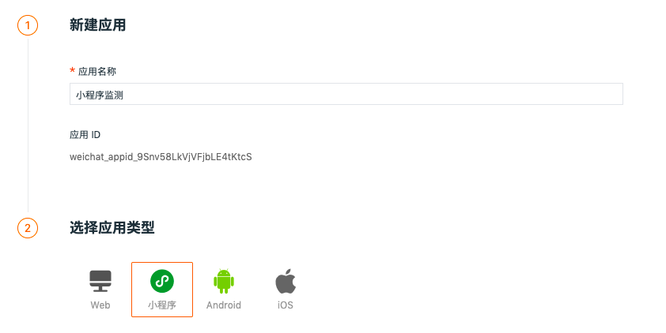

# 小程序应用接入
---

## 更新日志
2022.3.29

-   新增  `traceType` 配置，配置链路追踪工具类型，如果不配置默认为`ddtrace`。目前支持 `ddtrace`、`zipkin`、`skywalking_v3`、`jaeger`、`zipkin_single_header`、`w3c_traceparent` 6种数据类型。
- 新增 `allowedTracingOrigins` 允许注入 trace 采集器所需header头部的所有请求列表。可以是请求的origin，也可以是是正则。

  
## 简介

“观测云” 应用监测能够通过收集各个小程序应用的指标数据，通过引入sdk文件，监控小程序性能指标，错误log，以及资源请求情况数据，上报到DataFlux 平台，以可视化的方式分析各个小程序应用端的性能。

## 前置条件

- 安装 DataKit（[DataKit 安装文档](../../../datakit/datakit-install.md)）
## 小程序应用接入

登录观测云控制台，进入「用户访问监测」页面，点击右上角「新建应用」，在新窗口输入「应用名称」并自定义「应用 ID 标识」，点击「创建」，即可选择应用类型获取接入方式。

- 应用名称（必填项）：用于识别当前实施用户访问监测的应用名称。
- 应用 ID 标识（选填）：当前空间内唯一的应用 ID 标识，支持自定义，可用于数据上传匹配；应用ID标识最多为 20 个字符，仅支持输入大小写字母。
- 应用 ID：若创建应用时填写了应用 ID 标识，点击创建应用以后，会把填写的应用 ID 标识信息拼接到应用 ID 的前面，便于区分应用进行查询和筛选。



## 使用方法

### 在小程序的app.js文件以如下方式引入代码

#### npm 引入(可参考微信官方[npm引入方式](https://developers.weixin.qq.com/miniprogram/dev/devtools/npm.html))

```javascript
const { datafluxRum } = require('@cloudcare/rum-miniapp')
// 初始化 Rum
datafluxRum.init({
	datakitOrigin: 'https://datakit.xxx.com/',// 必填，Datakit域名地址 需要在微信小程序管理后台加上域名白名单
	applicationId: 'appid_xxxxxxx', // 必填，dataflux 平台生成的应用ID
	env: 'testing', // 选填，小程序的环境
  version: '1.0.0', // 选填，小程序版本
  trackInteractions: true,
})
```

#### CDN 下载文件本地方式引入([下载地址](https://static.dataflux.cn/miniapp-sdk/v2/dataflux-rum-miniapp.js))

```javascript
const { datafluxRum } = require('./lib/dataflux-rum-miniapp.js')
// 初始化 Rum
datafluxRum.init({
	datakitOrigin: 'https://datakit.xxx.com/',// 必填，Datakit域名地址 需要在微信小程序管理后台加上域名白名单
	applicationId: 'appid_xxxxxxx', // 必填，dataflux 平台生成的应用ID
	env: 'testing', // 选填，小程序的环境
  version: '1.0.0', // 选填，小程序版本
  trackInteractions: true,
})
```

## 配置

### 初始化参数

| 参数 | 类型 | 是否必须 | 默认值 | 描述 |
| --- | --- | --- | --- | --- |
| `applicationId` | String | 是 |  | 从 dataflux 创建的应用 ID |
| `datakitOrigin` | String | 是 |  | datakit 数据上报 Origin；`注意：需要在小程序管理后台加上request白名单` |
| `env` | String | 否 |  | 小程序 应用当前环境， 如 prod：线上环境；gray：灰度环境；pre：预发布环境 common：日常环境；local：本地环境； |
| `version` | String | 否 |  | 小程序 应用的版本号 |
| `sampleRate` | Number | 否 | `100` | 指标数据收集百分比:`100`表示全收集，`0`表示不收集 |
| `trackInteractions` | Boolean | 否 | `false` | 是否开启用户行为采集 |
| `traceType`【新增】 | Enum | 否 | `ddtrace` | 配置链路追踪工具类型，如果不配置默认为`ddtrace`。目前支持 `ddtrace`、`zipkin`、`skywalking_v3`、`jaeger`、`zipkin_single_header`、`w3c_traceparent` 6种数据类型。注： `opentelemetry` 支持 `zipkin_single_header`,`w3c_traceparent`,`zipkin`、`jaeger`三种类型。<br><br>注意：配置相应类型的traceType 需要对相应的API服务 设置不同的 `Access-Control-Allow-Headers` 具体查看 [APM 如何关联 RUM ](../../../application-performance-monitoring/collection/connect-web-app.md) |
| `traceId128Bit`【新增】 | Boolean | 否 | `false` | 是否以128字节的方式生成 `traceID`，与`traceType` 对应，目前支持类型 `zipkin`、`jaeger` |
| `allowedTracingOrigins`【新增】 | Array | 否 | `[]` | 【新增】允许注入`ddtrace`采集器所需header头部的所有请求列表。可以是请求的origin，也可以是是正则，origin: `协议（包括：//），域名（或IP地址）[和端口号]`<br>例如：<br>`["https://api.example.com", /https:\\/\\/.*\\.my-api-domain\\.com/]` |


## 注意事项

1. `datakitOrigin` 所对应的datakit域名必须在小程序管理后台加上request白名单
1. 因为目前微信小程序请求资源API`wx.request`、`wx.downloadFile`返回数据中`profile`字段目前ios系统不支持返回，所以会导致收集的资源信息中和timing相关的数据收集不全。目前暂无解决方案，[request](https://developers.weixin.qq.com/miniprogram/dev/api/network/request/wx.request.html), [downloadFile](https://developers.weixin.qq.com/miniprogram/dev/api/network/download/wx.downloadFile.html) ;[API支持情况](https://developers.weixin.qq.com/community/develop/doc/000ecaa8b580c80601cac8e6f56000?highLine=%2520request%2520profile)
1. `trackInteractions` 用户行为采集开启后，因为微信小程序的限制，无法采集到控件的内容和结构数据，所以在小程序 SDK 里面我们采取的是声明式编程，通过在 wxml 文件里面设置 data-name 属性，可以给 交互元素 添加名称，方便后续统计是定位操作记录， 例如：

```javascript
 <button bindtap="bindSetData" data-name="setData">setData</button>
```

