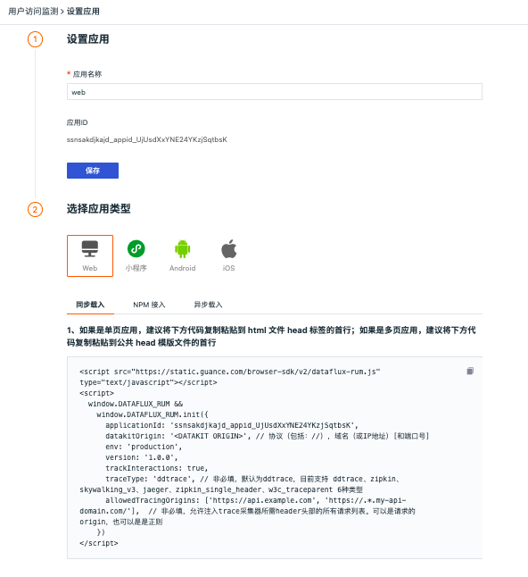

# 如何配置应用性能监测采样
---

## 简介

“观测云” 支持采集Web、Android、iOS和小程序应用数据，默认情况下，按照全量的方式采集用户访问数据。你可以通过设置采样的方式采集用户访问数据，节约数据存储量，降低成本费用。

下面将以Web 应用为例，介绍如何收集90％的Web应用用户访问数据。

## 采样设置

登录 “观测云” 控制台，进入「用户访问监测」页面，点击右上角「新建应用」，在新窗口输入「应用名称」，点击「创建」，即可选择应用类型获取接入方式。Web应用接入的有三种方式：NPM 接入、同步载入和异步载入。



以“同步载入”为例，在代码中加入`sampleRate: 90`，然后复制粘贴到需要接入的页面HTML的第一行，即可按90%的比例采集Web应用的用户访问数据。

```
<script src="https://static.dataflux.cn/browser-sdk/v2/dataflux-rum.js" type="text/javascript"></script>
<script>
  window.DATAFLUX_RUM &&
    window.DATAFLUX_RUM.init({
      applicationId: 'appid_48617201757b4dcc86f3e3291dfa7e4b',
      datakitOrigin: '<DATAKIT ORIGIN>', // 协议（包括：//），域名（或IP地址）[和端口号]
      sampleRate: 90,
      //  env: 'production',
      //  version: '1.0.0',
    })
</script>
```

**注意：设置采样后，初始化会随机生成一个0-100之间的随机数，当这个随机数小于你设置的采集率时，那么会上报当前用户访问的相关数据，否则就不会上报。

“NPM接入”和“异步载入”可以按照同样的方法进行设置。更多设置可参考文档[Web应用接入](web/app-access.md)。

## 其他应用采样

IOS采样设置可参考[IOS 应用接入](ios/app-access.md)。
Android采样设置可参考[Android 应用接入](android/app-access.md)。
小程序采样设置可参考[小程序应用接入](miniapp/app-access/index.md)。

