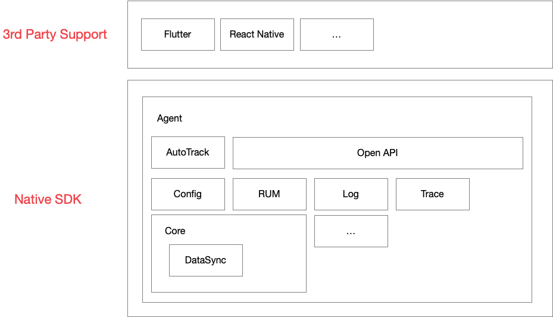
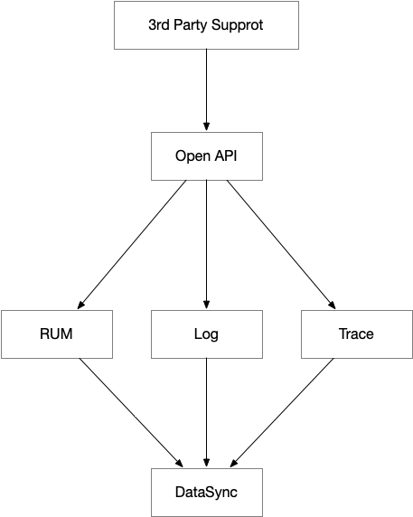

# 第三方框架支持
---

## 调用原理
第三方框架 SDK 依赖原生 SDK
### SDK 结构

- AutoTrack 负责原生应用行为，从而自动生成 RUM，Log，Trace 数据
- Open API 对外开放接口
- DataSync 数据同步模块，将数据同步至 Datakit

### 第三方框架数据追踪

## 开发进程

- [Flutter](flutter/app-access.md)（试验版）
- [React Native ](react-native/app-access)（试验版）

