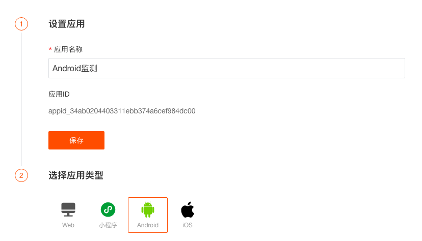

# React Native 应用接入
---

## 前置条件

- 安装 DataKit（[DataKit 安装文档](../../../dataflux/datakit/datakit-how-to.md)）

## 应用接入

当前 React Native 版本暂只支持 Android 和 iOS 平台。登录 “观测云” 控制台，进入「应用监测」页面，点击右上角「新建应用」，在新窗口输入「应用名称」，点击「创建」，然后相应接入的平台，即可开始配置。




# 安装
源码地址：[https://github.com/DataFlux-cn/datakit-react-native](https://github.com/DataFlux-cn/datakit-react-native)
Demo 地址：[https://github.com/GuanceCloud/datakit-react-native/example](https://github.com/GuanceCloud/datakit-react-native/tree/dev/example)
在项目路径下，终端运行命令：

```bash
npm install @cloudcare/react-native-mobile
```

这将在包的 package.json 中添加这样的一行：

```json
"dependencies": {    
   "@cloudcare/react-native-mobile: "^0.2.1",
   ···
}
```

> Android 需要在 app/android 目录下 build.gradle 安装 ft-plugin 配合使用，详细配置请见 [Android SDK](../android/app-access.md#Gradle-配置) 配置，或参考 demo


现在在您的代码中，您可以使用：

```json
import {
  FTMobileReactNative,
  FTReactNativeLog,
  FTReactNativeTrace,
  FTReactNativeRUM,
  FTMobileConfig,
  FTLogConfig,
  FTTraceConfig,
  FTRUMConfig,
  MonitorType,
  TraceType
} from '@cloudcare/react-native-mobile';
```

# SDK 初始化

##  基础配置

```typescript
let config: FTMobileConfig = {
    serverUrl: Config.SERVER_URL,
    debug: true,
  };
FTMobileReactNative.sdkConfig(config)
```

| **字段** | **类型** | **必须** | **说明** |
| --- | --- | --- | --- |
| serverUrl | string | 是 | 数据上报地址 |
| useOAID | boolean | 否 | 是否使用 `OAID` 唯一识别，默认`false`,开启后替换 `deviceUUID` 进行使用 |
| debug | boolean | 否 | 设置是否允许打印日志，默认`false` |
| datakitUUID | string | 否 | 请求`HTTP`请求头`X-Datakit-UUID` 数据采集端  如果用户不设置会自动配置 |
| envType | enum EnvType | 否 | 环境，默认`prod` |
| globalContext | NSDictionary | 否 | [添加自定义标签](#user-global-context ) |

## RUM 配置

```typescript
let rumConfig: FTRUMConfig = {
      rumAppId: rumid,
      monitorType: MonitorType.all,
      enableAutoTrackUserAction:true,
      enableAutoTrackError:true,
      enableNativeUserAction: false,
      enableNativeUserView: false,
      enableNativeUserResource: true, // 开启后、能同时采集 React Native 与 原生部分 
    }; 

FTReactNativeRUM.setConfig(rumConfig);
```

| **字段** | **类型** | **必须** | **说明** |
| --- | --- | --- | --- |
| rumAppId | string | 是 | appId，监测中申请 |
| sampleRate | number | 否 | 采样率，（采集率的值范围为>= 0、<= 1，默认值为 1） |
| enableAutoTrackUserAction | boolean | 否 | 是否自动采集 `React Native` 控件点击事件，开启后可配合  `accessibilityLabel`设置actionName |
| enableAutoTrackError | boolean | 否 | 是否自动采集 `React Native` Error |
| enableNativeUserAction | boolean | 否 | 是否进行 `Native Action` 追踪，`Button` 点击事件，纯 `React Native` 应用建议关闭，默认为 `false` |
| enableNativeUserView | boolean | 否 | 是否进行 `Native View` 自动追踪，纯 `React Native` 应用建议关闭，，默认为 `false` |
| enableNativeUserResource | boolean | 否 | 是否开始 `Native Resource`自动追踪，由于 React-Native 的网络请求在 iOS、Android 端是使用系统 API 实现的，所以开启 enableNativeUserResource 后，所有 resource 数据能够一并采集。 |
| monitorType | enum MonitorType | 否 | 监控补充类型 |
| globalContext | object | 否 | [添加自定义标签](#user-global-context) |


## Log 配置

```typescript
let logConfig: FTLogConfig = {
      enableCustomLog: true,
      enableLinkRumData: true,
    };
FTReactNativeLog.logConfig(logConfig);
```

| **字段** | **类型** | **必须** | **说明** |
| --- | --- | --- | --- |
| sampleRate | number | 否 | 采样率，采集率的值范围为>= 0、<= 1，默认值为 1 |
| serviceName | string | 否 | 服务名 |
| enableLinkRumData | boolean | 否 | 是否与 `RUM` 关联 |
| enableCustomLog | boolean | 否 | 是否开启自定义日志 |
| discardStrategy | enum FTLogCacheDiscard | 否 | 日志丢弃策略，默认`FTLogCacheDiscard.discard` |
| logLevelFilters | Array<FTLogStatus> | 否 | 日志等级过滤 |
| globalContext | NSDictionary | 否 | [添加自定义标签](#user-global-context) |

## Trace 配置

```typescript
 let traceConfig: FTTractConfig = {
      enableNativeAutoTrace: true, // 开启后、能同时追踪 React Native 与 原生部分 
    };

 FTReactNativeTrace.setConfig(traceConfig);
```

| **字段** | **类型** | **必须** | **说明** |
| --- | --- | --- | --- |
| sampleRate | number | 否 | 采样率，采集率的值范围为>= 0、<= 1，默认值为 1 |
| serviceName | string | 否 | 服务名 |
| traceType | enum TraceType | 否 | 链路类型，默认`TraceType.zipkin` |
| enableLinkRUMData | boolean | 否 | 是否与 `RUM` 数据关联，默认`false` |
| enableNativeAutoTrace | boolean | 否 | 是否开启原生网络网络自动追踪 iOS NSURLSession ,Android OKhttp(由于 `React Native`的网络请求在 iOS、Android 端是使用系统 API 实现的，所以开启 `enableNativeAutoTrace` 后，所有 `React Native` 数据能够一并追踪。） |
| globalContext | NSDictionary | 否 | [添加自定义标签](#user-global-context) |

# RUM 用户数据追踪

## Action

```typescript
FTReactNativeRUM.startAction('actionName','actionType');
```

开启自动采集后可通过 `accessibilityLabel`设置 `actionName`。

## View

```typescript
FTReactNativeRUM.startView("RUM");

FTReactNativeRUM.stopView();
```

使用 `react-native-navigation` 库与 `@react-navigation` 库，可参考 [example](https://github.com/DataFlux-cn/datakit-react-native)。

## Error

```typescript
FTReactNativeRUM.addError("error stack","error message");
```

## Resource

```typescript
//自己采集 
async getHttp(url:string){
            const key = Utils.getUUID();
            FTReactNativeRUM.startResource(key);
            const fetchOptions = {
                  method: 'GET',
                  headers:{
                        'Accept': 'application/json',
                        'Content-Type': 'application/json'
                  } ,
            };
            var res : Response;
            try{
                  res = await fetch(url, fetchOptions);
            }finally{
                  var resource:FTRUMResource = {
                        url:url,
                        httpMethod:fetchOptions.method,
                        requestHeader:fetchOptions.headers,
                  };
                  if (res) {
                        resource.responseHeader = res.headers;
                        resource.resourceStatus = res.status;
                        resource.responseBody = await res.text();
                  }
                  FTReactNativeRUM.stopResource(key);
                  FTReactNativeRUM.addResource(key,resource);
            }
      }
```

# Logger 日志打印 

```typescript
FTReactNativeLog.logging("info log content",FTLogStatus.info);
```

## 日志等级

| **方法名** | **含义** |
| --- | --- |
| FTLogStatus.info | 提示 |
| FTLogStatus.warning | 警告 |
| FTLogStatus.error | 错误 |
| FTLogStatus.critical | 严重 |
| FTLogStatus.ok | 恢复 |

# Tracer 网络链路追踪

```typescript
  async getHttp(url:string){
    const key = Utils.getUUID();
    const traceHeader =await FTReactNativeTrace.getTraceHeader(key,url);
    
    const fetchOptions = {
      method: 'GET',
      headers:Object.assign({
        'Accept': 'application/json',
        'Content-Type': 'application/json'
      },traceHeader) ,
    };
    try{
      fetch(url, fetchOptions);
    }
  }
```

# 用户信息绑定与解绑

```typescript
FTMobileReactNative.bindRUMUserData('react-native-user')

FTMobileReactNative.unbindRUMUserData()
```

# 添加自定义标签 {#user-global-context}

## 静态使用

1. 使用 `react-native-config`配置多环境，在不同的环境中设置对应的自定义标签值。

```typescript
let rumConfig: FTRUMConfig = {
      rumAppId: rumid,
      monitorType: MonitorType.all,
      enableTrackUserAction:true,
      enableTrackUserResource:true,
      enableTrackError:true,
      enableNativeUserAction: false,
      enableNativeUserResource: false,
      enableNativeUserView: false,
      globalContext:{"track_id":Config.TRACK_ID}, //.env.dubug、.env.release 等配置的环境文件中设置
    };

  
   FTReactNativeRUM.setConfig(rumConfig); 
});
```

## 动态使用

1. 通过数据持久化方式，如 `AsyncStorage`等，在初始化 SDK 时，获取存储的自定义标签。

```typescript
 let rumConfig: FTRUMConfig = {
      rumAppId: rumid,
      monitorType: MonitorType.all,
      enableTrackUserAction:true,
      enableTrackUserResource:true,
      enableTrackError:true,
      enableNativeUserAction: false,
      enableNativeUserResource: false,
      enableNativeUserView: false,
    };
 AsyncStorage.getItem("track_id",(error,result)=>{
        if (result === null){
          console.log('获取失败' + error);
        }else {
          console.log('获取成功' + result);
          if( result != undefined){
            rumConfig.globalContext = {"track_id":result};
          }    
        }
        FTReactNativeRUM.setConfig(rumConfig); 
      })
```

2. 在任意处添加或改变自定义标签到文件。

```typescript
AsyncStorage.setItem("track_id",valueString,(error)=>{
    if (error){
        console.log('存储失败' + error);
    }else {
        console.log('存储成功');
    }
})
```

3. 最后重启应用。

> 注意：
> 
> 1. 特殊 key : track_id (在 RUM 中配置，用于追踪功能) 
> 1. 当用户通过 globalContext 添加自定义标签与 SDK 自有标签相同时，SDK 的标签会覆盖用户设置的，建议标签命名添加项目缩写的前缀，例如 `df_tag_name`。项目中使用 `key` 值可[查询源码](https://github.com/DataFlux-cn/datakit-android/blob/dev/ft-sdk/src/main/java/com/ft/sdk/garble/utils/Constants.java)。

# 常见问题

- [iOS 相关](../ios/app-access.md#common-problem)
- [Android 相关](../android/app-access.md#common-problem)


---

观测云是一款面向开发、运维、测试及业务团队的实时数据监测平台，能够统一满足云、云原生、应用及业务上的监测需求，快速实现系统可观测。**立即前往观测云，开启一站式可观测之旅：**[www.guance.com](https://www.guance.com)

