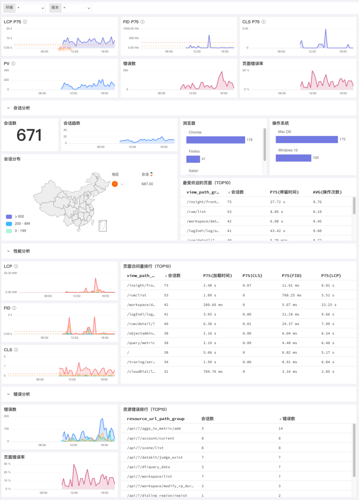
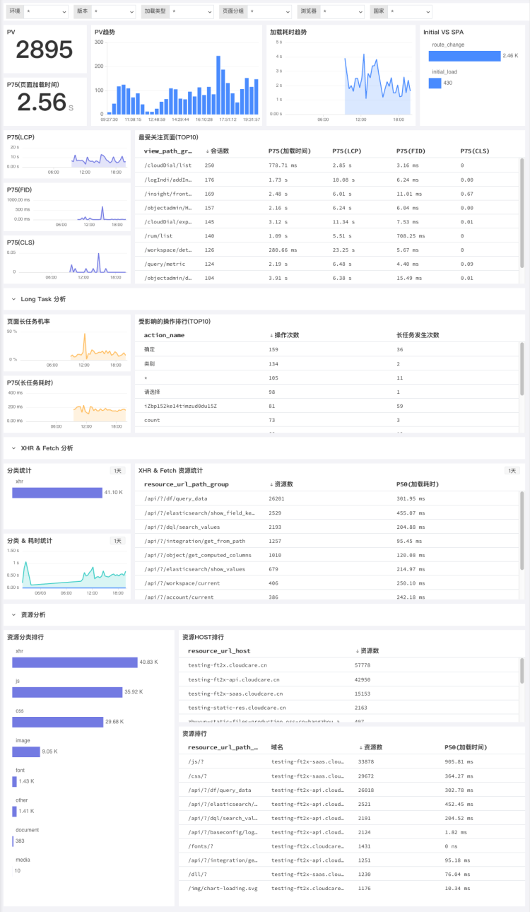
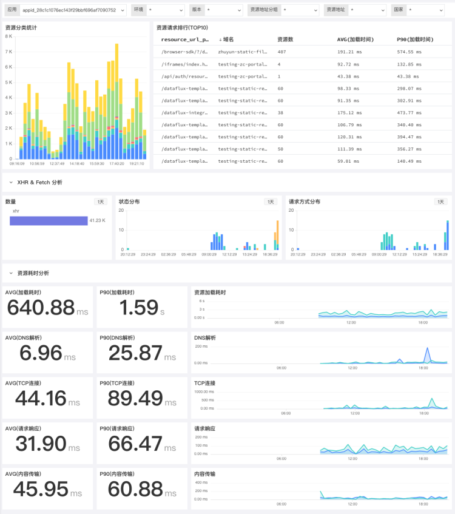
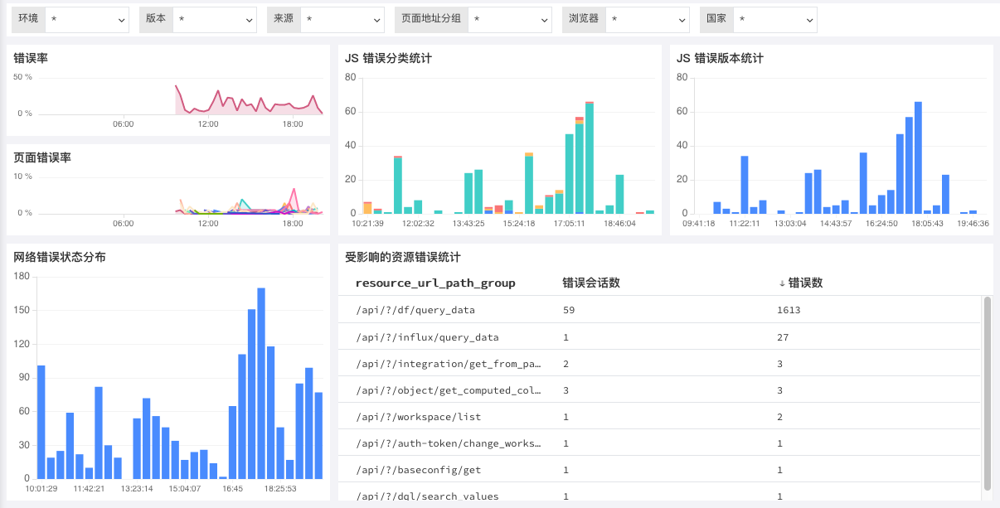

# Web 应用分析
---

## 简介

应用数据采集到的 “观测云” 后，可以通过 “观测云” 控制台查看应用性能分析，改善页面加载（LCP）、互动性（FID）和页面稳定性（CLS），提高用户体验。

LCP、FID、CLS 是谷歌网站核心指标，用来衡量网站的载入速度、互动性和页面稳定性。

| 指标 | 说明 | 目标值 |
| --- | --- | --- |
| LCP(Largest Contentful Paint) | 计算网页可视范围内最大的内容元件需花多少时间载入 | 小于2.5s |
| FID(First Input Delay) | 计算用户首次与网页互动时的延迟时间 | 小于100ms |
| CLS(Cumulative Layout Shift) | 计算网页载入时的内容是否会因动态加载而页面移动，0表示没有变化。 | 小于0.1 |

## 查看器分析

观测云提供用户访问监测查看器，帮助您查看与分析用户访问应用程序的详细信息。在观测云工作空间内打开「用户访问监测」，点击任意一个应用后即可通过「查看器」了解每个用户会话、页面性能、资源、长任务、操作中的错误、延迟对用户的影响、帮助你通过搜索、筛选和关联分析全面了解和改善应用的运行状态和使用情况，提高用户体验。更多详情可参考文档 [查看器](../explorer/index.md) 。

## 场景分析

观测云提供可视化的Web应用分析，内置多维度Web应用监测数据场景，包括概览、页面性能分析、资源加载分析、JS错误分析。

### 概览

Web应用的概览场景统计页面访问的错误数、错误率、会话数、会话分布、浏览器、操作系统、最受欢迎页面、资源错误排行等内容，可视化的展示用户访问Web页面的数据统计，快速定位用户访问Web应用的问题，提高用户访问性能。可通过环境、版本筛选查看已经接入的Web应用。

### 性能分析

Web应用的页面性能分析，通过统计PV数、页面加载时间、网站核心指标、最受关注页面会话数、页面长任务分析、XHR & Fetch 分析、资源分析等指标，可视化的实时查看整体的Web应用页面性能情况，更精准的定位需要优化的页面，可通过环境、版本等筛选查看已经接入的Web应用。

### 资源分析

Web应用的资源分析，通过统计资源分类、XHR & Fetch 分析、资源耗时分析等指标，可视化的实时查看整体的Web应用资源情况；通过统计资源请求排行，更精准的定位需要优化的资源；可通过环境、版本等筛选查看已经接入的Web应用。

### 错误分析

Web应用的JS错误分析，通过统计错误率、错误分类、错误版本、网络错误状态分布等指标，可视化的实时查看整体的Web应用错误情况；通过受影响的资源错误统计，可快速定位资源错误；可通过环境、版本等筛选查看已经接入的Web应用。

