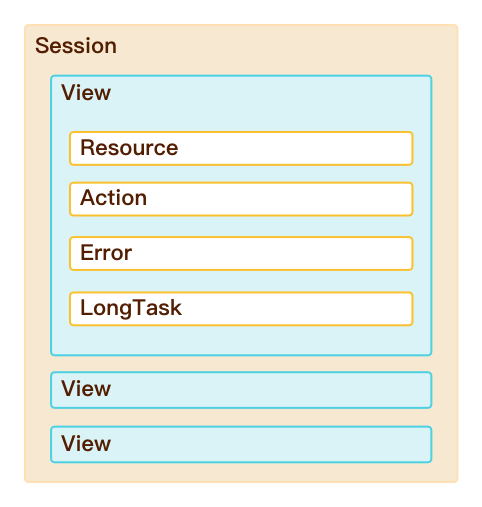

# Web 应用数据采集
---

## 简介

应用数据采集到的 “观测云” 后，可以通过 “观测云” 控制台进行自定义配置场景和配置异常检测事件。

## 数据类型

“观测云”的用户访问监测包括六种数据类型。

| **类型** | **描述** |
| --- | --- |
| session | 用户会话信息记录，当前会话中，将会基于会话维度用户页面、资源、操作、错误、长任务相关访问数据。 |
| view | 用户访问页面时，都会生成一个页面查看记录。当用户停留在同一页面上时，资源，长任务，错误和操作记录将通过view_id属性链接到相关的RUM视图。 |
| resource | 用户访问页面时，加载的资源信息记录。 |
| error | 用户访问监测采集器收集浏览器上的所有前端错误。 |
| long_task | 对于浏览器中的任何阻塞主线程超过50ms的任务，都会生成一条长任务记录。 |
| action | 跟踪用户页面浏览过程中所有的用户交互记录。 |

### 六种数据类型的层次结构如下图

## 默认属性

默认属性为全局属性，用户访问监测的场景构建和事件告警都可以通过下面的默认属性进行查询。

### SDK属性

| **字段** | **类型** | **描述** |
| --- | --- | --- |
| `sdk_name` | string | 采集器名称，固定名称： `df_web_rum_sdk`  `df_miniapp_rum_sdk`  `df_ios_rum_sdk` `df_android_rum_sdk`  |
| `sdk_version` | string | 采集器版本信息 |

### 应用属性

| 字段 | 类型 | 描述 |
| --- | --- | --- |
| `app_id` | string | 必填，用户访问应用唯一ID标识，在“观测云”控制台上面创建监控时自动生成。 |
| `env` | string | 必填，环境字段。属性值：prod/gray/pre/common/local。其中 prod：线上环境 gray：灰度环境 pre：预发布环境 common：日常环境 local：本地环境 |
| `version` | string | 必填，版本号。 |

### 用户 & 会话属性

| **字段** | **类型** | **描述** |
| --- | --- | --- |
| `userid` | string | 未登录用户使用cookie作为userid，登录用户使用应用后台生成的用户id。 |
| `session_id` | string | 会话id。 |
| `session_type` | string | 会话类型。参考值：user &#124; synthetics user表示是RUM功能产生的数据； synthetics表示是headless拨测产生的数据。 |
| `is_signin` | boolean | 是否是注册用户，属性值：True / False。 |

### 设备 & 分辨率属性

| **字段** | **类型** | **描述** |
| --- | --- | --- |
| `os` | string | 操作系统 |
| `os_version` | string | 操作系统版本 |
| `os_version_major` | string | 设备报告的主要操作系统版本 |
| `browser` | string | 浏览器提供商 |
| `browser_version` | string | 浏览器版本 |
| `browser_version_major` | string | 浏览器主要版本信息 |
| `screen_size` | string | 屏幕宽度*高度,分辨率 |

### 地理 & 网络属性

| **字段** | **类型** | **描述** |
| --- | --- | --- |
| `ip` | string | 用户访问IP地址 |
| `isp` | string | 运营商 |
| `network_type` | string | 网络连接类型，属性值参考： wifi &#124; 2g &#124; 3g &#124; 4g &#124; 5g &#124; unknown（未知网络）&#124; unreachable（网络不可用） |
| `country` | string | 国家 |
| `country_iso_code` | string | 国家 `iso_code` |
| `province` | string | 省 |
| `city` | string | 城市 |

### View 属性

| **字段** | **类型** | **描述** |
| --- | --- | --- |
| `view_id` | string | 每次访问页面时产生的唯一ID |
| `is_active` | boolean | 判断用户是否还在活跃状态，参考值: true &#124; false |
| `view_loading_type` | string | 页面加载类型， 参考值：`initial_load` &#124; `route_change` `route_change`为SPA页面加载模式 |
| `view_referrer` | string | 页面来源 |
| `view_url` | string | 页面URL |
| `view_host` | string | 页面URL域名部分 |
| `view_path` | string | 页面URL path部分 |
| `view_path_group` | string | 页面URL path分组 |
| `view_url_query` | string | 页面URL query部分 |

## 用户属性

除了默认属性以外，还可以通过用户属性构建场景和配置事件告警。用户属性是非全局属性，通过用户属性，可以跟踪用户访问应用的整个过程，定位和发现用户受影响的访问情况，监控用户访问性能。

## 其他数据类型属性

### Session

#### 统计指标

| **字段** | **类型** | **描述** |
| --- | --- | --- |
| `time_spent` | number(ns) | 当前会话持续时长 |
| `session_view_count` | number | 当前会话关联`view_id`个数 |
| `session_error_count` | number | 当前会话产生错误个数 |
| `session_resource_count` | number | 当前会话加载资源个数 |
| `session_action_count` | number | 当前会话用户操作次数 |
| `session_long_task_count` | number | 当前会话产生长任务次数 |

#### 属性

| 字段 | 类型 | 描述 |
| --- | --- | --- |
| `session_id` | string | 会话id（后台停留30s以上，会生成一个新的session_id） |
| `session_type` | string | 会话类型。参考值：user &#124; test user表示是RUM功能产生的数据； test表示是headless拨测产生的数据。 |
| `session_referrer` | string | 会话来源。一般是记录来源的页面地址。 |
| `session_first_view_id` | string | 当前会话的第一个页面的view_id |
| `session_first_view_url` | string | 当前会话的第一个页面的URL |
| `session_first_view_host` | string | 当前会话的第一个页面的域名 |
| `session_first_view_path` | string | 当前会话的第一个页面的地址 |
| `session_first_view_path_group` | string | 当前会话的第一个页面的地址分组 |
| `session_first_view_url_query` | string | 当前会话的第一个页面的query信息 |
| `session_last_view_id` | string | 当前会话的最后一个访问页面的view_id |
| `session_last_view_url` | string | 当前会话的最后一个页面的URL |
| `session_last_view_host` | string | 当前会话的最后一个页面的域名 |
| `session_last_view_path` | string | 当前会话的最后一个页面的地址 |
| `session_last_view_path_group` | string | 当前会话的最后一个页面的地址分组 |
| `session_last_view_url_query` | object | 当前会话的最后一个页面的query信息 |

---

### View

注意:view属性为全局参数，以下仅展示view的其他参数信息

#### 指标

| 字段 | 类型 | 描述 |
| --- | --- | --- |
| first_contentful_paint | number（ns） | 首次内容绘制时间(FCP) 计算方式：firstPaintContentEnd - firstPaintContentStart |
| largest_contentful_paint | number（ns） | 最大内容绘制（页面加载时间轴中的一刹那，其中呈现了视口中最大的DOM对象） 参考链接：[LCP](https://web.dev/lcp/) 计算方式：统计最近上报的一次 PerformanceEntry 时间 |
| cumulative_layout_shift | number | 累计布局版面转移(CLS)，0 表示载入过程没有版面移动变化 |
| first_input_delay | number（ns） | 首次输入延时(FID) 计算方式：performance.now() - event.timeStamp |
| loading_time | number（ns） | 页面加载时间 initial_load模式下计算公式: ① loadEventEnd - navigationStart ② 页面首次无活动时间 - navigationStart route_change模式下计算公式：用户点击时间 - 页面首次无活动时间 页面首次无活动时间：页面超过100ms无网络请求或DOM突变 |
| dom_interactive | number（ns） | DOM结构构建完毕时间 获取方式：time = performanceTiming.domInteractive; 参考链接：[MDN dom_interactive](https://developer.mozilla.org/en-US/docs/Web/API/PerformanceTiming/domInteractive) |
| dom_content_loaded | number（ns） | DOM 内容加载时间 计算方式：domContentLoadedEventEnd - domContentLoadedEventStart |
| dom_complete | number（ns） | DOM树解析完成时间 获取方式：time = performanceTiming.domComplete; 参考链接：[MDN dom_complete](https://developer.mozilla.org/en-US/docs/Web/API/PerformanceTiming/domComplete) |
| load_event | number（ns） | 事件加载时间 计算方式：loadEventEnd - loadEventStart |
| first_meaningful_paint | number（ns） | 首屏时间 计算方式：firstPaintContentEnd - firstPaintContentStart |
| first_paint_time | number（ns） | 首次渲染时间 计算方式：responseEnd - fetchStart |
| resource_load_time | number（ns） | 资源加载时间 计算方式：loadEventStart - domContentLoadedEventEnd |
| time_to_interactive | number（ns） | 首次可交互时间 计算方式：domInteratice - requestStart |
| dom | number（ns） | DOM解析耗时 计算方式：domComplete - domInteractive |
| dom_ready | number（ns） | DOM Ready时间 计算方式：domContentLoadedEventEnd - navigationStart |
| time_spent | number（ns） | 页面停留时间 |

#### 统计指标
| **字段** | **类型** | **描述** |
| --- | --- | --- |
| `view_error_count` | number | 每次页面加载时发生的错误次数 |
| `view_resource_count` | number | 每次页面加载时请求的资源个数 |
| `view_long_task_count` | number | 每次页面加载时产生的长任务个数 |
| `view_action_count` | number | 页面查看过程中操作的次数 |
| `view_apdex_level` | number | 页面Apdex满意度。 基础指标：`first_paint_time`（换算成秒单位） 参考值：0/1/2/3/4/5/6/7/8/9 (根据first_paint_time值，9表示>= 9秒) |

### Resource

#### 指标

| **字段** | **类型** | **描述** |
| --- | --- | --- |
| `resource_size` | number | 资源大小，默认单位：byte |
| `resource_dns` | number（ns） | 资源加载DNS解析时间 计算方式：domainLookupEnd - domainLookupStart |
| `resource_tcp` | number（ns） | 资源加载TCP连接时间 计算方式：connectEnd - connectStart |
| `resource_ssl` | number（ns） | 资源加载SSL连接时间 计算方式：connectEnd - secureConnectStart |
| `resource_ttfb` | number（ns） | 资源加载请求响应时间 计算方式：responseStart - requestStart |
| `resource_trans` | number（ns） | 资源加载内容传输时间 计算方式：responseEnd - responseStart |
| `resource_first_byte` | number（ns） | 资源加载首包时间 计算方式：responseStart - domainLookupStart |
| `duration` | number（ns） | 资源加载时间 计算方式：duration(responseEnd-startTime) |

#### 属性

| **字段** | **类型** | **描述** |
| --- | --- | --- |
| `resource_url` | string | 资源URL |
| `resource_url_host` | string | 资源URL 域名部分 |
| `resource_url_path` | string | 资源URL path部分 |
| `resource_url_query` | string | 资源URL query部分 |
| `resource_url_path_group` | string | 资源URL path分组 |
| `resource_type` | string | 资源的类别 |
| `resource_method` | string | 资源请求方式 |
| `resource_status` | string | 资源请求返回的状态值 |
| `resource_status_group` | string | 资源请求返回的状态分组值 |

### Error

#### 指标

| **字段** | **类型** | **描述** |
| --- | --- | --- |
| `error_message` | string | 错误信息 |
| `error_stack` | string | 错误堆栈 |

#### 属性

| **字段** | **类型** | **描述** |
| --- | --- | --- |
| `error_source` | string | 错误来源，参考值：console &#124; network &#124; source &#124; custom |
| `error_type` | string | 错误类型，参考链接：[error type](https://developer.mozilla.org/en-US/docs/Web/JavaScript/Reference/Global_Objects/Error) |
| `resource_status` | string | 资源请求返回的状态值 |
| `resource_url` | string | 资源URL |
| `resource_url_host` | string | 资源URL 域名部分 |
| `resource_url_path` | string | 资源URL path部分 |
| `resource_url_path_group` | string | 资源URL path分组 |
| `resource_method` | string | 资源请求方式 |

### Long Task

#### 指标

| **字段** | **类型** | **描述** |
| --- | --- | --- |
| `duration` | number（ns） | 页面加载时产生的长任务花费时间 |

### Action

#### 指标

| **字段** | **类型** | **描述** |
| --- | --- | --- |
| `duration` | number（ns） | 页面操作花费时间 |

#### 统计指标

| **字段** | **类型** | **描述** |
| --- | --- | --- |
| `action_long_task_count` | number | 操作关联长任务次数 |
| `action_resource_count` | number | 操作关联资源请求次数 |
| `action_error_count` | number | 操作关联的错误次数 |

#### 属性

| **字段** | **类型** | **描述** |
| --- | --- | --- |
| `action_id` | string | 用户页面操作时产生的唯一ID |
| `action_name` | string | 操作名称 |
| `action_type` | string | 操作类型 |

