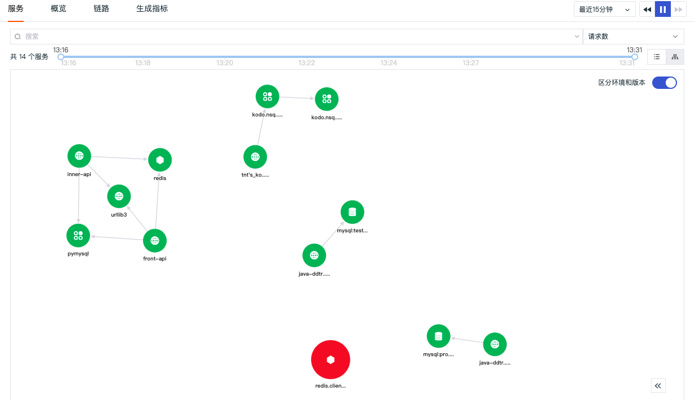
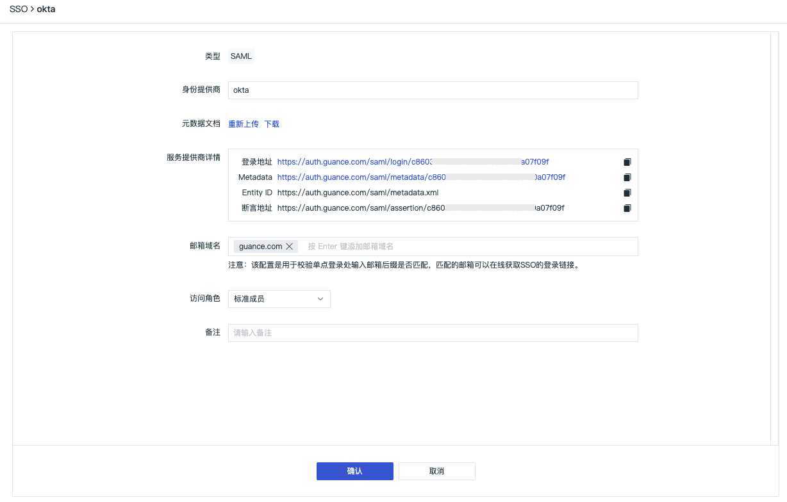
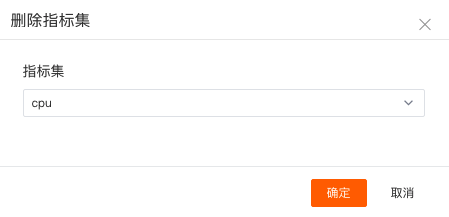

# 更新日志
---

本文档记录观测云每次上线发布的更新内容说明，包括 DataKit、Function、观测云最佳实践、观测云集成文档和观测云。

## 2022 年 6 月 21 号

### 观测云更新

#### 观测云帮助文档全新上线

为了提高观测云帮助文档的阅读体验，观测云帮助文档已迁至观测云域名下，您可以更简单、更快速的查看观测云帮助文档。新的观测云帮助文档地址为：[https://docs.guance.com](https://docs.guance.com) 。

#### 新增 Profile 可观测

Profile 支持采集使用 Java / Python 等不同语言环境下应用程序运行过程中的动态性能数据，帮助用户查看 CPU、内存、IO 的性能问题。采集 profile 数据需要先安装 DataKit，并配置 Profile 采集器，配置完成后，DataKit 会将采集到的 profile 数据上传到您的观测云工作空间，您可以通过 Profile 实时数据查看器了解您的程序代码性能。更多详情可参考文档 [Profile](../application-performance-monitoring/profile.md) 。


#### Pipeline 覆盖全数据的文本分析处理

文本处理（Pipeline）用于数据解析，通过定义解析规则，将各种数据类型切割成符合我们要求的结构化数据。在观测云工作空间「管理」-「文本处理（Pipeline）」，点击「新建Pipeline」即可创建一个新的 pipeline 文件。更多详情可参考文档 [文本处理（Pipeline）](../management/overall-pipeline.md) 。


#### 新增 Deployment 网络详情及网络分布

Deployment 网络支持查看 Deployment 之间的网络流量。支持基于 IP/端口查看源 IP 到目标 IP 之间的网络流量和数据连接情况，通过可视化的方式进行实时展示，帮助企业实时了解业务系统的网络运行状态，快速分析、追踪和定位问题故障，预防或避免因网络性能下降或中断而导致的业务问题。

Deployment 网络数据采集成功后会上报到观测云控制台，您可以在「基础设施」-「容器」-「Deployment」详情页中的「网络」，查看到Deployment 的网络性能监测数据信息；在「基础设施」-「网络」-「Deployment」，您可以查看到工作空间内全部 Deployment 的网络分布与数据连接情况。更多详情可参考 [Deployment 网络](../infrastructure/network.md#deployment_1) 。


#### 优化事件检测维度跳转到其他查看器

在事件未恢复查看器，支持点击检测维度查看相关容器、进程、日志、链路、RUM、可用性检测、安全巡检、CI 等。若相关查看器无相关数据，对应跳转链接为灰色不可点击。更多详情可参考文档 [事件检测维度](../events/explorer.md) 。


#### 新增日志查看器 JSON 格式的 message 信息搜索

日志查看器新增搜索 JSON 格式的日志内容（message），搜索格式为：`@key.key:value` 。

注意：JSON 搜索仅支持此次功能上线后创建的工作空间。


#### 新增用户访问监测新建应用时支持用户自定义输入 app_id 信息

新增自定义应用 ID 功能。支持在使用用户访问监测新建应用的功能时，自定义输入 app_id ，生成当前空间内唯一的应用 ID 标识，可用于区分应用类型、数据上传匹配等。

- 应用名称（必填项）：用于识别当前实施用户访问监控的应用名称。
- 应用 ID 标识（选填）：当前空间内唯一的应用 ID 标识，支持用于数据上传匹配；应用 ID 标识最多为 20 个字符，仅支持输入大小写字母。


#### 优化进程检测为基础设施对象检测

进程检测优化为基础设施对象监测，新增主机、容器、进程、Pod、Deployment、Replicaset、Job、自定义对象等基础对象选择，用于监控工作空间内的基础设施对象数据。更多详情可参考文档 [基础设施对象检测](../monitoring/monitor/infrastructure-detection.md) 。

#### 其他功能优化

- 基础设施POD查看器蜂窝模式下新增 CPU 使用率、内存使用量填充指标
- 优化日志黑名单配置。支持手动输入日志来源，作为日志黑名单的来源
- 优化应用性能监测服务列表数据查询时间组件，支持自定义时间范围选择
- 优化在 K8S 上安装 DataKit 引导文案，配置 DataWay 数据网关地址中自动增加当前工作空间的 token
- 优化监控器配置 UI 样式

### DataKit 更新

#### 2022/06/21

- gitrepo 支持无密码模式
- prom 采集器
    - 支持日志模式采集
    - 支持配置 HTTP 请求头
- 支持超 16KB 长度的容器日志采集
- 支持 TDEngine 采集器
- Pipeline
    - 支持 XML 解析
    - 远程调试支持多类数据类型
    - 支持 Pipeline 通过 `use()` 函数调用外部 Pipeline 脚本
- 新增 IP 库（MaxMindIP）支持
- 新增 DDTrace Profile 集成
- Containerd 日志采集支持通过 image 和 K8s Annotation 配置过滤规则
- 文档库整体切换

#### 2022/06/16

- 日志采集支持记录采集位置，避免因为 DataKit 重启等情况导致的数据漏采
- 调整 Pipeline 在处理不同类数据时的设定
- 支持接收 SkyWalking 指标数据
- 优化日志黑名单调试功能： 
    - 在 Monitor 中会展示被过滤掉的点数
    - 在 datakit/data 目录下会增加一个 *.filter* 文件，用来记录拉取到的过滤器
- Monitor 中增加 DataKit 打开文件数显示
- DataKit 编译器升级到 golang 1.18.3

#### 2022/06/07

- 增加TCP/UDP 端口检测采集器
- DataKit 跟 DataWay 之间增加 DNS 检测，支持 DataWay DNS 动态切换
- [eBPF](../integrations/ebpf.md) L4/L7 流量数据增加 k8s deployment name 字段
- 优化 [OpenTelemetry](../datakit/opentelemetry.md) 指标数据
- [ElasticSearch](https://preprod-docs.cloudcare.cn/datakit/changelog/elasticsearch) 增加 AWS OpenSearch 支持
- [行协议限制](../datakit/apis.md)中，字符串长度限制放宽到 32MB
- [prom](../integrations/prom.md) 采集器增加额外配置，支持忽略指定的 tag=value 的匹配，以减少不必要的时序时间线
- Sink 增加 Jaeger 支持
- Kubernetes 相关的指标采集，默认全部关闭，以避免时间线暴增问题
- DataKit Monitor 增加动态发现（比如 prom）的采集器列表刷新

更多 DataKit 更新可参考 [DataKit 版本历史](../datakit/changelog.md) 。


### 最佳实践更新

- APM
    - [GraalVM 与 Spring Native 项目实现链路可观测](../best-practices/apm/spring-native.md)
- 接入集成
    - [主机可观测最佳实践 (Linux)](../best-practices/integrations/host.md)

更多最佳实践更新可参考 [最佳实践版本历史](../best-practices/index.md) 。

### 集成模版更新

#### 新增文档

- 阿里云
    - 阿里云 NAT
    - 阿里云 CDN

#### 新增视图

- 阿里云
    - 阿里云 NAT
    - 阿里云 CDN


## 2022 年 6 月 6 号

### 观测云计费更新

观测云计费优化 [时间线](../billing/billing-method/index.md) 计费逻辑，以及指标数据的 [数据保存策略](../billing/billing-method/data-storage.md) 。原每 300 条 3 元下调为每 1000 条 3 元。同时指标数据新增 3 天、7 天、14 天数据保存策略，指标集支持 [自定义数据保存策略](../metrics/explorer.md) 。

时间线统计的是当前工作空间，上报的指标数据中基于标签可以组合而成的所有组合数量。数据保存策略即数据存储时长，是上报到当前工作空间的数据保存时间，超过存储时长的数据将会自动删除。

时间线为全量统计，即每天产生的时间线在数据保存策略期间会依次累加，数据保存策略越长，时间线的费用就越高。

此次优化通过下调时间线的费用以及缩短指标的数据保存策略，您可以更灵活的调整指标的数据保存策略，帮助您节约费用成本。

### 观测云更新

#### 新增 Jenkins CI 可观测

观测云新增 Jenkins CI 可观测，您可以通过观测云的 CI 可视化功能直接查看在 Jenkins 的 CI 结果。CI 的过程是持续集成，开发人员在 push 代码的时候，若碰到问题，可以在观测云查看所有 CI 的 pipeline 及其成功率、失败原因、具体失败环节，帮助您提供代码更新保障。更多详情可参考 [CI 可视化](../ci-visibility/index.md) 。


#### 新增自定义查看器图表同步搜索

自定义查看器新增图表同步搜索开关，用于决定搜索条件是否影响图表查询，默认开启。当搜索框有内容时，关闭开关，即图表查询回到默认状态；开启开关，即图表查询受到筛选内容的影响。


#### 新增网络拓扑和服务拓扑下钻分析

在基础设施网络拓扑图，点击主机/Pod 图标，点击“查看上下游”，即可查看当前节点的上下游节点关联。在上下游节点，点击左上角“返回总览”可返回到原网络拓扑图，在搜索框进行搜索或筛选可过滤关联的上下游节点，根据搜索或筛选的结果显示匹配的关联上下游节点。更多详情可参考文档 [网络查看上下游](../infrastructure/network.md) 。

在服务拓扑图，点击服务图标，点击“查看上下游”，即可查看当前服务的上下游服务关联。在上下游服务，点击左上角“返回总览”可返回到原服务拓扑图，在搜索框进行搜索或筛选可过滤关联的上下游服务，根据搜索或筛选的结果显示匹配的关联上下游服务。更多详情可参考文档 [服务查看上下游](../application-performance-monitoring/service.md) 。


#### 新增删除自定义对象的数据及索引

观测云支持拥有者和管理员删除指定自定义对象分类以及所有自定义对象，进入「管理」-「基本设置」，点击「删除自定义对象」后，选择删除自定义对象的方式，即可删除对应的对象数据。

- 指定自定义对象分类：仅删除所选对象分类下的数据，不会删除索引
- 所有自定义对象：删除所有自定义对象数据及索引

注意：所有自定义对象一旦删除，上报到基础设施自定义的所有数据及索引全部会被删除且无法恢复，所有设置的自定义对象分类数据需要重新上报，每天限制5次删除所有自定义对象操作。

更多自定义对象介绍可参考文档 [自定义](../infrastructure/custom/index.md) 。


#### 新增查看器快照查看入口

在观测云指标、日志、事件、应用性能监测、用户访问监测、云拨测、安全巡检、CI 可视化等查看器，保存快照以后，可直接点击右上角查看快照图标侧滑展开查看已经保存的快照。

- 支持快照名称关键字搜索，通过关键词模糊匹配相关快照名称
- 第一个为默认视图，不支持分享、复制链接和删除功能
- 除第一个默认视图外，其他快照支持分享、复制链接和删除功能，点击「快照名称」即可在当前查看器打开对应的数据副本


#### 新增查看器筛选条件编辑功能

在观测云查看器搜索栏通过“字段:值”的方式进行筛选时，支持点击“字段:值”对“字段:值”进行编辑修改，并以修改后的结果进行筛选。


#### 优化用户访问 View 查看器关联链路为 Fetch/XHR

在观测云用户访问监测 View 查看器详情页，切换至「Fetch/XHR」时，支持查看用户访问时向后端应用发出的每一个网络请求，包括发生时间、请求的链路和持续时间。

若网络请求存在对应的`trace_id`，在请求前会有提示的小图标，点击请求，可跳转至对应链路的详情页。


#### 新增图表数据加载高性能模式

观测云支持图表数据加载高性能模式，默认关闭，可通过点击左下角账号，在「高性能模式」选择开启。高性能模式开启以后，所有图表不进行动态加载，在点击进入页面的时候直接同时加载，即在超出当前页面使用往下滑动查看时图表已全部加载完成，可直接查看展示结果。

注意：高性能模式开启后仅针对当前用户查看图表。


#### 新增告警配置事件通知等级

告警配置支持自定义选择事件通知等级，包括紧急、重要、警告、恢复、无数据、无数据恢复、无数据视为恢复 7 种选择，支持多选，支持一键清空选项，清空后选项清除，需手动选择对应值。更多告警配置可参考文档 [告警设置](../monitoring/alert-setting.md) 。


#### 其他功能优化

- 场景仪表板组合图表支持隐藏/显示大标题
- 优化事件详情页事件类型文案显示
- 基础设施列表查看新增按照字段排序功能
- 日志查看器新增隐藏分布图按钮
- 查看器支持通过关键字搜索显示列，支持自定义显示列作为预设字段，后续通过Pipeline切割字段并上报数据后可直接显示上报的数据。
- 在内置模板库和内置视图增加一键查看对应的集成文档，帮助您快速配置对应的采集器
- 内置视图除支持在查看器绑定链路服务、应用、日志源、项目、标签等相关视图外，新增支持自定义 key 和 value 绑定相关视图，同时支持服务侧滑详情页绑定内置视图
- 优化通知对象飞书机器人，支持自定义是否需要密钥安全校验
- 配置监视器时，若配置的数据范围小于检测频率，触发提示配置会存在数据空洞问题

### DataKit 更新（**2022/05/26**）

- Pipeline 做了调整，所有数据类型，均可通过配置 Pipeline 来额外处理数据
- grok() 支持直接将字段提取为指定类型，无需再额外通过 cast() 函数进行类型转换
- Pipeline 增加多行字符串支持，对于很长的字符串（比如 grok 中的正则切割），可以通过将它们写成多行，提升了可读性
- 每个 Pipeline 的运行情况，通过 datakit monitor -V 可直接查看
- 增加 Kubernetes Pod 对象 CPU/内存指标
- Helm 增加更多 Kubernetes 版本安装适配
- 优化 OpenTelemetry，HTTP 协议增加 JSON 支持
- DataKit 在自动纠错行协议时，对纠错行为增加了日志记录，便于调试数据问题
- 移除时序类数据中的所有字符串指标
- 在 DaemonSet 安装中，如果配置了选举的命名空间，对参与选举的采集器，其数据上均会新增特定的 tag（election_namespace）
- CI 可观测，增加 Jenkins 支持

#### Breaking changes

对于 Docker 类容器日志的采集，需要将宿主机（Node）的 _/varl/lib_ 路径挂载到 DataKit 里面（因为 Docker 日志默认落在宿主机的 _/var/lib/_ 下面），在 _datakit.yaml_ 中，`volumeMounts` 和 `volumes` 中新增如下配置：

```yaml
volumeMounts:
- mountPath: /var/lib
  name: lib

# 省略其它部分...

volumes:
- hostPath:
    path: /var/lib
  name: lib
```

### 最佳实践更新

- APM
    - 基于观测云，使用 SkyWalking 实现 RUM、APM 和日志联动分析
- 监控最佳实践
    - OpenTelemetry 可观测建设
    - OpenTelemetry to Jeager 、Grafana、ELK
    - OpenTelemetry to Grafana
    - OpenTelemetry to 观测云
- 观测云小妙招
    - OpenTelemetry 采样最佳实践

更多最佳实践更新可参考 [最佳实践版本历史](../best-practices/index.md) 。

### 集成模版更新
#### 新增文档和视图

- 数据采集
    - Opentelemetry Collector
- 容器编排
    - Kubernetes Scheduler
    - Kubernetes Controller Manager
    - Kubernetes API Server
    - Kubernetes Kubelet
#### 新增视图

- 容器编排
    - Kubernetes Nodes Overview
- 中间件
    - JVM Kubernetes


## 2022 年 5 月 19 号

### 观测云更新

#### 优化观测云商业版注册流程

观测云注册时，提供免费版和商业版注册选项，您可以按照实际需求注册观测云账号。观测云支持按需购买，按量付费的计费方式，为您提供开箱即用，实现全面观测的云平台。

#### 新增场景仪表板用户视图模版库

观测云内置60余种系统视图模板，无需配置，即选即用，满足你各种监控场景的需求，您可以自定义视图作为用户视图模版来一键创建仪表板。更多仪表板的搭建可参考文档 [仪表板](../scene/dashboard.md) 。


#### 新增场景自定义查看器日志来源及筛选联动

场景自定义查看器的数据范围新增筛选功能，基于日志来源，筛选该日志来源下的字段数据，支持匹配多个字段数据，配合搜索和分组可对日志数据进一步筛选。


#### 新增事件详情页内容复制为Json格式

在事件详情页，支持点击“复制事件完整内容”按钮，获取当前事件所对应的所有关键数据，若在配置监控器时关联了仪表板，可点击“关联仪表板”按钮跳转到对应的仪表板。

在事件详情页的“关联信息”，若“日志检测”配置多个表达式查询（同一个对象类型），关联信息支持多个表达式查询的 tab 切换，若有两个表达式查询 A 和 B，则在关系信息包含 A 和 B 两个 tab 可切换查看。


#### 新增日志数据脱敏处理

观测云新增日志数据脱敏处理，数据采集上报到观测云工作空间以后，部分数据会存在一些敏感信息，比如说 IP 地址、用户信息等，针对这部分信息可以通过配置敏感字段来做脱敏处理。<br />注意：

- 脱敏后的数据仅支持工作空间管理员及以上的成员进行查看，标准和只读成员无法查看脱敏后的信息。
- 配置敏感字段仅支持工作空间管理员及以上的成员进行操作，标准和只读成员仅支持查看配置的敏感字段。

更多详情可参考文档 [数据权限管理](../management/data-authorization.md) 。


#### 优化日志查看器及详情页

观测云 [日志查看器](../logs/explorer.md) 默认显示“time”和“message”字段，本次优化支持可隐藏“message”字段显示。

在日志详情页，日志内容根据 message 类型自动显示 Json 和文本两种查看模式。若日志没有 message 字段，则不显示日志内容部分，日志内容支持展开收起，默认为展开状态，收起后仅显示1行的高度。

扩展字段展示日志的所有相关字段，支持“复制”和“添加到筛选”进行快速筛选查看。


#### 新增网络数据检测监控器

[网络数据检测](../monitoring/monitor/network-detection.md) 用于监测工作空间内网络性能的指标数据，通过设置阈值范围，当指标到达阈值后触发告警。“观测云”支持对单个指标设置告警和自定义告警等级。在「监控器」中，点击「+新建监控器」，选择「网络数据检测」，进入检测规则的配置页面。


#### 优化内置视图绑定功能

观测云内置视图包括系统视图和用户视图，本次优化取消自定义绑定系统视图为查看器视图，仅支持绑定用户视图为查看器视图，若需要绑定系统视图，可先克隆系统视图为用户视图，若系统视图和用户视图重名，在查看器优先显示用户视图。关于如何绑定用户视图为查看器视图，可参考文档 [绑定内置视图](../management/built-in-view/bind-view.md) 。


#### 其他功能优化

- 付费计划与账单新增储值卡余额
- 基础设施详情样式优化
- 链路详情页属性换行显示优化
- 监控器配置模版变量显示优化
- 增加快捷入口，DQL查询和快照菜单移至快捷入口下
- 观测云管理后台补充模版管理分类信息

### DataKit 更新（2022/5/12）

- eBPF 增加 arm64 支持
- 行协议构造支持自动纠错
- DataKit 主配置增加示例配置
- Prometheus Remote Write 支持 tag 重命名
- 合并社区版 DataKit 已有的功能，主要包含 Sinker 功能以及 filebeat 采集器
- 调整容器日志采集，DataKit 直接支持 containerd 下容器 stdout/stderr 日志采集
- 调整 DaemonSet 模式下主机名获取策略
- Trace 采集器支持通过服务名（`service`）通配来过滤资源（`resource`）

更多 DataKit 更新可参考 [DataKit 版本历史](../datakit/changelog.md) 。

### 最佳实践更新

- 云原生
    - 利用观测云一键开启Rancher可观测之旅
- 微服务可观测最佳实践
    - Kubernetes 集群 应用使用 SkyWalking 采集链路数据
    - Kubernetes 集群日志上报到同节点的 DataKit 最佳实践
- Gitlab-CI 可观测最佳实践
    - Gitlab-CI 可观测最佳实践

更多最佳实践更新可参考 [最佳实践版本历史](../best-practices/index.md) 。

### 集成模版更新

#### 新增文档和视图

- 中间件
    - Resin
    - Beats
- 主机系统
    - Procstat
#### 新增视图

- 容器编排
    - Istio Service
- 阿里云
    - ASM Service


## 2022 年 5 月 6 号

### 观测云更新

#### 优化观测云商业版升级流程

观测云升级到商业版默认开通 [观测云费用中心账户结算](../billing/billing-account/enterprise-account.md) ，支持更改结算方式为云账号结算，包括 [阿里云账号](../billing/billing-account/aliyun-account.md) 和 [AWS 云账号](../billing/billing-account/aws-account.md) 结算方式。

#### 新增进程、日志、链路详情页关联网络

观测云 [进程](../infrastructure/process.md)、[日志](../logs/explorer.md)、[链路](../application-performance-monitoring/explorer.md) 详情页新增关联网络数据分析，支持基于 IP/端口查看源主机/源进程服务到目标之间的网络流量和数据连接情况，通过可视化的方式进行实时展示，帮助企业实时了解业务系统的网络运行状态，快速分析、追踪和定位问题故障，预防或避免因网络性能下降或中断而导致的业务问题。


#### 场景模块优化

##### 优化仪表板，去掉编辑模式
在场景 [仪表板](../scene/dashboard.md) 顶部导航栏，去掉“编辑”按钮，新增“添加图表”为仪表板添加新的图表，图表添加完成后，点击右上角「完成添加」即可。


在 [图表](../scene/visual-chart//index.md) 中，点击「设置」按钮，选择「修改」，即可对图表进行编辑。


##### 新增图表链接显示开关
观测云支持图表内置链接和自定义链接，可以帮助您实现从当前图表跳转至目标页面。内置链接是观测云默认为图表提供的关联链接，主要基于当前查询的时间范围和分组标签，帮助您查看对应的日志、进程、容器、链路，内置链接显示开关默认关闭，可在编辑图表时开启；自定义链接创建完成后，显示开关默认开启。更多详情可参考文档 [图表链接](../scene/visual-chart/chart-link.md) 。


##### 优化 DQL 查询与简单查询转换
点击“DQL 查询”右侧的切换按钮，可切换 DQL 查询为简单查询。<br />注意：「DQL查询」切换成「简单查询」时，若无法解析或者解析不完整：

- 在「简单查询」下未操作，直接切换回「DQL查询」则显示之前的 DQL 查询语句；
- 在「简单查询」下调整了查询语句，再次切换回「DQL查询」将按照最新的「简单查询」进行解析。

更多 DQL 查询和简单查询的应用，可参考文档 [图表查询](../scene/visual-chart/chart-query.md) 。


#### 监控器和事件模块优化

##### 新增事件关联信息
观测云支持查看触发当前事件的相关信息，如查看触发事件的相关日志。此“关联信息”仅支持 4 种监控器产生的事件：日志检测、安全巡检异常检测、进程异常检测以及可用性数据检测。


##### 新增无数据事件名称和内容配置
观测云监控器“阈值检测”、“水位检测”、“区间检测”、“突变检测”、“进程异常检测”、“应用性能指标检测”、“用户访问指标检测”新增无数据事件标题和内容配置，默认不可填写，当选择触发无数据事件时为可填写无数据事件名称，支持使用预置的模板变量，详情参考 [事件名称/内容模板](../monitoring/event-template.md) 。


##### 优化可用性数据检测
观测云监控器 [可用性数据检测](../monitoring/monitor/usability-detection.md) ，优化支持选择 HTTP、TCP、ICMP、WEBSOCKET 拨测类型。

##### 优化告警通知模版，增加关联跳转链接
邮件、钉钉、微信、飞书收到的告警通知包含“观测云跳转链接”，点击可直接跳转到对应的观测云事件详情，时间范围为当前时间的往前15分钟，即18:45:00的事件，点击链接后跳转至事件详情页，时间范围固定为4.20 18:30:00 ~ 4.20 18:45:00。更多告警通知可参考文档 [告警设置](../monitoring/alert-setting.md) 。

#### 其他功能优化

- 优化服务 servicemap 指标查询性能
- 新增查看器数值型字段支持 > | >= | < | <= | [] 5种写法
- 新增指标查看器标签支持级联筛选
- 优化 DQL 查询返回报错提示

### DataKit 更新

- 进程采集器的过滤功能仅作用于指标采集，对象采集不受影响
- 优化 DataKit 发送 DataWay 超时问题
- 优化 Gitlab 采集器
- 修复日志采集截断的问题
- 修复各种 trace 采集器 reload 后部分配置不生效的问题

更多 DataKit 更新可参考 [DataKit 版本历史](../datakit/changelog.md) 。

### 集成模版更新

#### 新增数据存储 Redis Sentinel 集成文档和视图

Redis-sentinel 观测场景主要展示了 Redis 的集群、slaves、节点分布信息等。


## 2022 年 4 月 26 号

### 观测云更新

#### 优化 SSO 单点登录

观测云支持用户基于工作空间开启 SSO 单点登录，用户在登录时通过输入公司邮箱，获取对应SSO登录，实现对应验证登录。在观测云工作空间「管理」-「SSO管理」-「启用」，即可为员工设置SSO单点登录。本次优化内容主要包括以下几点：

- 一个工作空间从支持创建多个身份提供商更新为仅支持配置一个 SSO 单点登录，默认会将您最后一次更新的 SAML2.0 配置视为最终单点登录验证入口
- 若多个工作空间配置同一份身份提供商（IdP）的数据，通过 SSO 单点登录后可切换查看对应工作空间的数据
-  在配置 SSO 单点登录时，“用户白名单”配置替换成“邮箱域名”，只需配置邮箱的后缀域名即可和身份提供商（IdP）配置的用户邮箱后缀匹配进行单点登录
- SSO 单点登录启用、配置更新、删除支持邮件通知和产生审计事件
- SSO 单点登录用户支持删除和编辑，编辑时可升级权限至“管理员”

更多 SSO 点单登录详情可参考文档 [SSO 管理](../management/sso/index.md) 。


## 2022 年 4 月 21 号

### 观测云社区版上线

观测云社区版为老师、学生、云计算爱好者等社区用户提供一个简单易得又功能完备的产品化本地部署平台。欢迎免费申请并下载试用，搭建您自己的观测云平台，体验完整的产品功能。

### 观测云更新

#### 新增 Gitlab CI 可观测

观测云支持为 Gitlab 内置的 CI 的过程和结果进行可视化，您可以通过观测云的 CI 可视化功能直接查看在 Gitlab 的 CI 结果。CI 的过程是持续集成，开发人员在 push 代码的时候，若碰到问题，可以在观测云查看所有 CI 的 pipeline 及其成功率、失败原因、具体失败环节，帮助您提供代码更新保障。更多详情介绍可参考 [CI 查看器](../ci-visibility/explorer.md)。


#### 新增在线帮助奥布斯小助手

观测云奥布斯小助手支持您在工作空间快速查看基础入门、进阶指南、最佳实践、DataKit、Func等文档，通过点击提供的关键词或者在搜索栏直接输入关键字进行搜素，帮助您快速获取相关的文档说明。更多详情介绍可参考文档 [帮助](../management/help.md) 。


#### 新增仪表板设置刷新频率

观测云支持在场景仪表板设置刷新频率。初次设置刷新频率默认为 30 秒，支持 10 秒、30 秒、60 秒三种选项，若时间控件“暂停”，则不再刷新。


#### 新增进程 48 小时回放

观测云基础设施进程支持查看**最近十分钟内**采集的进程数据，点击时间范围可查看进程 48 小时回放，拖动后，刷新暂停，时间显示为：[ 开始时间-结束时间 ]，查询的时间范围为5分钟，点击「播放」按钮或刷新页面，回到查看「最近10分钟」的进程。


#### 新增集成 DataKit Kubernetes(Helm)安装引导页

在观测云集成 DataKit 安装引导页，新增 Kubernetes(Helm)安装引导，介绍在 K8S 中如何使用 Helm 安装 DataKit。


#### 新增应用性能全局概览、服务分类筛选、服务拓扑图区分环境和版本

应用性能监测新增全局性能概览视图，您可以在概览页面查看在线服务数量、P90 服务响应耗时、服务最大影响耗时、服务错误数、服务错误率统计，同时还可以查看 P90 服务、资源、操作的响应耗时 Top10 排行，以及服务错误率、资源 5xx 错误率、资源 4xx 错误率 Top10 排行。


在应用性能服务列表中，支持您通过点击服务类型图标进行分类筛选，再次点击即可恢复全部查看。


在服务列表，切换至「拓扑图」模式可查看各个服务之间的调用关系。支持基于服务（service）和服务环境版本（service+env+version）两种维度绘制链路拓扑图，开启“区分环境和版本”后，将按照不同的环境版本绘制服务拓扑图。比如说金丝雀发布，通过开启环境和版本，即可查看不同环境版本下的服务调用情况。



#### 优化 SSO 单点登录配置
SSO 单点登录配置用户白名单调整为邮箱域名，用于校验单点登录处输入邮箱后缀是否匹配，匹配的邮箱可以在线获取 SSO 的登录链接。更多 SSO 配置详情可参考文档 [SSO管理](../management/sso/index.md) 。



#### 其他功能优化

- 新增链路详情页中关联日志“全部来源”选项 
- 新增指标筛选支持反选，聚合函数位置调整
- 优化日志、应用性能、用户访问、安全巡检生成指标，“频率”所选时间也作为聚合周期
- 优化观测云部署版工作空间拥有者移交权限功能取消，支持管理后台设置
- 优化告警通知短信模版
- 优化可用性监测新建拨测列表，支持直接选择 HTTP、TCP、ICMP、WEBSOCKET 拨测

### DataKit 更新

- Pipeline 模块修复 Grok 中动态多行 pattern 问题
- DaemonSet 优化 Helm 安装，增加开启 pprof 环境变量配置，DaemonSet 中所有默认开启采集器各个配置均支持通过环境变量配置
- Tracing 采集器初步支持 Pipeline 数据处理。
- 拨测采集器增加失败任务退出机制
- 日志新增 `unknown` 等级（status），对于未指定等级的日志均为 `unknown`
- 容器采集器修复：
    - 修复 cluster 字段命名问题
    - 修复 namespace 字段命名问题
    - 容器日志采集中，如果 Pod Annotation 不指定日志 `source`，那么 DataKit 将按照此优先级来推导日志来源
    - 对象上报不再受 32KB 字长限制（因 Annotation 内容超 32KB），所有 Kubernetes 对象均删除 `annotation` 

更多 DataKit 更新可参考 [DataKit 版本历史](../datakit/changelog.md) 。

### 最佳实践更新

- 微服务可观测最佳实践
    - service mesh 微服务架构从研发到金丝雀发布全流程最佳实践(上)
    - service mesh 微服务架构从研发到金丝雀发布全流程最佳实践(下)
    - service mesh 微服务架构从研发到金丝雀发布全流程最佳实践(中)
- 监控最佳实践
    - JAVA OOM异常可观测最佳实践

更多最佳实践更新可参考 [最佳实践版本历史](../best-practices/index.md) 。

### 集成模版更新

#### 新增文档

- 应用性能监测 (APM)
    - Node.JS
    - Ruby
- 中间件
    - RocketMQ
- 容器编排
    - Istio
    - Kube State Metrics
- 数据存储
    - Aerospike
#### 新增视图

- 容器编排
    - Kubernetes Overview by Pods
    - Istio Mesh
    - Istio Control Plane
- 阿里云
    - 阿里云 ASM Mesh
    - 阿里云 ASM Control Plane
    - 阿里云 ASM Workload
- 中间件
    - RocketMQ


## 2022 年 4 月 8 号

### 观测云计费更新

#### 新增阿里云账户结算方式

在观测云费用中心「管理工作空间」，支持查看账户下绑定的所有工作空间，支持修改已绑定工作空间的结算方式，通过“更改结算方式”可任意切换观测云费用中心账户、亚马逊云账户和阿里云账户结算。

### 观测云更新

#### 新增 DQL 查询查看器

DQL 是专为观测云开发的语言，语法简单，方便使用，可在观测云工作空间或者终端设备通过 DQL 语言进行数据查询。

在观测云工作空间，点击菜单栏的「DQL 查询」即可打开 DQL 查询查看器，或者您可以通过快捷键`Alt+Q`直接打开 DQL 查询。DQL 查询查看器支持表格和 JSON 两种返回结果，支持保存7天历史查询记录。


#### 可用性监测新增 TCP/ICMP/Websocket 拨测协议

观测云支持自定义拨测任务。通过创建基于 HTTP、TCP、ICMP、WEBSOCKET 等不同协议的拨测任务，全面监测不同地区、不同运营商到各个服务的网络性能、网络质量、网络数据传输稳定性等状况。


#### 新增基础设施网络模块

在基础设施，原主机网络 Map 和 Pod 网络 Map 从主机和容器模块迁移至新增模块“网络”下，支持查看主机和 Pod 的网络 Map。Pod 网络 Map 填充指标新增七层网络指标：每秒请求数、错误率以及平均响应时间。更多详情可参考文档 [网络](../infrastructure/network.md) 。


#### 基础设施容器 Pod 新增 HTTP 七层网络数据展示

基础设施容器 Pod 新增 HTTP 七层网络数据采集和展示，Pod 网络数据采集成功后会上报到观测云工作空间，在「基础设施」-「容器」-「Pod」详情页中的「网络」，您可以查看到工作空间内全部 Pod 网络性能监测数据信息。查看基础更多详情可参考文档 [Pod 网络](../infrastructure/contrainer.md) 。


#### 新增查看器快捷筛选“反选”和“重置”功能

在任意查看器的“快捷筛选”，支持在选择字段筛选内容时进行“反选”或者“重置”，“反选”表示选中的字段筛选内容不展示（再次点击“反选”可返回字段选中状态），“重置”可清空筛选条件。更多详情说明可参考 [日志查看器快捷筛选 ](../logs/explorer.md)。


#### 优化日志黑名单

观测云支持通过设置日志黑名单的方式过滤掉符合条件的日志，即配置日志黑名单以后，符合条件的日志数据不再上报到观测云工作空间，帮助用户节约日志数据存储费用。

日志黑名单优化支持匹配全部日志来源，支持两种黑名单配置方式：

- 满足任意一个过滤条件，触发黑名单过滤
- 满足所有过滤条件，触发黑名单过滤

更多黑名单配置可参考文档 [日志黑名单](../logs/blacklist.md) 。


#### 其他功能优化

- 新增链路详情页 span 数量统计
- 优化链路关联主机时间线绘制方式
- 优化概览图时间分片，取消选项，若之前的概览图开启了时间分片，优化后默认更改为不开启时间分片
- 优化组合图表在浏览器缩放情况下，进入编辑后无法实现组合图表切换编辑不同的图表查询
- 优化日志查看器手动暂停页面刷新后，滚轴滑动到顶部不触发自动刷新

### DataKit 更新

- 增加宿主机运行时的内存限制，安装阶段即支持内存限制配置，
- CPU 采集器增加 load5s 指标
- 支持观测云优化的日志黑名单功能，调整 monitor 布局，增加黑名单过滤情况展示
- DaemonSet 安装增加 Helm 支持，新增 DaemonSet 安装最佳实践
- eBPF 增加 HTTP 协议采集，主机安装时，eBPF 采集器默认不再会安装，如需安装需用特定的安装指令，DaemonSet 安装不受影响

更多 DataKit 更新可参考 [DataKit 版本历史](../datakit/changelog.md) 。

### 观测云移动端 APP 更新

新增站点登陆的能力，优化场景、事件查看器，保持了与网页端查看器相同的访问体验。

- 支持用户选择账号对应的站点，通过账号密码或验证码方式登陆。
- 支持用户查看全部来源或任一来源的日志数据
- 支持用户查看当前空间下的全部仪表板，并通过下拉菜单切换“全部仪表板”，“我的收藏”、“导入项目”、“我的创建”和“经常浏览”，以快速过滤查找对应的仪表板。
- 支持用户在「事件」查看器中，通过「全部」查看、搜索和过滤异常检测库触发的全部未恢复事件内容；通过「我的」事件，查看通过邮件、钉钉机器人、企业微信机器人、Webhook等通知到用户的当前仍未恢复的事件内容。


### 最佳实践更新

- 观测云小妙招
    - 多微服务项目的性能可观测实践
    - ddtrace 高级用法
    - Kubernetes 集群使用 ExternalName 映射 DataKit 服务
- 接入(集成)最佳实践
    - OpenTelemetry 链路数据接入最佳实践
- 微服务可观测最佳实践
    - 基于阿里云 ASM 实现微服务可观测最佳实践


更多最佳实践更新可参考 [最佳实践版本历史](../best-practices/index.md) 。

### 集成模版更新

#### 新增阿里云 PolarDB Oracle 集成文档、视图和监控器

阿里云 PolarDB Oracle 指标展示，包括 CPU 使用率，内存使用率，网络流量，连接数，IOPS，TPS，数据盘大小等


#### 新增阿里云 PolarDB PostgreSQL 集成文档、视图和监控器

阿里云 PolarDB PostgreSQL 指标展示，包括 CPU 使用率，内存使用率，网络流量，连接数，IOPS，TPS，数据盘大小等


#### 新增阿里云 RDS SQLServer 集成文档、视图和检测库

阿里云 RDS SQLServer 指标展示，包括 CPU 使用率，磁盘使用率，IOPS，网络带宽，TPS，QPS 等


#### 新增 DataKit 集成文档、视图和监控器

DataKit 性能指标展示，包括 CPU 使用率，内存信息，运行时间，日志记录等


#### 新增 Nacos 集成文档、视图

Nacos 性能指标展示：Nacos 在线时长、Nacos config 长链接数、Nacos config 配置个数、Service Count、http请求次数等。


## 2022 年 3 月 24 号

### 观测云站点更新

观测云支持多站点登录和注册，新增“海外区1（俄勒冈）”站点，原“中国区1（阿里云）”变更为“中国区1（杭州）”，原“中国区2（AWS）”并更为“中国区2（宁夏）”。

不同站点的账号和数据相互独立，无法互相共享和迁移数据。您可以根据使用资源的情况，选择适合的站点进行注册登录。目前观测云支持以下三个站点。关于如何选择站点，可参考文档 [观测云站点](../getting-started/necessary-for-beginners/select-site.md) 。

| 站点 | 登录地址 URL | 运营商 |
| --- | --- | --- |
| 中国区1（杭州） | [https://auth.guance.com/](https://auth.guance.com/login/pwd) | 阿里云（中国杭州） |
| 中国区2（宁夏） | [https://aws-auth.guance.com/](https://aws-auth.guance.com/login/pwd) | AWS（中国宁夏） |
| 海外区1（俄勒冈） | [https://us1-auth.guance.com/](https://us1-auth.guance.com/) | AWS（美国俄勒冈） |


### 观测云更新

#### 新增工作空间数据授权

观测云支持通过数据授权的方式，授权多个工作空间的数据给到当前的工作空间，通过场景仪表板和笔记的图表组件进行查询和展示。若有多个工作空间，配置数据授权后，即可在一个工作空间查看所有工作空间的数据。更多配置详情，可参考文档 [数据授权](../management/data-authorization.md) 。

1.在「管理」-「数据授权」配置需要授权查看数据的工作空间


2.在工作空间获得数据授权后，打开「场景」-「仪表板或者笔记」，选择图表组件，在“设置”的“工作空间”选择被授权查看的工作空间，然后就可以通过[图表查询](../scene/visual-chart/chart-query.md)查看和分析被授权工作空间的数据。


#### 新增保存在线 Pipeline 样本测试数据

观测云 Pipeline 支持自定义和官方库两种：

- 自定义 Pipeline 脚本规则编写完成后，可以输入日志样本数据进行测试，来验证你配置的解析规则是否正确，自定义 Pipeline 保存后， 日志样本测试数据同步保存。
- Pipeline 官方库自带多个日志样本测试数据，在“克隆”前可选择符合自身需求的日志样本测试数据，克隆的 Pipeline 修改保存后， 日志样本测试数据同步保存。

更多在线 Pipeline 功能详情，可参考文档 [Pipelines](../logs/pipelines/index.md) 。


#### 优化自定义对象查看器

在观测云工作空间，通过 「基础设施」-「自定义」-「添加对象分类」，您可以创建新的对象分类，并自定义对象分类名称和对象字段。

添加完自定义对象分类以后，即可通过 [Func 函数处理平台](../dataflux-func/quick-start.md) 进行自定义数据上报。关于如何通过 Func 向观测云工作空间上报数据，可参考文档 [自定义对象数据上报](../infrastructure/custom/data-reporting.md) 。


#### 优化快照分享支持永久有效的链接

快照分享支持设置有效时间，支持选择 “48 小时”或者“永久有效”。在快照列表，点击分享按钮，即可在弹出对话框中进行高级设置“隐藏顶部栏”。更多快照分享详情，可参考文档 [快照](../management/snapshot/md) 。

注意：永久有效分享容易存在数据安全风险，请谨慎使用。


#### 优化图表时间间隔

在场景仪表板的图表设置中时间间隔选择“自动对齐”， 在预览图表时，图表右上角会出现时间间隔选项，您可以按照您的实际情况选择时间间隔查看您的数据。


#### 优化进程、应用性能、用户访问检测无数据触发策略

在观测云监控功能模块，配置进程异常检测、应用性能指标检测、用户访问指标检测监控时，无数据状态支持「触发无数据事件」、「触发恢复事件」、「不触发事件」三种配置，需要手动配置无数据处理策略。

#### 其他功能优化

- 优化集成DataKit、Func 安装引导页
- 优化日志查看器单条日志完全展示
- 新增查看器关联搜索 NOT 组合
- 优化编辑成员权限显示

### DataKit 更新

- 增加 DataKit 命令行补全功能，帮助您在终端操作的时候进行命令提示和补全参数
- 允许 DataKit 升级到非稳定版，体验最新的试验性功能，若您是生产环境，请谨慎升级
- 初步支持 Kubernetes/Containerd 架构的数据采集
- 网络拨测增加 TCP/UDP/ICMP/Websocket 几种协议支持
- 调整 Remote Pipeline 的在 DataKit 本地的存储，避免不同文件系统差异导致的文件名大小写问题
- Pipeline新增 decode() 函数，可以避免在日志采集器中去配置编码，在 Pipeline 中实现编码转换；add_pattern() 增加作用域管理

更多 DataKit 更新可参考 [DataKit 版本历史](../datakit/changelog.md) 。

### 最佳实践更新

- 场景最佳实践
    - RUM 数据上报 DataKit 集群最佳实践
- 日志最佳实践
    - Pod 日志采集最佳实践

更多最佳实践更新可参考 [最佳实践版本历史](../best-practices/index.md) 。

### 集成模版更新

#### 新增阿里云 PolarDB Mysql 集成文档、视图和检测库

阿里云 PolarDB Mysql 指标展示，包括 CPU 使用率，内存命中率，网络流量，连接数，QPS，TPS，只读节点延迟等


## 2022 年 3 月 10 号

### 观测云计费更新

#### 新增观测云计费储值卡

观测云储值卡支持通过账户现金余额进行购买，适用于所有观测云的消费模式，包括按量付费和包年套餐。登录到观测云[费用中心](https://boss.guance.com)，点击“管理储值卡”，即可进入储值卡管理页面购买，储值卡购买并支付费用后，按照实付金额开具等额发票。更多详情可参考 [储值卡管理](../billing/cost-center/account-wallet/index.md) 。

### 观测云更新

#### 新增用户访问监测 resource（资源）、action（操作）、long_task（长任务）、error（错误）查看器

用户访问监测查看器可以帮助您查看与分析用户访问应用程序的详细信息。在观测云工作空间内打开「用户访问监测」，点击任意一个应用后即可通过「查看器」了解每个用户会话、页面性能、资源、长任务、动态组件中的错误、延迟对用户的影响、帮助你通过搜索、筛选和关联分析全面了解和改善应用的运行状态和使用情况，提高用户体验。

观测云用户访问监测查看器包括 session（会话）、view（页面）、resource（资源）、action（操作）、long_task（长任务）、error（错误）。更多详情可参考 [用户访问监测查看器](../real-user-monitoring/explorer.md) 。

| 查看器类型 | 概述 |
| --- | --- |
| session（会话） | 查看用户访问的一系列详情，包括用户访问时间、访问页面路径、访问操作数、访问路径和出现的错误信息等。 |
| view（页面） | 查看用户访问环境、回溯用户的操作路径、分解用户操作的响应时间以及了解用户操作导致后端应用一系列调用链的性能指标情况 |
| resource（资源） | 查看网页上加载的各种资源信息，包括状态码、请求方式、资源地址，加载耗时等 |
| action（操作） | 查看用户在使用应用期间的操作交互，包括操作类型，页面操作详情，操作耗时等 |
| long_task（长任务） | 查看用户在使用应用期间，阻塞主线程超过 50ms 的长任务，包括页面地址、任务耗时等 |
| error（错误） | 查看用户在使用应用期间，浏览器发出的前端错误，包括错误类型、错误内容等 |


#### 新增 Pod 网络详情及网络分布

Pod 网络支持查看 Pod 之间的网络流量。支持基于 IP/端口查看源 IP 到目标 IP 之间的网络流量和数据连接情况，通过可视化的方式进行实时展示，帮助企业实时了解业务系统的网络运行状态，快速分析、追踪和定位问题故障，预防或避免因网络性能下降或中断而导致的业务问题。

Pod 网络数据采集成功后会上报到观测云控制台，在「基础设施」-「容器」-「Pod」详情页中的「网络」，您可以查看到工作空间内全部 Pod 网络性能监测数据信息。更多详情可参考 [Pod 网络](../infrastructure/contrainer.md) 。


在「基础设施」-「容器」-「Pod」，点击左上角网络分布图的小图标，即可切换到查看 Pod 网络分布情况。在「网络分布图」，你能够可视化查询当前工作空间 Pod 与 Pod 之间的网络流量，快速分析不同 Pod 之间的 TCP延迟、TCP波动、TCP重传次数、TCP连接次数以及 TCP关闭次数。更多详情可参考 [Pod 网络分布图](../infrastructure/contrainer.md) 。


### DataKit 更新

- DataKit 采集器新增支持 SkyWalking、Jaeger、Zipkin 数据配置采样策略。
- DataKit 采集器新增支持 OpenTelemetry 数据接入。
- DataKit 文档库新增文档 DataKit 整体日志采集介绍，包括从磁盘文件获取日志、通过调用环境 API 获取日志、远程推送日志给 DataKit、Sidecar 形式的日志采集四种方式。

#### Breaking Changes

**2022/03/22**

-  本次对 Tracing 数据采集做了较大的调整，涉及几个方面的不兼容： 
    - DDtrace 原有 conf 中配置的 `ignore_resources` 字段需改成 `close_resource`，且字段类型由原来的数组（`[...]`）形式改成了字典数组（`map[string][...]`）形式
    - DDTrace 原数据中采集的 tag `[type](ddtrace#01b88adb)` 字段改成 `[source_type](ddtrace#01b88adb)`

**2022/03/04**

- 老版本的 DataKit 如果开启了 RUM 功能，升级上来后，需重新安装 IP 库，老版本的 IP 库将无法使用。

**2021/12/30**

- 老版本的 DataKit 通过 `datakit --version` 已经无法推送新升级命令，直接使用如下命令：

- Linux/Mac:

```shell
DK_UPGRADE=1 bash -c "$(curl -L https://static.guance.com/datakit/install.sh)"
```

- Windows

```powershell
$env:DK_UPGRADE="1"; Set-ExecutionPolicy Bypass -scope Process -Force; Import-Module bitstransfer; start-bitstransfer -source https://static.guance.com/datakit/install.ps1 -destination .install.ps1; powershell .install.ps1;
```

更多 DataKit 更新可参考 [DataKit 版本历史](../datakit/changelog.md) 。

### SDK 更新

用户访问监测兼容 Opentracing 协议链路追踪工具，Web、小程序、Android、iOS SDK 支持 OTEL、SkyWalking、Jaeger 等链路追踪工具数据联动。

### 最佳实践更新

- 自定义接入最佳实践
    - 快速上手 pythond 采集器的最佳实践
    - 阿里云“云监控数据”集成最佳实践
- 日志最佳实践
    - logback socket 日志采集最佳实践

更多最佳实践更新可参考 [最佳实践版本历史](../best-practices/index.md) 。

### 场景模版更新

#### 新增场景自定义查看器 MySQL 数据库查看器模板

观测云的场景自定义查看器新增 MySQL 数据库查看器模版，可帮助你一键搭建 MySQL 日志的查看器。在观测云工作空间「场景」-「查看器」-「内置查看器模版」，点击「MySQL 查看器模版」，即可直接创建 MySQL 日志查看器，若已经采集相关日志，即可通过该日志查看器进行数据查看和分析。


### 集成模版更新

#### 新增主机系统 EthTool 集成文档和视图

EthTool 指标包括网络接口入/出流量，入/出数据包，丢弃的数据包等。


#### 新增主机系统 Conntrack 集成文档和视图

Conntrack 性能指标包括成功搜索条目数，插入的包数，连接数量等。


## 2022 年 2 月 22 号

#### 新增日志配置 pipeline 脚本

Pipeline 用于日志数据解析，通过定义解析规则，将格式各异的日志切割成符合我们要求的结构化数据。观测云提供三种日志 Pipeline 文本处理方式：

- DataKit：在服务器安装DataKit以后，在终端工具中配置DataKit的日志采集器及其对应的 pipeline 文件，对文本数据进行处理；
- DCA：DataKit Control APP，是DataKit的桌面客户端应用，需要先安装，安装完成后可在客户端查看和编辑 DataKit 默认自带的日志 pipeline 文件和自定义手动添加 pipeline 文件；
- Pipelines：支持在观测云工作空间手动配置和查看日志 pipeline 文件，无需登录 DataKit 服务器进行操作。


#### 新增 IFrame 图表组件

观测云新增 IFrame 图表组件，支持您配置 https 或者 http 链接地址。在 IFrame URL 可直接输入外网地址查看，或者在 IFrame URL 使用模版变量查看，更多配置详情可参考文档 [IFrame](../scene/visual-chart/iframe.md) 。


#### 新增事件详情历史记录、关联 SLO

观测在事件详情页优化基础属性、状态&趋势和关联事件布局，并新增历史记录和关联 SLO ，在异常事件列表中点击事件名称，即可查看。

新增事件的历史记录，支持查看检测对象主机、异常/恢复时间和持续时长。


若在监控配置了 SLO ，则可以查看关联 SLO ，包括 SLO 名称、达标率、剩余额度、目标等信息。


#### 新增保存快照默认开启绝对时间

观测云新增保存快照时默认开启绝对时间。

- 若在保存快照的时候选择开启绝对时间，分享后则显示保存快照时的绝对时间。如保存快照时，选择最近15分钟，您在14：00点开快照链接，显示之前的绝对时间的数据；
- 若在保存快照的时候选择关闭绝对时间，分享后则显示保存快照时的绝对时间。如保存快照时，选择最近15分钟，您在14：00点开快照链接，显示13：45 ~ 14：00的数据。

更多快照分享详情可参考文档 [快照](../management/snapshot.md) 。


#### 优化监控器无数据触发事件配置及触发条件单位提示

观测云新增三种无数据状态配置「触发无数据事件」、「触发恢复事件」、「不触发事件」。

- 指标类数据监控器配置时，需要手动配置无数据处理策略；
- 日志类数据监控器配置时，默认选择「触发恢复事件」策略，不需要做无数据的配置，获取「正常」条件处的周期作为无数据恢复事件周期；


#### 优化图表查询表达式计算单位

观测云优化图表查询表达式计算单位逻辑。若查询 A 带单位，查询 A 与数字的运算结果同样带单位。例如：A 的单位是 KB，那么A+100的单位也是 KB。更多详情可参考文档 [图表查询](../scene/visual-chart/chart-query.md) 。

#### 新增“时间线”按量付费模式

观测云新增“时间线”按量付费模式，并优化“DataKit+时间线”按量付费模式，具体计费模式可参考文档 [按量付费](../billing/billing-method/index.md)。

#### 其他优化功能

- 图表查询数据来源日志、应用性能、安全巡检和网络支持全选（`*`）;
- 图表查询文案、按钮样式以及文字提示优化；
- 工作空间操作按钮图标化，如编辑、删除等等。
- 其他 UI 显示优化

## 2022 年 1 月 20 号

#### 新增 Open API 及 API Key 管理

“观测云” 支持通过调用 Open API 接口的方式来获取和更新观测云工作空间的数据，在调用 API 接口前，需要先创建 API Key 作为认证方式。更多详情，可参考文档 [API Key 管理](../management/api-key/index.md) 。


#### 新增指标字典、指标单位管理

指标数据采集后，可以在观测云工作空间的「指标字典」查看所有采集的指标集及其指标和标签，支持为自定义指标数据手动设置单位。更多详情，可参考文档 [指标字典](../metrics/dictionary.md) 。

- 指标可以帮助您了解系统的整体可用性，比如说服务器 CPU 使用情况，网站的加载耗时等，配合观测云提供的日志和链路追踪，可以帮助您快速定位和解决故障。
- 标签可以帮助您关联数据，观测云支持把所有的指标、日志、链路数据统一上报到工作空间，通过对采集的数据打上相同的标签进行关联查询，可以帮您进行关联分析，发现并解决存在的潜在风险。


#### 新增场景图表漏斗图

漏斗图一般适用于具有规范性、周期长、环节多的流程分析，通过漏斗图比较各环节的数据，能够直观地对比问题。另外漏斗图还适用于网站业务流程分析，展示用户从进入网站到实现购买的最终转化率，及每个步骤的转化率。更多详情，可参考文档 [漏斗图](../scene/visual-chart/funnel-chart.md) 。


#### 新增场景仪表板保存到内置视图，并绑定 Label 数据

仪表版视图创建完成后，可以点击“设置”按钮，选择“保存到内置视图”，把仪表板视图保存到内置视图的“用户视图”。


仪表板视图保存到内置视图时，支持选择绑定关系，选择绑定关系“label”。保存到内置视图后，即可在观测云工作空间「管理」-「内置视图」的「用户视图」查看保存的仪表版视图。同时因为设置了绑定关系`label:*`，在基础设施设置过 “Label 属性”的主机、容器详情页即可查看绑定的内置视图。更多详情，可参考文档 [保存仪表板为内置视图](../scene/dashboard.md) 。


#### 新增容器详情页关联 Pod

在容器详情页，支持您通过详情页查看相关 Pod（关联字段： pod_name ）的基本信息和**在选定时间组件范围内**的性能指标状态。更多容器关联查询，可参考文档 [容器](../infrastructure/contrainer.md) 。<br />注意：在容器详情中查看相关 Pod，需要匹配字段“pod_name”，否则无法在容器详情查看到相关 Pod 的页面。


#### 新增监控器分组管理

观测云新增的分组功能支持您在设定监控器时，自定义创建有意义的监测器组合，支持通过「分组」筛选出对应监控器，方便分组管理各项监控器。

注意：
- 每个监控器创建时必须选择一个分组，默认选中「默认分组」；
- 当某个分组被删除时，删除分组下的监控器将自动归类到「默认分组」下。


#### 新增日志查看器、表格图、日志流图格式化配置

观测云新增的格式化配置可以让您隐藏敏感日志数据内容或者突出需要查看的日志数据内容，还可以通过替换原有日志内容进行快速筛选。支持在日志查看器、表格图、日志流图进行格式化配置。


#### 优化静默管理，新增禁用/启用规则

观测云新增静默规则禁用/启用功能，帮助您快速禁用/启用静默任务。更多详情，可参考文档 [静默管理](../monitoring/silent-management.md) 。

- 启用：静默规则按照正常流程执行
- 禁用：静默规则不生效；若有设置静默通知策略，选择的是开始前“xx分钟”且静默通知操作还未执行的情况下，通知不会执行

注意：启用/禁用规则都会产生操作审计事件，可在观测云工作空间「管理」-「基本设置」下的操作审计进行查看。


#### 新增日志 pipeline 使用手册

观测云新增日志的 pipeline 使用手册，帮助您了解如何通过 DataKit 内置的调试工具，来辅助编写 Pipeline 脚本。
```
# 调试脚本示例
datakit --pl datakit.p --txt '2022-01-12T18:40:51.962+0800 WARN diskio diskio/input.go:320 Error gathering disk info: open /run/udev/data/b252:1: no such file or directory'

# 提取成功示例
Extracted data(drop: false, cost: 3.108038ms):
{
  "code": "diskio/input.go:320",
  "level": "WARN",
  "message": "2022-01-12T18:40:51.962+0800 WARN diskio diskio/input.go:320 Error gathering disk info: open /run/udev/data/b252:1: no such file or directory",
  "module": "diskio",
  "msg": "Error gathering disk info: open /run/udev/data/b252:1: no such file or directory",
  "time": 1641984051962000000
}
```

#### 新增 DQL 外层函数

观测云新增两个外层函数`rate()`和`irate()`。

- rate()：计算某个指标一定时间范围内的平均变化率。适合警报和缓慢移动的计数器。
- irate()：计算某个指标一定时间范围内的瞬时变化率，适合绘制易失性、快速变化的计数器。

更多详情，可参考文档 [DQL 外层函数](../dql/out-funcs.md) 。

## 2021 年 12 月 30 号

#### 优化绑定内置视图

“观测云” 支持通过将内置视图与不同的链路服务、应用、日志源、项目等字段进行关联绑定，根据绑定字段可在对应的查看器详情页查看绑定的内置视图（系统视图、用户视图），支持的查看器包括场景自定义查看器、基础设施、日志、链路、用户访问、安全巡检、可用性等查看器。


#### 优化日志查看器

- 在日志查看器，左侧来源列表首次登录默认展开，可手动收起，查看器会默认记住最后一次的状态；
- 在日志查看器，点击左侧设置按钮，可手动添加筛选字段进行快捷筛选；
- 在日志数据列表，您可以使用“鼠标悬停”至日志内容，展开查看日志的全部内容，点击“复制”按钮可把整条日志内容复制到粘贴板。展开时若可以系统会将该条日志JSON格式化，若不可以则正常展示该日志内容。


#### 优化查看器详情页关联显示

在日志、基础设施、链路、安全巡检查看器详情页优化关联显示，包括主机、指标、链路、容器、日志、Pod等关联查询显示，支持两种关联显示：固定显示和非固定显示（需要根据是否包含关联字段来显示关联查询）。

以日志查看器详情页关联主机为例，关联字段分别为“host”，在日志详情中查看相关主机，需要匹配字段“host”，否则无法在日志详情查看到相关主机的页面。字段匹配后，在关联主机下可以查看主机的基本信息和指标性能状态。

- 属性视图：包括主机的基本信息、集成运行情况，若开启云主机的采集，还可查看云厂商的信息。


- 指标视图：可查看默认15分种内，相关主机的CPU、内存等性能指标视图。点击「打开该视图」至内置视图，可通过克隆的方式对主机视图进行自定义修改，并作为用户视图保存，用户视图可通过绑定在日志详情页查看。


#### 优化快照分享

快照分享支持隐藏分享页面的顶部栏，在快照列表，点击分享按钮，即可在弹出对话框中进行高级设置“隐藏顶部栏”。


#### 优化图表查询结果显示千分位

观测云仪表板图表查询结果支持自动加上数据千分位格式显示，若设置了单位，则按照设置的单位显示数据格式，设置完成后可以在预览情况下查看。


#### 其他优化功能

- 优化主机网络拓扑图查询性能，新增目标域名在网络拓扑图节点显示。即若目标主机不在当前工作空间但是目标域名存在且目标域名的端口小于 10000 ，则目标域名会在拓扑图中显示。
- 优化场景仪表板、笔记查看器收藏置顶逻辑：
   - 未收藏的仪表板，按创建时间倒序排序
   - 收藏的仪表板，按收藏时间倒序排序
   - 收藏的仪表板显示在未收藏的仪表板上方
- 优化视图变量级联查询逻辑，即两个变量联动查询时，前一个选择`*`，联动的变量不做筛选，展示所有的 value 值。
- 优化左侧收起的导航栏，增加导航栏的帮助文档链接。
## 2021 年 12 月 16 号

#### 新增时序图相似性指标查询

在时序图的分析模式下，支持选中“图表查询”为指标查询的趋势线/柱，可“查看相似趋势指标”。通过框选的绝对时间范围，可查询空间内相似的指标趋势。  


#### 新增查看器详情页关联数据统计显示
新增查看器详情页的相关日志、链路、容器等列表数据量统计，支持在查看器详情页面的Tab标题中直接获取相关数据的统计量显示，包括基础设施、日志、应用性能、用户访问、安全巡检等查看器。


#### 新增查看器图表导出功能

观测云支持将“观测云”空间查看器中的任意图表导出到仪表板、笔记或粘贴板。


#### 新增查看器搜索match匹配

观测云支持在查看器的搜索栏通过字段筛选如“host:cc*”格式进行`wildcard`搜索，可用于如命名开头一致的主机日志数据筛选。同时在查看器搜索栏右侧增加“删除号”，支持文本输入一键删除。


#### 优化日志查看器和日志类关联数据查询

- “观测云” 通过日志详情页下方的「容器」可以查看最近十分钟内与该日志相关主机的全部容器（Container）数据。
- 日志详情页相关的链路和容器数据支持以“trace_id“或“host”筛选
- 日志详情页的内容展示支持Json 和 文本两种查看模式，依据 message 类型自动显示格式
- 通过近似文本查看器，可查看Pattern聚类后关联日志的详情
- 日志查看器的鼠标悬浮hover提示去掉颜色


#### 优化沉默策略，支持针对监控器规则设置沉默

观测云支持用户在「监控」功能中，通过“静默管理”是对当前空间的全部静默规则进行管理。“观测云”提供了三种静默类型，包括主机静默、监控器静默、分组静默，支持对不同的主机、监控器、分组进行静默管理，使静默对象在静默时间内不向任一告警通知对象发送告警通知。


#### 优化监控器管理

监控器列表出现重复的监控器会影响用户快速定位监控对象，“观测云”支持选择是否从模版新建重复的监控器。同时，用户可通过新增的”批量管理”工具，自定义导出/删除监控器。 


#### 优化视图变量的查询显示


- 仪表板视图变量新增默认值，支持预览当前视图变量的全部变量，并选择在仪表板默认查看的初始变量
- 支持通过鼠标悬浮（hover）拖动视图变量以调节先后顺序
- 去除视图变量的「设置」按钮，可直接在视图变量列表中使用“排序”、“隐藏”和“删除”功能


#### 优化仪表板、笔记图表锁定时间设置

观测云支持在仪表板、笔记图表锁定时间设置增加“更多”选择来自定义锁定时间范围，此次优化后锁定时间组件和图表组件功能保持一致。


#### 优化帮助中心页面入口 

在观测云帮助中心，可快速查看产品文档、产品更新、博客、直播回顾等多种信息，在可通过扫码的方式加入我们观测云的官方服务群。


## 2021 年 12 月 2 号

#### 新增拥有者成员角色

观测云新增当前工作空间的拥有者角色，目前支持定义四种工作空间成员权限，包括“拥有者”、“管理员”、“标准成员”和“只读成员”，分别对不同成员类别的管理权限、配置权限、操作权限、浏览权限进行了约束。“拥有者”角色拥有最高操作权限，可以指定当前空间“管理员”并进行任意的管理、配置、操作和数据浏览。在观测云工作空间的「管理」-「成员管理」-「修改」，即可编辑更新成员的权限。


#### 场景新增自定义查看器

“观测云”在场景提供了可快速搭建的基于日志数据范围的查看器，支持空间成员共同搭建基于自定义场景的查看器，定制化查看需求。制作完成的“查看器”可导出分享给他人，共享查看器模版。


#### 新增导出用户视图到仪表板

“观测云”支持在「内置视图」中，导出已创建的用户视图为一份json文件，json文件可用于不同工作空间的场景或内置视图导入。


#### 优化主机网络可观测，新增网络流数据查看列表

“观测云”支持在基础设施「主机」详情页的「网络」，根据选择不同的协议展示不同的可视化图表，并自定义网络流数据列表显示字段。


通过点击「查看网络流数据」，支持默认查看最近2天的网络流数据，包括时间、源IP/端口、目标IP/端口、源主机、传输方向、协议、发送字节数等。支持自定义显示字段，或添加筛选条件，筛选所有字符串类型的keyword字段。


#### 新增sourcemap功能

应用在生产环境中发布的时候，为了防止代码泄露等安全问题，一般打包过程中会针对文件做转换、压缩等操作。以上举措在保障代码安全的同时也致使收集到的错误堆栈信息是经过混淆后的，无法直接定位问题，为后续 Bug 排查带来了不便。

为了解决以上的问题，"观测云" 为 Web 应用程序提供 sourcemap 功能，支持还原混淆后的代码，方便错误排查时定位源码，帮助用户更快解决问题。


#### 新增主机关联安全巡检数据分析

“观测云”支持查看最近一天内与该主机相关的安全巡检数据，并对这些安全巡检数据进行关键字搜索、多标签筛选和数据排序。


#### 新增DataKit采集器kubernetes安装引导

“观测云”支持在工作空间「集成」-「DataKit」中新增在 Kubernetes 集群安装 DataKit 采集器引导说明。


#### 优化用户访问监测关联链路查询

“观测云”支持在链路详情页和用户访问页面性能详情页（用户访问监测view查看器），将属性添加到当前筛选或复制（复制该标签至本地粘贴板）。


#### 优化注册升级流程

观测云新增注册账号时直接选择开通观测云计费平台，并对登录到工作空间后，升级到敏捷版的流程进行优化，

#### 计费降价调整

观测云采用最新的技术，优化数据存储成本，故对计费进行降价调整，新增基于数据存储策略的梯度计费模式，包括日志类数据、应用性能 Trace、用户访问 PV 这三个计费项。

另外为了助力企业以更优惠的价格，更全面的观测IT基础设施、应用系统等企业资产，观测云根据企业的不同发展阶段推出三种套餐包：初创加速包、创业发展包以及企业标准包，以及可叠加流量包供企业按照自身需求和套餐叠加使用。

#### 其他优化功能

- 监控器用户访问指标检测新增 LCP、FID、CLS、FCP 相关检测指标。在观测云工作空间「监控」-「监控器」，点击「+新建监控器」，选择「用户访问指标检测」，即可进入检测规则的配置页面。
- 监控器简单查询中的分组更改为检测维度，检测维度决定着检测规则基于哪个维度触发，即触发对象。“观测云”支持添加多个检测维度，任意一个检测维度的指标满足告警条件则触发告警。
- 优化导航菜单显示，“观测云”工作台的导航栏呈收起状态时，二级菜单顶格显示该功能的导航名称。

## 2021 年 11 月 18 号

#### 新增SSO登录

观测云支持用户基于工作空间创建身份提供商，用户在登录时通过输入公司邮箱，获取对应SSO登录链接，点击SSO登录链接实现对应验证登录。在观测云工作空间「管理」-「SSO管理」-「新建身份提供商」，即可为员工设置SSO单点登录。


#### 新增仪表板和笔记SLO图表

在场景仪表板和笔记新增SLO图表，SLO图表可直接选择设置的监控SLO进行SLO数据展示，通过选择不同的SLO名称，同步展示SLO数据结果。


#### 新增基础设施分组自定义添加分组字段

在观测云基础设施查看器，点击分组右侧的设置按钮，可自定义添加分组标签，添加完成后，可选择按照添加分组标签进行分组聚合展示。<br />注意：自定义分组标签仅管理员可添加。


#### 新增SLO通知沉默配置

若同一个事件不是非常紧急，但是告警通知频率高，可以通过设置通知沉默的方式减少通知频率。通知沉默设置后事件会继续产生，但是通知不会再发送，产生的事件会存入事件管理。
#### 


#### 优化图表链接

观测云支持添加内置链接和自定义链接到图表，通过链接可从当前图表跳转至目标页面，并通过模板变量修改链接中对应的变量值将数据信息传送过去，完成数据联动。图表链接支持从新页面、当前页面、侧滑详情页打开，实现联动分析。


#### 计费降价调整

- 每天DataKit 单价下调为每台 3 元 
- 可用性 API 拨测调整为 每 1 万次 1元


#### 其他优化功能

- 上线中国区1（阿里云）免费新版本：免费版分成阿里云登录和AWS登录，阿里云登录时间线的数据保存策略为30天，其他的数据保存策略为7天，AWS登录所有的数据保存策略为1天；
- 优化SLO扣分逻辑：监控器为禁用状态，不会计入扣分范围；
- 新增仪表板标签功能：在创建/修改仪表板视图时，可以为仪表板添加自定义标签，帮助快速筛选；
- 优化日志高亮显示：在搜索栏对日志进行搜索时，返回的列表仅保留匹配到的关键词的高亮显示；
- 优化查看器搜索：在查看器搜索下拉框增加帮助文档链接；
- 优化文本图表Markdown格式：增加支持无序列表和有序列表，优化显示格式。

## 2021 年 11 月 4 号

#### 新增场景笔记

在场景下，可以创建多个笔记来进行总结报告，支持插入实时可视化图表进行数据分析，支持插入文本文档进行说明，结合图表和文档进行数据分析和总结报告；支持基础设施、日志、应用性能、用户访问等查看器数据导出到笔记进行数据分析；支持与工作空间所有成员共享笔记，留存异常数据分析，帮助回溯、定位、解决问题。


#### 场景视图升级为仪表板

观测云的场景视图升级为仪表板，并对仪表板的功能和布局做了调整。在场景下，可以创建多个仪表板来构建数据洞察场景，支持通过关键字搜索仪表板，支持为仪表板添加可视化图表进行数据分析，支持从“我的收藏”、“导入项目”、“我的创建”和“经常浏览”来快速过滤查找对应的仪表板。


#### 查看器新增导出到仪表板和笔记

基础设施、日志监测、应用性能监测、可用性监测、安全巡检等查看器新增导出到仪表板和笔记。


#### 异常检测库升级为监控

原「异常检测库」升级为「监控」，原有「异常检测库」、「检测规则」等名称发生变更，具体变更如下：

- 监控器（原指“异常检测规则”）提供「阈值检测」、「日志检测」等多种监测方式，允许用户自定义配置检测规则和触发条件，并通过告警第一时间接收告警通知。
- 模版（原指“内置检测库”），“观测云”内置多种开箱即用的可用性监控模版，支持一键创建Docker、Elasticsearch、Host、Redis监控。成功新建模版后，即自动添加对应的官方监控器至当前工作空间。
- 分组（原指“自定义监测库”），分组功能支持您自定义创建有意义的监测器组合，方便分组管理各项监控器。

 


#### 新增监控SLO功能，支持导出到仪表板<br /><br />
「监控」新增SLO监控，支持在云时代背景下，对系统服务提供者（Provider）的服务质量评分，对比检测对应的SLI（Service Level Indicator）是否满足目标需要。同时，“观测云”还支持导出SLO为视图至仪表板，以便利在仪表板同步进行SLO监控。


#### 其他优化功能

- 图表优化：
    - 概览图去掉分组的选择；
    - 时序图、饼图、柱状图图表选择样式调整；
    - 时间分片新增提示信息；
    - 图表json支持编辑，和查询/设置联动，支持对输入的Json进行校验，若有错误则显示错误提示；
    - 时序图分析模式下的样式优化；
- 付费计划与账单新增提示，结算方式选择aliyun或者aws，账单列表直接显示跳转到对应云服务控制台查看账单信息。


## 2021 年 10 月 21 号

#### 新增主机网络分布图

新增主机网络分布图，提供基础设施网络可观测。在「基础设施」-「主机」，点击左上角的小图标，即可切换到查看主机网络分布情况。在「网络分布图」，您能够可视化查询当前工作空间主机与主机之间的网络流量，快速分析不同主机之间的 TCP延迟、TCP波动、TCP重传次数、TCP连接次数以及 TCP关闭次数。


#### 新增用户访问监测追踪功能

新增用户访问监测「追踪」功能。支持用户通过「用户访问监测」新建追踪任务，对自定义的链路追踪轨迹进行实时监控。通过预先设定链路追踪轨迹，可以集中筛选链路数据，精准查询用户访问体验，及时发现漏洞、异常和风险。


#### 新增场景图表 Json 格式查询

在「场景」编辑图表时，每一个正确的图表查询都对应一个json文本，支持工作台内的 json文本和图表查询可互相解析，帮助您洞察图表绘制详情。


#### 优化 DCA 桌面客户端应用

优化 DCA 桌面客户端 UI 展示，增加主机状态。

- online：说明数据上报正常，可通过 DCA 查看 DataKit 的运行情况和配置采集器；
- unknown：说明远程管理配置未开启，或者不在一个局域网内；
- offline：说明主机已经超过 10 分钟未上报数据，或者主机名称被修改后，原主机名称会显示成 offline 的状态。未正常上报数据的主机，若超过 24 小时仍未有数据上报，该主机记录将会从列表中移除。


#### 优化事件主机联动查询及检测规则查询

优化事件模块，支持对事件的关联主机进行联动查询，可实时监控与该事件相关的主机在选定时间组件范围内的日志、容器、进程，链路，巡检事件；支持一键查看事件关联的检测规则，并查询对应检测规则下的其他被触发事件。


#### 调整计费方式

- 按节点登录方式，选择计费结算方式，包括CloudCare账号、Aliyun、AWS。其中CloudCare账号结算为通用方式，阿里云登录节点对应可选择Aliyun账号结算方式（上线中），AWS登录节点对应可选择AWS账号结算方式（已上线）。
- 去除Session数量和Browser拨测数量计费维度，在「付费计划与账单」去除Session数量和Browser拨测数量统计及视图，新增安全巡检数量统计图。


#### 其他优化功能

- 优化场景添加图表功能，去掉「编辑」模式下「添加图表」按钮，所有可添加的图表类型在场景顶部可选；
- 优化场景图表分组功能，支持仅删除分组，并保留原有图表进入默认分组下；
- 新增中国地图/世界地图的「地区排名」开关，默认关闭地区排名；
- 优化查看器查询方式，合并搜索与筛选栏，支持基于标签、字段、文本进行关键词搜索、标签字段筛选、关联搜索。

## 2021 年 9 月 28 号

#### 新增主机网络性能监测

主机网络性能监测支持查看主机服务、容器和任意带标签的基础设施等之间的网络流量。支持基于 IP/端口查看源主机到目标之间的网络流量和数据连接情况，通过可视化的方式进行实时展示，帮助企业实时了解业务系统的网络运行状态，快速分析、追踪和定位问题故障，预防或避免因网络性能下降或中断而导致的业务问题。

主机网络数据采集成功后会上报到观测云控制台，在「基础设施」-「主机」详情页中的「网络」，您可以查看到工作空间内全部网络性能监测数据信息。


#### 新增图表联动查询

在场景视图，支持通过单击鼠标查看该图表的DQL查询语句、关联的链接等，或关联查询不同分组查询标签下的相关日志、容器、进程、链路等。当图表查询存在主机（host) 信息时，支持查看相关的主机监控视图。如点击图中任意图表，即可查看图表的DQL查询语句、设置的链接以及关联查询相关日志、容器、进程、链路、主机监控视图等。


#### 新增图表矩形树图

矩形树图用于展示不同分组下指标数据的占比分布可视化。矩形树图颜色表示分组的标签（Tag），面积表示指标数据。当添加了多个指标查询时，可选择主要展示的指标，面积大小根据选择的指标数据结果、Top/Bottom 以及数量进行展示。如本图中通过可视化的方式展示主机的CPU使用率排名。


#### 新增应用性能和用户访问监测关联查询

在应用性能监测链路详情内，支持通过页面上方的「相关view」查看关联（相同trace_id）的真实用户访问体验数据。此功能不仅能够帮助您查看主动式监测的应用性能数据，还能够帮助您快速透视真实用户的访问情况。更多应用性能监测可参考文档 [链路分析](../application-performance-monitoring/explorer.md) 。


#### 新增基础设施查询绝对时间范围

基础设施新增「主机」、「容器」、「进程」查询范围绝对时间，默认展示最近24小时的主机数据、最近十分钟内的容器数据、最近十分钟的进程数据，可通过手动方式刷新查询范围。鼠标悬停在离线的主机，可查看主机离线处理提示。


#### 优化图表同期对比功能

优化图表同期对比功能，支持对时序图、概览图等的同期数据进行比较，可选择同比（相邻时间段中某一相同时间点的比较）或环比（相邻时间段的对比）。根据图表锁定时间，可选择环比、日环比、周环比、月环比、周同比、月同比等选项。


#### 优化图表查询 SLIMIT
<br />默认为分组查询的图表添加SLIMIT，用于限制**时序图**图表查询返回的points或series的数目。一个图表限制返回10000个点，一个查询最多返回 10 条时间线。


#### 云拨测调整为可用性监测

云拨测分成 API 拨测和 Browser 拨测，调整为可用性拨测以后，保留 API 拨测。其他功能如概览分析、查看器分析、自建节点功能保持不变。更多详情可参考文档 [可用性监测](../usability-monitoring/index.md) 。

#### 计费降价调整

- 日志价格从每100万条1元调整为每100万条0.5元
- 用户访问监测价格去除 Session 计费维度，调整为每1000个 PV 0.3元

更多价格和数据过期策略详情请参考文档 [按量付费](../billing/billing-method/index.md) 。
## 2021 年 9 月 9 号

#### DataFlux 更名为“观测云”

云计算时代，可观测性被越来越多的企业所采纳和重视，DataFlux作为驻云科技推出的云时代的可观测性平台，为了让企业和用户更容易理解，本次发布将正式更名为“观测云”，网址为“[www.guance.com](https://www.guance.com)”。

同时我们为“观测云”设计了新的 Logo ，以字母C和G为基础组成类似雷达波的图形，体现探测、观测特性，充分贴合可观测性的特征，也体现了“观测云”为企业和用户构建基于数据的核心保障体系。


#### 新增日志近似文本查看器

“观测云”支持对原始日志数据的`message`字段进行相似度计算分析，根据右上方选择的时间范围固定当前时间段，并获取该时间段内 10000 条日志数据做近似分析，将近似度高的日志进行聚合，提取并统计共同的 Pattern 聚类，帮助快速发现异常日志和定位问题。


**Pattern 聚类详情**

点击 Pattern 聚类列表，即可划出当前所有的 Pattern 聚类列表，返回数据列表按照时间倒序排列，支持显示最近50条日志数据，可选择 1行、3行、10行的方式显示。


#### 新增容器Jobs和Cron Jobs查看器

“观测云”新增容器「Jobs」、「Cron Jobs」查看器, 在「基础设施」-「容器」的左侧对象列表选择对应的查看器，支持查看 Kubernetes 中 Job 和 Cron Job 的运行状态和服务能力相关指标，进而实现对 Kubernetes 集群以及其中部署的各类资源的实时监测。详情可参考文档 [容器](../infrastructure/contrainer.md) 。


#### 新增 DCA 桌面客户端应用

DCA，DataKit Control APP，是一款桌面客户端应用，旨在方便管理已经安装和配置的采集器，支持查看集成列表、配置文件管理、Pipeline管理、集成配置文档在线查看等功能。您可以通过 DCA 远程连接 DataKit ，在线变更采集器，变更完成后保存更新即可生效。

在“观测云”工作空间，依次点击「集成」-「DCA」，即可下载安装包。下载完成后，可安装在您的电脑远程管理 DataKit 。


#### 新增移动端 APP

DataFlux Mobile 可以帮助您在移动设备上随时随地查看来自观测云的日志数据、场景视图等，接收通过邮件、钉钉机器人、企业微信机器人、Webhook等通知到您的全部告警事件。

在观测云的工作空间内，您可以通过「集成」-「移动端」进行 DataFlux Mobile APP的下载。


#### 新增指标的标签筛选功能，优化指标的三种查看模式

DataKit 采集器会默认给采集到的所有数据追加标签 `host=<DataKit所在主机名>`，

标签是标识一个数据点采集对象的属性的集合，标签分为标签名和标签值，在「指标」页面可选择需要查看的标签值对应的指标视图。如下图所示：在标签栏筛选主机，并查看其 `usage_system`、`usage_total`、`usage_user`、`usage_iowait`等指标视图。


在「指标」页面左侧可选择切换指标查看模式，支持三种查看模式：平铺模式、混合模式、列表模式，默认选中平铺模式。

#### 优化异常检测

新增window（窗口）函数在异常检测规则查询和图表查询的使用，即支持以选定的时间间隔为窗口（记录集合），以检测频率为偏移，重新对每条记录执行统计计算。

•  在进行图表查询时，支持添加窗口函数，即以选定的时间间隔为窗口（支持选择1分钟、5分钟、15分钟、30分钟、1小时、3小时），结合聚合函数对每条记录都执行统计计算。<br />•  在配置异常检测规则配置时，新增window函数为查询结果的绘图展示区域，返回用于触发告警的实时异常检测指标数据。


新增percent()函数在异常规则查询和图表查询的聚合函数中使用。支持在聚合函数中添加percent()函数，包括 p50(取中位数值)、p75（取处于75%位置的值）、p90（取处于90%位置的值）、p99(取处于99%位置的值)。 

新增lable筛选在异常规则查询和图表查询中使用，支持选择主机 label 属性进行筛选显示。在查询中选择 label 之前，您需在「基础设施」-「主机」中为主机设置 label 属性。 

#### 优化未恢复事件显示样式

在未恢复事件列表中，您可以预览事件最近 6 小时的window函数：<br />•  虚线边框的展示效果为异常事件影响的时间段<br />•  检测库规则类型为阈值、日志、应用性能指标、用户访问指标检测、安全巡检、异常进程、云拨测检测时，根据不同告警等级对应的色块可查看相关异常检测指标数据，包括紧急、错误、警告。<br />•  检测库规则类型为突变、区间、水位时，根据图表“竖线”可快速识别出当前事件触发的时间点。 


在事件的详情页面支持查看异常事件的状态分布、DQL函数和窗口函数折线图。<br />•  状态分布：展示选定时间范围内（默认展示最近6小时）的事件状态 (紧急、重要、警告、无数据)<br />•  DQL查询语句：基于异常检测规则的自定义查询语句返回的实时指标数据，默认展示最近6小时的实时指标数据<br />•  window 函数：基于异常检测规则，以选定的时间范围为窗口（记录集合），以检测频率为偏移，重新对每条记录执行统计计算，返回用于触发告警的实时异常检测指标数据。默认展示最近6小时的实时异常检测指标数据


#### 优化场景视图分析

在预览模式下，通过双击图表，即可放大图表进入分析模式查看。在编辑模式下，双击图表可进入编辑模式。对图表进行增删改查。  

#### 优化基础设施绑定内置视图

选择内置视图时，会过滤重名视图，当系统视图和用户视图重名时，优先展示用户视图，即只能选择用户视图，若需要选择系统视图，则需更改或者删除重名的用户视图。

#### 优化计费方式，新增云拨测计费，调整数据过期策略

- 新增 PV 数量统计：Session 数量和 PV 数量按照实际产生的费用低那个作为最终费用
- 新增云拨测任务次数费用统计：开放云拨测自建节点管理，支持任何空间管理员在全球范围内自建新的拨测节点；云拨测的计费维度将根据当前工作空间的云拨测任务调用次数收费；免费版工作空间最多可创建 5 个拨测任务，且仅支持“中国区”拨测节点的使用；敏捷版及以上版本工作空间支持创建更多拨测任务，并且使用更多的国外拨测节点。


## 2021 年 8 月 26 号
### DataFlux Studio

#### 新增图表查询label筛选

DataFlux 支持选择主机 label 属性进行筛选显示，在图表查询中选择 label 之前，需在「基础设施」-「主机」中为主机设置 label 属性。如下图中，包含“production” label 属性有两台主机，故显示两台主机的数据。


#### 新增基础设施容器 Cluster、Replicate Set、Node查看器 

DataFlux 新增容器 Cluster、Replicate Set、Node查看器, 支持查看 Kubernetes 中 Cluster、Replicate Set、Node 的运行状态和服务能力相关指标，进而实现对Kubernetes集群以及其中部署的各类资源的实时监测。


#### 新增用户访问监测 View 查看器快捷筛选

DataFlux 支持在 View 查看器，点击左侧快速筛选的设置按钮，即可自定义添加筛选字段。选择需要添加的字段后，点击“完成”即可。


注意：若添加筛选的字段是代表时间的字段，支持通过选择时间区间筛选查看对应的页面内容。如 loading_time（页面加载时间）。


#### 新增导航菜单帮助入口，新增多个查看器数据采集引导入口

DataFlux 在导航菜单新增帮助文档入口，同时当查看器未上传数据时，DataFlux 为您提供了快捷访问 “如何开始数据采集”的入口，以帮助您在不同查看器下及时开启数据实时监测之路。包括如何开启日志监测、如何开启云拨测、如何采集主机对象等。

#### 优化日志查看器

DataFlux 优化日志查看器，采用不同的颜色高亮日志的不同内容，让您能更快的的获取日志的重点数据信息，支持浅色和深色两种主题颜色。

| 日志内容 | 浅色主题 | 深色主题 |
| --- | --- | --- |
| 日期（日志发生的时间） | 黄色 | 浅黄色 |
| 关键字（HTTP协议相关，如GET） | 绿色 | 浅绿色 |
| 文本（带引号的字符串） | 蓝色 | 浅蓝色 |
| 默认（无任何标示的文本） | 黑色 | 灰色 |
| 数字（日志状态码等，如404） | 紫色 | 浅紫色 |


#### 优化安全巡检概览统计

DataFlux 支持自定义安全巡检概览页面的视图，通过点击「跳转」按钮，可跳转至概览页面对应的内置视图进行查看，并对该视图进行编辑、复制和导出。


#### 优化工作空间切换

DataFlux支持通过点击 「当前空间」名称即可切换至其他工作空间或新建工作空间。


#### 优化系统主题颜色切换

DataFlux 新增系统主题颜色“自动”选项，可根据电脑外观设置自动切换主题颜色。


#### 其他优化功能

- 优化应用性能监测「服务」详情，在服务详情页，点击服务的资源名称可直接跳转到「链路」查看对应的资源的链路情况；
- 优化用户访问监测 View 查看器「性能」详情，点击性能详情中的错误数据（在 View 列表中含“错误”标志的数据），可查看错误对应的详情；
- 优化指标查看器标签名和标签值显示；
- 优化时序图 X 轴时间显示，默认时间范围最近15分钟，X 轴分段按照分钟间隔；最近1天，X 轴分段按照小时间隔；最近7天，X 轴分段按照天间隔；
- 优化表达式查询，图表查询时，若表达式查询包含多个查询语句，分组标签需保持一致；
- 优化主机集成运行情况，在「基础设施」-「主机」-「集成运行情况」新增主机安装的 DataKit 版本信息；
- 优化快照分享，支持分享快照给拥有分享链接的“任何人”，或者加密分享给拥有链接和密钥的人。

## 2021 年 8 月 12 号
### DataFlux Studio

#### 新增 3 种权限角色，优化场景查看权限

DataFlux 目前支持定义三种工作空间成员权限，包括“管理员”、“标准成员”和“只读成员”，分别对不同成员类别的管理权限、操作权限、浏览权限进行了约束。“管理员”能够自定义成员的权限范围，如：限定只读成员可访问的场景视图、限定标准成员可编辑的场景视图等。

在 DataFlux 工作空间的「管理」-「成员管理」-「修改」，即可编辑更新成员的权限。


#### 新增基础设施主机详情查看连接追踪和文件及布局优化

DataFlux 支持在基础设施主机详情页查看主机系统信息，包括主机名称、操作系统、处理器、内存，网络，硬盘以及连接追踪数、文件句柄数等数据。


#### 新增场景视图快照保存功能

在 DataFlux 工作空间，进入「场景」-「节点」，点击顶部导航栏的「设置」按钮，选择「保存快照」即可保存当前视图所展示的数据内容为快照。


另外，DataFlux 支持通过页面功能按钮和快捷键（Ctrl+K ）快速保存快照。在场景视图和全部查看器内，使用快捷键 Ctrl+K ，即可快速弹出【保存快照】弹窗，输入名称，点击【确定】即可添加当前页面为新的快照。

**注意**：当您的后台程序存在与快捷键 Ctrl+K 冲突的其他快捷键时，您将无法使用「保存快照」的快捷键功能。


#### 新增图表和快照分享管理

DataFlux 支持对当前空间内分享的图表和快照进行统一管理。如在「场景视图中」完成图表分享后，通过「管理」-「分享管理」-「图表分享」可以查看当前空间内的图表分享列表，并进行图表查看，查看嵌入代码和取消分享。


#### 新增用户邮箱更换、手机更换解绑功能

在 DataFlux 工作空间，点击左下角「账号」-「设置」-「基础设置」，即可更换、解绑手机和邮箱。


#### 新增自定义用户访问监测 SDK 采集数据内容

DataFlux 支持自定义用户访问监测 SDK 采集数据内容，通过自定义设置用户标识、自定义设置会话以及自定义添加额外的数据 TAG ，帮助用户在特定场景下，通过设置不同类型的标识来定位分析数据。

#### 新增付费版 Session 、任务调度、Trace 免费额度

DataFlux 付费版本新增每台 DataKit 每天赠送 100 万条日志类数据、100 个 Session 数量、1 万次任务调度次数以及 100万个Trace数量。

#### 优化场景图表分析模式

DataFlux 支持在时序图的分析模式下，通过图表下方的时间轴，预览对象数据在四倍查询周期内的交互变化，并且通过拖动时间轴选择时序图展示的时间范围。如：当前时间点为14:00，时间范围选择【10:00-11:00】，那么时间轴范围【08:00-12:00】。


注意：时序图一条查询语句最多返回 10 条时间线，即根据分组（group by）条件的结果，超过 10 条时间线的数据按照顺序只显示 10 条时间线。

#### 优化基础设施主机、容器蜂窝图

悬停鼠标至主机、容器对象，可查看主机、容器名称、CPU 使用率和 MEM 使用率。


#### 优化日志来源列表根据查看器时间范围显示

DataFlux 支持通过选择查看器时间范围筛选日志来源列表。如在 DataFlux 工作空间「日志查看器」右上角时间范围选择 15 分钟，左侧日志列表仅显示 15 分钟内有数据的日志来源。


#### 优化系统主题颜色切换

DataFlux 支持切换系统主题颜色，分成浅色和深色两种，点击左下角账号，在「系统主题」点击需要的主题即可直接切换使用。


#### 其他优化功能

- Webhook自定义通知发送内容的类型从文本格式调整为json格式 。
- 新增异常检测库告警设置的告警沉默 15 分钟选项，即在 15 分钟时间范围内，相同告警不发送通知。
- 未恢复事件列表页显示样式调整，日志告警事件统计显示从表格图调整为时序图。

## 2021 年 8 月 4 号
### DataFlux Studio
m
#### 新增容器Services和Deployments查看器

DataFlux支持通过「Container」、「Pod」、「Services」、「Deployments」等查看器，从不同的维度全面展示容器的状态。

在工作空间「基础设施」-「容器」，通过左上角的数据类型筛选栏，可以切换至「Services」查看空间内留存的全部 Service 的详尽信息，包括Service 名称、服务类型、Cluster IP、External IP、运行时长等。


切换至「Deployments」可查看空间内留存的全部 Deployment 的详尽信息，包括Deployment 名称、可用副本、已升级副本、准备就绪、运行时长等。


## 2021 年 7 月 29 号
### DataFlux Studio

#### 新增基础设施全局 Label 功能

DataFlux 新增基础设施全局 Label 功能，支持用户针对主机、容器、进程等基础设施对象添加自定义标签，并通过添加的标签筛选展示相同标签的基础设施对象。

在基础设施对象列表中，点击对象名称，即可划出详情页为对象添加标签「Label 属性」。


自定义标签添加后，可在对象列表通过添加的标签筛选展示相同标签的对象列表。


#### 新增短信通知对象；新增付费计划与账单短信费用统计

DataFlux支持用户管理发送告警的通知对象，目前支持添加钉钉机器人、企业微信机器人、飞书机器人、Webhook自定义、邮件组和短信组

**注意：**

- 短信通知的成员需要先在「管理」 - 「成员管理」中邀请加入到工作空间后才可选择。
- DataFlux 免费版无短信通知，其他版本短信通知100条/10元，按天计费。


#### 新增场景视图幻灯片轮播模式

DataFlux 新增场景视图幻灯片放映，支持使用幻灯片模式浏览指定场景下的全部节点视图，并自定义幻灯片放映的时间间隔。


#### 新增工作空间更换 Token 功能

DataFlux 支持当前空间管理员变更空间内的Token，并自定义当前Token的失效时间。进入「管理」-「基本设置」-「更换Token」，选择失效时间并确认「更换」后，DataFlux会自动生成新的Token，旧的Token会在指定时间内失效。

**注意：**

- 更换Token后，原有Token会在指定时间内失效。如有任何代理使用该Token，都将立刻停止数据上报，请务必及时检查集成配置；
- 更换Token会触发「操作事件」和「通知」。


#### 新增指标DQL查询模式

DataFlux 支持在工作空间「指标」，切换「搜索」为「DQL 查询模式」后，直接输入 DQL 语句进行查询，查询可在左侧查看对应的标签和指标，在右侧查看查询语句返回的可视化图表。


#### 优化日志查看器多行显示

DataFlux 支持在日志查看器的“设置”中选择日志显示“1行”、“3行”或“10行”来查看完整的日志内容。


#### 优化应用性能监测服务和链路切换查看，优化响应时间折线图

DataFlux 支持「服务」和「链路」查看器互相切换时，默认保留当前的筛选条件（包括：环境、版本）和时间范围。 如：在应用性能监测「服务」选择「环境」为`production_a`  ，「时间范围」为`最近30分钟`。


切换至应用性能监测「链路」，筛选条件和「服务」保持一致。


#### 优化DataKit采集器安装指南

DataFlux 支持在安装 DataKit 的时候自定义安装选项，如云厂商、命名空间、全局 tag 等；DataKit 离线安装支持直接点击下载不同操作系统的离线安装包。


#### 优化火焰图同步、异步调用展示

DataFlux 应用性能监测的火焰图支持查看服务同步和异步调用链路性能的数据详情。如通过火焰图可以清晰查看哪几条请求是异步进行的，从什么时候开始、什么时候结束以及总共花了多少时间。


#### 优化查看器显示列自定义字段别名

DataFlux 支持为查看器显示的字段自定义别名，如在基础设施主机对象，用户可以在“添加显示列”修改字段别名，修改以后可以在查看器以及详情中查看。


#### 优化云拨测自建节点

DataFlux 云拨测自建节点地理位置拆分成两个筛选框：国家和省份（或城市）。如果国家筛选框选中的是China，则后一个筛选框会过滤出省份的列表；如果国家选中的为非China，则后一个筛选框过滤显示城市的列表。筛选框默认显示 20条，支持模糊搜索。


#### 优化 DQL 查询函数

DataFlux DQL 新增exists、wildcard、with_labels等多种查询函数。

## 2021 年 7 月 15 号
### DataFlux Studio

#### 新增用户访问第三方开发工具接入

DataFlux 新增基于uniapp开发框架的小程序接入，通过引入 sdk 文件，监控小程序的性能指标、错误 log 以及资源请求情况数据，并上报到 DataFlux 平台。

#### 新增无数据异常检测

DataFlux 新增无数据异常检测，基于配置自定义检测周期来触发产生事件，产生的无数据事件统一保存在事件中。

配置无数据检测规则生效后，第一次检测无数据且持续无数据，不产生无数据告警事件；若检测有数据且在配置的自定义检测周期内，数据上报发生断档，则产生无数据告警事件。


#### 新增 Elasticsearch、Redis 和 Docker 内置检测库

DataFlux 目前支持 Elasticsearch、Redis、Host 和 Docker 监控 4个内置检测库，您无需手动配置，开箱即可使用。若需要了解更多详情，可直接点击对应的内置检测库。

- Redis 检测库：包括 Redis 等待阻塞命令的客户端连接数异常增加
- Host 监控：包括主机 CPU、内存、磁盘等多种数据指标
- Elasticsearch 检测库：包括 ES JVM 堆内存、线程池、搜索查询负载异常等指标
- Docker 监控：包括容器 CPU、内存等多种数据指标


#### 新增应用性能"所有Trace查看器"

DataFlux 提供三种链路筛选查看列表，分别为“所有Span”、“顶层Span”和“Traceid”。span 表示给定时间段内分布式系统中的逻辑工作单元，多个 span 会构成一条链路轨迹（trace）。

- 所有 Span：显示当前所选时间范围内，所有采集到Span数据
- 服务顶层 Span：筛选显示当前所选时间范围内，首次进入的所有Span数据
- 所有 Trace：筛选显示当前所选时间范围内，所有包含初始顶层span的trace数据


**新增链路详情查看拓扑调用关系图**

DataFlux 在应用性能监测详情页新增对应服务拓扑调用关系图用来查看各个服务之间的调用关系。


#### 新增用户访问错误详情页

DataFlux 支持在用户访问详情页查看用户访问错误详情，可查看出现在该次用户访问时的错误数据信息、错误类型和错误发生时间。


点击错误信息，可跳转至对应错误的详情页。


#### 新增安全巡检概览统计

在「安全巡检」-「概览」，可以通过筛选主机、安全巡检等级、安全巡检类别来查看不同主机发生安全巡检事件的概览情况，包括不同等级安全巡检事件发生的数量及可视化图表分析，不同类别和规则的安全巡检事件排行榜。


#### 新增安全巡检事件处理建议

在安全巡检查看器，点击想要查看的巡检事件，在划出详情页中，您可以查看对本次安全巡检事件的处理建议，包括安全巡检事件发生的理论基础、风险项、审计方法、补救措施等。


#### 新增二级导航栏

DataFlux 新增支持通过“鼠标悬停“显示二级导航，进而缩短用户找寻目标数据的时间。


#### 新增成员管理搜索功能

DataFlux 支持在「成员管理」通过搜索功能，快速基于邮箱或姓名匹配当前工作空间的成员。


#### 新增绑定内置视图到基础设施对象

DataFlux 支持**当前空间管理员**绑定内置视图（系统视图、用户视图）到基础设施对象的详情页面。如下图中绑定了内置系统视图“Disk 监控视图”。


#### 优化事件列表按照检测库类型显示

DataFlux 支持在事件列表支持根据不同的检测库类型显示对应的事件信息。

- 当检测库规则类型为阈值、突变、区间、水位、应用性能指标、用户访问指标检测时，根据配置的触发条件显示对应的基线及其对应信息，包括紧急、错误、警告。
- 当检测库规则类型为日志、安全巡检、异常进程、云拨测检测时，查询异常事件统计的所有日志数据。

如下图中有三种不同的检测库类型，包括阈值检测、安全巡检检测和进程数据检测。


#### 优化指标集删除

DataFlux 支持管理员删除空间内的指标集，进入「管理」-「基本设置」，点击「删除指标集」后，输入关键字查询并选择指标集名称，点击「确定」后进入删除队列等待删除。删除指标集时，会产生系统通知事件，如用户创建了删除指标集任务、删除指标集任务执行成功、删除指标集任务执行失败等。



#### 优化查看器内置视图查询时间范围

变更内置视图查询时间范围，包括基础设施对象、链路、日志详情页的「主机监控」视图和链路、日志详情页的「进程」视图。

- 查看链路、日志的详情页面时，「主机监控」默认展示关联的主机在选定时间组件范围内的性能数据
- 查看基础设施对象（主机、容器）的详情页面时，「主机监控」默认展示最近24小时内主机的性能数据
- 查看链路的详情页面时，「进程」默认展示该链路发生时间点的前后10分钟内的实时进程数据
- 查看日志的详情页面时，「进程」默认展示该日志产生时间点的前后10分钟内的实时进程数据

#### 优化查看器快捷筛选交互

DataFlux 各查看器快捷筛选若当前字段对应值过长，超出的部分用`···`显示，且鼠标移动到当前字段值区域，按照字段值长度向右拓展显示。

## 2021 年 7 月 1 号
### DataFlux Studio 

#### 新增未恢复事件统计查看器

DataFlux 新增未恢复事件统计查看器，在DataFlux工作空间的「事件」，通过切换左上角的查看器，您可以查看到空间内持续被触发的全部未恢复事件，及不同告警级别下未恢复事件的数据量统计、告警信息详情等。


#### 新增图表链接功能

DataFlux 新增时序图、柱状图、概览图、仪表盘、饼图、排行榜、散点图、气泡图、地图、蜂窝图的图表链接功能。图表链接可以帮助你实现从当前图表跳转至目标页面，支持通过模板变量修改链接中对应的变量值将数据信息传送过去，完成数据联动。


图表链接支持通过查询获取模版变量，支持添加平台内部链接和外部链接，支持新页面、当前页面和划出详情页三种打开方式，支持为链接添加别名显示。


链接添加完成后，点击图表即可查看可以点击打开的“自定义链接”。


#### 新增应用性能监测绑定链接和内置视图

DataFlux 支持在单个服务详情中添加内置视图，包括内置视图和可链接的网页地址。在服务列表中，点击「设置」，您可以可添加一个或多个跳转链接地址或内置视图，并自定义名称。


添加内置视面后，您可以通过查看服务详情，查看对应的内置页面。


#### 新增用户访问监测场景PV/UV概览统计

DataFlux 新增用户访问监测的Web、iOS、Android和小程序场景PV/UV概览统计。可快速对比PV/UV的差异，了解实际访问用户数量。


#### 新增通知对象：飞书机器人

DataFlux支持用户管理发送告警的通知对象，目前支持添加邮件、钉钉机器人、企业微信机器人、飞书机器人和Webhook自定义。


#### 优化基础设施自定义对象

基础设施除了主机、容器、进程以外的对象数据都可以通过DataFlux Function自定义上报数据到「基础设施」-「自定义」进行查看和分析。支持为自定义对象数据绑定内置视图，手动添加标签进行筛选。


自定义对象数据上报需要先安装并连通 DataKIt 和 Function，再通过 Function 上报数据到 DataKit，最终 DataKit 上报数据到 DataFlux 工作空间。


#### 优化异常检测库的检测规则

DataFlux 新增异常事件恢复告警配置；新增筛选条件支持正则匹配样式调整，优化`＝～`为`match` ，新增`not match`；新增触发条件支持非数值型数据匹配，新增 `match`、`not match`正则匹配，新增`between`。


#### 优化查看器详情页关联日志

DataFlux 支持在链路侧滑详情页中关联的日志页面基于`trace_id`做默认过滤筛选，查看相同`trace_id`条件下关联的日志详情。

在链路详情内，点击火焰图下方的「日志」，您可以基于当前链路关联的主机、链路ID（`trace_id` 字段）查看关联日志。同时，您可以对日志进行关键字搜索和多标签筛选。若您需要查看更详细的日志内容，您可以点击日志内容跳转到日志详情页面，或点击跳转按钮到日志页打开。


查看器新增日志关联页面。


#### 优化查看器搜索样式

调整新建场景、指标、应用性能监测、用户访问监测、异常检测库、主机静默管理、集成、管理/内置视图、快照等搜索样式。

#### 部署版本支持修改数据保留时长

工作空间管理的基本信息增加变更数据存储策略。


## 2021 年 6 月 17 号
### DataFlux Studio 

#### 新增日志分析模式

DataFlux 支持通过日志的分组功能，对庞大的原始数据基于**1-3个标签**进行分组处理，以反映出分组数据在不同时间的分布特征与趋势。DataFlux 支持三种分组数据浏览方式：折线图，面积图、柱状图。


#### 新增日志过滤

新增日志过滤功能（日志黑名单），支持设置过滤规则过滤掉符合条件的日志，即配置日志过滤以后，符合条件的日志数据不再上报到DataFlux 工作空间，帮助用户节约日志数据存储费用。

在「日志」-「过滤规则」－「新建规则」，选择“日志来源”，添加一个或多个关系为**and（并且）** 的数据筛选条件，对采集的日志数据进行过滤。符合筛选条件的日志数据，将不会被上报到工作台。


#### 新增保存指标浏览快照，新增快照链接复制功能

DataFlux 支持为指标查看器创建可快捷访问的数据副本，并统一保存在“快照”目录中；新增生成快照分享链接，支持分享快照链接给空间内其他成员，可快速复现即时拷贝的数据副本信息，将数据恢复到某一时间点和某一数据展示逻辑。


#### 新增容器Pod查看器

DataFlux 在「基础设施」-「容器」新增Pod查看器，通过左上角的筛选可以切换至「Pod」查看采集的全部Pod的详尽信息，包括Pod名称、所属的节点Node、所包含的一个或多个容器、启动状态、运行状态及其相关联的指标等。可通过切换到蜂窝图进行查看。


点击蜂窝图的Pod，可查看该Pod的详情，包括Pod名称、命名空间、可视化监控图表等。


#### 新增免费额度预警通知

新增免费版使用额度预警通知及额度用完通知功能，支持发送邮件和产生系统通知。了解更多消息通知。系统消息通知可在DataFlux工作空间「账号」- 「通知」中查看。


#### 新增图表分享

DataFlux 支持图表分享，可用于在 DataFlux 以外的平台代码中插入图表进行可视化数据展示和分析，分享的图表会根据 DataFlux 中图表的变化而变化。DataFlux在场景视图分享的图表统一存储在「集成」-「内嵌分享」中。


#### 优化图表查询和图表样式及设置

调整优化场景视图中的可视化图表查询、样式和设置布局，新增图表标题隐藏、时间分片设置、概览图数据精度设置、排行榜基线设置、地图/蜂窝图色系填充设置等功能。


#### 优化集成，新增DataKit和Function安装指导，新增内嵌分享

DataFlux支持在集成中查看所有支持的采集器、DataKit安装指令、DataKit升级命令、Function安装指令，以及内嵌分享的图表代码。

在 DataFlux 工作空间，点击 左侧「集成」菜单，即可查看目前支持的所有采集器，点击采集器即可查看该采集器的配置详情。


在 DataFlux 工作空间，点击 「集成」- 「DataKit」，即可获取 DataKit 安装指令，包括Linux、Windows、MacOS三大操作系统以及离线安装方式。若 DataKit 已经安装但是版本不是最新，可以通过此处的“DataKit升级”获取更新脚本。


在 DataFlux 工作空间，点击 「集成」- 「Function」，即可获取 Function 安装指令。


#### 优化主机详情页

在「基础设施」-「主机」，点击列表中的主机名称，即可划出详情页查看主机的基本信息、处理器、内存，网络，硬盘等。支持数据单位自动转换、支持基于不同操作系统展示不同主机监控视图。


## 2021 年 6 月 3 号
### DataFlux Studio 

#### 新增浏览器日志采集

DataFlux支持通过web浏览器或者javascript客户端主动发送不同等级的日志数据(`对应的source:browser_log`指标类型日志数据)到DataFlux。

#### 新增用户访问监测Session查看器

DataFlux用户访问监测查看器新增查看与Web/小程序/Android/iOS应用相关的的用户访问行为监测数据（会话数据）和会话数据详情。在工作空间内打开「用户访问监测」-「选择任一应用」-「查看器」，可切换到会话查看器（Session）。会话查看器统计整个会话的时长、页面数、操作数、错误数等内容，点击单条会话可查看整个会话下的详情记录。通过对会话数据的查看和分析，可以从多维度了解用户真实访问数据情况，帮助提升应用性能体验。


#### 新增浏览器拨测、云拨测异常检测模版及优化自建节点

1. **浏览器拨测**

DataFlux新增浏览器拨测，在 DataFlux「云拨测」，点击「新建」-「Browser拨测」即可新建Browser拨测任务，实时获取Web页面的用户访问体验数据，包括页面加载时间、资源加载时间等。


2. **异常检测模版**

「云拨测数据检测」用于监控工作空间内的云拨测数据，通过对一定时间段内拨测任务产生的指定数据量设置阈值（边界）范围，当数据量到达阈值范围后即可触发告警。同时您可以自定义告警等级，当指定数据量到达不同的阈值范围时，即可出发不同等级的告警事件。


3. **自建节点**

DataFlux云拨测自建节点新增“节点Code”，用于获取节点信息的Code码，在当前空间内节点Code不支持重复。


#### 新增注册欢迎页面

DataFlux账号注册登录后提示欢迎页面，可查看DataFlux介绍小视频，扫码可进入DataFlux微信和钉钉服务群。


#### 新增免费版支持DataFlux Func、调整计费项

DataFlux所有版本全面支持DataFlux Func平台自定义函数，DataFlux Func 是一个基于Python 的类ServerLess 的脚本开发、管理及执行平台。
同时为了降低用户使用DataFlux的费用成本，DataFlux调整了应用性能监测和用户访问监测的计费逻辑，调整后应用性能监测统计trace数量，用户访问监测统计每日session数量。 

#### 优化生成指标

新增用户性能监测、用户访问监测、安全巡检生成指标，优化日志生成指标。生成指标可以通过数据筛选、数据查询、生成指标三个步骤完成配置，包括配置维度、聚合时间、定义聚合频率、指标集和指标名生成指标。示例如下：

1. 应用性能监测


2. 用户访问监测


3. 安全巡检


#### 优化内置视图，新增克隆功能

内置视图分成“系统视图”和“用户视图”，支持从“系统视图”克隆到“用户视图”，且允许系统视图与用户视图重名。点击系统视图上的 “查看” 跳转到系统视图详情。


点击“克隆”，打开克隆视图弹窗，点击确定后根据当前视图模板创建对应的用户视图。


创建成功后跳转到上面创建的用户视图页面。


若用户视图和系统视图重名，且系统视图应用在查看器详情视图，如“基础设施-主机-主机详情”下的主机视图，用户视图会代替系统视图在主机视图展示。


#### 优化视图变量

DataFlux支持向视图中添加全局变量，当你想要在视图中，动态地完成图表的筛选时，你可以选择使用视图变量来实现。视图变量配置完成后，可通过“高级设置”选择是否需要开启“默认匹配所有”。


开启后，可通过「*」查看所有主机的综合视图，可手动选择变量筛选查看。


#### 优化查看器

- 单列信息显示不全时，鼠标悬停延迟1s 后显示全部提示信息；
- 查看器搜索关键内容时，列表匹配到的内容高亮显示；
- 详情页标签支持复制功能；主机标签支持【查看相关日志】【查看相关容器】【查看相关进程】【查看相关链路】【查看相关巡检】；
- 日志、应用性能监测、用户访问监测、云拨测、安全巡检查看器统计图变更为状态统计；
- 新增开启用户性能监测、用户访问监测、安全巡检帮助链接。

## 2021 年 5 月 20 号
### DataFlux Studio 

#### 新增保存快照

DataFlux快照支持为基础设施、日志、事件、应用性能监测、用户访问监测、云拨测、安全巡检的查看器创建快照，通过快照，你可以快速查看和分析不同时间段、不同标签的数据及其异常情况。


#### 新增基础设施主机集成交互

基础设施主机的「集成运行情况」展示了该主机相关的采集器运行情况，运行情况共有两种状态：正常运行状态的集成和发生错误的集成。正常运行状态的集成默认展示为 ‘浅蓝色’，发生错误的集成默认展示为 ‘红色’且支持点击查看错误信息。

同时，通过点击带内置视图符号的集成（如下图），支持“查看监控视图”，点击即可查看相关内置视图。


#### 新增自建节点、优化云拨测节点展示

「云拨测」支持通过 DataFlux Studio 控制台自定义云拨测数据采集。通过新建探测点，您可以周期性的监控基于HTTP 协议下的网站、域名、后台接口等，随时随地分析站点质量情况。DataFlux 在全球已覆盖16个节点，按照国内、海外、自建节点进行分类选择。同时，支持自建拨测节点，充分保障服务的可用性。


#### 新增进程、应用性能监测和用户访问监测检查规则

「进程异常检测」用于监控工作空间内的进程数据，支持对进程数据的一个或多个字段类型设置触发告警。如：你可以基于进程数据中 ‘host’ 字段为 ‘izaqbin’ 并且 ‘state’ 的字段为 ‘sleep’ 出现的次数设置告警。


「用户访问指标检测」用于监控工作空间内「用户访问监测」的指标数据，通过设置阈值范围，当指标到达阈值后触发告警，支持对单个指标设置告警和自定义告警等级。


「应用性能指标检测」用于监控工作空间内「应用性能监测」的指标数据，通过设置阈值范围，当指标到达阈值后触发告警，支持对单个指标设置告警和自定义告警等级。


#### 优化集成

登录DataFlux工作空间，进入「集成」页面，即可查看所有支持的采集器。同时可点击右上角的“快速获取 DataKit 安装命令”，直接获取DataKit的安装指令进行安装，安装完成后即可开启更多采集器收集数据指标。


#### 优化日志生成指标

日志生成指标新增选择日志来源，可以通过选择日志来源、筛选日志、配置维度、聚合频率、定义指标集、指标名和聚合规则生成指标。[了解更多日志生成指标]


#### 优化日志查看器

日志数据采集到的 DataFlux 后，可以在 DataFlux Studio 控制台 「日志」中查看所有的日志来源及其内容，支持通过搜索日志来源选择需要查看的日志详情。


#### 优化用户访问监测查看器

在用户访问监测详情页「性能」，可以查看到前端页面性能，包括页面加载时间、内容绘制时间、交互时间、输入延时等。以下图为例，可以看出LCP（最大内容绘制时间）的指标达到了5.43秒，而推荐的时间在2.5秒以内，说明页面速度载入慢，需要进行优化。支持筛选和搜索，帮助用户快速定位资源和内容。


切换至「链路」时，支持查看向后端应用发出的请求，包括跳用资源的发生时间、内容和持续时间。如：你可以查看通过xhr对象返回的每一个ajax请求。

切换至「错误」时，你可以通过错误发生的详细信息，包括错误信息、错误类型和发生时间快速定位前端错误。

#### 优化内置视图

内置视图分成系统视图和用户视图两种类型，可应用在场景。

系统视图为系统提供已集成的视图模版，支持修改，导出和还原。即用户可直接「导出」系统视图，也可「修改」系统视图。通过「还原」系统视图，可将修改后的系统视图转换为原始系统视图。还原后将无法恢复。<br />

用户视图为用户自定义视图后保存作为模版使用的视图，支持修改，导出和删除。在「内置视图」-「用户视图」，通过点击「新建用户视图」，可以创建用户自定义视图模版，具体配置可参考 场景和视图。<br />

#### 优化图表锁定时间优化

看板视图中支持锁定图表的时间范围，不受全局时间组件的限制。设置成功后的图表右上角会出现用户设定的时间，如「xx分钟」、「xx小时」、「xx天」。

#### 优化嵌套函数

所有图表组件的嵌套函数优化成内置函数，不再调用DataFlux Func的函数，通过DQL来实现，删除嵌套函数时间间隔选项。
## 2021 年 5 月 7 号
### DataFlux Studio 
#### 新增日志备份

DataFlux基础日志最多存储60天，如果需要更长时间的存储和查看需要对基础日志进行备份。DataFlux支持备份日志最多存储长达720天。

进入「日志」-「备份日志」页面，默认数据为空，选择时间范围即可查看对应的备份日志，DataFlux 支持通过选择时间范围、搜索关键字，筛选等方式查询和分析日志。点击日志可查看该条日志详情包括日志产生的时间和内容等。


#### 新增安全巡检

DataFlux 支持你通过「安全巡检」及时监控、查询和关联全部巡检事件。在及时发现漏洞，异常和风险的同时，帮助你提高巡检质量、问题分析和问题处理的能力。

在开始安全巡检之前需要先安装[DataKit]及[security-checker]，配置完成后即可进入「安全巡检」并通过选择时间范围、搜索关键字，筛选等方式查询和分析。。


#### 新增新手指导

第一次注册登陆DataFlux时，可以通过新手引导的方式开启使用DataFlux，根据引导步骤，用户可以自行完成datakit的安装，nginx数据的采集，在日志可查看对应的数据。新手引导关闭后，可通过点击工作空间的用户名称 - 「新手引导」重新打开。


#### 新增柱状图分组堆叠显示

**图表堆叠柱状图**

柱状图支持【指标堆叠】和【分组堆叠】，默认关闭，开启后，默认选中【指标堆叠】。右侧出现“方式”选项，包含默认、百分比。

- 指标堆叠：以指标为维度堆叠对比查看分组的标签数据
- 分组堆叠：以分组的标签为维度堆叠对比查看指标数据

**事件查看器堆叠柱状图**

DataFlux 支持通过柱状图堆叠的方式查看不同时间点发生的、不同状态的事件统计。


#### 新增腾讯云、AWS云主机详情

若主机是云主机且配置了「云关联」，点击列表中的主机名称即可划出查看云主机对象的「云厂商信息」，包括云平台、实例名、实例ID、实例规格、地域、可用区、创建时间、网络类型、付费类型、IP地址等。

#### 新增主机运行情况集成

主机集成运行情况共有三种状态：正常运行状态的集成、正常运行且存在内置监控视图的集成以及发生错误的集成：

- 正常运行状态的集成点击无反应
- 内置监控视图的集成点击后下拉“查看监控视图”,点击即可查看对应的监控视图。


- 发生错误的集成点击后可以查看最后一条错误反馈信息。


#### 新增关联性分析内置页面

- 基础设施主机新增进程和容器内置页面
- 日志新增进程和链路内置页面
- 链路新增主机监控视图和日志内置页面

#### 优化应用性能监测拓扑图

在「应用性能监测」的「服务」列表中，可切换列表至拓扑图模式查看各个服务之间的调用关系。

- 新增按照时间轴选取时间范围
- 新增拓扑图放大缩小，放大状态可在左下角查看小缩略图
- 新增三种节点大小尺寸
- 新增选择服务后对应服务高亮显示，其他服务及连接线变灰


#### 优化操作事件和通知事件

- 操作事件移至「管理」-「基本设置」-「安全审计」，点击“查看”即可看到操作安全事件。
- 通知事件移至左侧菜单「通知」，点击“通知”即可查看所有的通知事件。

#### 优化付费计划与账单使用统计视图

- 付费计划与账单使用统计视图新增日志备份统计

## 2021 年 4 月 15 号

### DataFlux Studio

#### 启用新的 DataFlux Logo

采用机器人大脑的方式，不仅具有强烈的科技感官，突出 DataFlux 海量数据集成、处理、分析的强大能力，像机器人一样能实时、快速、无限扩展，为数据分析、业务运营分析等提供易于使用、灵活多样的可视化图表，提升运营效率。


#### 新增云拨测

DataFlux 为用户提供开箱即用的云测解决方案，支持 HTTP 协议拨测，利用覆盖全球的监控网络，端到端的跟踪网页和应用性能等，记录所有拨测的实时反馈信息，提供DNS、SSL、TTFB等性能测试结果，帮助你提前发现问题，定位问题，提升用户体验。


DataFlux 云拨测支持从地理和趋势两个维度分析当前拨测任务的响应时间和可用率情况。


#### 新增容器对象分布图

[容器对象]新增蜂窝分布图。在容器列表页面，通过点击列表左侧的图标，即可切换到容器分布图显示。通过分布图，你能够可视化查询容器分布信息。分布图支持以下功能:

- 搜索：输入搜索关键词
- 筛选：筛选标签并选择过滤对象，可多选
- 分组：分组展示对象，可多选
- 填充：选择填充的指标，指标值的大小将决定填充的图例颜色。
- 填充规则：根据填充指标的结果填充图例颜色。将指标的最大和最小值五等分，得到5个区间，分别对应五个颜色。


#### 新增阿里云云主机详情

若主机是云主机且配置了 「云关联」，点击列表中的主机名称即可划出查看云主机对象的「云厂商信息」，包括云平台、实例名、实例ID、实例规格、地域、可用区、创建时间、网络类型、付费类型、IP地址等。


#### 新增表格图指标排序

表格图支持指标排序，默认按第一个查询的指标排序，点击表头切换升降序，对应查询中的 Top/Bottom 同步调整，点击其他查询的指标进行排序，对应查询中的 Top/Bottom 同步调整。


#### 新增链路快速筛选项「持续时间」

- 默认进度条最小值、最大值为 [链路] 数据列表里最小和最大的持续时间
- 支持拖动进度条调整最大/最小值，输入框中的值同步变化
- 支持手动输入最大/最小值，"按回车键"或"点击输入框外"进行过滤搜索
- 输入不规范时输入框变红，不进行搜索，正确格式：纯“数字”或“数字+ns/μs/ms/s/min”
- 若没有输入单位进行搜索，默认直接在输入的数字后面填入"s"然后进行过滤搜索
- 若手动输入单位，则直接进行搜索


#### 新增邮件组

在 [通知对象] 管理新增邮件组通知对象，邮件组可同时添加多个成员，添加完成后在异常检测库的“告警设置”选择该邮件组，告警邮件即可同时发送到添加的成员邮箱。

#### 优化异常检测库

DataFlux 内置多种检测库，开箱即用。支持主机等多种内置检测库，开启后，即可接收到相关的异常事件告警。


在「检测库」中支持「导入/导出检测库」，配置完所有的检测规则后，可以通过 json 文件的方式导出检测库，导出的检测库可以导入其他的检测库，导入检测库时会验证是否存在重名检测项，可进行「替换」或「跳过」。

#### 优化对象查看器和详情

- 主机对象新增操作系统小图标显示
- 容器对象新增容器类型小图标显示
- 进程侧滑详情页新增显示「启动时间」

#### 优化数据存储策略、付费计划和账单

- 工作空间管理的基本信息增加变更数据存储策略
- 工作空间管理的使用统计优化为付费计划和账单

## 2021 年 4 月 7 号

### DataFlux Studio

#### 新增视图变量对象映射

使用「对象映射」时，必须先定义一个基于对象类字段的视图变量，在「视图变量」中配置完对象映射以后，需要在「图表查询」中以映射的标签字段作为分组，在「图表设置」中开启「字段映射」，然后就可以在视图图表中查看设置的对象映射显示。


#### 优化事件分组

DataFlux 支持「异常事件」按照「检测项」分组聚合相关事件，点击查看「聚合事件」，可以快速查看关联事件列表、不同主机的异常事件状态分布和指标监控等。异常事件状态分布包括 `critial` 、 `error` 、 `warning` 、 `ok` 和 `静默` ，对应五种状态颜色，底色为绿色，按照事件发生的时间点向后填充对应状态颜色，填充范围即检测频率，当分组中存在`host`，且设置了主机静默，静默时间范围显示为灰色。


#### 优化检测项查询

「异常检测库」中「检测规则」的「检测指标」只允许添加一条查询，默认添加「简单查询」，支持「简单查询」和「表达式查询」来回切换；统一将「检测规则」的「触发条件」`M1`修改为`Result`；支持为查询添加`AS`别名。


### DataKit（v1.1.4-rc2）

- 修复阿里云监控数据采集器（aliyuncms）频繁采集导致部分其它采集器卡死的问题。

## 2021 年 3 月 25 号

### DataFlux Studio

#### 新增云服务关联

DataFlux 支持通过通过「云关联」统一集中管理云服务账号的 AccessKey 信息，配置完成以后可在 [基础设施-主机] 定期同步所属云账号下的云主机信息，展示所有云主机信息，如CPU、内存、网络、磁盘等。


若不再需要关联，可删除已关联的阿里云 RAM 子账号 AK 信息。关联信息删除后，会触发关联失效通知事件，可在 事件-通知事件 中查看。更多云关联的说明可参考文档 云关联 。


#### 新增操作事件审计

DataFlux 支持对工作空间的操作事件进行安全审计，操作事件统一存储在「事件」-「操作事件」中。


#### 新增主机静默

若需要对单个云主机进行如压测等操作，会触发频繁的告警，对于这种告警通知，可临时开启主机静默功能。在「基础设施」-「主机」，点击云主机详情即可选择主机静默时间。


所有静默的主机列表可在「异常检测库」-「主机静默管理」中查看。删除静默的主机后，可以重新接收到对应主机的告警通知。


#### 新增通知对象：企业微信机器人

DataFlux支持用户管理发送告警的通知对象，目前支持添加邮件、钉钉机器人、企业微信机器人和Webhook自定义。

#### 优化事件查看器，新增事件分组聚合查看

在事件列表查看器，通过分组功能，DataFlux支持快速依据分组标签聚合和统计相关事件。例如，在「异常事件」中，基于"检测项“分组，你可以快速获取基于该检测项触发的全部事件。通过切换聚合事件列表，你可以查看这些事件的详情。


#### 优化链路服务筛选及拓扑图

在「应用性能监测」的「服务」列表中，支持切换列表至拓扑图模式查看各个服务之间的调用关系。支持通过不同的性能指标进行筛选显示，并可自定义链路服务性能指标颜色区间。


#### 其他优化功能

-  优化日志、事件、基础设施、应用性能监测、用户访问检测查看器搜索和导出，新增导出到视图。优化日志、事件、链路、基础设施-容器、基础设施-进程详情页标签筛选、关联查询分析。 
-  优化时间组件，优化场景视图下单查询图表（概览图、仪表盘、排行榜）简单查询和表达式查询互相切换 
-  优化主机 offline 显示：当主机 offline 状态时，cpu使用率、mem使用率、负载均不作显示，值填充为“ - ” 
-  优化异常检测库检测规则，新增水位检测、区间检测和突变检测。 

### DataKit（v1.1.4-rc1）

- 进程采集器 message 字段增加更多信息，便于全文搜索
- 主机对象采集器支持自定义 tag，便于云属性同步

### DataKit（v1.1.4-rc0）

- 增加文件采集器、拨测采集器以及HTTP报文采集器
- 内置支持 ActiveMQ/Kafka/RabbitMQ/gin（Gin HTTP访问日志）/Zap（第三方日志框架）日志切割
- 丰富 [http://localhost:9529/stats] 页面统计信息，增加诸如采集频率（n/min），每次采集的数据量大小等
- DataKit 本身增加一定的缓存空间（重启即失效），避免偶然的网络原因导致数据丢失
- 改进 Pipeline 日期转换函数，提升准确性。另外增加了更多 Pipeline 函数（parse_duration()/parse_date()）
- trace 数据增加更多业务字段（project/env/version/http_method/http_status_code）
- 其它采集器各种细节改进

## 2021 年 3 月 4 号

### DataFlux Studio

#### 1. 优化时序图、柱状图、排行榜、日志流图、告警统计图、对象列表图

- 时序图：新增「显示密度」，包括「较低：60个点」、「低：180个点」、「中：360个点」、「高：720个点」。新增「堆叠显示」，仅支持柱状图，默认关闭
- 排行榜：图表显示优化
- 柱状图：图表显示优化
- 日志流图：增加搜索框，支持对message内容进行搜索
- 告警统计图：查询显示优化
- 对象列表图：查询显示优化

#### 2. 新增自动转换单位

- 默认查询结果值自动转换单位展示遵循「科学计数 K、M、B」，保留两位小数点（1千 = 1K，100万 = 1M，10亿 = 1B）
- 人民币自动转换单位「元、万、亿」，保留两位小数点
- 设置单位后，取消科学计数，按用户设置的单位显示

#### 3. 新增对象管理

DataFlux支持用户管理发送告警的通知对象，目前支持添加钉钉机器人通知配置和Webhook自定义通知配置两种方式。


#### 4. 调整事件、日志、链路追踪、应用监测、对象主机、对象容器、对象进程、对象其他查看器，支持导出CSV文档，最大支持导出最近5000条数据。

- 事件

DataFlux 支持采集基于「异常检测库」所产生的所有事件数据。用户可在「事件」页面查看和搜索工作空间内所有的事件数据。


- 对象主机

DataFlux 支持采集对象主机数据。在「对象」的主机列表，可以查看和搜索所有的主机对象数据信息。


点击列表中的主机名称即可划出详情页查看主机对象的详细信息，包括基本信息，CPU，内存，网络，硬盘等。


- 对象容器

DataFlux 支持采集对象容器数据。在「对象」的容器列表，可以查看和搜索所有的容器对象数据信息。点击列表中的容器名称即可划出详情页查看容器对象的详细信息。


- 对象进程

DataFlux 支持采集对象进程数据。在「对象」的进程列表，可以查看和搜索所有的进程对象数据信息。点击列表中的进程名称即可划出详情页查看进程对象的详细信息。


- 对象其他

DataFlux 支持采集对象其他数据，如阿里云ECS等。在「对象」的其他列表，可以查看和搜索所有的其他对象数据信息。点击列表中的其他对象名称即可划出详情页查看其他对象的详细信息。


- 日志

DataFlux 支持采集各种格式的日志数据，包括系统日志、Niginx 日志、Apache 日志在内的多种日志数据，可快速查看和分析当前工作空间所有日志数据。


- 链路追踪

DataFlux 支持在「链路追踪」查看链路服务和链路列表，在服务列表中，可以查看或搜索全部接受链路数据的服务。在链路列表中，可以查询链路数据，导出链路数据，查看链路详情并通过火焰图、span列表等对链路性能进行全量分析。

DataFlux 支持同时支持浅色和深色的主题显示，这里以深色为例。

**服务列表**


**链路拓扑**


**链路列表**


**火焰图**


- 应用监测

DataFlux 支持采集Web、Android、iOS和小程序应用数据，并提供了应用监控场景，可快速查看和分析应用状况。以Web应用为例：

**Web应用查看器**


**Web应用详情**


## 2021 年 2 月 2 号

### DataFlux Studio

-  新增时序图样式面积图 
-  新增对象主机、容器、进程，新增主机蜂窝图 
-  优化异常检测，新增内置检测库 
-  优化事件、对象、日志、链路、应用查看器及页面功能 
-  优化日志流图图表查询 
-  优化排行榜、仪表盘、概览图图表查询，新增表达式查询模式。 
-  优化可视化图表查询，简单查询和DQL查询支持互相切换 
-  优化分组逻辑，包括散点图、气泡图、地图、蜂窝图、表格图 
-  优化筛选条件支持实时过滤 

### DataKit

-  新增主机对象数据采集 
-  新增容器对象数据采集 
-  新增进程对象数据采集 

## 2021 年 1 月 14 号

### DataFlux Studio

-  新增Explorer布局，优化数据结构，支持对象/链路/RUM/日志等模块查询/分析 
-  新增小程序应用监测 
-  新增时序图，图表类型可以选择折线图或柱状图 
-  调整图表UI 
-  调整日志流图图表查询和设置 
-  优化柱状图、排行榜、表格图相关设置 
-  阈值检测调整为DQL的UI查询模式 

## 2020 年 12 月 29 号

### DataFlux Studio

-  新增内置视图 
-  新增图表类型：图片 
-  新增柱状图支持堆叠图和百分比堆叠图 
-  新增转换单位：流量、带宽、时间戳 
-  优化数据网关页面，新增选择开启主机监控 
-  优化DQL查询、DQL函数、DQL命令行客户端 
-  优化图表查询方式，支持普通查询、表达式查询、DQL查询 
-  优化视图变量管理方式，支持DQL查询 
-  优化预览/编辑视图，添加图表交互 
-  优化场景创建，支持基于视图模版进行创建 
-  优化对象监控视图，支持绑定视图 
-  关系图支持保存为图表，并优化绘制交互 
-  优化节点树的点击交互 

### DataKit

-  新增微信小程序应用监测数据采集 
-  新增默认开通主机监控配置文件 

## 2020 年 12 月 15 号

### DataFlux Studio

-  新增 RUM 应用监测模块，支持 Web、IOS、Android 应用监测 
-  新增 DQL 查询，支持远程 CLI 
-  新增组合图图表，最多支持5个图表组合 
-  新增排行榜图表，支持柱状图和表格图两种图表类型展现方式 
-  新增图表链接，支持折线图、饼图、柱状图、表格图从当前页面跳转至目标页面 
-  新增图表标题描述 
-  新增地图图表指标 Top5 排行榜及正/倒序排列 
-  优化散点图，增加气泡图，支持用散点大小来表示数据大小 

### DataKit

- 新增 Web、IOS、Android 应用监测数据采集

## 2020 年 11 月 26 号

### DataFlux Studio

-  调整计费模式为按量付费 
-  新增使用统计模块，用于查看版本信息及收费项目的使用情况 
-  新增添加对象功能，支持自定义对象的属性和标签 
-  对象新增关系图功能 
-  日志、事件、链路新增快捷筛选，支持用户自定义标签 
-  官网新增计费相关落地页 

### DataKit

- 新增阿里云、腾讯云、华为云、Docker 容器对象采集

## 2020 年 11 月 5 号

### DataFlux Studio

-  时间组件新增相对时间的选择，和数据刷新时间的调整 
-  支持针对不同视图设置不同的时间范围 
-  对象、链路新增标签筛选功能，可对数据进行过滤 
-  新增 2 个图表类型：对象列表图、告警统计图 
-  日志流图表新增单位设置和添加显示列功能 
-  新增指标查询复制功能 
-  异常检测新增日志检测 
-  优化事件页面的数据加载速度 
-  优化若干交互及前端界面，提升用户体验 

## 2020 年 10 月 15 号

### DataFlux Studio

-  优化了日志、事件、对象的详情页面，可以更清晰直观的查看详细信息 
-  视图变量新增搜索功能 
-  新增图表复制功能，支持复制图表，并粘贴至任意场景 
-  调整了对象的数据结构 
-  修复若干样式问题，提高了图表的加载速度 

### DataKit

-  优化CSV/Excel 指标采集 
-  新增华为云云监控指标、TIDB指标采集 

## 2020 年 9 月 22 号

### DataFlux Studio

- 新增「深色模式」主题

## 2020 年 9 月 17 号

### DataFlux Studio

-  对象新增监控视图功能，可用于IT基础设施等监控 
-  新增对象类型的视图变量 

## 2020 年 9 月 8 号

### DataFlux Studio

-  新增指标搜索功能 
-  新增面包屑功能 
-  优化若干交互及前端界面，提升用户体验 
-  修复已发现的 bug 

## 2020 年 8 月 20 号

### DataFlux Studio

-  优化场景创建流程，调整节点树的展示效果 
-  优化新建节点的流程及页面UI 
-  视图模板新增采集源配置功能，支持导入模板文件自动生成采集源配置。 
-  新增 1 个图表类：蜂窝图 
-  修复已发现的 bug 

## 2020 年 8 月 6 号

### DataFlux Studio

-  「链路追踪」新增服务拓扑图功能，用来展示服务间的调用关系 
-  「日志」「对象」和「链路」新增列表设置功能，支持自定义显示列以及列名；新增显示设置功能，支持隐藏“筛选栏”和“统计图” 
-  新增工单功能，可基于使用中遇到的问题提交工单进行提问和建议 

### DataKit

- 新增 15 个数据源：ASP .NET、.NET CLR、Druid、Envoy、Ansible、Kibana、Microsoft Exchange Server、ModBus、MQTT Consumer、Nfsstat、Puppet Agent、systemd_utils、Kong 监控指标、微信小程序运营指标以及 AWS CloudWatch 日志及事件采集

## 2020 年 7 月 16 号

### DataFlux Studio

-  调整左侧导航菜单栏，新增日志、链路追踪、对象功能模块 
-  新增日志的采集和管理功能，支持基于日志数据进行“提取标签”和“生成指标”数据 
-  新增链路追踪功能，用于链路数据的分析管理，适用于应用性能（APM）的监控 
-  新增对象的采集和分析功能，支持手动添加对象 
-  「关键事件」更名为「事件」，重构了业务逻辑，并对显示界面进行了调整，支持聚合相关事件；支持显示事件触发的相关指标折线图；支持在分析模式下基于图表新建事件 
-  场景新增 4 类视图分类，分别为「日志视图」「事件视图」「链路视图」和「对象视图」，支持将日志、事件、链路、对象保存到对应的视图进行查询分析 
-  新增标签的关联分析功能。支持针对标签查询相关指标、日志、对象、事件和链路 
-  「指标浏览」更名为「指标」，新增平铺模式，支持同时查看多个指标折线图 
-  「触发器」更名为「异常检测」，调整“基本检测”为“阈值检测”，“高级检测”为“自定义检测函数”，并新增事件检测、突变检测、区间检测、水位检测 4 种异常检测类型 
-  删除「触发历史」模块，告警历史数据将直接保存至「事件」中 
-  新增一个图表类型：日志流图，支持向视图中添加日志数据表 
-  指标查询 UI 模式下，新增 influxdb 自带的转换函数 
-  新增 5 个视图模板：etcd 监控视图、CoreDNS 监控视图、 Traefik 监控视图、Hadoop 监控视图、RaspberryPi（树莓派）监控视图 
-  其他优化调整 
-  优化导航菜单收起/展开样式 
-  集成页面新增是否已验证标示，包含「已验证」和「Bate」两种状态 
-  优化衍生节点的排序方式，默认按照节点名称首字母升序展示 
-  优化若干界面的 UI 设计，新增视图图表 hover 显示效果 
-  SaaS 版用户注册新增企业/团队信息 

### DataFlux Admin Console

-  调整 DataWay 网关使用逻辑，DataWay 安装移至管理后台，所有空间成员均可使用 
-  支持设置不同类型的数据保留时长 

### DataKit

-  DataKit 新增 15 个数据源：Containerd 、GitLab、Yarn、Harbor、Tailf、Rsyslog 、Jira 、AWS CloudWatch Log、、RaspberryPi（树莓派）、Go 运行时指标、Neo4j 监控指标、目录监控指标、阿里云安全指标、百度指数以及主机对象数据采集 
-  DataKit 支持通过 Zipkin 和 Jaeger 采集链路追踪的数据 
-  调整了 DataKit 安装命令，DataKit 安装支持更多的平台，同时支持离线安装 
-  调整了 DataKit 相关配置，部分采集器有一些字段上的调整，不建议 copy 原 conf.d 目录到新的采集器中 
-  整理了 DataKit 配置文件目录结构和默认安装路径

### DataWay

- DataWay 新增写入日志数据、对象数据的接口同时调整了事件数据的写入接口

## 2020 年 5 月 7 号

### DataFlux Studio

-  图表新增散点图，可展示数据的分布情况 
-  指标浏览中 “指标集” 新增 「配置自动聚合规则」 功能，支持按照设定的聚合规则对采集的指标自动降精度 
-  移除视图中的数据集模式，优化了指标浏览的交互，并在浏览指标时新增了表格模式查看 
-  优化集成组件的展示效果 
-  修复登录后在一段时间后会自动登出的 bug 以及新建查询时某些情况下标签过滤条件未保存的 bug 和其他若干 bug，提高了产品可用性 

### DataFlux Admin Console

-  工作空间新增数据仓库配置，可配置指定的的指标集将数据同步到数据仓库中 
-  工作空间支持配置开启和关闭指标集自动聚合功能 

### DataFlux f(x)

- 《DataFlux.f(x)包学包会》更新到最新版
- 授权链接GET方式访问支持扁平形式（?kwargs_key=value）和简化形式（?key=value）

## 2020 年 4 月 29 号

### 数据采集

-  DataKit 新增 6 个数据源：Oracle 监控指标、CoreDNS、uWSGI、Traefik、Solr以及 阿里云 RDS 慢查询日志。新增对 Express 项目的监控指标采集 
-  新增四个视图模板，：自建MySQL监控、阿里云云数据库PolarDB MySQL监控、阿里云云数据库PolarDB PostgreSQL监控、和 阿里云云数据库RDS for PostgreSQL监控；优化了两个视图模板：MySQL监控、PostgreSQL监控 

## 2020 年 4 月 21 号

### DataFlux Studio

-  新增一个图表类型：自定义图表，支持基于自定义的背景图片绘制图表 
-  基础图表中新增“自动对齐时间间隔”功能。系统根据选择的时间范围和聚合时间计算出时间间隔后，将按照预设的自动对齐时间间隔（ 包含 1分钟、5分钟、10分钟、30分钟、1小时等 10 种时间间隔）就近向上动态的调整查询 
-  图表新增自适应视图窗口功能。当视图中仅存在一个图表时，支持选择「铺满视图」使图表一键自适应整个视图窗口 
-  添加节点时，衍生节点支持指定指标集和节点图标 
-  调整了左侧导航栏的分类及名称 
-  基本设置中支持查看当前工作空间的版本； 
-  调整了 SAAS 版本的数据网关界面 
-  修复若干 bug，提高了系统稳定性 

### DataKit（`v1.0.0-109-g13b2ced`）

-  新增 timezone、StatsD、SSH、lighttpd、etcd、以及 阿里云询价 六个数据源的数据采集支持 
-  支持 CentOS 6.7 及 Ubuntu 14.04 以上操作系统 
-  DataKit 支持级联以及 Lua 脚本清洗 

## 2020 年 4 月 14 号

### DataFlux Studio

-  DataFlux 线上新增产品版本限制，所有新增的工作空间默认为免费版（时间线500条、数据保留时长1天、触发规则数1个、触发规则有效期7天 ） 
-  重构和优化了触发器的底层逻辑；同时触发规则支持自定义无数据告警的消息内容，新增高级检测功能，支持在 DataFlux f（x）平台自主开发高级检测函数 
-  优化了图表的加载速度以及 SQL 的查询 
-  修复了图表别名及颜色显示出错的问题 
-  修复了指标集不能删除的问题 
-  修复了指标集中名称中如果存在英文点号数据无法查询的问题 

### DataFlux Admin Console

-  调整“添加工作空间”逻辑，删除“选择已有数据库”和“设置数据权限”的功能，所有新建工作空间均“自动创建新数据库” 
-  新建工作空间支持设置“数据保留时长”和“触发历史保留时长” 

### DataFlux.f(x)

-  增加官方脚本库在线更新功能，官方脚本不再需要导出后导入 
-  官方脚本库增加简单检测支持（需要安装最新版官方库） 
-  编辑器使用严格等宽字体，保证1个中文等于2个英文宽度 
-  修复了已知问题并提高了系统稳定性 

### DataWay（V1.0.1-401-ga917b59）

-  Lua 模块中 MongoDB/Redis/MySQL 增加连接池功能（默认启用） 
-  移除对 $flow_ 、 $alert 等指标的正确性验证 
-  **DataWay 增加数据上报安全认证机制，所有已部署的 DataWay 都必须进行升级，否则无法继续使用** 

## 2020 年 4 月 3 号

-  折线图、柱状图、饼图的图表「设置」中支持设置颜色，且支持分组后针对不多分组设置颜色 
-  图表设置中支持自定义指标单位 
-  修复 safari 兼容性问题 
-  优化侧边导航栏 

## 2020 年 3 月 31 号

### DataFlux Studio

-  帮助中心新增搜索功能，支持快速定位目标关键词 
-  场景节点新增分享功能，支持查看分享历史、编辑分享、取消分享和查看分享二维码。 
-  场景节点新增搜索功能，支持查看搜索历史 
-  调整基线功能，将原「查询」和「异常检测」中的“基线”移至“折线图”和“柱状图”的设置中 
-  「指标浏览」中支持查看指标集的 “数据类型” 
-  针对 IT 运维场景新增 37 个视图模板 
-  调整图表查询规则及 UI 样式，支持一个指标集选择多个 field ，支持聚合函数嵌套使用; 
-  优化场景节点树，记录展开状态的选择状态；修复了选中问题 
-  优化左侧导航栏，支持收缩显示，增加图表可视化面积 
-  优化了指标查询中“自定义SQL”功能，支持返回点数限制和时间限制 
-  优化界面中 tag key，tag value，measurement、fieldkey 查询慢的问题 

### DataFlux Mobile

-  新增“服务协议”确认功能，同意后才可使用 APP 
-  新增节点导入功能，支持直接查看节点图表 

### 数据采集

- 新增 PostgreSQL、MongoDB、网络旁路抓包（pcap）以及 阿里云 CDN 四个数据源的数据采集支持

## 2020 年 3 月 16 号

### DataFlux Studio

-  支持用户退出工作空间；支持管理员解散工作空间 
-  图表分析模式下，折线图支持调整查询条件；支持关键事件按时间聚合展示；支持关键事件列表展示 
-  新增概览图、折线图、柱状图同期对比功能 
-  新增两个图表类型：中国地图、世界地图 
-  新建图表中，别名支持格式化展示，包含“只显示分组名”、“只显示指标名”等 
-  新建子节点时允许不继承父节点标签筛选 
-  支持锁定图表的时间范围，不受全局时间范围的限制 
-  优化表格图，支持查询方式按分组显示 
-  DataFlux 现支持  Warehouse 功能 
-  修复饼图，表格图聚合模式，仪表盘，柱状图分组模式下查询的数据不正确的问题 
-  优化集成组件的筛选方式 
-  修复触发规则有时不产生触发历史的 bug 

### DataFlux Admin Console

-  添加工作空间支持“自动创建新数据库”和“选择已有数据库”两种方式 
-  优化默认工作空间的名称，统一为【用户名】的工作空间 

### DataFlux.f(x)

-  「简易调试面板」现已支持内置 DataWay 浏览工作空间列表 
-  「脚本列表」新增「快速查看面板」，可在编辑脚本时同时查看另一个脚本代码 
-  「DataWay 操作对象」现已支持指定 Token 进行数据写入 
-  「脚本编辑器」不再允许多个窗口编辑同一个脚本 
-  「@DFF.API」现已支持 cagetory='check' 选项，用于标示检测类函数 
-  修复已知问题并提高了系统稳定性 

### 数据采集

-  新增 5 个 DataWay API：`/v1/config`、`/v1/reload`、`/v1/lua`、`/v1/lua/list`、`/v1/license`； 
-  优化 `/v1/write/metrics` API 功能 
-  DataWay 升级，现已支持合并新老配置文件。包含 `remote_host`、`collect_second`、`lua_worker`、`access_key`、`secret_key` 等可以通过命令行传入的参数 
-  DataWay 安装新增两个参数支持：DW_ ENABLE_ CONFIG_ API 和 DW_ CONFIG_ PASSWORD，分别为允许开启 config API 及设置 config API 密码。一但开启 config API，如果没有指定密码，安装将失败。 
-  调整 DataWay Cache 清理行为：限制单次清理数量，提高清理频率 
-  DataWay Lua 脚本相关 
-  所有 Lua 文件统一放在 < DataWay-安装目录 >/lua 下，旧版本所有 Lua 配置需手动移至此目录下，必要情况下需更改路由配置 
-  不再支持绝对路径的 Lua 配置，若在旧版本已进行了配置，需手动做处理 
-  DataKit 允许通过 X-Token 头指定 token 向公共 DataWay 传送数据 

## 2020 年 3 月 13 号

### 数据采集

- 新增 DataWay Android SDK、DataWay iOS SDK、DataWay Python SDK、DataWay Javascript SDK

## 2020 年 3 月 11 号

### 数据采集

-  DataKit（`v1.0.0-44-gaa4a656`） 数据源新增支持 Azure Monitor、Zabbix、Promethues Exporter、NSQ 监控指标、网络端口扫描、Kubernetes 监控数据、Github 及 Java 中间件（Cassandra、Hadoop-HDFS、Java JVM、JBoss、Kafka、Tomcat、Weblogic、BitBucket）监控数据采集 
-  DataWay 新增对 Logstash、Promethues 数据采集器的支持 
-  发布 CSV 数据采集器 
-  新增对 Oracle 数据采集支持 

## 2020 年 3 月 5 号

### DataFlux Studio

- 指标集支持删除

### DataFlux Admin Console

- 后台添加管理员帐号和成员帐号增加密码强度要求

## 2020 年 2 月 28 号

### DataFlux Studio

-  图表查询新增自定义函数模式，支持使用 DataFlux.f(x) 开发自定义查询函数 
-  视图变量新增排序功能，在创建和修改视图变量时支持对变量值进行排序和预览 
-  优化 SQL 模式模式，支持 UI 模式直接映射 SQL 模式，增加执行按钮和错误提示反馈 
-  优化图表查询下函数的交互体验，增加函数说明的提示 
-  优化概览图的取值方式，支持选择聚合算法 
-  修复表格图表存在 null 数据界面不显示的问题 
-  修复柱状图 top 设置排序不对的问题 

### DataFlux Admin Console

- 管理后台账号新增角色功能，分为管理员和开发者角色，开发者只能登录 DataFlux.f(x) 平台

### DataFlux.f(x)

-  新增数据源结构浏览器 
-  代码编辑器可切换查看已发布，编辑中，DIFF 
-  UI/API增强异步调用支持 
-  增加查询函数支持（category=query） 
-  更新内置官方脚本包 
-  修复已知问题并提高系统稳定性 

### 数据采集

-  DataKit 新增阿里云日志服务（SLS）数据采集、阿里云操作审计（ActionTrail）数据采集、Kafka Consumer 数据采集、路由追踪指标采集、Kubernetes 监控指标、Kube Inventory 监控指标采集、HTTP 性能指标采集 
-  新增 Oracle 数据采集 
-  DataWay 兼容 DataX 数据同步工具 

## 2020 年 2 月 20 号

### DataFlux Studio

-  新增命令组件，图表中支持命令组件的创建与设置 
-  优化了图表添加的交互方式和图表的分类，包括基础图表和高级图表。 
-  新增图表的 PNG 图片导出功能 
-  概览图新增 maping 功能 
-  集成新增场景分类筛选 
-  添加、修改场景时，支持对场景数据范围的进行设置 
-  优化了图表数据的显示，所有 float 类型数据保留两位小数 
-  支持为节点添加自定义图标 
-  触发规则中的触发动作，新增动作函数的触发 
-  新增 DataFlux EBA Agent Builder，通过 DataFlux EBA Agent Builder 可打包生成针对企业行为分析场景的专用采集器 
-  系统部署时支持通过配置 Continuous Query 规则对指标进行降精度设置 

### DataKit

-  新增支持对 agent 的配置 
-  修复阿里云费用采集的相关 bug 
-  优化采集和上报性能 

## 2020 年 2 月 15 号

### DataFlux Studio

-  修复视图偶尔白屏的问题 
-  修复分析模式中预测函数无法输入自定义参数的问题 
-  修复 SQL 模式下柱状图无法显示的问题 
-  修复私有部署版本生成的场景二维码无法在移动端扫描添加的问题 
-  修复表格图上一页和下一页不能点击、定时刷新后回到第一页、重复数据被屏蔽、分页后数据为空则不显示分页条的问题 

### DataFlux.f(x)

-  脚本编辑器添加只读模式，点击开始编辑才进入编辑 
-  修复脚本函数返回非标准JSON时，API接口失败的问题 
-  修复文案、展示问题，补充页面提示 

## 2020 年 2 月 10 号

-  新增场景模板模板，创建场景支持基于模板创建，已创建的场景可导出为模板 
-  场景支持分享功能，分享后可通过 DataFlux APP 或小程序在移动端查看 
-  视图支持添加流程图、视频、实时视频流 
-  新增图表组合功能，柱状图与折线图组合、概览图与折线图组合 
-  图表查询的转换函数支持选择通过 DataFlux f(x) 开发的自定义转换函数 
-  发布 DataFlux 移动端 APP，场景发布后支持在 APP 中扫码查看 
-  柱状图支持 TopList 展示方式 
-  优化视图显示页面，支持动态加载图表 
-  优化 Dataway 管理界面的监控视图 
-  发布了 DataWay API 文档和 SDK 
-  指标集多 RP（数据保留策略） 支持 

## 2020 年 1 月 10 号

-  新增 Telegraf 采集器配置文档 
-  DataKit 采集器新增支持 `snmp`、`syslog`、`exec`、`varnish`、`NSQ Consumer` 采集源配置 
-  优化查询的返回数据点太多时页面加载性能 
-  优化字符串类型指标设置触发规则时的配置逻辑：去掉字符串不支持的聚合函数；优化字符串 count 聚合时的触发条件的设置 
-  修复将场景钉到首页后跳转错误的问题 
-  修复柱状图多个查询，显示错位的问题 
-  修复新建查询时删除自定义表达式后查询无数据的问题 

## 2019 年 12 月 29 号

-  新增关键事件功能，通过上报关键事件，可关联图表分析关键事件对数据指标影响 
-  优化图表渲染性能 
-  视图模板支持导出 
-  支持云端 DataWay，用户可直接使用云端 DataWay 地址上报数据；如需使用本地 DataWay 需购买授权 License 
-  修复放大分析模式下，数据刷新后预测数据清空的问题 
-  左侧导航和页面筛选栏支持收缩展开 
-  优化新建查询的交互体验 
-  优化时间选择控件交互体验 
-  自定义查询时的图表直接进入放大分析模式 
-  增加帮助中心入口 
-  优化 PaaS 版本用户登录UI 

## 2019 年 12 月 24 号

DataFlux 正式发布上线

