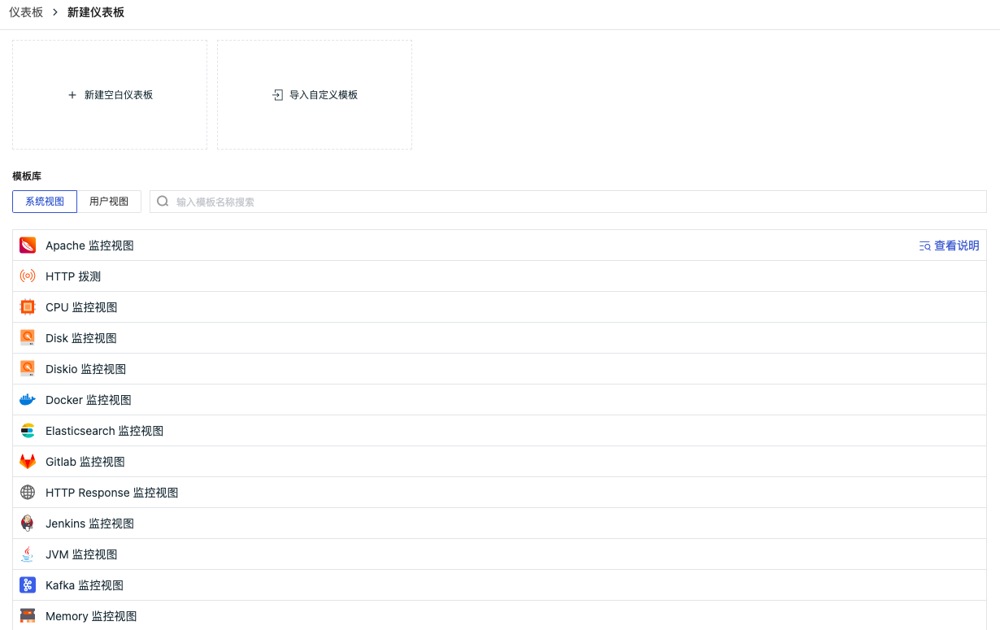
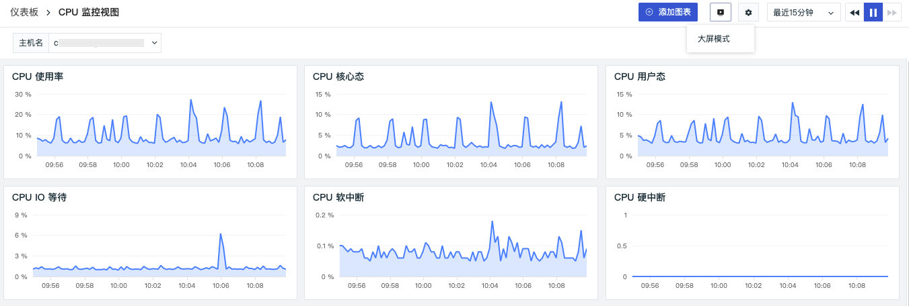
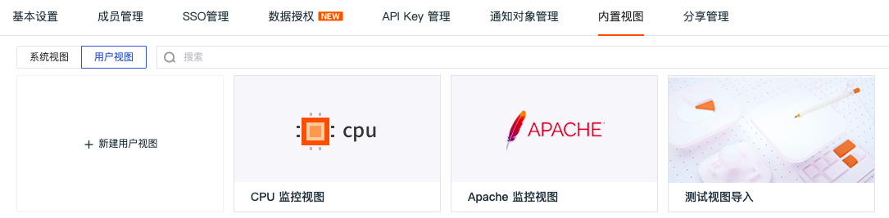
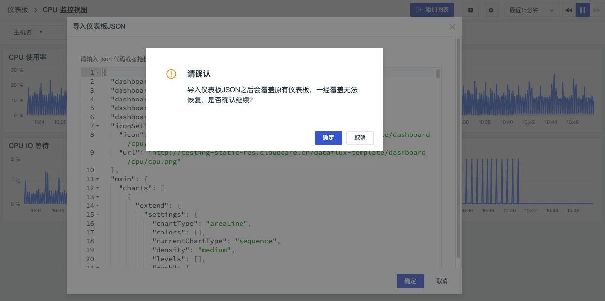
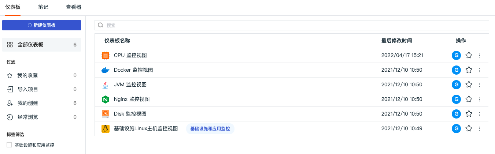

# 仪表板
---

## 概述

在场景下，可以创建多个仪表板来构建数据洞察场景，支持通过关键字搜索仪表板，支持为仪表板添加可视化图表进行数据分析，支持从“我的收藏”、“导入项目”、“我的创建”和“经常浏览”来快速过滤查找对应的仪表板。

## 新建仪表板

进入场景后，在「仪表板」，点击「+新建仪表板」，然后选择想要创建的视图模板。

**视图模板说明**

- 空白仪表板：即创建一个空白的仪表板，后续可自定义设置该仪表板中的图表
- 自定义模板：导入自定义的视图模板进行使用，将视图模板代码粘贴到指定位置即可。
> **视图模板代码：**通常为导出的模板文本。在仪表板中，点击导航栏「设置」-「导出仪表板JSON」即可导出对应的视图模板 json 文件至本地，打开 json 文件即可看到“视图模板代码”；点击导航栏「设置」-「导入仪表板JSON」即可导入视图模板 json 文件至对应的仪表板。

- 内置模板库：系统提供和用户自定义创建的视图模板，无需配置，即选即用，支持关键字搜索，支持点击右侧“查看说明”一键查看对应的集成文档，帮助您快速配置对应的采集器

在创建/修改仪表板视图时，可以为仪表板添加自定义标签，帮助快速筛选。

根据需求搜索视图模板，并添加自定义标签以后，点击「确定」可直接创建一个仪表板。视图模板无需配置，即选即用。

### 添加图表

仪表板创建完成后，可点击右上角 「添加图表」为仪表板添加新的图表。支持为图表添加全局变量，完成图表的动态筛选。详细介绍请点击 [视图变量](view-variable.md) 进行查看。

### 时间组件

“观测云”支持通过时间组件控制当前仪表板的数据展示范围（不包括锁定时间范围的图表）。时间组件用来设定仪表板中图表显示的时间范围和数据的刷新时间，用户可以快速选择预设的时间范围，或通过「开始时间」和「结束时间」自定义设置时间范围。

**时间范围**

「快速选择」中预设了21种时间范围，包括相对时间（昨天、上周、本月等）和相近时间（最近15分钟、最近1小时、最近1天等）两种范围类型。

点击按钮，退出实时数据模式，锁定当前时间范围为绝对时间。
> 例如：时间范围选择了“最近1小时”，那么当点击按钮后，视图时间范围整体向前调节1小时

**数据刷新时间**

观测云数据刷新时间默认为30秒。支持手动设置刷新频率。

### 大屏模式

在仪表板，点击「预览」-「大屏模式」按钮后，观测云将自动帮您收起左侧和顶部的导航栏并全屏显示视图。点击【ESC】按钮，即可退出大屏模式。

### 仪表板设置

仪表版创建完成后，点击“设置”按钮可对仪表板“保存到内置视图”、“设置刷新频率”、“导入/导出仪表板JSON”、“复制仪表板”、“保存快照”等操作。

#### 保存仪表板为内置视图

在仪表板，点击“设置”按钮，选择“保存到内置视图”，把仪表板视图如“CPU 监控视图”保存到内置视图的“用户视图”。仪表板视图保存到内置视图时，支持选择绑定关系，选择绑定关系“label”。

保存到内置视图后，即可在观测云工作空间「管理」-「内置视图」的「用户视图」查看保存的仪表版视图“CPU 监控视图”。 注意：同一个工作空间下用户视图不允许重名。

同时因为设置了绑定关系`label:*`，在基础设施设置过 “Label 属性”的主机、容器详情页即可查看绑定的内置视图“CPU 监控视图”。

#### 设置刷新频率

在仪表板，点击“设置”按钮，选择「设置刷新频率」，即可手动配置图表数据的刷新频率。初次设置刷新频率默认为 30 秒，支持 10 秒、30 秒、60 秒三种选项，若时间控件设置为“暂停”，则不再刷新。

#### 导入/导出仪表板JSON

在仪表板，点击“设置”按钮，选择“导出仪表板JSON”，即可导出当前仪表板的JSON文件；选择“导入仪表板JSON”，即可导入JSON文件覆盖当前的仪表板。 注意：导入仪表板JSON会覆盖原有仪表板，易经覆盖无法恢复。

#### 复制仪表板

在仪表板，点击“设置”按钮，选择「复制仪表板」，即可复制仪表板。

在弹出的对话框输入复制的仪表板名称，点击确定，即可在仪表板列表查看复制的仪表板视图。

#### 保存快照

在仪表板，点击“设置”按钮，选择「保存快照」，即可为当前仪表板保存快照。更多介绍可参考文档 [快照](../management/snapshot.md) 。

## 修改/导出/删除仪表板

点击仪表板右侧的下拉按钮，支持为仪表板修改名称、导出仪表板到 json 文件和删除仪表板。

## 过滤/筛选仪表板

在仪表板左侧，支持通过“我的收藏”、“导入项目”、“我的创建”和“经常浏览”来快速过滤查找对应的仪表板；支持通过为仪表板设置标签来进行快速筛选仪表板。

- 我的收藏：当前用户收藏的仪表板，点击仪表板右侧的收藏图标即可；
- 导入项目：当前工作空间所有通过“导入自定义模板”创建的仪表板；
- 我的创建：当前用户创建的所有仪表板，包括导入的仪表板；
- 经常浏览：当前用户一周内浏览次数大于5次的仪表板。

