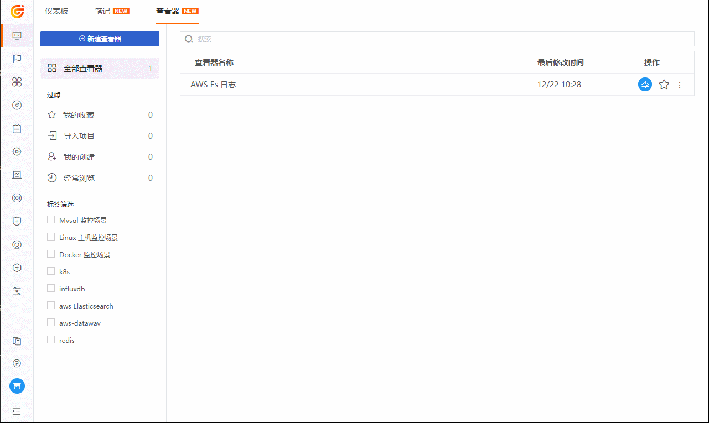
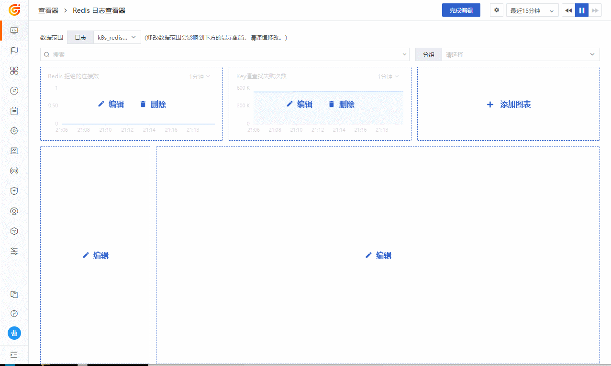
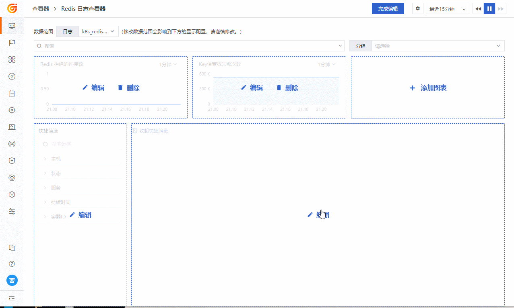

# 快速搭建自定义日志查看器
---

日志查看器做为日志可观测的重要工具，支持我们通过搜索、筛选等方式快速定位问题所在。“观测云”在原有的日志观测查看器的基础上，支持在场景处新建自定义的日志查看器。

自定义的查看器采用全新统一布局，响应式的配置模式和更科学的数据关联配置，下面将以 Redis 日志自定义查看器为例，您可以在自定义查看器中体验如下操作：

- 多个自定义图表显示设置
- 自定义快捷筛选字段
- 自定义列表默认显示列
- 绑定查看关联的内置视图

## 开始创建日志自定义查看器
### 新建 Redis 日志查看器
进入 [场景] - [查看器] 页面，点击 【新建查看器】，新建自定义查看器。如下图所示：

### 配置 Redis 统计类图表
编辑模式下，支持最多添加 3 个统计类图表。如下图所示：

### 配置快捷筛选字段
点击[快捷筛选]编辑按钮，添加字段和别名。如下图所示：

### 配置列表默认显示字段
点击[列表]编辑按钮，编辑更新默认显示字段和别名。如下图所示：

### 绑定内置视图显示
进入[管理] - [内置视图] -[系统视图]，搜索“redis”，编辑【Redis 监控视图】添加绑定关系。如下所示：

### 查看 Redis 日志查看器

## 更多参考

- [场景 - 查看器帮助文档](index.md)
- [绑定内置视图](../../management/built-in-view/bind-view.md)

