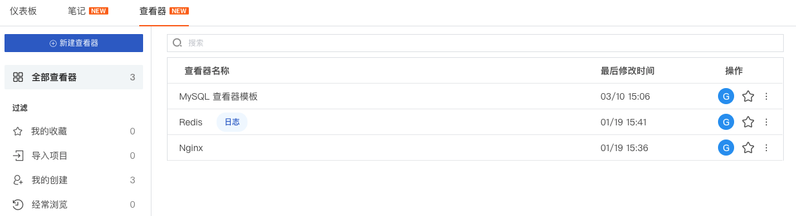
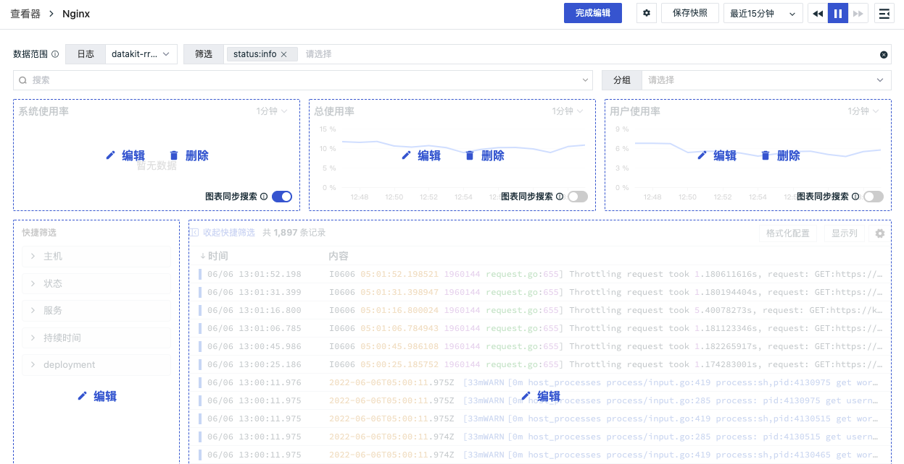
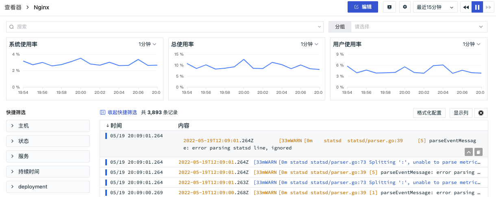
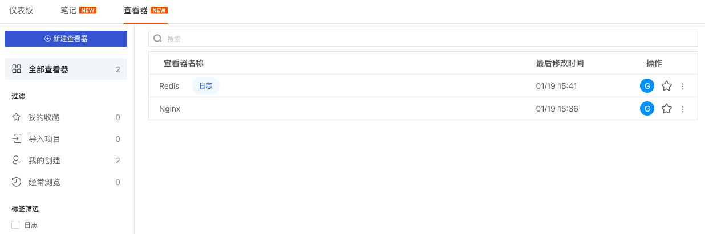
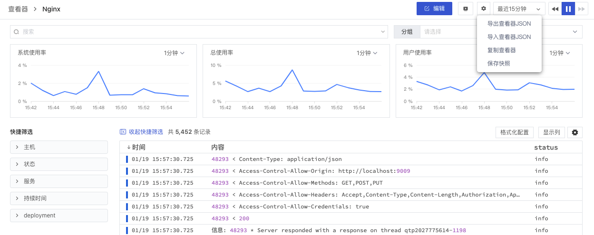

# 查看器
---

## 概述

观测云的场景自定义查看器为你提供了可快速搭建的日志查看器，你可以与空间成员共同搭建基于自定义的日志查看器，定制化你的查看需求，还可以将制作完成的查看器导出分享给他人，共享查看器模版。

## 新建查看器

进入「场景」-「查看器」，点击「+新建查看器」，即可开始创建自定义查看器。

- 空白查看器：即创建一个空白的查看器，后续可自定义设置该查看器
- 自定义模板：导入自定义的查看器模板进行使用
- 内置查看器模板：系统提供的查看器模板，无需配置，即选即用。

选择「+新建空白查看器」并完成自定义查看器名称及标签后，即可创建一个新的查看器。

- 查看器名称：工作空间内查看器名称不可重复，且支持最大长度 64个字符
- 自定义标签：自定义的可识别语言符号，用于将仪表板和查看器分组。”观测云“的仪表板与查看器共用一套标签数据，点击「标签」即可搜索对应的查看器

在新创建的查看器，选择日志的数据范围后进行编辑，包括：3个时序图图表、1个快速筛选、1个数据列表。

- 时序图图表：用于显示数据在相等时间间隔下的趋势变化，同时可用来分析多组指标数据之间的作用及影响。支持自定义图表查询，并展示为折线图、面积图或柱状图，详情可参考 [图表查询](../visual-chart/chart-query.md) 和 [时序图](../visual-chart/timeseries-chart.md) 。
- 图表同步搜索：用于筛选搜索的内容是否同步到图表，默认开启。当搜索框有内容时，关闭开关，即图表查询回到默认状态；开启开关，即图表查询受到筛选内容的影响；
- 快捷筛选：默认显示 主机、状态 两个字段；支持用户自定义快捷筛选列表；
- 数据列表：默认配置 时间、内容 两个字段，支持用户自定义显示列表字段；

更多详情可参考文档 [快速搭建自定义日志查看器](custom-explorer.md) 。

查看器创建完成后，您可以通过以下功能查询和分析日志数据，帮助您快速定位问题。

- 搜索：基于字段标签、日志文本进行关键词搜索、字段筛选、关联搜索、模糊搜索
- 分组：基于字段标签，展示可视化趋势
- 快捷筛选：基于字段标签，快捷筛选日志数据
- 格式化配置：隐藏敏感日志数据内容或者突出需要查看的日志数据内容，还可以通过替换原有日志内容进行快速筛选。
- 显示列：自定义数据列表显示列
- 设置按钮：设置日志多行查看和导出CSV
- 复制日志内容：使用“鼠标悬停”至日志内容，展开查看日志的全部内容，点击“复制”按钮可把整条日志内容复制到粘贴板。展开时若可以系统会将该条日志JSON格式化，若不可以则正常展示该日志内容

### 格式化配置

格式化配置可以让您隐藏敏感日志数据内容或者突出需要查看的日志数据内容，还可以通过替换原有日志内容进行快速筛选。

在查看器的格式化配置，添加映射，输入以下内容，点击保存，即可把含“48043”的原日志内容替换成您想显示的格式。

- 字段：如内容
- 匹配方式：如match（目前支持`=`、`!=`、`match`、`not match`）
- 匹配内容：如48043
- 显示为内容：如xxxxxx

注意：仅管理员及以上可进行查看器格式化配置。

## 编辑查看器

“查看器”可通过点击右侧操作下的按钮进行收藏、修改名称和标签、导出和删除。左侧可通过“过滤”和“标签筛选”对查看器进行分组查看，以便快速获取查询结果。在查看器列表，点击查看器名称，即可编辑查看器。

## 导入/导出/复制查看器

观测云支持复制当前查看器为新的查看器进行编辑；支持导出Json文件为模版，以共享当前查看器的数据监测方案，实现反复使用模版的价值，导出的查看器Json文件可以通过导入新建或者覆盖原先的模版进行编辑。

