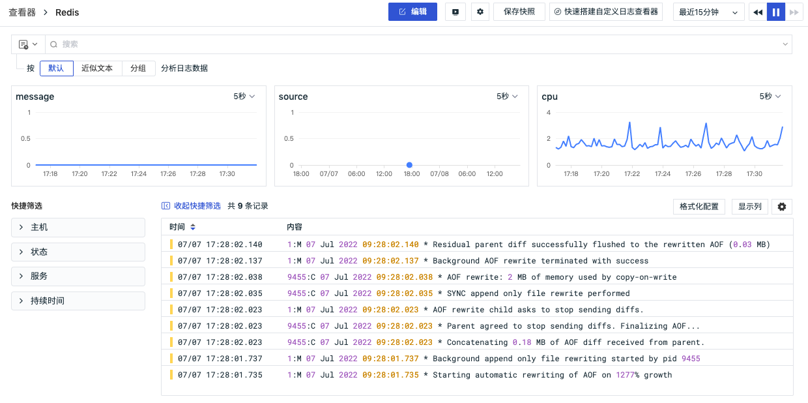

# 场景
---

在观测云中，您可以根据不同的视角构建满足不同业务的「场景」。场景包括仪表板、笔记和查看器。

## 仪表板

在场景下，您可以创建多个 [仪表板](dashboard.md) 来构建数据洞察场景。在仪表板中支持添加多种可视化图表进行数据展示，帮助用户直观地跟踪，分析和显示关键性能指标，监控整体的运行状况。

## 笔记
在场景下，可以创建多个 [笔记](note.md) 来进行总结报告，支持插入实时可视化图表进行数据分析，支持插入文本文档进行说明，结合图表和文档进行数据分析和总结报告；支持与工作空间所有成员共享笔记，留存异常数据分析，帮助回溯、定位、解决问题。

## 查看器
在场景下，可快速搭建多个自定义日志 [查看器](explorer/index.md) ，支持与空间成员共同定制化日志的查看需求，支持将制作完成的查看器导出分享给他人，共享查看器模板。

