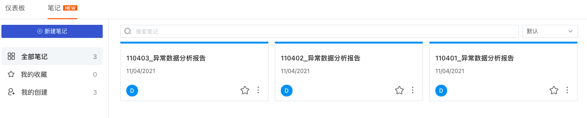
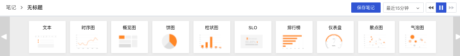

# 笔记
---

## 概述

在场景下，可以创建多个笔记来进行总结报告，支持插入实时可视化图表进行数据分析，支持插入文本文档进行说明，结合图表和文档进行数据分析和总结报告；支持与工作空间所有成员共享笔记，留存异常数据分析，帮助回溯、定位、解决问题。

## 新建笔记

进入场景后，在「笔记」，点击「+新建笔记」。

输入笔记标题，使用文本图表输入文本，使用其他图表展示指标的可视化数据分析，支持在编辑笔记时查看帮助文档，支持复制、删除、编辑文本和可视化图表组件。

- 关于文本输入，可参考文档 [如何撰写文本文档](https://www.yuque.com/dataflux/doc/lovki1) 。
- 关于图表制作，可参考文档 [可视化图表](https://www.yuque.com/dataflux/doc/rttwsy) 。

笔记完成后，点击“保存笔记”，即可完成笔记的创建。

在导航栏「设置」，笔记支持「导出笔记JSON」、「导入笔记JSON」、「导出为PDF」以及「[保存快照](https://www.yuque.com/dataflux/doc/uuy378)」。

点击「导出笔记JSON」即可导出对应的 json 文件至本地，打开 json 文件即可看到“模板代码”。

点击「导入笔记JSON」即可导入模板 json 文件至对应的笔记。

## 修改删除笔记

点击笔记右下角的下拉按钮，选择「修改」、「删除」即可修改或者删除笔记。

注意：仅空间拥有者、管理员、笔记的创建者可删除笔记，其他工作空间成员可查看、但无删除权限。

## 时间范围

“观测云”支持通过时间组件控制当前笔记中图表（不包括锁定时间范围的图表）的时间范围，您可以自定义时间范围。

## 过滤笔记

在笔记顶部，支持通过关键字搜索和按时间为笔记排序；在笔记左侧，支持通过“我的收藏”、“我的创建”来快速过滤查找对应的笔记。

- 我的收藏：当前用户收藏的笔记，点击笔记右下角的收藏图标即可；
- 我的创建：当前用户创建的所有笔记；

---

观测云是一款面向开发、运维、测试及业务团队的实时数据监测平台，能够统一满足云、云原生、应用及业务上的监测需求，快速实现系统可观测。**立即前往观测云，开启一站式可观测之旅：**[www.guance.com](https://www.guance.com)
