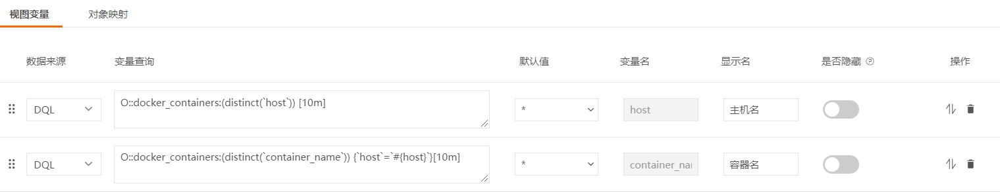
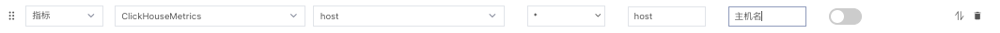
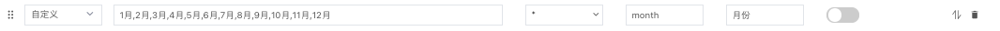
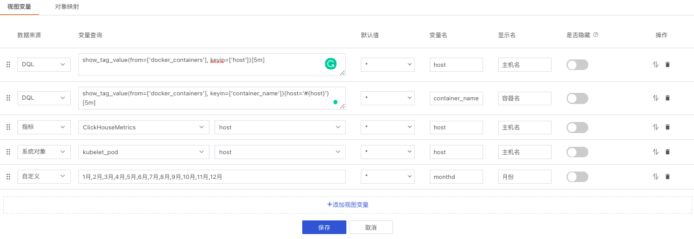
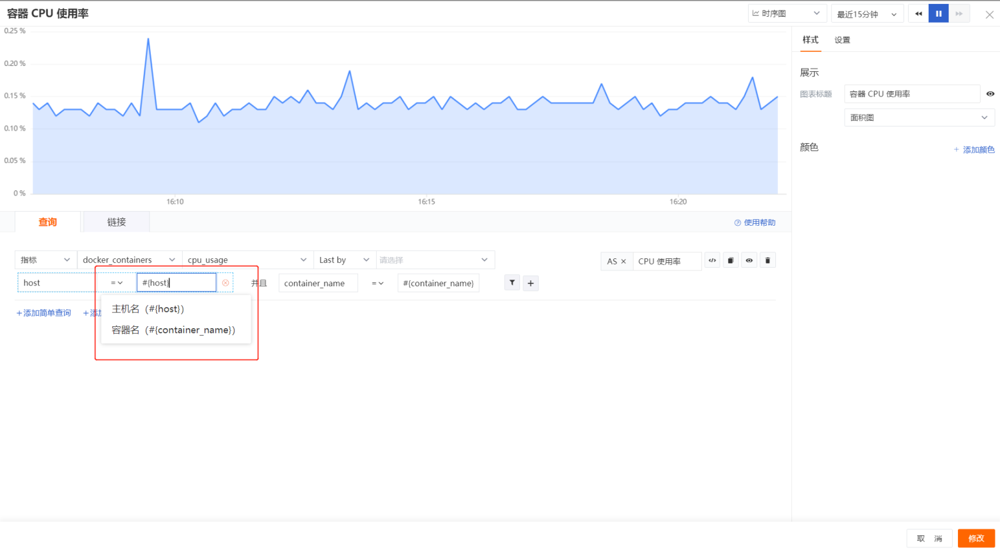
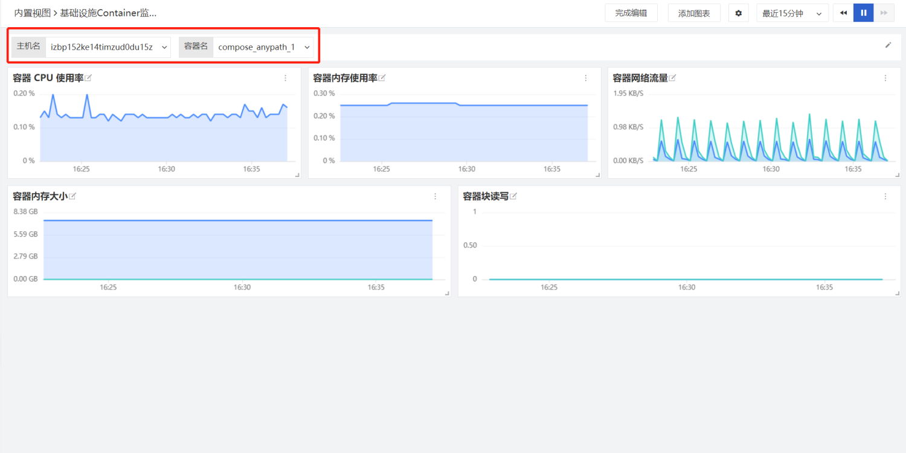
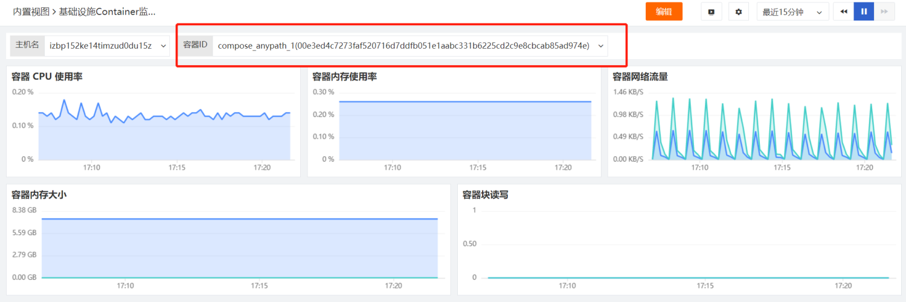
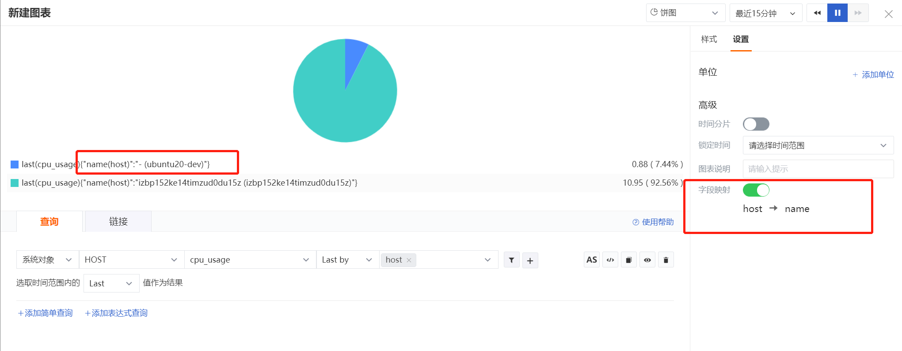

# 视图变量
---

## 概述

“观测云”支持向视图中添加全局变量，当你想要在仪表板中，动态地完成图表的筛选，可以选择使用视图变量来实现。（注意：在切换视图变量时，下拉中仅支持显示前50个，可通过搜索查看其余变量）

## 添加视图变量

在仪表板视图中，进入「编辑」模式，点击「添加视图变量」进入视图变量编辑界面。

视图变量支持的数据来源包括「指标」、「DQL」、「系统对象」、「自定义对象」和「自定义」。


### DQL 查询

使用 DQL 可以实现查询变量和关联变量。([了解更多DQL函数说明](https://www.yuque.com/dataflux/doc/ziezwr#648f615c))

#### Show 函数查询

> 【指标数据】建议使用该查询方式

| 语法 | 说明 |
| --- | --- |
| show_measurement() | 返回时序数据的指标集合 |
| show_tag_key(from=["指标集名"]) | 返回指标集 tag 列表, 可以指定具体的指标 |
| show_tag_value(from=['指标集名'], keyin=['标签名']) | 返回数据库中指定 tag key 的 tag value 列表 |
| show_object_source()    <br />_ `object `可替换为 logging/event/tracing/rum _ | 返回 object /log/keyevent/tracing /rum数据的指标集合，该函数不需要参数 |

`SHOW_TAG_VALUE` 函数示例：

```
##查询指标集 cpu 的 host 标签值列表
SHOW_TAG_VALUE(from=["cpu"],keyin=["host"])
```

#### DQL 语句查询

> 基础设施、日志等【非指标数据】建议使用该方式

| 语法 | 说明 |
| --- | --- |
| _数据源类型::数据来源:(distinct(`属性字段名`)){筛选条件} _ | _M/metric - 时序指标数据 ；O/object - 对象数据；L/logging - 日志数据 ；E/event - 事件数据 ；T/tracing - 追踪数据  ；R/rum - RUM 数据_ |
| R::view:(distinct(`app_id`)) | 返回web应用用户访问监测的app_id列表 |
| R::view:(distinct(`env`)) {`app_id` = '#{appid}'} | 变量联动，假使上一条查询的变量名设为`appid`，则返回上条变量中所选app_id对应的`evn`列表 |
| R::view:(distinct(`env`)) {`app_id` = '8f05003ebccad062'} | 返回`app_id=8f05003ebccad062`对应的`evn`列表 |

#### 变量联动查询

> 使用场景：两个变量 host（主机）、container_name（容器），选择host，自动显示该 Host 对应所有 Container 列表


变量1（主机名）：_查询最近10分钟的容器主机列表_<br />`O::docker_containers:(distinct(`host`)) [10m]`

变量2（容器名）：_查询变量1中所选主机下的容器列表_<br />`O::docker_containers:(distinct(`container_name`)) {`host`=`#{host}`}[10m]`




### 指标查询

选择【指标集】以及对应的【标签】



### 基础设施查询

选择【对象分类】以及对应的【属性字段】


### 自定义查询

自定义变量选项中的内容，每个选项之间用英文 “,” 隔开。



### 变量设置

#### 字段描述
| 字段 | 描述 |
| --- | --- |
| 默认值 | 当前视图变量在仪表板中的初始变量。支持预览当前视图变量的全部变量，并选择在仪表板默认查看的初始变量。默认值列表最多显示50个变量，支持搜索查找更多 |
| 变量名 | 当前视图变量集合所属的变量名称 |
| 显示名 | 当前视图变量集合在仪表板中现实的名称 |


#### 高级设置
针对视图变量可以进行如下的高级配置：

| 功能 | 说明 |
| --- | --- |
| 拖动排序 | 通过鼠标悬浮（hover）至图标，可点击拖动视图变量，调节先后顺序 |
| 排序 | 针对查询返回的视图变量进行默认、升降、排序排列。 |
| 是否隐藏 | 开启该功能后，在非编辑模式下，该变量不可见 |



## 如何使用视图变量

视图变量创建完成后，要在图表中关联此变量，实现图表与视图变量的联动筛选。

1）在图表查询中，筛选字段时，value值选中该变量即可。(此处下拉中显示的是变量名)



2）在场景视图中切换变量值，图表将根据变量标签进行筛选展示



## 修改/删除视图变量

点击「编辑」，点击视图变量编辑图标，进入变量管理页面，即可「修改」，点击删除图标即可「删除」。

## 对象映射

针对系统对象数据可以设置字段映射，字段映射只是用作显示，不会影响原字段数据。

### 添加映射

选择【对象分类】以及需要映射的两个【属性字段】。如下图所示：将`container_id` 映射显示为`container_name`。


### 如何使用对象映射

字段映射的结果可以应用在两个地方：1）视图变量的下拉显示中；2）图表的显示中

#### 在视图变量中应用

在视图变量中添加对象的【属性字段】，若该字段同样设置了字段映射，那么在视图变量中显示为：映射的字段（查询的字段）。

举例说明：

1）在【对象映射】中设置`container_id`映射为`container_name`。<br />2）在【视图变量】中添加了container_id变量（如下图所示）。


3）此时在视图中变量显示为：container_name(container_id)。



#### 在图表中应用

在图表中查询了对象的【属性字段】，并在设置中开启【字段映射】，若该字段同样设置了字段映射，那么在图表变量中显示为：映射的字段（查询的字段）。

举例说明：

1）在【对象映射】中设置`host`映射为`name`（如下图所示）。


2）在图表查询中使用该字段，并且在【设置】中开启【字段映射】，那么在图表中显示格式为`name(host)`。



注意：

- 对象映射只支持设置对象类数据
- 使用对象映射时，必须先定义一个基于对象类字段的视图变量
- 同一对象分类的查询字段，不支持设置两个映射，即查询字段下拉中不存在该对象分类已添加的字段
- 开启字段映射时，图表中显示查询的「分组字段」和对应的「映射字段」，未指定映射的分组字段不显示
- 关闭字段映射时，图表中不显示映射的字段，正常显示。


---

观测云是一款面向开发、运维、测试及业务团队的实时数据监测平台，能够统一满足云、云原生、应用及业务上的监测需求，快速实现系统可观测。**立即前往观测云，开启一站式可观测之旅：**[www.guance.com](https://www.guance.com)
