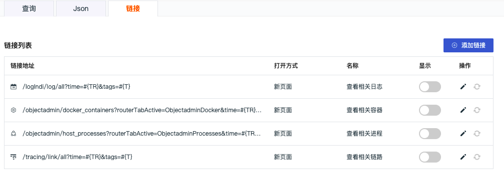
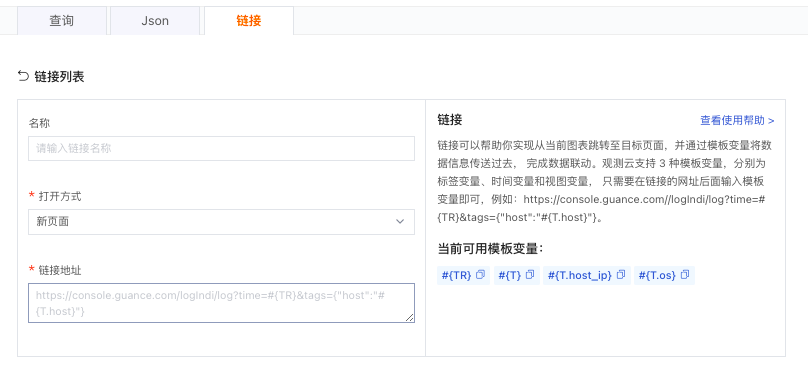
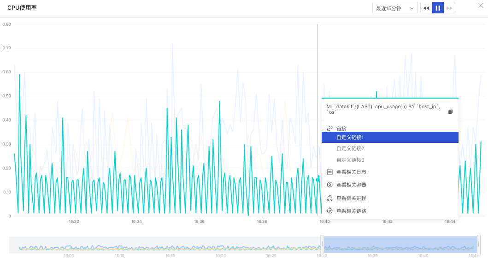
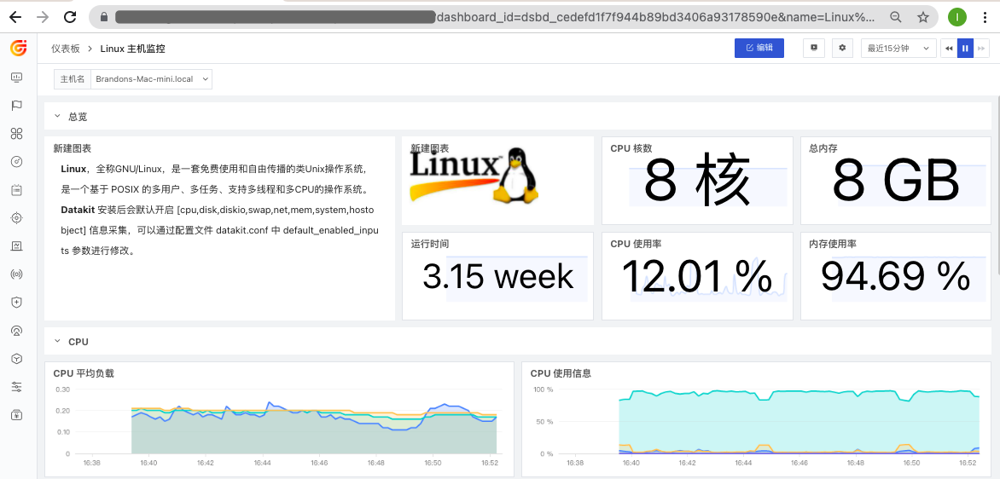
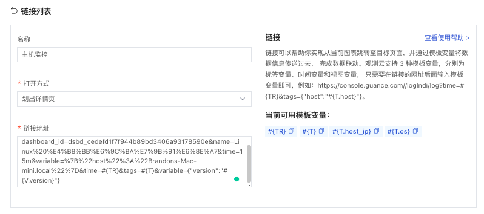
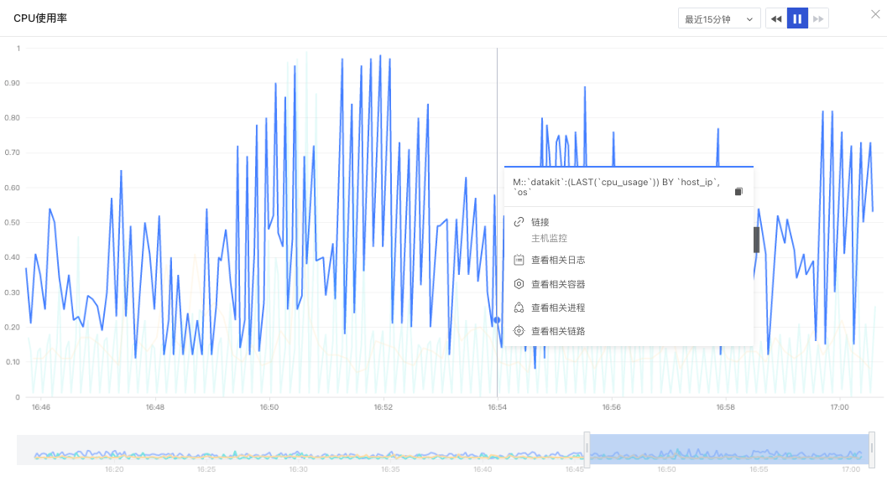
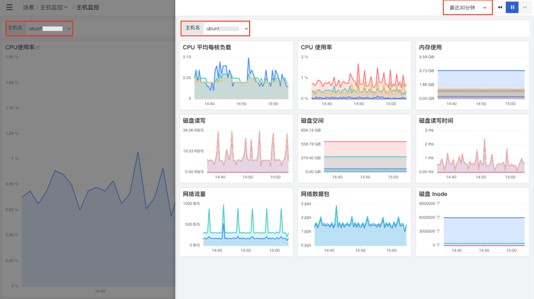
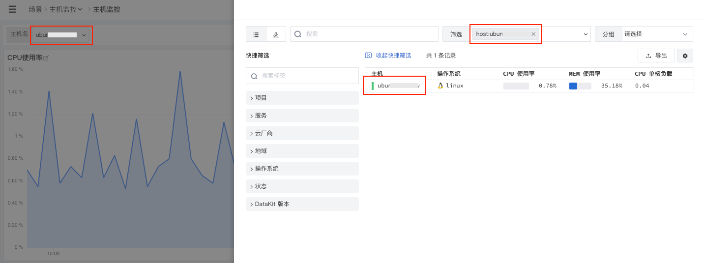
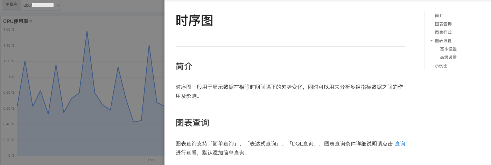

# 图表链接
---

## 简介

观测云支持图表内置关联链接和自定义关联链接，可以帮助您实现从当前图表跳转至目标页面，并通过模板变量修改链接中对应的变量值将数据信息传送过去，完成数据联动。

注意：图表链接支持相对路径的地址。

## 变量说明

观测云支持 3 种模板变量，分别为时间变量、标签变量和视图变量。

| 变量类型 | 变量 | 说明 |
| --- | --- | --- |
| 时间变量 | #{TR} | 当前图表查询的时间范围，例如  `time=#{TR}` |
| 标签变量 | #{T} | 当前图表查询的所有分组标签，是将当前图表查询的全部分组标签作为查询条件。 假设当前图表查询为： `M::`datakit`:(LAST(`cpu_usage`)) { `vserion` = '1.0.0-rc1' } BY `host`, `vserion`, `os`` 模版变量：`&tags=#{T} `同为 `&tags={“host","os","linux"}` |
|  | #{T.name} | name 为系统自动识别的当前图表查询对应的分组标签名称。 假设当前图表查询存在分组标签“host"： - 模版变量 `#{T.host}` -  `tags={"host":"{T.host}"}`  |
| 视图变量 | #{V} | 仪表板中的所有视图变量的当前值集合，是将当前仪表板的全部视图变量作为查询条件。 假设当前仪表板的视图变量为： "version"="V1.7.0" 和 "region":"cn-hangzhou" 模版变量` &tags=#{V}  `同为 `&tags={"version":"V1.7.0","region":"cn-hangzhou"}` |
|  | #{V.name} | name 为系统自动识别的当前仪表版存在的视图变量名称。 假设当前仪表板存在视图变量“version" - 模版变量 `#{V.version}` - `tags={"version":"{V.version}"}`  |

链接中视图变量通常有以下几种用法： 1）`&tags=#{V}`  ，链接中传递所有视图变量的条件 2）`&tags={"version":"{V.version}"}`，链接中仅传视图变量version的条件 3）`&tags={"host":"#{V.host}"}`，链接中传递标签 host 的条件，host 值即为当前视图变量 host 的选值
## 内置链接

内置链接是观测云默认为图表提供的关联链接，主要基于当前查询的时间范围和分组标签，帮助您查看对应的日志、进程、容器、链路，内置链接默认关闭，可在编辑图表时开启显示。

- 查看相关日志：基于当前查询的分组标签关联查询相关日志，即添加当前分组标签为筛选条件，支持跳转至日志查看器查看详情
- 查看相关容器：基于当前查询的分组标签关联查询相关容器，即添加当前分组标签为筛选条件，支持跳转至容器查看器查看详情
- 查看相关进程：基于当前查询的分组标签关联查询相关进程，即添加当前分组标签为筛选条件，支持跳转至进程查看器查看详情
- 查看相关链路：基于当前查询的分组标签关联查询相关链路，即添加当前分组标签为筛选条件，支持跳转至应用性能监测查看器查看详情

注意：

- 内置链接**不支持存在筛选条件的查询**。当您的图表查询存在筛选条件时，您可以通过「链接」自定义链接
- 内置链接**不支持存在视图变量的查询**。当您的图表查询存在筛选条件时，您可以通过「链接」自定义链接

## 自定义链接

观测云支持添加图表自定义链接，可以帮助您实现从当前图表跳转至目标页面，并通过模板变量修改链接中对应的变量值将数据信息传送过去。自定义链接添加以后默认开启显示，可直接在图表预览中显示相关链接。

在「仪表板」编辑模式下，选择「图表」-「链接」，即可查看可使用的模版变量。

1）在网址链接后面输入变量模版，如 `https://console.guance.cn/logndi/log?time=#{TR}&tags={"version":"#{V.version}"}`

- `https://console.guance.com/logIndi/log/?`为网址链接
- `time=#{TR}&tags={"version"="#{V.version}"}`为模版变量的内容。

2）在网址链接中修改变量模版，如

- 使用模版变量前：

`https://console.guance.com/logIndi/log/?`

- 使用时间变量后：

`https://console.guance.cn/logndi/log?time=#{TR}`

- 使用标签变量后：

`https://console.guance.cn/logndi/log?time=#{TR}&tags=#{T}`

- 使用视图变量后：

`https://console.guance.cn/logndi/log?time=#{TR}&tags={"version"="#{V.version}"}`

**注意：**

- 变量支持在网址链接后面输入，若网址链接本身已经带有时间变量、标签变量或者视图变量，需要在现在有的变量上进行修改，否则会导致冲突。
- 若一个变量有多个参数用 `,` 隔开，多个变量之间用 `&` 链接。

## 链接方式

观测云支持三种链接打开方式，分别为【新页面】【当前页面】和【划出详情页】。

- 新页面：在一个新的页面打开链接
- 当前页面：在当前页面打开链接
- 划出详情页：在当前页面侧滑出窗口，打开该链接

## 操作

观测云支持对图表链接进行「编辑」、「删除」、「还原」的操作

- 编辑：支持对已添加的链接进行修改
- 删除：删除当前链接。确定删除的链接将无法恢复
- 还原：支持对修改过的链接还原到初始默认状态

## 示例

前提条件：已经在 “观测云”仪表板下完成图表创建，现在需要为图表添加链接。

### 链接到其他视图
  **步骤一：获取需要链接的网址** 打开需要在图表中链接的主机监控视图，复制浏览器中的网址。

**步骤二：填入图表链接** 在图表链接中，粘贴复制的链接地址。

**步骤三：按照图表链接模版变量修改链接** 根据链接的模版变量规则修改链接中的变量值，包括时间变量、标签变量和视图变量。打开方式选择“划出详情页”，别名填入“主机监控视图”。

**步骤四：在图表预览中打开链接** 在图表预览中，点击图表，即可弹出自定义链接对话框。

点击配置的“主机监控视图”链接，即可侧滑打开链接的视图。可以看到，视图变量和时间范围都和图表一致。

### 链接到基础设施

**步骤一：获取需要链接的网址** 在“观测云”基础设施主机复制链接网址。

**步骤二：填入图表链接** 在图表链接中，粘贴复制的链接地址。

**步骤三：按照图表链接模版变量修改链接** 根据链接的模版变量规则修改链接中的变量值，包括时间变量和视图变量（这里也可以使用标签变量`#{T.host}`）。打开方式选择“划出详情页”，别名填入“主机基础设施”。

**步骤四：在图表预览中打开链接** 在图表预览中，点击图表，即可弹出自定义链接对话框。点击配置的“主机基础设施”链接，即可侧滑打开链接的内容。可以看到，变量值主机保持一致。

### 链接到外部帮助文档

**步骤一：获取需要链接的网址** 在“观测云”帮助手册时序图复制链接网址。

**步骤二：填入图表链接** 在图表链接中，粘贴复制的链接地址。打开方式选择“划出详情页”，别名置空。

**步骤三：在图表预览中打开链接** 在图表预览中，点击图表，即可弹出自定义链接对话框。点击配置的外部链接，即可侧滑打开链接内容。可以按照链接的时序图帮助文档说明对图表进行设置。

