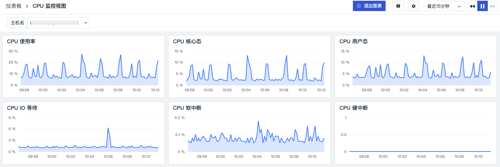
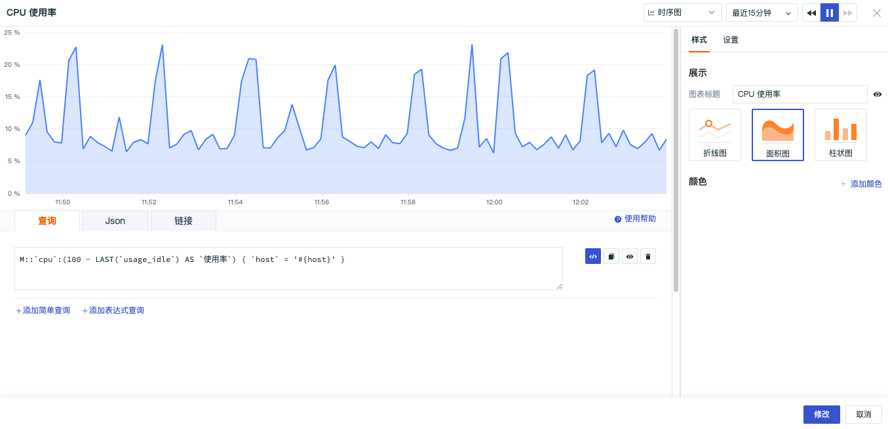
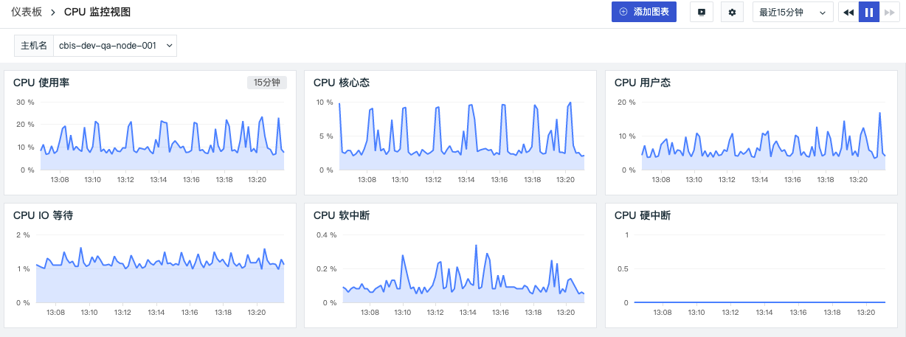
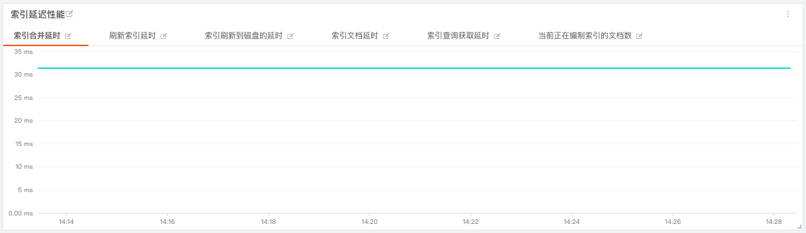

# 可视化图表
---

“观测云” 内置20余种标准的可视化图表：包括[时序图](https://www.yuque.com/dataflux/doc/sqg3vu)、[概览图](https://www.yuque.com/dataflux/doc/nlqqgk)、[表格图](https://www.yuque.com/dataflux/doc/gd2mzn)、[矩形树图](https://www.yuque.com/dataflux/doc/qqq59k)、[饼图](https://www.yuque.com/dataflux/doc/tycc02)、[柱状图](https://www.yuque.com/dataflux/doc/cmb104)、[SLO](https://www.yuque.com/dataflux/doc/nmbghv)、[排行榜](https://www.yuque.com/dataflux/doc/yi684q)、[仪表盘](https://www.yuque.com/dataflux/doc/vnio9q)、[散点图](https://www.yuque.com/dataflux/doc/igerle)、[气泡图](https://www.yuque.com/dataflux/doc/mpyve5)、[中国地图](https://www.yuque.com/dataflux/doc/lhm393)、[世界地图](https://www.yuque.com/dataflux/doc/eplxkm)、[蜂窝图](https://www.yuque.com/dataflux/doc/ulydya)、[文本](https://www.yuque.com/dataflux/doc/hhdws9)、[图片](https://www.yuque.com/dataflux/doc/uusinz)、[视频](https://www.yuque.com/dataflux/doc/ho0etb)、[命令面板](https://www.yuque.com/dataflux/doc/gevsbs)、[IFrame](https://www.yuque.com/dataflux/doc/yehahh)、[日志流图](https://www.yuque.com/dataflux/doc/nyca45)、[对象列表图](https://www.yuque.com/dataflux/doc/fl4z3f)、[告警统计图](https://www.yuque.com/dataflux/doc/qkrut5)等，可快速根据不同业务需求快速创建不同的仪表板，满足对数据个性化、全面的展示需求。

## 添加图表

仪表板创建完成后，可点击右上角 「添加图表」为仪表板添加新的图表。

支持为图表添加全局变量，完成图表的动态筛选。详细介绍请点击 [视图变量](https://www.yuque.com/dataflux/doc/mgpxkf) 进行查看。图表添加完成后，点击右上角「完成添加」即可。

## 设置图表

### 修改

在图表中，点击「设置」按钮，选择「修改」，即可对图表进行编辑。

在编辑图表时，可添加或者调整[图表查询](https://www.yuque.com/dataflux/doc/cxlbps)，查看和复制[图表 Json](https://www.yuque.com/dataflux/doc/pcopl4) 代码，添加[图表链接](https://www.yuque.com/dataflux/doc/nn6o31)，调整图表样式和设置等内容。

##### 锁定时间
若在图表设置中锁定时间选择“最近15分钟”。

在预览图表时，图表右上角会出现选择的锁定时间，您可以按照您的实际情况选择锁定时间查看您的数据。更多锁定时间介绍可查看具体的图表说明。

##### 自动对齐

若在图表设置中时间间隔选择“自动对齐”。

在预览图表时，图表右上角会出现时间间隔选项，您可以按照您的实际情况选择时间间隔查看您的数据。更多时间间隔介绍可查看具体的图表说明。

### 组合图表

在图表中，点击「设置」按钮，选择「组合图表」即可添加其他图表组合为新的组合图表。组合图表一般用于组合一个指标不同结果值的多个图表，帮助用户了解指标的对比结果，同时可以随意组合不同类型的图表。

### 分享

在图表中，点击「设置」按钮，选择「分享」，即可对制作的可视化图表进行分享，分享的图表统一存储在「管理」-「分享管理」-「图表分享」。更多详情可参考文档 [图表分享](https://www.yuque.com/dataflux/doc/fnsiyf) 。

**注意：分享图表功能仅支持空间拥有者、管理员和标准成员操作，只读成员无法查看到分享图表的功能。**

### 复制/粘贴

在图表中，点击「设置」按钮，选择「复制」，即可对制作的可视化图表进行复制，复制的图表可粘贴到其他的仪表板或者在笔记中使用。

### 克隆

在图表中，点击「设置」按钮，选择「克隆」，即可对制作的可视化图表进行克隆，克隆的图表可在当前仪表板直接编辑，帮助用户节约重新创建新图表的时间。

### 删除

在图表中，点击「设置」按钮，选择「删除」，即可对制作的可视化图表进行删除。图表一旦删除不可复原，需要重新制作。

## 分析图表

在仪表板中，点击图表上的「分析」按钮或双击图表空白处，可以放大图表进行查看和分析。

- 支持通过鼠标悬浮（hover）查看图表的数据信息；
- 支持通过选择[时间轴](https://www.yuque.com/dataflux/doc/sqg3vu#Skt0V)查看特定时间范围的指标趋势；
- 支持通过单击图表查看图表的[DQL查询语句](https://www.yuque.com/dataflux/doc/cxlbps)、[相似趋势指标](https://www.yuque.com/dataflux/doc/sqg3vu#ATVjL)以及相关关联分析链接如日志、容器、进程、链路等，支持自定义关联[图表链接](https://www.yuque.com/dataflux/doc/nn6o31)；
- 当图表查询存在主机（host) 信息，且图表查询中分组条件选择了「by host」，您还可以查看相关的主机监控视图。

---

观测云是一款面向开发、运维、测试及业务团队的实时数据监测平台，能够统一满足云、云原生、应用及业务上的监测需求，快速实现系统可观测。**立即前往观测云，开启一站式可观测之旅：**[www.guance.com](https://www.guance.com)

