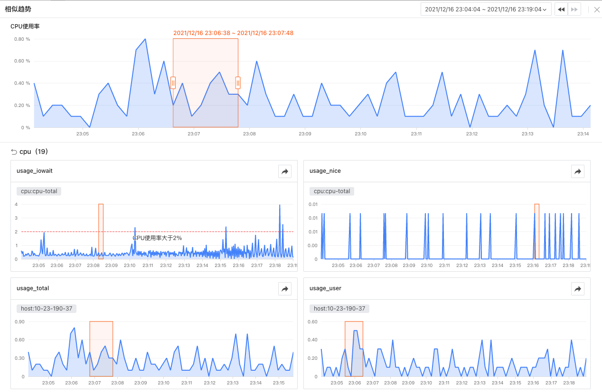
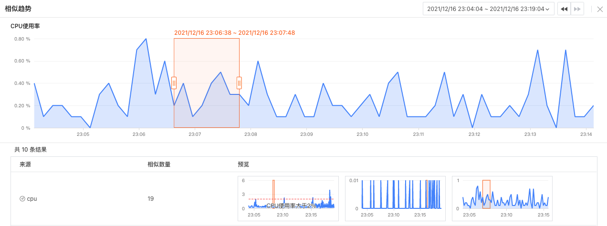
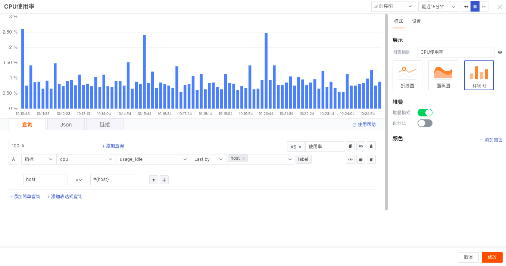

# 时序图
---

## 简介

时序图一般用于显示数据在相等时间间隔下的趋势变化，同时可以用来分析多组指标数据之间的作用及影响。

## 图表查询

图表查询支持「简单查询」、「表达式查询」、「DQL查询」，图表查询条件详细说明请点击 [图表查询](chart-query.md) 进行查看，默认添加简单查询。

## 图表链接

链接可以帮助您实现从当前图表跳转至目标页面，支持添加平台内部链接和外部链接，支持通过模板变量修改链接中对应的变量值将数据信息传送过去，完成数据联动。相关设置说明请点击 [图表链接](chart-link.md) 进行查看。

## 图表样式
| 选项 | 说明 |
| --- | --- |
| 图表标题 | 为图表设置标题名称，设置完成后，在图表的左上方显示，支持隐藏 |
| 图表类型 | 包含折线图、柱状图和面积图（默认选中折线图） |
| 堆叠显示 | 仅支持柱状图，默认关闭，开启后，右侧出现“方式”选项，包含时序、百分比。 - 时序：将每根柱子进行分割，以显示大类目下的细分类目占比情况，统计每个分组下不同指标的大小 - 百分比：柱子的各个层代表的是该类别数据占该分组总体数据的百分比，每个系列按照所占的百分比进行堆积  |
| 颜色 | 设置图表数据的显示颜色 |

## 图表设置

### 基本设置
| 选项 | 说明 |
| --- | --- |
| 单位 | 支持为查询结果自定义设置单位。若不设置单位，则按照科学计数自动计算图表Y轴数值；按照千分位的格式在图表上展示原始数值。 <li> Y轴数值展示 默认查询结果值自动转换单位展示遵循「科学计数 K、M、B」，保留两位小数点（1千 = 1K，100万 = 1M，10亿 = 1B）；人民币自动转换单位「元、万、亿」，保留两位小数点        例如：单位的时间间隔选择单位为ns，那么按照数据的大小，查询结果只自动转换单位效果如下，以此类推：    - 1000000ns：图表查询数据结果显示为1ms    - 1000000000ns：图表查询数据结果显示为1s    - 60000000000ns：图表查询数据结果显示为1m 注意：选择自定义单位后，取消科学计数，按用户设置的单位显示。 <li> 图表数值展示 可参考文档 [图表千分位](chart-query.md) 。 |
| 基线设置 | 支持添加基线值、基线标题以及基线颜色 |

### 高级设置
| 选项 | 说明 |
| --- | --- |
| 时间分片 | 默认对数据按照一定的时间间隔进行聚合处理，默认开启，不可更改 |
| 锁定时间 | 支持锁定图表查询数据的时间范围，不受全局时间组件的限制。设置成功后的图表右上角会出现用户设定的时间，如【xx分钟】、【xx小时】、【xx天】。如锁定时间间隔30分钟，那么当调节时间组件无论查询什么时间范围视图，仍只会显示最近 30 分钟数据 |
| 时间间隔 | 时间分片不显示，默认开启，时间间隔选项如下： <li>当没有选择【锁定时间】时，【时间间隔】可以选择 “原始间隔” 和 “自动对齐” ；【显示密度】可以进行切换。    - 原始间隔：根据时间组件的时间范围默认查询显示数据    - 自动对齐：开启后，将按选择的时间范围和聚合时间间隔动态的调整查询。系统预设了1毫秒、10毫秒、50毫秒、100毫秒、500毫秒、1秒、5秒、15秒、30秒、1分钟、5分钟，10分钟、30分钟、1小时，6小时，12小时、1天、1周、1月，多种时间间隔，根据计算的时间间隔就近向上取实际查询的时间间隔。（ 例如：自动聚合算法计算出时间间隔是 50 秒，那么实际将按照  1 分钟的时间间隔发起查询 ） <li>当选择了【锁定时间】时，【时间间隔】可以选择 “原始间隔” 和具体时间间隔。当选择了具体时间间隔时（例如1分钟、5分钟），显示密度灰置，不生效。    - 原始间隔：根据时间组件的时间范围默认查询显示数据    - 时间间隔：根据锁定时间的长短，自动匹配不同的可选时间间隔查询显示数据。（ 例如：时间间隔选择 1 分钟，那么实际将按照  1 分钟的时间间隔发起查询 ）  |
| 显示密度 | 包括「较低：60个点」、「低：180个点」、「中：360个点」、「高：720个点」（默认选"中"）。 逻辑规则如下：（例如查询出100个点） - 当查询点数低于“密度点数”时，直接返回；（选中【低】密度，100<180,直接返回查询出来的100个点） - 当查询点数超出”密度点数“时，返回密度点数；（例选中【较低】密度，100>60,处理后返回 60 个点）  |
| 同期对比 | 显示上一同等时间的折线图对比情况。（同期对比情况下的折线图显示为虚线折线图） **注意**：如需开启同期对比功能，需预先开启「锁定时间」功能， - 当 锁定时间为【今日/昨天】【本周/上周】【本月/上月】时，不支持使用同期对比功能 - 当 锁定时间为【最近XX分钟/小时/天】时，支持选择「环比」，进而对连续2个统计周期（比如连续两天）内的量的变化比  |
| 折线混合图 | 仅支持柱状图 |
| 字段映射 | 配合视图变量的对象映射功能，默认为关闭，若在视图变量已配置对象映射： - 开启字段映射时，图表显示查询的「分组字段」和对应的「映射字段」，未指定映射的分组字段不显示 - 关闭字段映射时，图表正常显示，不显示映射的字段  |
| 图表说明 | 为图表添加描述信息，设置后图表标题后方会出现【i】的提示，不设置则不显示 |
| 工作空间 | 被授权的工作空间列表，选择后即可通过图表查询并展示该工作空间数据 |

## 图表分析

时序图是以时间顺序为索引的二维图，横轴为时间刻度，纵轴为数据刻度。基于选择的时间范围，时序图将绘制对象数据在该时间段内的趋势变化。

**注意**：时序图一条查询语句最多返回 10 条时间线，即根据分组（group by）条件的结果，超过 10 条时间线的数据按照顺序只显示 10 条时间线。

### 时间轴功能

同时，在分析模式下，观测云提供了时间轴功能，即您不仅能够通过图表下方的时间轴预览对象数据和时间的交互变化，而且能够拖动选择展示的时间范围。时间轴范围是以选定的时间范围为查询周期，向前固定三个查询周期，向后最多固定一个查询周期（截止到当前的时间点）。例如：

- 当前时间点为11:00，时间范围选择「最近1小时」，那么时间轴范围为「8:00 - 11:00」。
- 当前时间点为11:00，时间范围选择「10:00-10:40」（查询周期为40分钟），那么时间轴范围为「8:40 - 11:00」。

### 相似趋势指标

在时序图的分析模式下，选中 [图表查询](chart-query.md) 为指标查询（包含：1.简单的指标查询；2.多个指标查询之间的表达式运算）的趋势线/柱，可“查看相似趋势指标”。

“查看相似趋势指标” 是以您框选的时间范围为绝对时间，查询空间内相似的指标趋势。您可以

- 在时序图上，点击图表并拖动鼠标选定搜索的时间范围
- 点击“按钮”，搜索相似趋势结果
- 点击查询结果，进入“相似趋势指标”详情页

#### 相似趋势结果

基于选定的绝对时间范围，查询结果列表包括：

- 来源：存在相似趋势的指标集
- 相似数量：对应“指标集”下相似趋势的图表数量
- 预览：相似趋势图表的预览图

**注意**：

- 查询「相似区间」时默认当前选定的时间范围为“绝对时间”，不会因任何外部的作用或观察者改变。如果您需要更改时间范围，您需要重新调节时间范围
- 进入「相似区间」页面后，单击拖动矩形可调整搜索的时间范围，如果已经选择了一个区域，您仍可以移动或者调整选择的时间范围
- 拖动至新的时间范围后，您需要 确定/取消 更换时间范围

## 示例图

- 折线图

- 柱状图

- 面积图

