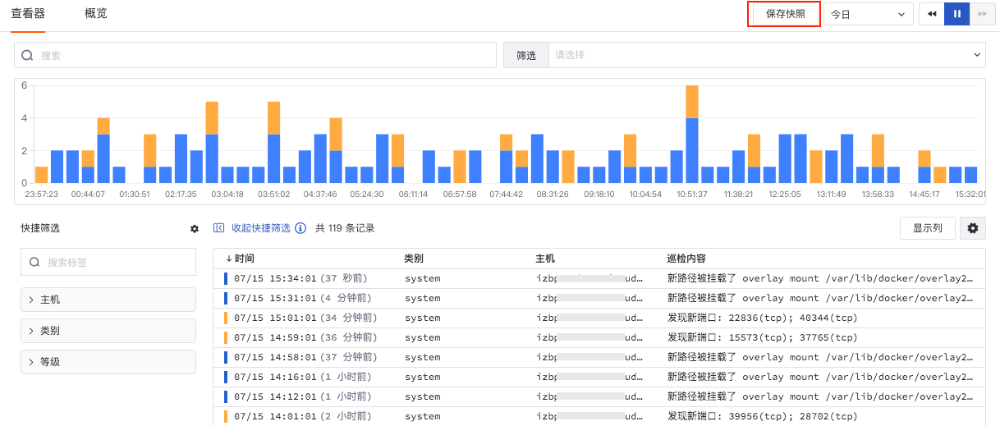
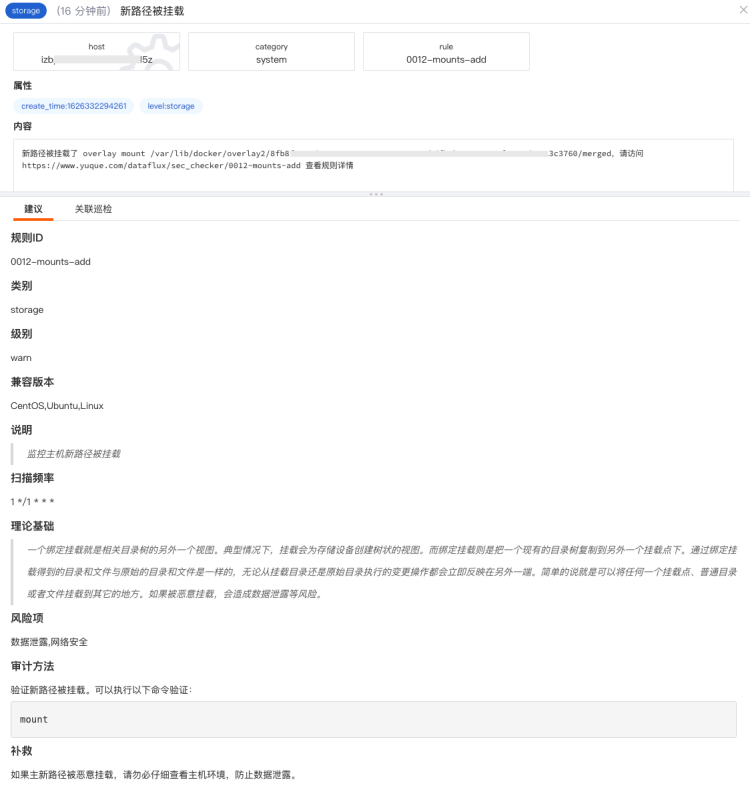
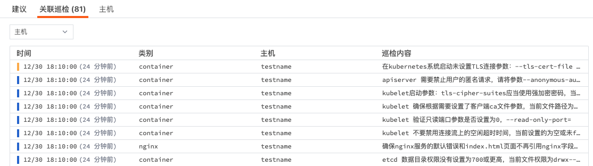
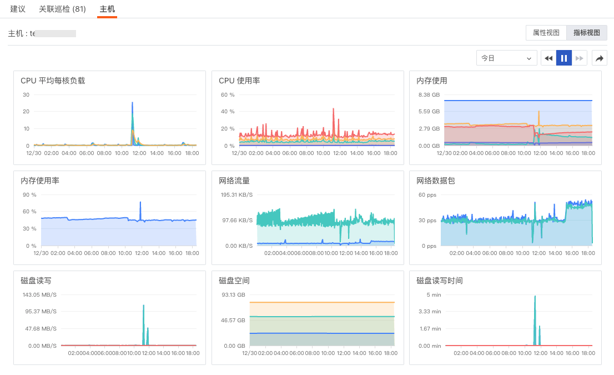

# 安全巡检查看器
---
- 版本：1.0.7-4-g582a075
- 发布日期：2022-08-05 03:12:31
- 操作系统支持：windows/amd64,windows/386,linux/arm,linux/arm64,linux/386,linux/amd64

## 简介

观测云支持你通过「安全巡检」及时监控、查询和关联全部巡检事件。在及时发现漏洞，异常和风险的同时，帮助你提高巡检质量、问题分析和问题处理的能力。

## 概览

在「安全巡检」-「概览」中，观测云默认为您提供了安全巡检监测视图，您可以通过筛选主机、安全巡检等级、安全巡检类别来查看不同主机发生安全巡检事件的概览情况，包括不同等级安全巡检事件发生的数量及可视化图表分析，不同类别和规则的安全巡检事件排行榜。

同时，您可以通过「跳转」按钮，跳转至概览页面对应的内置视图页面进行查看，并对该视图进行编辑、复制和导出。

## 查询与分析

在「安全巡检」-「查看器」，支持通过选择时间范围、搜索关键字，筛选等方式查询安全巡检事件。

### 时间控件

观测云查看器默认展示最近 15 分钟的数据，通过右上角的「时间控件」，您可以选择数据展示的时间范围。更多详情可参考文档 [时间控件说明](../getting-started/necessary-for-beginners/explorer-search.md#time) 。

### 搜索与筛选

在查看器搜索栏，支持关键字搜索、通配符搜索、关联搜索、JSON 搜索等多种搜索方式，支持通过 `标签/属性` 进行值的筛选，包括正向筛选、反向筛选、模糊匹配、反向模糊匹配、存在和不存在等多种筛选方式。更多搜索与筛选可参考文档 [查看器的搜索和筛选](../getting-started/necessary-for-beginners/explorer-search.md) 。

### 快捷筛选

在查看器快捷筛选，支持编辑“快捷筛选”，添加新的筛选字段。添加完成后，可以选择其字段值进行快捷筛选。更多快捷筛选可参考文档 [快捷筛选](../getting-started/necessary-for-beginners/explorer-search.md#quick-filter) 。

### 自定义显示列

查看列表时，可通过「显示列」自定义添加、编辑、删除、拖动显示列。当鼠标放在查看器显示列上时，点击「设置」按钮，支持对显示列进行升序、降序、向左移动列、向右移动列、向左添加列、向右添加列、替换列、添加到快捷筛选、添加到分组、移除列等操作。更多自定义显示列可参考文档 [显示列说明](../getting-started/necessary-for-beginners/explorer-search.md#columns) 。

### 巡检事件统计

观测云会依据选择的时间范围统计该时间点上出现不同状态巡检事件的数量。你可以通过堆积柱状图，查看不同时间点的巡检事件数量。同时，若对数据进行了筛选过滤，柱状图将同步展示筛选后结果。

### 数据导出

巡检事件列表支持通过列表上方的设置按钮导出当前列表数据为CSV文件到本地设备或者导出到视图。「导出到视图」的链路数据将以视图的方式添加到对应的场景中进行查看和分析。

### 保存快照

“观测云” 支持创建可快捷访问的数据副本。通过「保存快照」功能，您可以快速复现即时拷贝的数据副本信息，将数据恢复到某一时间点和某一数据展示逻辑。更多详细介绍可参考文档 [快照](../management/snapshot.md) 。

## 巡检事件详情

当鼠标点击标签「host」或者属性字段，支持“筛选字段值”、“反向筛选字段值”、“添加到显示列”和“复制”进行快速筛选查看。支持点击“查看相关日志”、“查看相关容器”、“查看相关进程”、“查看相关链路”直接进入主机相关的数据查看器，对主机进行关联分析。

- “筛选字段值”，即添加该字段至查看器，查看与该字段相关的全部数据
- “反向筛选字段值”，即添加该字段至查看器，查看除了该字段以外的其他数据
- “添加到显示列”，即添加该字段到查看器列表进行查看
- “复制”，即复制该字段至剪贴板 

### 建议

点击想要查看的巡检事件，在划出详情页中，您可以查看对本次安全巡检事件的处理建议，包括安全巡检事件发生的理论基础、风险项、审计方法、补救措施等。

### 关联巡检

在巡检事件详情页面的关联巡检，你可以通过选择标签（包括：主机host、类别category、规则rule）匹配关联的事件。同时，你可以基于事件的名称和内容对相关联的事件进行检索。

### 关联主机

在安全巡检详情页，点击下方的「主机」，可查看相关主机（关联字段：host）的指标视图和属性视图。

注意：在进程详情中查看相关主机，需要匹配字段“host”，否则无法在进程详情查看到相关主机的页面。

- 属性视图：帮助您回溯巡检数据产生时主机对象的真实情况，支持查看相关主机**在该巡检事件结束前10分钟内最新的一条对象数据**，包括主机的基本信息、集成运行情况。若开启云主机的采集，还可查看云厂商的信息。

注意：观测云默认保存主机对象最近 48 小时的历史数据。未找到当前日志时间对应的主机历史数据时，你将无法查看关联主机的属性视图。

- 指标视图：可查看相关主机**在该巡检事件结束前30分钟到日志结束后30分钟内**的主机性能指标状态，包括相关主机的CPU、内存等性能指标视图。

