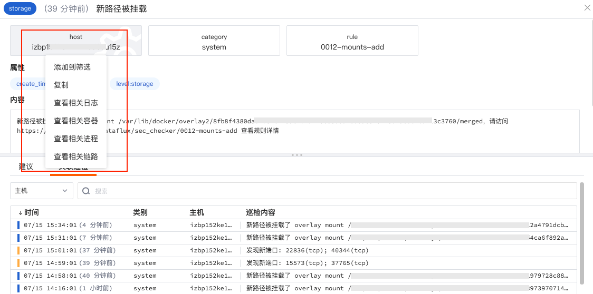
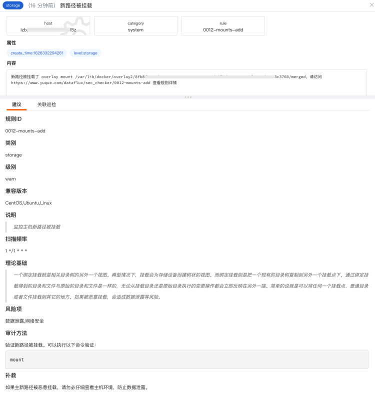

# 安全巡检分析
---

## 简介

“观测云” 支持你通过「安全巡检」及时监控、查询和关联全部巡检事件。在及时发现漏洞，异常和风险的同时，帮助你提高巡检质量、问题分析和问题处理的能力。

## 概览

在「安全巡检」-「概览」中，“观测云” 默认为您提供了安全巡检监测视图，您可以通过筛选主机、安全巡检等级、安全巡检类别来查看不同主机发生安全巡检事件的概览情况，包括不同等级安全巡检事件发生的数量及可视化图表分析，不同类别和规则的安全巡检事件排行榜。

同时，您可以通过「跳转」按钮，跳转至概览页面对应的内置视图页面进行查看，并对该视图进行编辑、复制和导出。

## 查询与分析

在「安全巡检」-「查看器」，支持通过选择时间范围、搜索关键字，筛选等方式查询安全巡检事件。

- 时间范围：通过右上角的时间筛选组件，您可以筛选数据展示的时间范围
- 搜索：通过列表上方的搜索栏，您可以基于字段、文本进行关键词搜索、字段筛选、关联搜索
   - 输入框支持模糊匹配相关字段
   - “abc：123”形式， 回车后支持字段筛选
   - 输入框输入文本后，支持基于关键字的模糊匹配
   - " abc AND cba / abc OR cba" 形式，回车后支持关联搜索
- 快捷筛选：您可以通过勾选快捷筛选的字段快速筛选数据，支持自定义添加筛选字段，支持通过“反选”进行快捷筛选，支持通过“重置”快速清除快捷筛选条件。使用“鼠标悬停”，在快捷筛选可查看字段的完整内容

**注意: **

- "观测云“ 支持多个关键词搜索，只需要输入对应的关键词，并使用空格或者逗号隔开即可。另外，搜索多个关键词时，支持采用AND/OR逻辑，以获取更精确的数据范围。输入的关键词越多，数据匹配的范围将越精准。

### 巡检事件统计

“观测云” 会依据选择的时间范围统计该时间点上出现不同状态巡检事件的数量。你可以通过堆积柱状图，查看不同时间点的巡检事件数量。同时，若对数据进行了筛选过滤，柱状图将同步展示筛选后结果。

### 设置显示列

对于列表，可以通过列表上方的「显示列」向列表中添加、删除显示列。

### 数据导出

巡检事件列表支持通过列表上方的设置按钮导出当前列表数据为CSV文件到本地设备或者导出到视图。「导出到视图」的链路数据将以视图的方式添加到对应的场景中进行查看和分析。

### 保存快照

“观测云” 支持创建可快捷访问的数据副本。通过「保存快照」功能，您可以快速复现即时拷贝的数据副本信息，将数据恢复到某一时间点和某一数据展示逻辑。更多详细介绍可参考文档 [快照](https://www.yuque.com/dataflux/doc/uuy378) 。

## 巡检事件详情

点击想要查看的巡检事件，在划出详情页中，您可以查看事件触发时间、事件标题、标签、内容、建议和关联的巡检事件。点击详情页的标签「host」，支持“添加到筛选”查看该主机下的容器信息、支持“复制”标签内容、支持点击“查看相关日志”、“查看相关容器”、“查看相关进程”、“查看相关链路”直接进入主机相关的数据查看器，对主机进行关联分析。

### 建议

点击想要查看的巡检事件，在划出详情页中，您可以查看对本次安全巡检事件的处理建议，包括安全巡检事件发生的理论基础、风险项、审计方法、补救措施等。

### 关联巡检

在巡检事件详情页面的关联巡检，你可以通过选择标签（包括：主机host、类别category、规则rule）匹配关联的事件。同时，你可以基于事件的名称和内容对相关联的事件进行检索。

### 关联主机

在安全巡检详情页，点击下方的「主机」，可查看相关主机（关联字段：host）的基本信息和**在选定时间组件范围内**的性能指标状态。
注意：在进程详情中查看相关主机，需要匹配字段“host”，否则无法在进程详情查看到相关主机的页面。

- 属性视图：包括主机的基本信息、集成运行情况，若开启云主机的采集，还可查看云厂商的信息。

- 指标视图：可查看默认24小时内，相关主机的CPU、内存等性能指标视图。点击「打开该视图」至内置视图，可通过克隆的方式对主机视图进行自定义修改，并作为用户视图保存，用户视图可通过绑定在安全巡检详情页查看，更多配置详情，可参考[绑定内置视图](https://www.yuque.com/dataflux/doc/dns233/)。

---

观测云是一款面向开发、运维、测试及业务团队的实时数据监测平台，能够统一满足云、云原生、应用及业务上的监测需求，快速实现系统可观测。**立即前往观测云，开启一站式可观测之旅：**[www.guance.com](https://www.guance.com)

%!(EXTRA string=1.0.7-3-g7183440, string=2022-06-14 06:31:52)