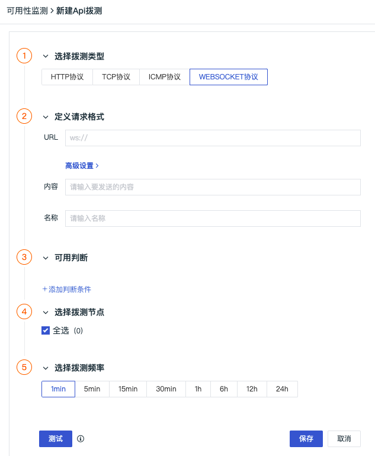
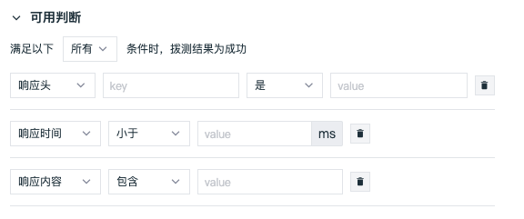
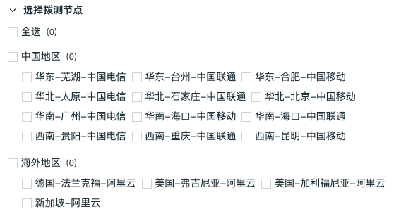

# 创建 WEBSOCKET 拨测任务
---

## 简介

WEBSOCKET 拨测允许您的客户端向服务端发起 HTTP 请求，建立 WebSocket 连接，以验证定义请求和判断条件，例如请求头、响应时间等。

## 创建 WEBSOCKET 拨测任务

在观测云工作空间，点击「新建」-「API拨测」，选择「WEBSOCKET 协议」即可新建 WEBSOCKET 拨测任务。

### 定义请求格式

- URL：同时支持ws / wss两种协议的URL。
- 高级设置：根据实际情况进行高级设置，包括请求设置、身份验证。

- 内容：输入向客户端发送的信息。
- 名称：自定义 WEBSOCKET 拨测任务名称，在当前空间内不支持重名。

### 可用判断

支持添加判断条件匹配数据，当选择多个判断条件时，多个判断条件之间可以通过选择“所有”或者“任意”来判断是“全且”或“全或”关系。

### 选择拨测节点

目前观测云 在全球已覆盖16个节点，支持选择中国地区、海外地区（仅支持商业版及以上版本用户）的一个或多个节点，，快速开启站点的服务质量监测。

### 选择拨测频率

选择云拨测的数据返回频率，支持1分钟（仅支持商业版及以上版本用户）、5分钟（仅支持商业版及以上版本用户）、15分钟（仅支持商业版及以上版本用户）、30分钟、1小时、6小时、12小时、24小时等8种选择。

### 测试

配置完成后，点击“测试”按钮，确认配置是否成功。

