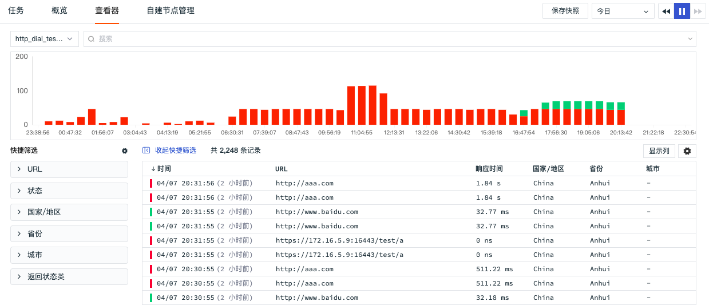
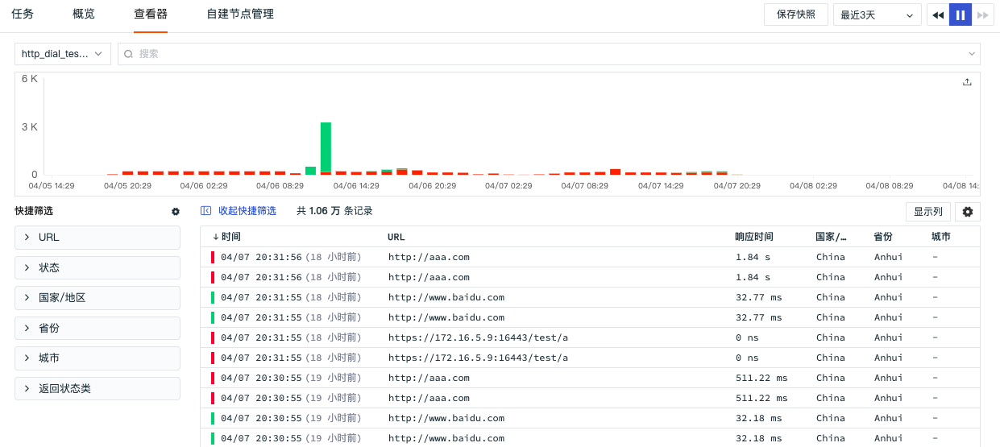
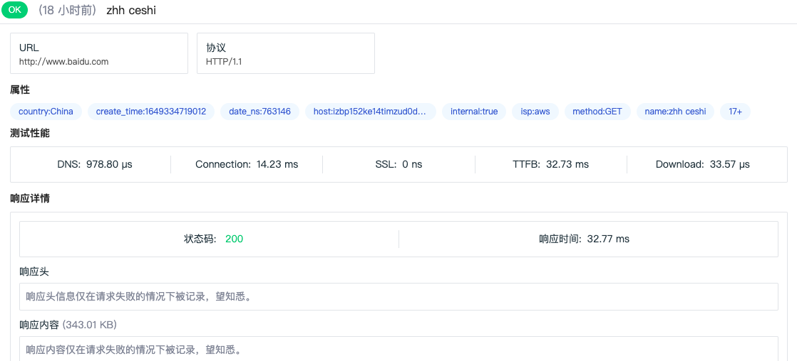
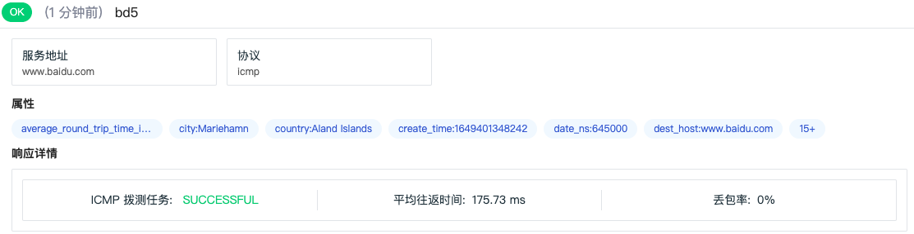

# 可用性查看器
---

## 简介

观测云支持您通过「查看器」查看拨测任务返回的全部数据详情，帮助您提前发现问题，定位问题，提升用户体验。

## 查询与分析

观测云支持多种方式对拨测数据进行查询和分析，包括选择数据来源、搜索、筛选、统计、导出等。

### 数据查询

 “观测云” 支持通过选择时间范围、搜索关键字，筛选等方式查询拨测数据。

- 时间范围：通过右上角的时间筛选组件，您可以筛选数据展示的时间范围
- 搜索：通过列表上方的搜索栏，您可以基于字段、文本进行关键词搜索、字段筛选、关联搜索
   - 输入框支持模糊匹配相关字段
   - “abc：123”形式，回车后支持字段的精确查询，在筛选栏中选择wildcard查询支持基于变量进行模糊查询

   - 输入框输入文本后，支持基于关键字的模糊匹配
   - " abc AND cba / abc OR cba" 形式，回车后支持关联搜索
- 快捷筛选：您可以通过勾选快捷筛选的字段快速筛选数据，支持自定义添加筛选字段，支持通过“反选”进行快捷筛选，支持通过“重置”快速清除快捷筛选条件。

**注意: **

- "观测云“ 支持多个关键词搜索，只需要输入对应的关键词，并使用空格或者逗号隔开即可。另外，搜索多个关键词时，支持采用AND/OR逻辑，以获取更精确的数据范围。输入的关键词越多，数据匹配的范围将越精准。

### 拨测统计

 观测云会依据选择的时间范围统计一定时间段内存在的拨测数据数量。您可以通过堆积柱状图，查看不同时间段存在的不同状态拨测数据数量。

不同数据类型存在不同的数据状态，http(API拨测）数据的状态包括，

- `OK`：成功的请求
- `FAIL`：失败的请求

### 设置显示列

在可用性监测查看器列表，您可以通过向列表中添加/删除显示列优化您的查看体验。

### 数据导出

在可用性监测查看器列表，您可以先筛选出想要的数据导出后进行查看和分析，支持导出CSV文件到本地设备或者导出到场景仪表板或者笔记。

## HTTP 拨测

在可用性监测「查看器」，选择「HTTP 拨测」，即可查看配置的所有 HTTP 拨测任务的数据结果。

在可用性监测查看器列表，点击想要查看的拨测数据即可查看对应的拨测数据详情，您可查看到属性、测试性能、响应详情、响应头、响应内容等数据详情。

## TCP 拨测

在可用性监测「查看器」，选择「TCP 拨测」，即可查看配置的所有 TCP 拨测任务的数据结果。

在可用性监测查看器列表，点击想要查看的拨测数据即可查看对应的拨测数据详情，您可查看到属性、测试性能、响应详情、路由跟踪结果等数据详情。

## ICMP 拨测

在可用性监测「查看器」，选择「ICMP 拨测」，即可查看配置的所有 ICMP 拨测任务的数据结果。

在可用性监测查看器列表，点击想要查看的拨测数据即可查看对应的拨测数据详情，您可查看到属性、响应详情等数据详情。

## WEBSOCKET 拨测

在可用性监测「查看器」，选择「WEBSOCKET 拨测」，即可查看配置的所有 WEBSOCKET 拨测任务的数据结果。

在可用性监测查看器列表，点击想要查看的拨测数据即可查看对应的拨测数据详情，您可查看到属性、发送消息、响应详情、响应头、响应内容等数据详情。

