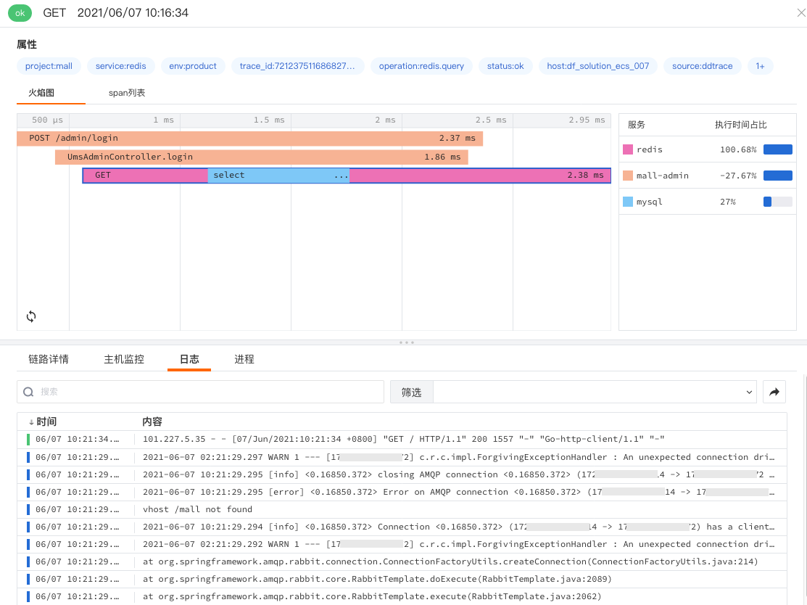

# 应用性能监测关联日志
---

<<< custom_key.brand_name >>>支持用户访问监测关联日志，通过在日志中注入 `span_id`、`trace_id`、`env`、`service`、`version` 来关联应用性能监测。关联后，在**应用性能监测**中可查看请求所在关联的特定日志。

## 配置关联日志

在配置关联日志之前，您需要

:material-numeric-1-circle: [安装 DataKit](../../../datakit/datakit-install.md)；

:material-numeric-2-circle: 安装完 DataKit 以后，开启 DDtrace，配置链路的 `env`、`service`、`version` 等参数用来关联日志，同时在应用代码中注入日志参数 `span_id`、`trace_id`、`env`、`service`、`version` 和应用性能参数关联。

> 更多内容配置，可查看 [DDtrace](../../../integrations/ddtrace.md)。
