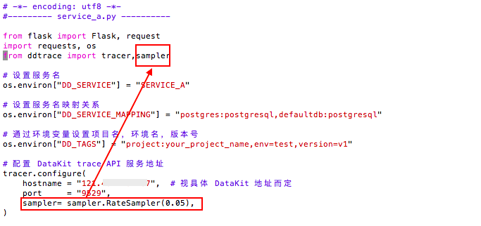

# 如何配置应用性能监测采样
---


<<< custom_key.brand_name >>>的**应用性能监测**功能支持对符合 Opentracing 协议的采集器所采集的链路数据进行分析和管理。默认情况下，按照全量的方式采集应用性能数据，即每次调用都会产生数据，若不加以限制，采集到的数据量大，会占用过多的数据存储。您可以通过设置采样的方式采集应用性能数据，节约数据存储量，降低成本费用。

下面将以 *[DDtrace 采集器](../../integrations/ddtrace.md) 为例，介绍如何配置采样率为 5％ 的应用性能数据*。

## 前置条件

- [注册登录<<< custom_key.brand_name >>>](https://<<< custom_key.studio_main_site_auth >>>/login/pwd)；  
- [安装 DataKit](../../datakit/datakit-install.md)；   
- [开启 DDtrace 采集器](../../integrations/ddtrace.md)。 

## 采样设置

在开始采集应用性能数据之前，需要先根据不同的语言配置 DDtrace。

下面以 Python 中常用的 Webserver Flask 应用为例，介绍如何采样应用性能数据。示例中 `SERVICE_A` 提供 HTTP 服务，并且调用 `SERVICE_B` HTTP 服务。

### Step 1：安装 DDtrace 运行环境

```python
pip install ddtrace
```

### Step 2：安装 flask 包

```python
pip install flask
```

### Step 3：配置采样

???+ abstract "采样配置说明"

    创建 `SERVICE_A` 和 `SERVICE_B`，为 `SERVICE_A` 配置采样 5%，`SERVICE_B` 按照默认采集。

在创建时，需要引用 DDtrace 并设置服务名、服务名映射关系并且通过环境变量设置项目名、环境名、版本号相关信息，并且配置 DataKit trace API 服务地址（具体地址视 DataKit 地址而定端口号为 9529）。

> 可参考 [Python Flask 完整示例](../../integrations/apm/ddtrace-python.md)。

#### 1. SERVICE_A

```python
# -*- encoding: utf8 -*-
#--------- service_a.py ----------

from flask import Flask, request
import requests, os
from ddtrace import tracer,sampler

# 设置服务名
os.environ["DD_SERVICE"] = "SERVICE_A"

# 设置服务名映射关系
os.environ["DD_SERVICE_MAPPING"] = "postgres:postgresql,defaultdb:postgresql"

# 通过环境变量设置项目名，环境名，版本号
os.environ["DD_TAGS"] = "project:your_project_name,env=test,version=v1"

# 配置 DataKit trace API 服务地址
tracer.configure(
    hostname = "localhost",  # 视具体 DataKit 地址而定
    port     = "9529",
    sampler  = sampler.RateSampler(0.05),
)

app = Flask(__name__)

def shutdown_server():
    func = request.environ.get('werkzeug.server.shutdown')
    if func is None:
        raise RuntimeError('Not running with the Werkzeug Server')
    func()

@app.route('/a',  methods=['GET'])
def index():
    requests.get('http://127.0.0.1:54322/b')
    return 'OK', 200

@app.route('/stop',  methods=['GET'])
def stop():
    shutdown_server()
    return 'Server shutting down...\n'

# 启动 service A: HTTP 服务启动在 54321 端口上
if __name__ == '__main__':
    app.run(host="0.0.0.0", port=54321, debug=True)

```

*示例：*




#### 2. SERVICE_B

```python
# -*- encoding: utf8 -*-

#--------- service_b.py ----------

from flask import Flask, request
import os, time, requests
from ddtrace import tracer

# 设置服务名
os.environ["DD_SERVICE"] = "SERVICE_B"

# 设置服务名映射关系
os.environ["DD_SERVICE_MAPPING"] = "postgres:postgresql,defaultdb:postgresql"

# 通过环境变量设置项目名，环境名，版本号
os.environ["DD_TAGS"] = "project:your_project_name,env=test,version=v1"

tracer.configure(
    hostname = "localhost",  # 视具体 DataKit 地址而定
    port="9529",
)

app = Flask(__name__)

def shutdown_server():
    func = request.environ.get('werkzeug.server.shutdown')
    if func is None:
        raise RuntimeError('Not running with the Werkzeug Server')
    func()

@app.route('/b',  methods=['GET'])
def index():
    time.sleep(1)
    return 'OK', 200

@app.route('/stop',  methods=['GET'])
def stop():
    shutdown_server()
    return 'Server shutting down...\n'

# 启动 service B: HTTP 服务启动在 54322 端口上
if __name__ == '__main__':
    app.run(host="0.0.0.0", port=54322, debug=True)

```

### Step 4：启动并调用 `SERVICE_A` 和 `SERVICE_B`

```python
# 分别后台启动两个服务：
(ddtrace-run python3 service_a.py &> a.log &)
(ddtrace-run python3 service_b.py &> b.log &)

# 调用 A 服务，促使其调用 B 服务，这样就能产生对应 trace 数据（此处可多次执行触发）
curl http://localhost:54321/a

# 分别停止两个服务
curl http://localhost:54321/stop
curl http://localhost:54322/stop
```

### Step 5：在<<< custom_key.brand_name >>>工作空间查看效果

登录<<< custom_key.brand_name >>>工作空间，可以看到采集的 `SERVICE_A` 和 `SERVICE_B` 链路数据。

???+ warning

    应用性能采样是基于链路（Trace）的，如果有 100 个 trace ，设置采样率为 5%，则随机采集其中的 5%，也就是随机上报 5 个 trace 及下的所有 Span 到<<< custom_key.brand_name >>>工作空间。
    
    在本示例中，`SERVICE_A` 提供 HTTP 服务，并且调用 `SERVICE_B` HTTP 服务，也就是 服务 A 调用 服务 B 是一条链路，假设有 100 条链路，即随机上报其中 5 条链路。


## 更多阅读

- 以上是通过客户端配置应用性能监测的采样率，除了以上的方式以外，还可以直接通过 DataKit 配置采样率，只需开启应用性能采集器配置中的采样即可。

<div class="grid cards" markdown>

- [<font color="coral"> :fontawesome-solid-arrow-right-long: &nbsp; Datakit Samplers</font>](../../integrations/datakit-tracing.md#samplers)


</div>


```python
  ## Sampler config uses to set global sampling strategy.
  ## sampling_rate used to set global sampling rate.
  [inputs.tracer.sampler]
    sampling_rate = 1.0
```

- 设置应用性能采样后，有可能会错过重要的链路，您可以通过配置过滤器来保证上报关键的链路，如配置 `keep_rare_resource = true`，那么被判定为稀有的链路将会被直接上报到<<< custom_key.brand_name >>>。


<div class="grid cards" markdown>

- [<font color="coral"> :fontawesome-solid-arrow-right-long: &nbsp; Datakit Filters</font>](../../integrations/datakit-tracing.md#filters)


</div>