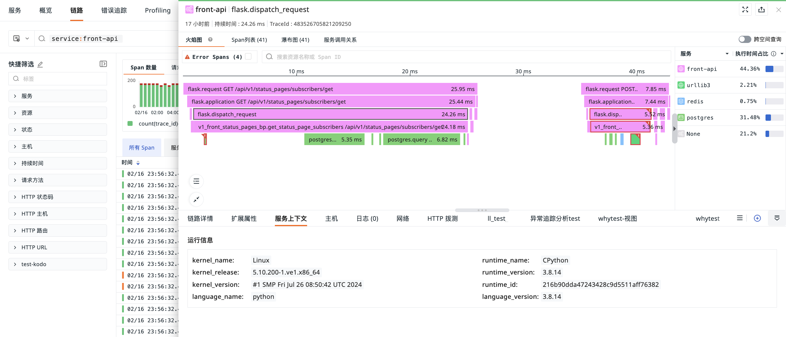

# 链路查看器

---

数据采集成功后，即可在链路功能页面查看所有相关数据。利用[强大的搜索功能](../../getting-started/function-details/explorer-search.md#search)，您可以轻松筛选并查看任何时间段的链路数据，迅速识别并定位异常链路。

[火焰图](#flame)为您提供了直观的视图，以观察链路中每个 Span 的流转和性能表现。此外，<<< custom_key.brand_name >>>的标签功能使您能够自动将基础设施、日志、用户访问监测等数据与链路分析相关联，支持代码级别的数据关联查看，帮助您快速定位并解决异常问题。[Span 列表](./explorer-analysis.md#span)、[瀑布图](./explorer-analysis.md#waterfall)等工具进一步为您展示某条链路下相关的 Span 信息。

## 链路列表

<<< custom_key.brand_name >>>提供三种链路查看列表，分别为**所有 Span**、**服务顶层 Span** 和**所有 Trace**。

Span 表示给定时间段内分布式系统中的逻辑工作单元，多个 Span 会构成一条链路轨迹（`trace`）。

=== "所有 Span"

    显示当前所选时间范围内，所有采集到 Span 数据。

    

=== "服务顶层 Span"

    筛选显示当前所选时间范围内，所有服务入口调用产生的 Span。

    

=== "所有 Trace"

    筛选显示当前所选时间范围内，所有链路调用的顶层入口 Sapn。

    

## 查询与分析

- 时间控件：链路查看器默认展示最近 15 分钟的数据，您也可以自定义数据展示的[时间范围](../../getting-started/function-details/explorer-search.md#time)。

- 在链路查看器搜索栏，支持[多种搜索方式和筛选方式](../../getting-started/function-details/explorer-search.md)。

  - **注意：**当切换查看**服务**或**链路**查看器，<<< custom_key.brand_name >>>默认为您保留当前的筛选条件和时间范围。

- 分析模式：在链路查看器[分析栏](../../getting-started/function-details/explorer-search.md#analysis)，您可以基于 <u>1-3 个标签</u>进行多维度分析统计，并支持多种数据图表分析方式。

- 快捷筛选：支持编辑[快捷筛选](../../getting-started/function-details/explorer-search.md#quick-filter)，添加新的筛选字段。

- 筛选历史：<<< custom_key.brand_name >>>支持在[筛选历史](../../getting-started/function-details/explorer-search.md#filter-history)保存查看器 `key:value` 的搜索条件历史，应用于当前工作空间不同的查看器。

- 自定义[显示列](../../getting-started/function-details/explorer-search.md#columns)：在链路列表，默认查看**时间**、**链路 ID**、**服务**、**资源**以及**持续时间**，可自定义添加、编辑、删除、拖动显示列。

- <<< custom_key.brand_name >>>支持**查看历史快照**直接保存当前查看器的快照数据，通过[快照](../../getting-started/function-details/snapshot.md)功能，您可以快速复现即时拷贝的数据副本，将数据恢复到某一时间点和某一数据展示逻辑。

### 图表统计

在链路查看器图表统计，您可以查看所选时间范围内链路不同状态的**请求数**、**Error 请求数**、**响应时间**，您可以通过筛选同步展示图表统计。

- 请求数/Error 请求数：根据所选时间范围划分为 60 个时间点，用柱状图统计展示链路的请求数以及 Error 请求数。
- 响应时间：根据所选时间范围划分为 60 个时间点，用折线图统计展示四个响应指标，分别为每秒平均响应时间、P75 响应时间、P90 响应时间以及 P99 响应时间。

### 链路数据导出

在链路查看器，在筛选出想要的链路数据导出后进行查看和分析后，您可以导出到 CSV 文件或者场景仪表板和笔记。

如果需要导出某条数据，打开该条数据详情页，点击右上角 :material-tray-arrow-up: 图标即可。

## 链路详情 {#detail}

在链路查看器，您可以通过点击任意链路查看对应的链路详情，包括当前链路发生的相对时间、持续时间、HTTP 方法、HTTP URL 、HTTP 状态码、TraceId、火焰图、Span 列表、服务调用关系以及关联的日志、主机、指标、网络等等。

若当前的链路属于前端应用（如：browser），您可以在链路详情查看请求耗时分布，包括 Queueing（队列）、First Byte（首包）、Download（下载）的请求耗时占比。

**注意**：火焰图/Span 列表/瀑布图最多展示 1 万条 Span，您可通过**偏移**设置查看未展示 Span：

???+ warning

    用户访问监测 SDK 必须是 2.2.10 以及上才可以看到这部分数据显示，如存在跨域情况需要调整 header 配置。

    > 更多详情，可参考 [Web 应用接入](../../real-user-monitoring/web/faq.md#header)。

### 火焰图 {#flame}

火焰图可清晰展示整条链路中每个 Span 的流转和执行时间。您可以在火焰图右侧查看对应的服务列表及响应时间。点击火焰图的 Span，在**链路详情**可查看对应的 Json 内容，通过鼠标滚轴缩放可查看具体 Span 信息。

> 更多火焰图的应用详情，可参考 [巧用火焰图分析链路性能](../../best-practices/monitoring/trace-glame-graph.md)。

=== "火焰图链路说明"

    

    从上图的火焰图可以看出，此次调用链路包含了两个服务，分别为 <u>CloudCare 和 Mysql</u>，链路从发起 CloudCare 服务的 POST 请求开始，然后执行 `ActionResource.executeAction`，最后执行 Mysql 语句，在执行 `ActionResource.executeAction` 的整个过程中，多次执行 Mysql 语句。CloudCare 和 Mysql 的执行时间计算方式分别为：

    - CloudCare 服务的执行时间 = D1+D2+D3+D4+D5+D6+D7+D8+D9+D10+D11
    - Mysql 服务的执行时间 = span2+span3+......+span11

    

    具体执行的语句和执行时间详情可以参考 Span 列表。

=== "执行时间占比计算说明"

    火焰图中的服务执行时间占比是指这一次调用链路各个服务占总时间的比率。以下图为例，此次调用链路包含了两个服务，分别为 CloudCare 和 Mysql，执行时间占比分别为 42.37% 和 57.63%。CloudCare 服务有 2 个 Span，Mysql 服务有 10 个 Span。

    - Mysql 服务执行时间占比计算方式：所有 span 执行时间相加／当前调用链路总时长。

    计算方式说明：下图中 Mysql 服务总共有10个 Span 数量，可以点击每一个 Span 来获取当前 Span 的执行时间，从图中可以看出，该 Span 的执行时间为 5.08ms，然后以同样的方式，获取剩余 9 个 Span 的执行时间并相加。

    

    - CloudCare 服务执行时间占比计算方式：(当前调用链路总时长-mysql服务执行时间)/当前调用链路总时长

    计算方式说明：下图中 CloudCare 服务贯穿在当前整个调用链路中，除了mysql服务的执行时间，剩余的时间即为 CloudCare 服务的执行时间（见标红线部分的执行时间）。执行时间占比也可以直接通过 Span 列表来查看每条 Span 的执行时间和执行时间占比。

    

=== "异步调用"

    在火焰图中，无论服务是同步还是异步的调用，都能够清晰追踪每一个链路性能的数据细节。如通过火焰图可以清晰查看哪几条请求是异步进行的，开始时间、结束时间以及总计花费时间。

    

### Span 列表 {#span}

展示该条链路中所有的 Span 列表及其总的 Span 数量，包括**资源名**、**Span 数量**、**持续时间**、**执行时间**以及**执行时间占比**。

您可以输入 Span 对应的资源名称或 Span ID 进行搜索匹配，点击任一 Span，在**链路详情**可查看对应的 JSON 内容，切换到火焰图同步展示 Span。若有错误，会显示错误提示。

点击 **Error Spans**，即可直接展示命中筛选的结果。

### 瀑布图 {#waterfall}

可查看各个资源之间的父子关系。

瀑布图按照开始时间先后显示 Span 数据。在左侧列表展示 Span 数据，并展示每个资源的执行时间占比。右侧则按照时间先后显示瀑布图。

- 您可以输入 Span 对应的资源名称或 Span ID 进行搜索匹配；

- 点击 :octicons-arrow-switch-24: 即可切换执行时间的格式；

- 点击 **Error Spans**，即可直接展示命中筛选的结果。

### 服务调用关系 {#call}

用来查看服务之间的调用关系，并直接展示调用次数。您可通过服务、资源、Span ID 搜索筛选查看相关服务调用关系。

<<< custom_key.brand_name >>>依据链路详情 > [火焰图](#flame)里面统计的服务对应的 `error` 结果对应显示此处服务的颜色，若出现红色则表示该服务存在错误。

若您在用户视图配置了 `service` 的[绑定](../../scene/built-in-view/bind-view.md#bind)关系，如 `service:mysql`。在此处点击服务的卡片，即可快速查看与该服务关联的相关用户视图。

点击某一视图即可跳转至其详情页。

### 快捷操作 {#icon}

| 
操作
 | 说明                                                                                                                                                           |
| ------------------------------------ | -------------------------------------------------------------------------------------------------------------------------------------------------------------- |
| 全屏查看/恢复默认大小                | 您可以点击链路详情右上角全屏查看图标 :material-arrow-expand-all:，横向展开查看链路火焰图；点击恢复默认大小图标 :material-arrow-collapse-all:，即可恢复详情页。 |
| 展开/收起小地图                      | 您可以点击链路详情左侧展开/收起小地图图标 :material-format-indent-increase:，通过在小地图上选择区间、拖拽、滚动来快捷查看火焰图。                              |
| 查看全局 Trace                       | 您可以点击链路详情左侧查看全局 Trace 图标 :material-arrow-expand:，在火焰图查看全局链路。                                                                      |
| 双击 Span                            | 在火焰图中间放大展示该 Span，您可以快速定位查看其上下文关联 Span。                                                                                             |
| 点击服务名称                         | 高亮展示对应 Span，再次点击服务名称，恢复默认全选 Span，您可以通过点击服务名称，快速筛选查看服务对应的 Span。                                                  |

### 扩展属性

:material-numeric-1-circle-outline: 在搜索栏，可输入字段名称或值快速搜索定位；

:material-numeric-2-circle-outline: 勾选字段别名后，可在字段名后查看；您可按需选择。

:material-numeric-3-circle-outline: 在链路详情页，您可以在**扩展属性**查看当前链路的相关字段属性：

| 
字段
 | 属性                                                                                                           |
| ------------------------------------ | -------------------------------------------------------------------------------------------------------------- |
| 筛选字段值                           | 即添加该字段至查看器，查看与该字段相关的全部数据，可在链路查看器筛选查看该字段相关的链路列表。 _见图一。_ |
| 反向筛选字段值                       | 即添加该字段至查看器，查看除了该字段以外的其他数据。                                                           |
| 添加到显示列                         | 即添加该字段到查看器列表进行查看。                                                                             |
| 复制                                 | 即复制该字段至剪贴板。                                                                                         |

???- abstract "部分字段不支持筛选聚合等相关逻辑"

    <<< custom_key.brand_name >>>存在部分字段采用全文索引，这部分字段不支持您做筛选聚合等相关逻辑。全文索引字段范围如下：

    | 分类      | 字段                  |
    | ----------- | ------------------ |
    | 对象、资源目录      | `message `                 |
    | 日志、备份日志      | `message`                  |
    | 安全      | `message` / `title`                  |
    | 网络      | `message`                  |
    | 链路      | `error_message` / `error_stack`                  |
    | 事件      | `message` / `title` / `df_message` / `df_title`                  |
    | RUM 错误      | `error_message` / `error_stack`                  |
    | RUM 长任务      | `long_task_message` / `long_task_stack`                  |

_图一_

### 错误详情

在链路详情页，若存在错误链路，即可查看相关的错误详情。

> 更多错误链路分析，可参考 [错误追踪](../error.md)。

### 服务上下文 {#context}

通过获取基础设施资源目录下的对象分类，并按 `create_time` 选择最新对象进行展示，快速查看当前服务的运行信息、服务依赖关系以及集成信息。

### 关联分析

=== "关联日志"

    您可以通过**日志**查看基于当前链路关联的日志（关联字段：`trace_id`）。您可以自定义显示列，若您需要查看更详细的日志内容，可以点击日志内容跳转到日志详情页面，或点击跳转按钮到日志页打开。

    

    若您是管理员及以上权限，您可以自定义关联字段。点击关联字段右侧的设置按钮，在弹出的对话框中选择需要关联的字段，支持手动输入、拖拽顺序等操作，确认即可完成配置。

    

    **注意**：联日志自定义字段和服务清单关联分析配置自定义字段相互影响，若在服务清单配置了自定义字段，此处同步展示。

=== "代码热点"

    当应用程序使用 ddtrace 采集器同时开启了 APM 链路追踪和 Profile 性能追踪数据采集后，<<< custom_key.brand_name >>>提供 Span 级别的关联查看分析。在链路详情页，您可以点击火焰图下方的**代码热点**，查看当前链路关联的代码热点，包括执行耗时、方法以及执行时间占比。

    

    点击**查看 Profile 详情**，可以跳转到 Profile 详情页查看更多的关联代码。

    

=== "关联主机"

    在链路详情页，您可以通过**主机**，查看相关主机的指标视图和属性视图（关联字段：`host`）。

    - 指标视图：可查看相关主机**在该链路结束前30分钟到链路结束后 30 分钟内**的性能指标状态，包括相关主机的 CPU、内存等性能指标视图。

    

    - 属性视图：帮助您回溯链路产生时主机对象的真实情况，支持查看相关主机**在对应时间内产生的最新的一条对象数据**，包括主机的基本信息、集成运行情况。若开启云主机的采集，还可查看云厂商的信息。

    **注意：**<<< custom_key.brand_name >>>默认保存主机对象最近 48 小时的历史数据。未找到当前链路时间对应的主机历史数据时，您将无法查看关联主机的属性视图。

    

=== "关联容器"

    在链路详情页，您可以通过**容器**，查看相关容器的指标视图和属性视图（关联字段：`container_name`）。

    - 指标视图：支持查看相关容器<u>在该链路结束前 30 分钟到链路结束后 30 分钟</u>的性能指标状态，包括容器 CPU、内存等性能指标视图。

    - 属性视图：帮助您回溯链路产生时容器对象的真实情况，支持查看相关容器<u>在对应时间内产生的最新的一条对象数据</u>，包括容器的基本信息、属性信息。

=== "关联 Pod"

    在链路详情页，您可以通过 **Pod**，查看相关 Pod 的属性视图和指标视图（关联字段：`pod_name`）。

    - 指标视图：支持查看相关容器 Pod <u>在该链路结束前 30 分钟到链路结束后 30 分钟</u>的性能指标状态，包括容器 CPU、内存等性能指标视图。

    - 属性视图：帮助您回溯链路产生时容器 Pod 对象的真实情况，支持查看相关容器 Pod <u>在对应时间内产生的最新的一条对象数据</u>，包括容器的基本信息、属性信息。

=== "关联网络"

    <<< custom_key.brand_name >>>支持您在**网络**查看包括 Host 、Pod 、Deployment 和 Service 多维度的[网络拓扑图和总览数据](../../infrastructure/network.md)。

    

    **匹配字段：**

    在详情页中查看相关网络，需要匹配对应的关联字段，即在数据采集的时候需要配置对应的字段标签，否则无法在详情页中匹配查看关联的网络视图。

    - Host：匹配字段 `host`。

    - Pod：

    | **匹配字段优先级**  |
    | ------------------- |
    | namespace、pod_name |
    | namespace、pod      |
    | pod_name            |
    | pod                 |

    - Deployment：

    | **匹配字段优先级**  |
    | ------------------- |
    | namespace、deployment_name |
    | namespace、deployment      |
    | deployment_name            |
    | deployment                 |

    - Service：

    | **匹配字段优先级**  |
    | ------------------- |
    | namespace、service_name |
    | namespace、service      |

    **注意：**

    - 若同时查询到 Host、Pod、Deployment、Service 的关联字段，进入详情页时则按照此顺序显示网络数据；
    - 若未查询到关联字段，则排在末端显示为灰色，点击提示**未匹配到网络视图**。

## 更多阅读

- [ :fontawesome-solid-arrow-right-long: &nbsp; **开始采集链路数据**](./index.md)

- [ :fontawesome-solid-arrow-right-long: &nbsp; **查看器的强大之处**](../../getting-started/function-details/explorer-search.md)

- [ :fontawesome-solid-arrow-right-long: &nbsp; **绑定内置视图**](../../scene/built-in-view/bind-view.md#bind)

