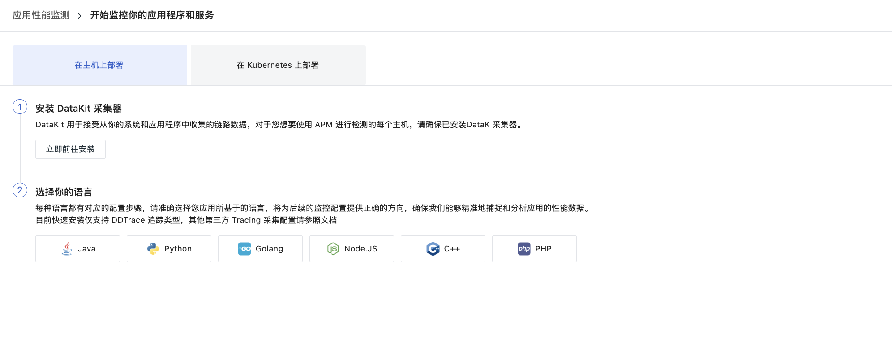

# 链路
---

针对在分布式系统、无服务器计算和容器化环境中部署服务的业务组织，观测云通过应用性能监测（APM）帮助团队实时了解影响性能的问题，如应用中断或服务无响应，还能通过端到端的可见性，确保对性能问题的全面掌握。不过，追踪成本管理不当可能导致数据缺失，延长问题解决时间，甚至可能放大小问题，对业务产生重大影响。

观测云的应用性能监测支持 Opentracing 协议，实现对分布式架构应用的端到端链路分析，并能与基础设施、日志、用户访问监测等进行关联分析。您可以在**应用性能监测 > 链路**搜索、筛选、导出链路数据，查看链路详情，并通过[火焰图](./explorer-analysis.md#flame)、[Span 列表](./explorer-analysis.md#span)、[瀑布图](./explorer-analysis.md#waterfall)等工具对链路性能进行全面分析。无论是同步还是异步调用，观测云都能清晰追踪每一个链路性能的数据细节，确保您对链路数据实现完全有效的控制。

## 立即开始

进入链路，立即开始配置。

- [在主机上部署](./deploy_on_host.md)；  
- [在 Kubernetes 上部署](./deploy_on_k8s.md)。

