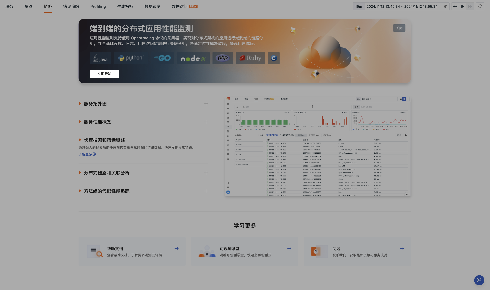

# 链路
---

针对在分布式系统、无服务器计算和容器化环境中部署服务的业务组织，观测云通过应用性能监测（APM) 帮助团队实时了解影响性能的问题，如应用中断或服务无响应，还能通过端到端的可见性，确保对性能问题的全面掌握。不过，追踪成本管理不当可能导致数据缺失，延长问题解决时间，甚至可能放大小问题，对业务产生重大影响。

观测云的应用性能监测支持 Opentracing 协议，实现对分布式架构应用的端到端链路分析，并能与基础设施、日志、用户访问监测等进行关联分析。您可以在**应用性能监测 > 链路**搜索、筛选、导出链路数据，查看链路详情，并通过[火焰图](./explorer-analysis.md#flame)、[Span 列表](./explorer-analysis.md#span)、[瀑布图](./explorer-analysis.md#waterfall)等工具对链路性能进行全面分析。无论是同步还是异步调用，观测云都能清晰追踪每一个链路性能的数据细节，确保您对链路数据实现完全有效的控制。

## 立即开始



:material-numeric-1-circle-outline: 在进行系统和应用程序的链路数据分析之前，您需要在每个目标主机上[部署观测云 DataKit 采集器](../../datakit/datakit-install.md)，以收集必要的链路数据。

:material-numeric-2-circle-outline: 基于您的应用语言，观测云对应不同的配置步骤：

### Java

安装依赖：

```
wget -O dd-java-agent.jar 'https://static.guance.com/dd-image/dd-java-agent.jar'
```

运行应用：

可以通过多种途径运行你的 Java Code，如 IDE，Maven，Gradle 或直接通过 `java -jar` 命令，以下通过 `java` 命令启动应用：

```
java -javaagent:/path/to/dd-java-agent.jar \ 
     -Ddd.logs.injection=true \ 
     -Ddd.service.name=<YOUR-SERVICE-NAME> \
     -Ddd.env=<YOUR-ENV-NAME> \
     -Ddd.agent.host=<YOUR-DATAKIT-HOST> \ 
     -Ddd.trace.agent.port=9529 \ 
     -jar path/to/your/app.jar
```

参数配置：

1. `service.name`：服务名；
2. `env`：应用服务的环境信息；
3. `version`：版本号；
4. 设置采样率：开启后，可降低实际产生的数据量；数字范围从 0.0(0%) ~ 1.0(100%)；
5. 收集 Profiling 数据：开启后可以看到更多应用程序运行时的信息；
6. 开启 JVM 指标采集：需要同步开启 [statsd 采集器](../../integrations/statsd.md)。

> 更多参数配置，参考 [这里](../../integrations/ddtrace-java.md#start-options)。

### Python

安装依赖：

```
pip install ddtrace
```

运行应用：

可以通过多种途径运行你的 Java Code，如 IDE，Maven，Gradle 或直接通过 `java -jar` 命令，以下通过 `java` 命令启动应用：

```
DD_SERVICE="<YOUR-SERVICE-NAME>" \
DD_ENV="<YOUR-ENV-NAME>" \
DD_LOGS_INJECTION=true \ 
DD_AGENT_HOST=localhost \ 
DD_AGENT_PORT=9529 \ 
ddtrace-run python my_app.py
```

参数配置：

1. `service.name`：服务名；
2. `env`：应用服务的环境信息；
3. `version`：版本号；
4. 设置采样率：开启后，可降低实际产生的数据量；数字范围从 0.0(0%) ~ 1.0(100%)；
5. 收集 Profiling 数据：开启后可以看到更多应用程序运行时的信息；
6. 开启 Python 指标采集：需要同步开启 [statsd 采集器](../../integrations/statsd.md)。

> 更多参数配置，参考 [这里](../../integrations/ddtrace-java.md#start-options)。

### Golang

安装依赖：

```
go get gopkg.in/DataDog/dd-trace-go.v1/ddtrace/tracer
```

运行应用：

可以通过多种途径运行你的 Java Code，如 IDE，Maven，Gradle 或直接通过 `java -jar` 命令，以下通过 `java` 命令启动应用：

```
package main 

import ( 
   "io/ioutil" 
   "os" 
   "time" 
   httptrace "gopkg.in/DataDog/dd-trace-go.v1/contrib/net/http" 
   "gopkg.in/DataDog/dd-trace-go.v1/ddtrace/tracer" 
) 

func main() { 
  tracer.Start( 
   tracer.WithService("test"),
   tracer.WithEnv("test"),
  ) 
  defer tracer.Stop() 
  // Create a traced mux router
  mux := httptrace.NewServeMux()
  // Continue using the router as you normally would.
  mux.HandleFunc("/", func(w http.ResponseWriter, r *http.Request) {
    time.Sleep(time.Second)
    w.Write([]byte("Hello World!"))
  })
  if err := http.ListenAndServe(":18080", mux); err != nil {
    log.Fatal(err)
  }
}
```

参数配置：

1. `service.name`：服务名；
2. `env`：应用服务的环境信息；
3. `version`：版本号；
4. 设置采样率：开启后，可降低实际产生的数据量；数字范围从 0.0(0%) ~ 1.0(100%)；
5. 收集 Profiling 数据：开启后可以看到更多应用程序运行时的信息。

> 更多参数配置，参考 [这里](../../integrations/ddtrace-java.md#start-options)。

### Node.JS

<div class="grid cards" markdown>

- [<font color="coral"> :fontawesome-solid-arrow-right-long: &nbsp; 请参考</font>](../../integrations/ddtrace-nodejs.md)

</div>

### C++

<div class="grid cards" markdown>

- [<font color="coral"> :fontawesome-solid-arrow-right-long: &nbsp; 请参考</font>](../../integrations/ddtrace-cpp.md)

</div>

### PHP

<div class="grid cards" markdown>

- [<font color="coral"> :fontawesome-solid-arrow-right-long: &nbsp; 请参考</font>](../../integrations/ddtrace-php.md)

</div>

