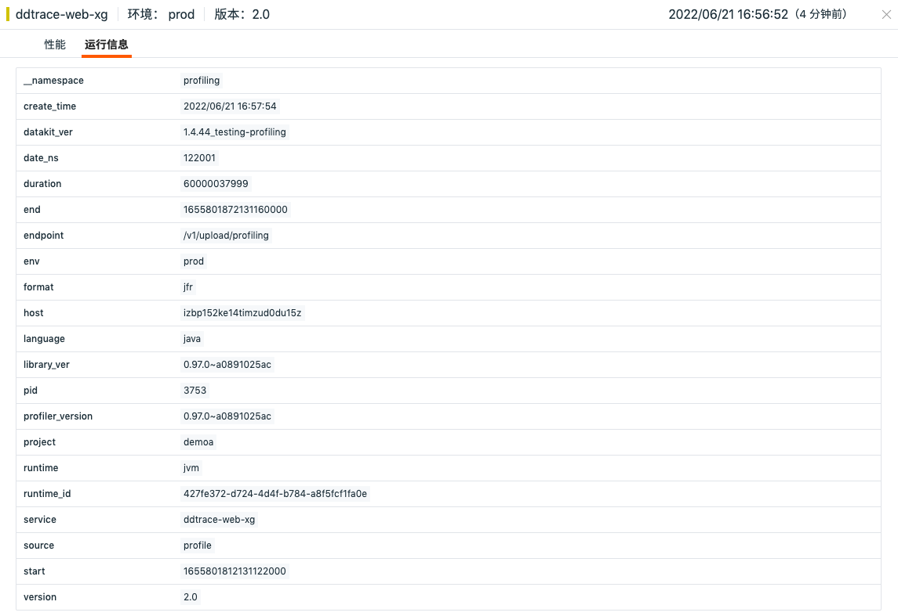

# Profiling
---

Profiling 支持自动获取应用程序运行过程中 CPU、内存和 I/O 的使用情况，通过火焰图实时展示每一个方法、类和线程的调用关系和执行效率，帮助优化代码性能。

在 Profiling 查看器，您可以：

- 基于 Profiling 火焰图分析 Java、Python、Go 、C/C++ 不同语言环境下应用程序运行过程中的动态性能数据，直观的查看 CPU、内存和 I/O 的性能问题；
- 通过关联链路，获取链路相关 Span 的关联代码执行片段，实现方法级代码性能追踪，帮助开发人员发现代码优化方向。

## 前提条件

1. [安装 DataKit](../datakit/datakit-install.md) ；
2. [开启 Profiling 采集器](../integrations/profile.md)。

## 查询与分析

Profiling 数据上报到{{{ custom_key.brand_name }}}工作空间以后，您可以通过 Profiling 实时数据查看器了解您的程序代码性能。支持对 Profiling 数据进行查询和分析，包括搜索与筛选、快捷筛选、添加显示列、数据导出等。

> 更多详情，可参考 [查看器说明](../getting-started/function-details/explorer-search.md)。

**注意**：Profiling 数据默认保存 7 天。

## Profiling 性能分析 {#analysis}

点击 Profiling 列表可查看对应的性能详情，包含属性标签、性能火焰图以及运行信息。

### 火焰图和维度数据分析

Profiling 利用火焰图分析不同类型下代码方法级别的 CPU、内存或 IO 的使用情况，您可以非常直观的了解方法的执行性能和调用情况。同时 Profiling 提供基于方法、库、线程等维度情况下的执行数据分析查看，更直观的显示执行占比较大的一些方法，更快地定位性能问题。

=== "Python"

    
    
    | 分类              | 说明                                                         |
    | ----------------- | ------------------------------------------------------------ |
    | CPU Time          | 每个方法在 CPU 上的运行时间。                                |
    | Wall Time         | 每个方法的花费耗时，其中包含在 CPU 上运行的时间，等待 I/O 的时间以及函数运行时发生的其他任何事情所花费的时间。 |
    | Heap Live Size    | 仍在使用中的堆内存数量。                                     |
    | Allocated Memory  | 每个方法分配的堆内存数量，包括后来被释放的分配。             |
    | Allocations       | 每个方法进行的堆分配数量，包括后来被释放的分配。             |
    | Thrown Exceptions | 每个方法抛出的异常数。                                       |
    | Lock Wait Time    | 每个函数等待锁的时间。                                       |
    | Locked Time       | 每个函数保持锁的时间。                                       |
    | Lock Acquires     | 每个方法获得锁的次数。                                       |
    | Lock Releases     | 每个方法释放锁的次数。                                       |

=== "Java"

    
    
    | 分类                     | 说明                                                         |
    | ------------------------ | ------------------------------------------------------------ |
    | CPU Time                 | 每个方法在 CPU 上的运行时间，其中包含服务的 Java 字节码和运行时操作耗时，不包含通过 JVM 调用本地代码耗时。 |
    | Wall Time in Native Code | 本地代码的采样次数。当代码在 CPU 上运行、等待 I/O 以及方法运行时发生的任何其他情况，都可能发生采样。其中不包含运行应用代码时涉及到的 Java 字节码调用。 |
    | Allocations              | 每个方法进行的堆分配数量，包括后来被释放的分配。             |
    | Allocated Memory         | 每个方法分配的堆内存数量，包括后来被释放的分配。             |
    | Heap Live Objects        | 每个方法被分配到的存活对象数量。                             |
    | Thrown Exceptions        | 每个方法抛出的异常数量。                                     |
    | Lock Wait Time           | 每个方法等待锁的时间。                                       |
    | Lock Acquires            | 每个方法获得锁的次数。                                       |
    | File I/O Time            | 每个方法花在文件读取和写入的时间。                           |
    | File I/O Written         | 每个方法写入到文件的数据量统计。                             |
    | File I/O Read            | 每个方法从文件中读取的数据量统计。                           |
    | Socket I/O Read Time     | 每个方法花在从 socket 中读取的时间。                         |
    | Socket I/O Write Time    | 每个方法花在写入 socket 的时间。                             |
    | Socket I/O Read          | 每个方法从 socket 读取的数据量统计。                         |
    | Socket I/O Written       | 每个方法写到 socket 的数据量统计。                           |
    | Synchronization          | 每个方法花在同步上的时间。                                   |

#### 快捷操作 {#operate}

- 搜索：您可以通过在**类型**右侧的选择框，输入关键字进行模糊搜索，选择框会列出匹配到的方法，直接选择您所需要查看的方法即可。                          
- 复制：您可以在**维度**通过鼠标悬停复制查看方法详情。                          
- 点击选择：**维度**默认全选，您可以点击选择查看一个或多个方法及其相关的火焰图信息。再次点击方法，即可恢复全选。                          

### 运行信息

在 Profiling 详情页，点击查看**运行信息**，可以查看对应编程语言运行时的一些信息以及标签属性。您可以将标签信息添加到查看器列表做筛选使用、复制标签内容进行查询搜索。

## 链路关联 Profiling {#correlate-trace}

当应用程序使用 `ddtrace` 采集器同时开启了 APM 链路追踪和 Profiling 性能追踪数据采集后，{{{ custom_key.brand_name }}}提供 Span 级别的关联查看分析。在应用性能监测的链路详情页，选中火焰图的 Span，获取对应时间段的代码热点信息，直接查看该段时间内的代码方法调用列表和 Wall Time 的执行耗时和占比信息。在方法列表，您可以递归查看方法调用的先后顺序以及执行时间情况。

点击**查看 Profiling 详情**可跳转到对应 Profiling 详情页查看具体的性能数据。

