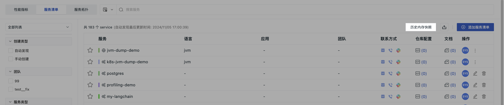

# 服务清单

## 添加服务 {#create}

1. 定义服务的具体名称。 

2. 选择服务类型；选择范围包括：`app`, `framework`, `cache`, `message_queue`, `custom`, `db`, `web`。  

3. 选择当前服务的颜色；默认随机生成，也可下拉选择。

4. 配置团队信息  

    - 团队：即当前服务所属团队；可选择目前工作空间已有的团队，也可手动输入团队名称后回车创建新团队；  
    - 联系方式：当前服务出现异常故障时，将第一时间联系；支持邮箱、电话、Slack 3 种渠道；若需多选，须按照逗号、分号、空格间隔。

    **注意**：在当前服务清单创建成功后，此处创建的新团队会同步在**管理 > 成员管理 > 团队管理**列表中。

5. 配置关联信息 

    - 应用：即当前服务关联的应用信息；同用户访问监测应用 ID；
    - 标签：用于关联当前工作空间内其他配置信息，通过全局标签将工作空间内信息串联，支持跳转联系查看分析等操作。

6. 配置帮助链接

    - 仓库配置：依次填入显示名称、提供商名称及仓库代码 URL；          
    - 帮助文档：依次填入显示名称、提供商名称及其他关联文档 URL；  
    - 视图：可为当前服务关绑定所需内置视图，选定后可在当前服务联动数据查看的**分析看板**下查看绑定的内置视图。 

7. 点击确定。

## 查看服务 

创建完成后，您可以在以下三个列表查看服务的相关参数信息：

## 管理清单 {#list-deatils}

您可参考以下操作管理服务清单列表：

1. 搜索：在搜索栏，可输入关键词搜索服务名称。

2. 筛选：

    - 在全部列表，通过经常浏览、我的收藏和我的创建和来快速过滤查找对应的服务；

    - 在列表左侧，可根据创建类型、团队、服务类型进行相应筛选。

3. 在列表页：

    - 应用：若填写应用与 RUM 应用 ID 一致，则支持 Hover 点击打开新页跳转到 Session 查看器；

    - 团队：支持 Hover 点击打开新页，查看团队信息；

    - 联系方式：支持 Hover 查看邮箱、电话、Slack 的详细信息；其中 Slack 支持跳转；

    - 仓库配置 & 文档：Hover 至相应图标，点击可自动跳转至所关联的仓库或文档。

4. 在**操作**：

    - Hover 至头像图标，可查看该条服务的创建人、创建时间、更新人及更新时间；

    - 点击 :material-dots-vertical: 按钮，可修改或删除当前服务。

5. 点击 :octicons-star-24: 按钮，即可收藏当前服务。

6. 点击 :material-tray-arrow-up: 按钮，即可导出当前页面数据为 JSON 文件。

7. 您可以将当前页面数据保存为[快照](../../getting-started/function-details/snapshot.md)。

### 内存快照 {#jvm}

针对 Java 服务，您可为其配置 JVM 内存快照。

#### 概念先解

JVM（Java Virtual Machine，Java 虚拟机）内存快照是一种在特定时间点捕获 JVM 内存状态的完整记录。您可以通过快照内的日志信息查看相关应用占用内存的详细信息，及时排查应用出现内存泄漏、性能问题等异常情况，在了解内存使用情况的基础上进一步优化数据结构。

> 更多采集器侧的配置，可参考 [采集](../../datakit/datakit-conf.md#remote-job)。

#### 开始创建

1. 输入任务名称；
2. 系统自动为您代入当前服务；
3. 选择执行主机或 Pod；
4. 按需添加描述；
5. 点击确定。

???+ warning "执行目标如何判定？"

    观测云会查询过去 1 小时的链路数据，并判断当前服务所在链路数据是否存在 POD，若存在 `pod_name` 值，则下拉列出 `pod_name`；若不存在，则下拉列出 `host`。

#### 历史内存快照

所有已创建的快照均可通过列表上方**历史内存快照**的入口进入查看。

在历史内存快照列表中，您可以查看该条任务的执行日志，对执行结果和执行日志进行评估。

