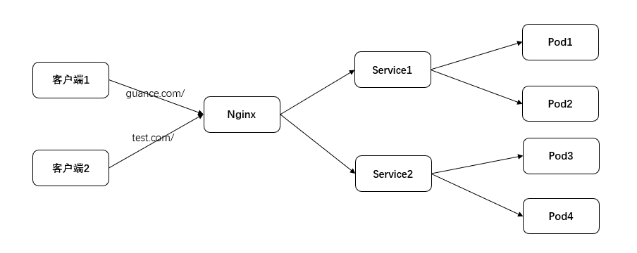
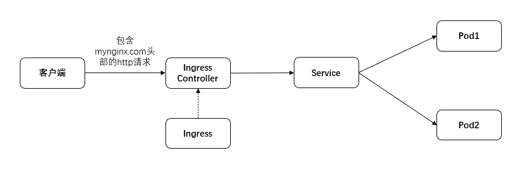
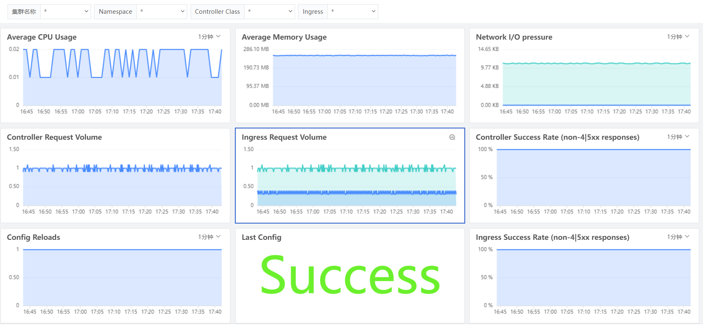

# Nginx Ingress 可观测最佳实践

---

## 简介

Kubernetes 提供了四层代理用来访问部署在 Pod 中的应用，这种具有四层代理的 Service ，Kubernetes 提供了 4 种访问方式：

1. ClusterIP：供集群内的其它应用访问，外部无法访问。
2. NodePort：所有节点上开放指定端口，外部可以通过 IP+端口访问服务，如果没有指定 NodePort 的端口，默认会随机分配一个 30000–32767 的端口。
3. LoadBalancer：在 NodePort 基础上，使用云服务商提供的负载均衡器，把流量转发到服务中。
4. ExternalName：通过返回 CNAME 和它的值，可以将服务映射到 externalName 字段的内容。

上述的 4 种方式都不能满足通过域名来访问集群中的应用，为了通过域名访问部署在 Kubernetes 中的应用，最简单的方式就是在集群中部署一个七层代理 Nginx ，通过域名来转发到对应的 Service 。如果有新的部署时，就需要更新一下 Nginx 的配置。为了达到更新配置时其它应用无感知，Ingress 出现了。



Ingress 可以把 http 和 https 的请求转发到 Kubernetes 集群内部的服务上，最终访问 Service 后端的 Pod。可以将 Ingress 配置为 Service 提供外部可访问的 URL、负载均衡流量、提供基于域名的虚拟主机。


Ingress 包含两大组件 Ingress Controller 和 Ingress ，常用的 Ingress 有 traefik Ingress 和 Nginx Ingress ，本文以 Nginx Ingress 为例。 Ingress Controller 通过与 Kubernetes 的 api 进行交互，动态感知 Kubernetes 集群中 Ingress 服务规则的变化，然后读取这些规则，并按照 Ingress 的规则，转发到 Kubernetes 集群中对应的 Service 上。 Ingress 就是配置这些规则，规则写明了哪个域名对应 Kubernetes 集群中的哪个 Service ，然后根据 Ingress Controller 中 Nginx 配置的模板，生成一段对应的 Nginx 配置， Ingress Controller 再动态加载这些配置，并把这些配置写入 Ingress Controller 的 Pod 里面运行的 Nginx 服务里，然后 reload 一下，使配置生效。

对于部署了 Ingress 的 Kubernetes 集群，我们对 Ingress Controller 的 CPU 使用、内存占用、配置文件加载、转发成功率等资源的观测变得非常有必要了。

**Ingress 工作原理：**

1. 客户端发起[http://myNginx.com](http://mynginx.com)请求。
2. 客户端的 DNS 服务器返回 Ingress 控制器的 IP。
3. 客户端向 Ingress 控制器发送 http 请求，并在 Host 头中指定[myNginx.com](http://mynginx.com)。
4. 控制器接收到请求后，从头部确定客户端尝试访问哪个服务，通过与该服务关联的 endpoint 对象查看到 pod 的 IP。
5. 客户端的请求被转发给具体的 pod 执行。



## 前置条件

- [安装 Kubernetes](https://kubernetes.io/docs/setup/production-environment/tools/)
- 安装 DataKit：登录[<<< custom_key.brand_name >>>控制台](https://console.guance.com/)，点击 「集成」 - 「DataKit」 - 「Kubernetes」

### 部署 Ingress

生产环境推荐使用 DaemonSet 方式部署 Ingress ，并设置 `hosetNetwork` 为 `true`，让 Nginx 直接使用宿主机的网络，然后通过云厂商提供的负载均衡访问 Ingress 。

#### 1 下载 deploy.yaml

```shell
wget https://raw.githubusercontent.com/kubernetes/ingress-nginx/controller-v1.1.1/deploy/static/provider/baremetal/deploy.yaml
```

#### 2 编辑 deploy.yaml

##### 2.1 替换镜像

使用下面的镜像替换 `deploy.yaml` 文件中使用的镜像

```
registry.cn-hangzhou.aliyuncs.com/google_containers/nginx-ingress-controller:v1.1.1
registry.cn-hangzhou.aliyuncs.com/google_containers/kube-webhook-certgen:v1.1.1
```

##### 2.2 修改 Deployment 资源文件

找到 kind: Deployment 部分，修改如下内容：

```yaml
kind: DaemonSet #修改

---
hostNetwork: true #新增
dnsPolicy: ClusterFirstWithHostNet #修改
```

```shell
kubectl apply -f deploy.yaml
```

## 指标采集

### 开启 Input

<<< custom_key.brand_name >>>接入 Ingress 指标数据，需要 datakit 开启 prom 插件，在 prom 插件配置中指定 exporter 的 url，在 Kubernetes 集群中采集 Ingress Controller 指标，推荐使用 annotations 增加注解的方式。打开部署 Ingress 的 deploy.yaml 文件，找到上步中修改的 DaemonSet 部分 ，增加 annotations。

```yaml
annotations:
  datakit/prom.instances: |
    [[inputs.prom]]
      url = "http://$IP:10254/metrics"
      source = "prom-ingress"
      metric_types = ["counter", "gauge", "histogram"]
      # metric_name_filter = ["cpu"]
      # measurement_prefix = ""
      measurement_name = "prom_ingress"
      interval = "60s"
      tags_ignore = ["build","le","path","method","release","repository"]
      metric_name_filter = ["nginx_process_cpu_seconds_total","nginx_process_resident_memory_bytes","request_size","response_size","requests","success","config_last_reload_successful"]
      [[inputs.prom.measurements]]
        prefix = "nginx_ingress_controller_"
        name = "prom_ingress"
      [inputs.prom.tags]
      namespace = "$NAMESPACE"
```


参数说明

- url: Exporter URLs，多个 url 用逗号分割，示例["[http://127.0.0.1:9100/metrics",](http://127.0.0.1:9100/metrics",) "[http://127.0.0.1:9200/metrics"]](http://127.0.0.1:9200/metrics"])
- source: 采集器别名。
- metric_types: 指标类型，可选值是 counter, gauge, histogram, summary。
- measurement_name: 指标集名称。
- interval: 采集频率。
- inputs.prom.measurements: 指标集为 prefix 的前缀归为 name 的指标集。
- tags_ignore: 忽略的 tag。
- metric_name_filter: 指标过滤，只采集需要的指标项。

annotations 中支持如下几个通配符：

- `$NAMESPACE`：Pod Namespace

### 重启 Ingress Controller

```shell
kubectl delete -f deploy.yaml
kubectl apply -f deploy.yaml
```

### 演示案例

编写 Nginx 的部署文件 `nginx-deployment.yaml`

??? quote "`nginx-deployment.yaml`"

    ```yaml
    apiVersion: apps/v1
    kind: Deployment
    metadata:
      name: nginx-deployment
    spec:
      selector:
        matchLabels:
          app: backend
      replicas: 1
      template:
        metadata:
          labels:
            app: backend
        spec:
          # nodeName: df-k8s-node2
          containers:
            - name: nginx
              image: nginx:latest
              resources:
                limits:
                  memory: "128Mi"
                  cpu: "128m"
              ports:
                - containerPort: 80

    ---
    apiVersion: v1
    kind: Service
    metadata:
      name: nginx-service
    spec:
      selector:
        app: backend
      ports:
        - port: 80
          targetPort: 80
    ```

编写对应的 `nginx-ingress.yaml`，根据这个规则，如果域名是 mynginx.com 则，转发到 Nginx - Service 这个 Service 。

??? quote "`nginx-ingress.yaml`"

    ```yaml
    apiVersion: networking.k8s.io/v1
    kind: Ingress
    metadata:
      name: nodeport-ingress
      namespace: default
    spec:
      rules:
        - host: mynginx.com
          http:
            paths:
              - pathType: Prefix
                path: /
                backend:
                  service:
                    name: nginx-service
                    port:
                      number: 80
    ```

部署示例

```shell
kubectl apply -f  nginx-deployment.yaml
kubectl apply -f  nginx-ingress.yaml
```

测试请求，其中

- `8.136.204.98` 是 Kubernetes 集群中部署了 Ingress 的节点 ip
- `mynginx.com` 是 `nginx-ingress.yaml` 中对应的 host

```shell
curl -v http://8.136.204.98 -H 'host: mynginx.com'
```

### 查看指标数据

登录[<<< custom_key.brand_name >>>](https://console.guance.com/)，在「指标」中找到 prom_ingress 指标。其中 prom_ingress 是 annotations 中 measurement_name 参数的值。


## 观测 Ingress

### Ingress 监控视图

登录[<<< custom_key.brand_name >>>](https://console.guance.com/)，「场景」 - 「新建仪表板」，在模板库中搜索「Ingress Nginx 监控视图」，点击「确定」。

Ingress 性能指标展示，包括 Ingress Controller 的平均 cpu 使用率、平均内存使用、网络请求/响应合计、 Ingress Config 的加载次数、 Ingress Config 上次加载结果、 Ingress 的转发成功率等。


