# 基于 Istio 实现微服务可观测最佳实践

---

## Istio

### Service Mesh 是什么

过去几年，微服务在软件应用中迅速普及，大型应用被分解成多个微服务，虽然每个微服务能通过容器化在单独的容器中运行，但是服务间通信的网络拓扑仍然非常复杂。既然微服务之间网络通信非常重要，具备通过实现多个服务代理，确保受控的服务到服务之间通信通道安全、健壮的基础组件就非常有必要。<br />
服务网格 ( Service Mesh )是用来描述组成这些应用程序的微服务网络以及它们之间的交互。单个服务调用，表现为 Sidecar。如果有大量的服务，就会表现出来网格，下图绿色方格代表应用微服务，蓝色方格代表 Sidecar，线条表示服务之间的调用关系，Sidecar 之间的连接就会形成一个网络。


### Istio 简介

Istio 是一个开源服务网格，它透明地分层到现有的分布式应用程序上。提供了对整个服务网格的行为洞察和操作控制的能力，以及一个完整的满足微服务应用各种需求的解决方案。

### Istio 核心组件

Istio 服务网格由数据平面和控制平面组成。

- 数据平面由一组智能代理（Envoy）组成，Envoy 被部署为 sidecar ，微服务之间 Sidecar 的通信是通过策略控制和遥测收集（Mixer）实现。
- 在控制平面负责管理和配置代理来路由流量。Citadel 通过内置身份和凭证管理可以提供强大的服务间和最终用户身份验证。Pilot 用于为 Envoy sidecar 提供服务发现，智能路由（例如 A/B 测试、金丝雀部署等）、流量管理和错误处理（超时、重试和熔断）功能。Galley 是 Istio 配置验证、获取、处理和分发组件。


### Istio 链路追踪

Envoy 原生支持 Jaeger，追踪所需 x-b3 开头的 Header (`x-b3-traceid`, `x-b3-spanid`, `x-b3-parentspanid`, `x-b3-sampled`, `x-b3-flags`）和 x-request-id 在不同的服务之间由业务逻辑进行传递，并由 Envoy 上报给 Jaeger，最终 Jaeger 生成完整的追踪信息。<br />
在 Istio 中，Envoy 和 Jaeger 的关系如下：


图中 Front [Envoy](https://www.servicemesher.com/istio-handbook/GLOSSARY.html#envoy) 指的是第一个接收到请求的 [Envoy](https://www.servicemesher.com/istio-handbook/GLOSSARY.html#envoy) [Sidecar](https://www.servicemesher.com/istio-handbook/GLOSSARY.html#sidecar)，它会负责创建 Root Span 并追加到请求 Header 内，请求到达不同的服务时，[Envoy](https://www.servicemesher.com/istio-handbook/GLOSSARY.html#envoy) [Sidecar](https://www.servicemesher.com/istio-handbook/GLOSSARY.html#sidecar) 会将追踪信息进行上报。<br />
Envoy 链路追踪原生支持 Jaeger，Envoy 支持集成外部追踪服务，支持 zipkin、zipkin 兼容的后端( jaeger )。Istio 链路追踪提供全局配置 zipkinAddress, [Envoy](https://www.servicemesher.com/istio-handbook/GLOSSARY.html#envoy)的上报地址通过 proxy_init 的 --zipkinAddress 参数传入。

### Istio 可观测性

Istio 健壮的追踪、监控和日志特性让您能够深入的了解服务网格部署。通过 Istio 的监控能力，可以真正的了解到服务的性能是如何影响上游和下游的；而它的定制 Dashboard 提供了对所有服务性能的可视化能力，并让您看到它如何影响其他进程。所有这些特性都使您能够更有效地设置、监控和加强服务的 SLO。

### BookInfo 简介

这个示例部署了一个用于演示多种 Istio 特性的应用，该应用由四个单独的微服务构成。这个应用模仿在线书店的一个分类，显示一本书的信息。页面上会显示一本书的描述，书籍的细节（ISBN、页数等），以及关于这本书的一些评论。<br />
Bookinfo 应用程序分为四个单独的微服务：

- productpage：productpage (python) 微服务调用 details 和 reviews 微服务来填充页面。
- details：details (ruby) 微服务包含图书的详细信息。
- reviews：reviews (java) 微服务包含书评，它还调用 ratings 微服务。
- ratings：ratings (node js) 微服务包含书的排名信息。

reviews 微服务提供了 3 个版本：

- 版本 v1 不调用 ratings 服务。
- 版本 v2 调用 ratings 服务，并将每个等级显示为 1 到 5 个黑星。
- 版本 v3 调用 ratings 服务，并将每个等级显示为 1 到 5 个红色星号。


Bookinfo 的链路数据，只需要修改 istio 的 configmap 中 zipkin.address 为 DataKit 地址，DataKit 需要开启 zipkin 采集器，即能实现链路数据 push 到 DataKit。

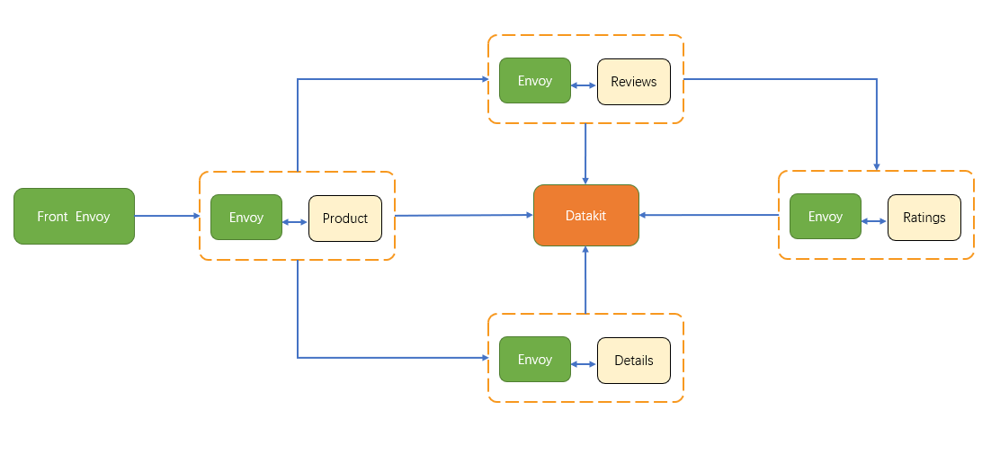

## 环境部署

### 前置条件

#### Kubernetes

本示例在 CentOS 7.9 通过 minikube 创建的版本是 1.21.2 的 Kubernetes 集群。

#### 部署 DataKit

参考< [Daemonset 部署 DataKit](../insight/datakit-daemonset.md) >。

#### 开启采集器

使用 [Daemonset 部署 DataKit](../insight/datakit-daemonset.md) 的 `datakit.yaml` 文件，上传到 Kubernetes 集群 的 master 节点 `/usr/local/df-demo/datakit.yaml`，修改 `datakit.yaml` 文件，增加 ConfigMap 并挂载文件来开通 Zipkin 和 Prom 采集器，最终结果是部署完成的 DataKit。

- 增加文件 `/usr/local/datakit/conf.d/zipkin/zipkin.conf` 是开通 Zipkin 的指标采集器
- 增加文件 `/usr/local/datakit/conf.d/prom/prom_istiod.conf` 是开通 Istiod pod 的指标采集器
- 增加文件 `/usr/local/datakit/conf.d/prom/prom-ingressgateway.conf` 是开通 Ingressgateway 的指标采集器
- 增加文件 `/usr/local/datakit/conf.d/prom/prom-egressgateway.conf` 是开通 Egressgateway 的指标采集器

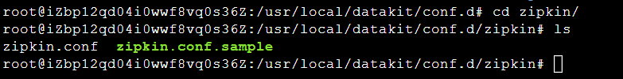

采集 ingressgateway 和 egressgateway 使用 Service 来访问 `15020` 端口，所以需要新建 ingressgateway 和 egressgateway 的 Service。

??? quote "`istio-ingressgateway-service-ext.yaml`"

    ```yaml
    apiVersion: v1
    kind: Service
    metadata:
      name: istio-ingressgateway-ext
      namespace: istio-system
    spec:
      ports:
        - name: http-monitoring
          port: 15020
          protocol: TCP
          targetPort: 15020
      selector:
        app: istio-ingressgateway
        istio: ingressgateway
      type: ClusterIP
    ```

??? quote "`istio-egressgateway-service-ext.yaml`"

    ```yaml
    apiVersion: v1
    kind: Service
    metadata:
      name: istio-egressgateway-ext
      namespace: istio-system
    spec:
      ports:
        - name: http-monitoring
          port: 15020
          protocol: TCP
          targetPort: 15020
      selector:
        app: istio-egressgateway
        istio: egressgateway
      type: ClusterIP
    ```

创建 Service

```bash
kubectl apply -f istio-ingressgateway-service-ext.yaml
kubectl apply -f istio-egressgateway-service-ext.yaml
```

下面是 `datakit.yaml` 文件的修改部分：

??? quote "ConfigMap 增加"

    ```yaml
    apiVersion: v1
    kind: ConfigMap
    metadata:
      name: datakit-conf
      namespace: datakit
    data:
      zipkin.conf: |-
        [[inputs.zipkin]]
          pathV1 = "/api/v1/spans"
          pathV2 = "/api/v2/spans"

      prom_istiod.conf: |-
        [[inputs.prom]] 
          url = "http://istiod.istio-system.svc.cluster.local:15014/metrics"
          source = "prom-istiod"
          metric_types = ["counter", "gauge"]
          interval = "60s"
          tags_ignore = ["cache","cluster_type","component","destination_app","destination_canonical_revision","destination_canonical_service","destination_cluster","destination_principal","group","grpc_code","grpc_method","grpc_service","grpc_type","reason","request_protocol","request_type","resource","responce_code_class","response_flags","source_app","source_canonical_revision","source_canonical-service","source_cluster","source_principal","source_version","wasm_filter"]
          metric_name_filter = ["istio_requests_total","pilot_k8s_cfg_events","istio_build","process_virtual_memory_bytes","process_resident_memory_bytes","process_cpu_seconds_total","envoy_cluster_assignment_stale","go_goroutines","pilot_xds_pushes","pilot_proxy_convergence_time_bucket","citadel_server_root_cert_expiry_timestamp","pilot_conflict_inbound_listener","pilot_conflict_outbound_listener_http_over_current_tcp","pilot_conflict_outbound_listener_tcp_over_current_tcp","pilot_conflict_outbound_listener_tcp_over_current_http","pilot_virt_services","galley_validation_failed","pilot_services","envoy_cluster_upstream_cx_total","envoy_cluster_upstream_cx_connect_fail","envoy_cluster_upstream_cx_active","envoy_cluster_upstream_cx_rx_bytes_total","envoy_cluster_upstream_cx_tx_bytes_total","istio_request_duration_milliseconds_bucket","istio_request_duration_seconds_bucket","istio_request_bytes_bucket","istio_response_bytes_bucket"]
          #measurement_prefix = ""
          measurement_name = "istio_prom"
          #[[inputs.prom.measurements]]
          # prefix = "cpu_"
          # name ="cpu"
          [inputs.prom.tags]
            app_id="istiod"

      prom-ingressgateway.conf: |-
        [[inputs.prom]] 
          url = "http://istio-ingressgateway-ext.istio-system.svc.cluster.local:15020/stats/prometheus"
          source = "prom-ingressgateway"
          metric_types = ["counter", "gauge"]
          interval = "60s"
          tags_ignore = ["cache","cluster_type","component","destination_app","destination_canonical_revision","destination_canonical_service","destination_cluster","destination_principal","group","grpc_code","grpc_method","grpc_service","grpc_type","reason","request_protocol","request_type","resource","responce_code_class","response_flags","source_app","source_canonical_revision","source_canonical-service","source_cluster","source_principal","source_version","wasm_filter"]
          metric_name_filter = ["istio_requests_total","pilot_k8s_cfg_events","istio_build","process_virtual_memory_bytes","process_resident_memory_bytes","process_cpu_seconds_total","envoy_cluster_assignment_stale","go_goroutines","pilot_xds_pushes","pilot_proxy_convergence_time_bucket","citadel_server_root_cert_expiry_timestamp","pilot_conflict_inbound_listener","pilot_conflict_outbound_listener_http_over_current_tcp","pilot_conflict_outbound_listener_tcp_over_current_tcp","pilot_conflict_outbound_listener_tcp_over_current_http","pilot_virt_services","galley_validation_failed","pilot_services","envoy_cluster_upstream_cx_total","envoy_cluster_upstream_cx_connect_fail","envoy_cluster_upstream_cx_active","envoy_cluster_upstream_cx_rx_bytes_total","envoy_cluster_upstream_cx_tx_bytes_total","istio_request_duration_milliseconds_bucket","istio_request_duration_seconds_bucket","istio_request_bytes_bucket","istio_response_bytes_bucket"]
          #measurement_prefix = ""
          measurement_name = "istio_prom"
          #[[inputs.prom.measurements]]
          # prefix = "cpu_"
          # name ="cpu"

      prom-egressgateway.conf: |-
        [[inputs.prom]] 
          url = "http://istio-egressgateway-ext.istio-system.svc.cluster.local:15020/stats/prometheus"
          source = "prom-egressgateway"
          metric_types = ["counter", "gauge"]
          tags_ignore = ["cache","cluster_type","component","destination_app","destination_canonical_revision","destination_canonical_service","destination_cluster","destination_principal","group","grpc_code","grpc_method","grpc_service","grpc_type","reason","request_protocol","request_type","resource","responce_code_class","response_flags","source_app","source_canonical_revision","source_canonical-service","source_cluster","source_principal","source_version","wasm_filter"]
          interval = "60s"
          metric_name_filter = ["istio_requests_total","pilot_k8s_cfg_events","istio_build","process_virtual_memory_bytes","process_resident_memory_bytes","process_cpu_seconds_total","envoy_cluster_assignment_stale","go_goroutines","pilot_xds_pushes","pilot_proxy_convergence_time_bucket","citadel_server_root_cert_expiry_timestamp","pilot_conflict_inbound_listener","pilot_conflict_outbound_listener_http_over_current_tcp","pilot_conflict_outbound_listener_tcp_over_current_tcp","pilot_conflict_outbound_listener_tcp_over_current_http","pilot_virt_services","galley_validation_failed","pilot_services","envoy_cluster_upstream_cx_total","envoy_cluster_upstream_cx_connect_fail","envoy_cluster_upstream_cx_active","envoy_cluster_upstream_cx_rx_bytes_total","envoy_cluster_upstream_cx_tx_bytes_total","istio_request_duration_milliseconds_bucket","istio_request_duration_seconds_bucket","istio_request_bytes_bucket","istio_response_bytes_bucket"]
          #measurement_prefix = ""
          measurement_name = "istio_prom"
          #[[inputs.prom.measurements]]
          # prefix = "cpu_"
          # name ="cpu"
    ```

??? quote "挂载 `zipkin.conf` 和 `prom_istiod.conf`"

    ```yaml
    apiVersion: apps/v1
    kind: DaemonSet
    ...
    spec:
      template
        spec:
          containers:
          - env:
            volumeMounts: # 下面是新增部分
            - mountPath: /usr/local/datakit/conf.d/zipkin/zipkin.conf
              name: datakit-conf
              subPath: zipkin.conf
            - mountPath: /usr/local/datakit/conf.d/prom/prom_istiod.conf
              name: datakit-conf
              subPath: prom_istiod.conf
            - mountPath: /usr/local/datakit/conf.d/prom/prom-ingressgateway.conf
              name: datakit-conf
              subPath: prom-ingressgateway.conf
            - mountPath: /usr/local/datakit/conf.d/prom/prom-egressgateway.conf
              name: datakit-conf
              subPath: prom-egressgateway.conf
    ```

#### 替换 token

登录[<<< custom_key.brand_name >>>](https://<<< custom_key.studio_main_site >>>/)，「集成」 - 「DataKit」复制 token，替换到 `datakit.yaml` 中的 `<your-token>`。


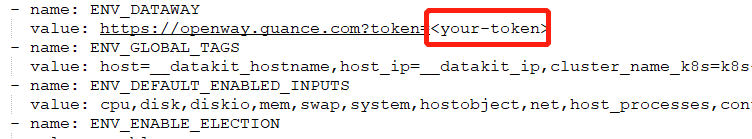

#### 重新部署 DataKit

```bash
cd /usr/local/df-demo
kubectl apply -f datakit.yaml
```

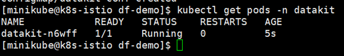

### 部署 Istio

#### 下载 Istio

[下载](https://github.com/istio/istio/releases) **Source Code** 和 `istio-1.11.2-linux-amd64.tar.gz`

#### 安装 Istio

上传 `istio-1.11.2-linux-amd64.tar.gz` 到 `/usr/local/df-demo/` 目录，查看 Kubernetes 所在服务器的内网地址是 `172.16.0.15`，请替换 `172.16.0.15` 为您的 ip。

```bash
su minikube
cd /usr/local/df-demo/
tar zxvf istio-1.11.2-linux-amd64.tar.gz
cd /usr/local/df-demo/istio-1.11.2
export PATH=$PWD/bin:$PATH$
cp -ar /usr/local/df-demo/istio-1.11.2/bin/istioctl /usr/bin/

istioctl install --set profile=demo

```

#### 验证安装

部署成功后，ingressgateway、egressgateway、istiod 会处于 Running 状态。

```bash
kubectl get pods -n istio-system
```

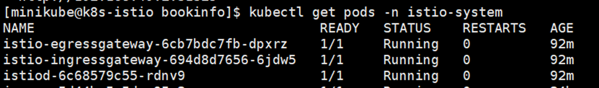

### 部署 BookInfo

#### 文件拷贝

解压源码，拷贝 `/usr/local/df-demo/istio-1.11.2/samples/bookinfo/src/productpage` 目录到 `/usr/local/df-demo/bookinfo` 目录。拷贝部署 bookInfo 需要的 yaml。

```bash
cp /usr/local/df-demo/istio-1.11.2/samples/bookinfo/networking/bookinfo-gateway.yaml /usr/local/df-demo/bookinfo/bookinfo-gateway.yaml
cp /usr/local/df-demo/istio-1.11.2/samples/bookinfo/networking/virtual-service-ratings-test-delay.yaml /usr/local/df-demo/bookinfo/virtual-service-ratings-test-delay.yaml
cp /usr/local/df-demo/istio-1.11.2/samples/bookinfo/platform/kube/bookinfo.yaml /usr/local/df-demo/bookinfo/bookinfo.yaml
```

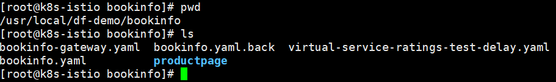

#### 开启自动注入

新建 prod 命名空间，开启该空间下创建 Pod 时自动注入 Sidecar，让 Pod 的出入流量都转由 Sidecar 进行处理。

```bash
kubectl create namespace prod
kubectl label namespace prod istio-injection=enabled
```

#### 开启 RUM

- 1 登录[<<< custom_key.brand_name >>>](https://<<< custom_key.studio_main_site >>>/)，「用户访问监测」 - 「新建应用」，输入 bookinfo，<br />
  复制 js 到 `/usr/local/df-demo/bookinfo/productpage/templates/productpage.html`，并修改 <DATAKIT ORIGIN> 为 `http://<your-外网 ip>:9529`。


- 2 修改 `/usr/local/df-demo/bookinfo/productpage/Dockerfile`

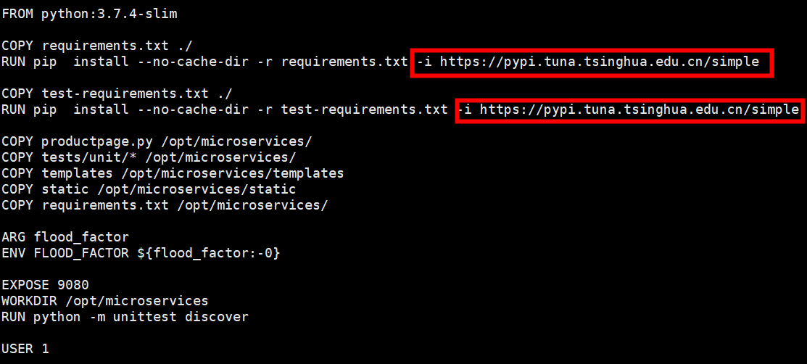

- 3 制作镜像

```bash
cd /usr/local/df-demo/bookinfo/productpage
eval $(minikube docker-env)
docker build -t product-page:v1  .
```

- 4 替换镜像

替换 `/usr/local/df-demo/bookinfo/bookinfo.yaml` 中的 `image: docker.io/istio/examples-bookinfo-productpage-v1:1.16.2` 为 `image: product-page:v1`。


#### 打通 APM 和 DataKit

```bash
kubectl edit configmap istio -n istio-system -o yaml
```


在上图中，可以看到链路数据默认推送到 `zipkin.istio-system:9411` 这个地址。由于 DataKit 服务的名称空间是 datakit，端口是 9529，所以这里需要做一下转换。

> 详情请参考 <[Kubernetes 集群使用 ExternalName 映射 DataKit 服务](./kubernetes-external-name.md)>

#### 增加 namespace

修改 bookinfo 的 yaml，所有资源的 metadata 下增加 `namespace: prod`

```bash
vi /usr/local/df-demo/bookinfo/bookinfo.yaml
vi /usr/local/df-demo/bookinfo/bookinfo-gateway.yaml
vi /usr/local/df-demo/bookinfo/virtual-service-ratings-test-delay.yaml
```


#### 开启 Pod 自定义采集

修改 `bookinfo.yaml`

```bash
vi /usr/local/df-demo/bookinfo/bookinfo.yaml
```

在所有 Deployment 控制器，Pod 模板上增加 annotations。<br />

参数说明

- url：Exporter 地址
- source：采集器名称
- metric_types：指标类型过滤
- measurement_name：采集后的指标集名称
- interval：采集指标频率，s 秒
- $IP：通配 Pod 的内网 IP
- $NAMESPACE：Pod 所在命名空间
- tags_ignore: 忽略的 tag。

```yaml
annotations:
  datakit/prom.instances: |
    [[inputs.prom]]
      url = "http://$IP:15020/stats/prometheus"
      source = "minik8s-istio-product"
      metric_types = ["counter", "gauge"]
      interval = "60s"
      tags_ignore = ["cache","cluster_type","component","destination_app","destination_canonical_revision","destination_canonical_service","destination_cluster","destination_principal","group","grpc_code","grpc_method","grpc_service","grpc_type","reason","request_protocol","request_type","resource","responce_code_class","response_flags","source_app","source_canonical_revision","source_canonical-service","source_cluster","source_principal","source_version","wasm_filter"]
      metric_name_filter = ["istio_requests_total","pilot_k8s_cfg_events","istio_build","process_virtual_memory_bytes","process_resident_memory_bytes","process_cpu_seconds_total","envoy_cluster_assignment_stale","go_goroutines","pilot_xds_pushes","pilot_proxy_convergence_time_bucket","citadel_server_root_cert_expiry_timestamp","pilot_conflict_inbound_listener","pilot_conflict_outbound_listener_http_over_current_tcp","pilot_conflict_outbound_listener_tcp_over_current_tcp","pilot_conflict_outbound_listener_tcp_over_current_http","pilot_virt_services","galley_validation_failed","pilot_services","envoy_cluster_upstream_cx_total","envoy_cluster_upstream_cx_connect_fail","envoy_cluster_upstream_cx_active","envoy_cluster_upstream_cx_rx_bytes_total","envoy_cluster_upstream_cx_tx_bytes_total","istio_request_duration_milliseconds_bucket","istio_request_duration_seconds_bucket","istio_request_bytes_bucket","istio_response_bytes_bucket"]
      #measurement_prefix = ""
      measurement_name = "istio_prom"
      #[[inputs.prom.measurements]]
      # prefix = "cpu_"
      # name = "cpu"         
      [inputs.prom.tags]
      namespace = "$NAMESPACE"
      pod_name = "$PODNAME"
```

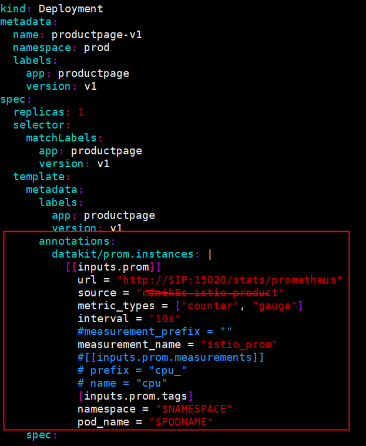

- 完整 `bookinfo.yaml` 如下

??? quote "`bookinfo.yaml`"

    ```yaml
    apiVersion: v1
    kind: Service
    metadata:
      name: details
      namespace: prod
      labels:
        app: details
        service: details
    spec:
      ports:
      - port: 9080
        name: http
      selector:
        app: details
    ---
    apiVersion: v1
    kind: ServiceAccount
    metadata:
      name: bookinfo-details
      namespace: prod
      labels:
        account: details
    ---
    apiVersion: apps/v1
    kind: Deployment
    metadata:
      name: details-v1
      namespace: prod
      labels:
        app: details
        version: v1
    spec:
      replicas: 1
      selector:
        matchLabels:
          app: details
          version: v1
      template:
        metadata:
          labels:
            app: details
            version: v1
          annotations:
            datakit/prom.instances: |
              [[inputs.prom]]
                url = "http://$IP:15020/stats/prometheus"
                source = "minik8s-istio-details"
                metric_types = ["counter", "gauge"]
                interval = "60s"
          tags_ignore = ["cache","cluster_type","component","destination_app","destination_canonical_revision","destination_canonical_service","destination_cluster","destination_principal","group","grpc_code","grpc_method","grpc_service","grpc_type","reason","request_protocol","request_type","resource","responce_code_class","response_flags","source_app","source_canonical_revision","source_canonical-service","source_cluster","source_principal","source_version","wasm_filter"]
                metric_name_filter = ["istio_requests_total","pilot_k8s_cfg_events","istio_build","process_virtual_memory_bytes","process_resident_memory_bytes","process_cpu_seconds_total","envoy_cluster_assignment_stale","go_goroutines","pilot_xds_pushes","pilot_proxy_convergence_time_bucket","citadel_server_root_cert_expiry_timestamp","pilot_conflict_inbound_listener","pilot_conflict_outbound_listener_http_over_current_tcp","pilot_conflict_outbound_listener_tcp_over_current_tcp","pilot_conflict_outbound_listener_tcp_over_current_http","pilot_virt_services","galley_validation_failed","pilot_services","envoy_cluster_upstream_cx_total","envoy_cluster_upstream_cx_connect_fail","envoy_cluster_upstream_cx_active","envoy_cluster_upstream_cx_rx_bytes_total","envoy_cluster_upstream_cx_tx_bytes_total","istio_request_duration_milliseconds_bucket","istio_request_duration_seconds_bucket","istio_request_bytes_bucket","istio_response_bytes_bucket"]
                #measurement_prefix = ""
                measurement_name = "istio_prom"
                #[[inputs.prom.measurements]]
                # prefix = "cpu_"
                # name = "cpu"
                [inputs.prom.tags]
                namespace = "$NAMESPACE"
        spec:
          serviceAccountName: bookinfo-details
          containers:
          - name: details
            image: docker.io/istio/examples-bookinfo-details-v1:1.16.2
            imagePullPolicy: IfNotPresent
            ports:
            - containerPort: 9080
            securityContext:
              runAsUser: 1000
    ---
    ##################################################################################################
    # Ratings service
    ##################################################################################################
    apiVersion: v1
    kind: Service
    metadata:
      name: ratings
      namespace: prod
      labels:
        app: ratings
        service: ratings
    spec:
      ports:
      - port: 9080
        name: http
      selector:
        app: ratings
    ---
    apiVersion: v1
    kind: ServiceAccount
    metadata:
      name: bookinfo-ratings
      namespace: prod
      labels:
        account: ratings
    ---
    apiVersion: apps/v1
    kind: Deployment
    metadata:
      name: ratings-v1
      namespace: prod
      labels:
        app: ratings
        version: v1
    spec:
      replicas: 1
      selector:
        matchLabels:
          app: ratings
          version: v1
      template:
        metadata:
          labels:
            app: ratings
            version: v1
          annotations:
            datakit/prom.instances: |
              [[inputs.prom]]
                url = "http://$IP:15020/stats/prometheus"
                source = "minik8s-istio-ratings"
                metric_types = ["counter", "gauge"]
                interval = "60s"
          tags_ignore = ["cache","cluster_type","component","destination_app","destination_canonical_revision","destination_canonical_service","destination_cluster","destination_principal","group","grpc_code","grpc_method","grpc_service","grpc_type","reason","request_protocol","request_type","resource","responce_code_class","response_flags","source_app","source_canonical_revision","source_canonical-service","source_cluster","source_principal","source_version","wasm_filter"]
                metric_name_filter = ["istio_requests_total","pilot_k8s_cfg_events","istio_build","process_virtual_memory_bytes","process_resident_memory_bytes","process_cpu_seconds_total","envoy_cluster_assignment_stale","go_goroutines","pilot_xds_pushes","pilot_proxy_convergence_time_bucket","citadel_server_root_cert_expiry_timestamp","pilot_conflict_inbound_listener","pilot_conflict_outbound_listener_http_over_current_tcp","pilot_conflict_outbound_listener_tcp_over_current_tcp","pilot_conflict_outbound_listener_tcp_over_current_http","pilot_virt_services","galley_validation_failed","pilot_services","envoy_cluster_upstream_cx_total","envoy_cluster_upstream_cx_connect_fail","envoy_cluster_upstream_cx_active","envoy_cluster_upstream_cx_rx_bytes_total","envoy_cluster_upstream_cx_tx_bytes_total","istio_request_duration_milliseconds_bucket","istio_request_duration_seconds_bucket","istio_request_bytes_bucket","istio_response_bytes_bucket"]
                #measurement_prefix = ""
                measurement_name = "istio_prom"
                #[[inputs.prom.measurements]]
                # prefix = "cpu_"
                # name = "cpu"
                [inputs.prom.tags]
                namespace = "$NAMESPACE"
        spec:
          serviceAccountName: bookinfo-ratings
          containers:
          - name: ratings
            image: docker.io/istio/examples-bookinfo-ratings-v1:1.16.2
            imagePullPolicy: IfNotPresent
            ports:
            - containerPort: 9080
            securityContext:
              runAsUser: 1000
    ---
    ##################################################################################################
    # Reviews service
    ##################################################################################################
    apiVersion: v1
    kind: Service
    metadata:
      name: reviews
      namespace: prod
      labels:
        app: reviews
        service: reviews
    spec:
      ports:
      - port: 9080
        name: http
      selector:
        app: reviews
    ---
    apiVersion: v1
    kind: ServiceAccount
    metadata:
      name: bookinfo-reviews
      namespace: prod
      labels:
        account: reviews
    ---
    apiVersion: apps/v1
    kind: Deployment
    metadata:
      name: reviews-v1
      namespace: prod
      labels:
        app: reviews
        version: v1
    spec:
      replicas: 1
      selector:
        matchLabels:
          app: reviews
          version: v1
      template:
        metadata:
          labels:
            app: reviews
            version: v1
          annotations:
            datakit/prom.instances: |
              [[inputs.prom]]
                url = "http://$IP:15020/stats/prometheus"
                source = "minik8s-istio-review1"
                metric_types = ["counter", "gauge"]
                interval = "60s"
          tags_ignore = ["cache","cluster_type","component","destination_app","destination_canonical_revision","destination_canonical_service","destination_cluster","destination_principal","group","grpc_code","grpc_method","grpc_service","grpc_type","reason","request_protocol","request_type","resource","responce_code_class","response_flags","source_app","source_canonical_revision","source_canonical-service","source_cluster","source_principal","source_version","wasm_filter"]
                #measurement_prefix = ""
                metric_name_filter = ["istio_requests_total","pilot_k8s_cfg_events","istio_build","process_virtual_memory_bytes","process_resident_memory_bytes","process_cpu_seconds_total","envoy_cluster_assignment_stale","go_goroutines","pilot_xds_pushes","pilot_proxy_convergence_time_bucket","citadel_server_root_cert_expiry_timestamp","pilot_conflict_inbound_listener","pilot_conflict_outbound_listener_http_over_current_tcp","pilot_conflict_outbound_listener_tcp_over_current_tcp","pilot_conflict_outbound_listener_tcp_over_current_http","pilot_virt_services","galley_validation_failed","pilot_services","envoy_cluster_upstream_cx_total","envoy_cluster_upstream_cx_connect_fail","envoy_cluster_upstream_cx_active","envoy_cluster_upstream_cx_rx_bytes_total","envoy_cluster_upstream_cx_tx_bytes_total","istio_request_duration_milliseconds_bucket","istio_request_duration_seconds_bucket","istio_request_bytes_bucket","istio_response_bytes_bucket"]
                measurement_name = "istio_prom"
                #[[inputs.prom.measurements]]
                # prefix = "cpu_"
                # name = "cpu"
                [inputs.prom.tags]
                namespace = "$NAMESPACE"
        spec:
          serviceAccountName: bookinfo-reviews
          containers:
          - name: reviews
            image: docker.io/istio/examples-bookinfo-reviews-v1:1.16.2
            imagePullPolicy: IfNotPresent
            env:
            - name: LOG_DIR
              value: "/tmp/logs"
            ports:
            - containerPort: 9080
            volumeMounts:
            - name: tmp
              mountPath: /tmp
            - name: wlp-output
              mountPath: /opt/ibm/wlp/output
            securityContext:
              runAsUser: 1000
          volumes:
          - name: wlp-output
            emptyDir: {}
          - name: tmp
            emptyDir: {}
    ---
    apiVersion: apps/v1
    kind: Deployment
    metadata:
      name: reviews-v2
      namespace: prod
      labels:
        app: reviews
        version: v2
    spec:
      replicas: 1
      selector:
        matchLabels:
          app: reviews
          version: v2
      template:
        metadata:
          labels:
            app: reviews
            version: v2
          annotations:
            datakit/prom.instances: |
              [[inputs.prom]]
                url = "http://$IP:15020/stats/prometheus"
                source = "minik8s-istio-review2"
                metric_types = ["counter", "gauge"]
                interval = "60s"
          tags_ignore = ["cache","cluster_type","component","destination_app","destination_canonical_revision","destination_canonical_service","destination_cluster","destination_principal","group","grpc_code","grpc_method","grpc_service","grpc_type","reason","request_protocol","request_type","resource","responce_code_class","response_flags","source_app","source_canonical_revision","source_canonical-service","source_cluster","source_principal","source_version","wasm_filter"]
                #measurement_prefix = ""
                metric_name_filter = ["istio_requests_total","pilot_k8s_cfg_events","istio_build","process_virtual_memory_bytes","process_resident_memory_bytes","process_cpu_seconds_total","envoy_cluster_assignment_stale","go_goroutines","pilot_xds_pushes","pilot_proxy_convergence_time_bucket","citadel_server_root_cert_expiry_timestamp","pilot_conflict_inbound_listener","pilot_conflict_outbound_listener_http_over_current_tcp","pilot_conflict_outbound_listener_tcp_over_current_tcp","pilot_conflict_outbound_listener_tcp_over_current_http","pilot_virt_services","galley_validation_failed","pilot_services","envoy_cluster_upstream_cx_total","envoy_cluster_upstream_cx_connect_fail","envoy_cluster_upstream_cx_active","envoy_cluster_upstream_cx_rx_bytes_total","envoy_cluster_upstream_cx_tx_bytes_total","istio_request_duration_milliseconds_bucket","istio_request_duration_seconds_bucket","istio_request_bytes_bucket","istio_response_bytes_bucket"]
                measurement_name = "istio_prom"
                #[[inputs.prom.measurements]]
                # prefix = "cpu_"
                # name = "cpu"
                [inputs.prom.tags]
                namespace = "$NAMESPACE"
        spec:
          serviceAccountName: bookinfo-reviews
          containers:
          - name: reviews
            image: docker.io/istio/examples-bookinfo-reviews-v2:1.16.2
            imagePullPolicy: IfNotPresent
            env:
            - name: LOG_DIR
              value: "/tmp/logs"
            ports:
            - containerPort: 9080
            volumeMounts:
            - name: tmp
              mountPath: /tmp
            - name: wlp-output
              mountPath: /opt/ibm/wlp/output
            securityContext:
              runAsUser: 1000
          volumes:
          - name: wlp-output
            emptyDir: {}
          - name: tmp
            emptyDir: {}
    ---
    apiVersion: apps/v1
    kind: Deployment
    metadata:
      name: reviews-v3
      namespace: prod
      labels:
        app: reviews
        version: v3
    spec:
      replicas: 1
      selector:
        matchLabels:
          app: reviews
          version: v3
      template:
        metadata:
          labels:
            app: reviews
            version: v3
          annotations:
            datakit/prom.instances: |
              [[inputs.prom]]
                url = "http://$IP:15020/stats/prometheus"
                source = "minik8s-istio-review3"
                metric_types = ["counter", "gauge"]
                interval = "60s"
          tags_ignore = ["cache","cluster_type","component","destination_app","destination_canonical_revision","destination_canonical_service","destination_cluster","destination_principal","group","grpc_code","grpc_method","grpc_service","grpc_type","reason","request_protocol","request_type","resource","responce_code_class","response_flags","source_app","source_canonical_revision","source_canonical-service","source_cluster","source_principal","source_version","wasm_filter"]
                metric_name_filter = ["istio_requests_total","pilot_k8s_cfg_events","istio_build","process_virtual_memory_bytes","process_resident_memory_bytes","process_cpu_seconds_total","envoy_cluster_assignment_stale","go_goroutines","pilot_xds_pushes","pilot_proxy_convergence_time_bucket","citadel_server_root_cert_expiry_timestamp","pilot_conflict_inbound_listener","pilot_conflict_outbound_listener_http_over_current_tcp","pilot_conflict_outbound_listener_tcp_over_current_tcp","pilot_conflict_outbound_listener_tcp_over_current_http","pilot_virt_services","galley_validation_failed","pilot_services","envoy_cluster_upstream_cx_total","envoy_cluster_upstream_cx_connect_fail","envoy_cluster_upstream_cx_active","envoy_cluster_upstream_cx_rx_bytes_total","envoy_cluster_upstream_cx_tx_bytes_total","istio_request_duration_milliseconds_bucket","istio_request_duration_seconds_bucket","istio_request_bytes_bucket","istio_response_bytes_bucket"]
                #measurement_prefix = ""
                measurement_name = "istio_prom"
                #[[inputs.prom.measurements]]
                # prefix = "cpu_"
                # name = "cpu"
                [inputs.prom.tags]
                namespace = "$NAMESPACE"
        spec:
          serviceAccountName: bookinfo-reviews
          containers:
          - name: reviews
            image: docker.io/istio/examples-bookinfo-reviews-v3:1.16.2
            imagePullPolicy: IfNotPresent
            env:
            - name: LOG_DIR
              value: "/tmp/logs"
            ports:
            - containerPort: 9080
            volumeMounts:
            - name: tmp
              mountPath: /tmp
            - name: wlp-output
              mountPath: /opt/ibm/wlp/output
            securityContext:
              runAsUser: 1000
          volumes:
          - name: wlp-output
            emptyDir: {}
          - name: tmp
            emptyDir: {}
    ---
    ##################################################################################################
    # Productpage services
    ##################################################################################################
    apiVersion: v1
    kind: Service
    metadata:
      name: productpage
      namespace: prod
      labels:
        app: productpage
        service: productpage
    spec:
      ports:
      - port: 9080
        name: http
      selector:
        app: productpage
    ---
    apiVersion: v1
    kind: ServiceAccount
    metadata:
      name: bookinfo-productpage
      namespace: prod
      labels:
        account: productpage
    ---
    apiVersion: apps/v1
    kind: Deployment
    metadata:
      name: productpage-v1
      namespace: prod
      labels:
        app: productpage
        version: v1
    spec:
      replicas: 1
      selector:
        matchLabels:
          app: productpage
          version: v1
      template:
        metadata:
          labels:
            app: productpage
            version: v1
          annotations:
            datakit/prom.instances: |
              [[inputs.prom]]
                url = "http://$IP:15020/stats/prometheus"
                source = "minik8s-istio-product"
                metric_types = ["counter", "gauge"]
                interval = "60s"
          tags_ignore = ["cache","cluster_type","component","destination_app","destination_canonical_revision","destination_canonical_service","destination_cluster","destination_principal","group","grpc_code","grpc_method","grpc_service","grpc_type","reason","request_protocol","request_type","resource","responce_code_class","response_flags","source_app","source_canonical_revision","source_canonical-service","source_cluster","source_principal","source_version","wasm_filter"]
                metric_name_filter = ["istio_requests_total","pilot_k8s_cfg_events","istio_build","process_virtual_memory_bytes","process_resident_memory_bytes","process_cpu_seconds_total","envoy_cluster_assignment_stale","go_goroutines","pilot_xds_pushes","pilot_proxy_convergence_time_bucket","citadel_server_root_cert_expiry_timestamp","pilot_conflict_inbound_listener","pilot_conflict_outbound_listener_http_over_current_tcp","pilot_conflict_outbound_listener_tcp_over_current_tcp","pilot_conflict_outbound_listener_tcp_over_current_http","pilot_virt_services","galley_validation_failed","pilot_services","envoy_cluster_upstream_cx_total","envoy_cluster_upstream_cx_connect_fail","envoy_cluster_upstream_cx_active","envoy_cluster_upstream_cx_rx_bytes_total","envoy_cluster_upstream_cx_tx_bytes_total","istio_request_duration_milliseconds_bucket","istio_request_duration_seconds_bucket","istio_request_bytes_bucket","istio_response_bytes_bucket"]
                #measurement_prefix = ""
                measurement_name = "istio_prom"
                #[[inputs.prom.measurements]]
                # prefix = "cpu_"
                # name = "cpu"
                [inputs.prom.tags]
                namespace = "$NAMESPACE"
        spec:
          serviceAccountName: bookinfo-productpage
          containers:
          - name: productpage
            #image: docker.io/istio/examples-bookinfo-productpage-v1:1.16.2
            image: image: product-page:v1
            imagePullPolicy: IfNotPresent
            ports:
            - containerPort: 9080
            volumeMounts:
            - name: tmp
              mountPath: /tmp
            securityContext:
              runAsUser: 1000
          volumes:
          - name: tmp
            emptyDir: {}
    ---

    ```

- 完整 `bookinfo-gateway.yaml`

??? quote "`bookinfo-gateway.yaml`"

    ```yaml
    kind: Gateway
    metadata:
      name: bookinfo-gateway
      namespace: prod
    spec:
      selector:
        istio: ingressgateway # use istio default controller
      servers:
        - port:
            number: 80
            name: http
            protocol: HTTP
          hosts:
            - "*"
    ---
    apiVersion: networking.istio.io/v1alpha3
    kind: VirtualService
    metadata:
      name: bookinfo
      namespace: prod
    spec:
      hosts:
        - "*"
      gateways:
        - bookinfo-gateway
      http:
        - match:
            - uri:
                exact: /productpage
            - uri:
                prefix: /static
            - uri:
                exact: /login
            - uri:
                exact: /logout
            - uri:
                prefix: /api/v1/products
          route:
            - destination:
                host: productpage
                port:
                  number: 9080
    ```

#### 部署服务

```bash
cd /usr/local/df-demo/bookinfo
kubectl apply -f bookinfo.yaml
kubectl apply -f bookinfo-gateway.yaml
```

#### nginx 代理 productpage 服务

由于本示例使用 minikube，通过 nginx 代理集群内服务，所以要配置一下 nginx。

- 查看 minikube http2 的 url：

```
minikube service istio-ingressgateway -n istio-system
```

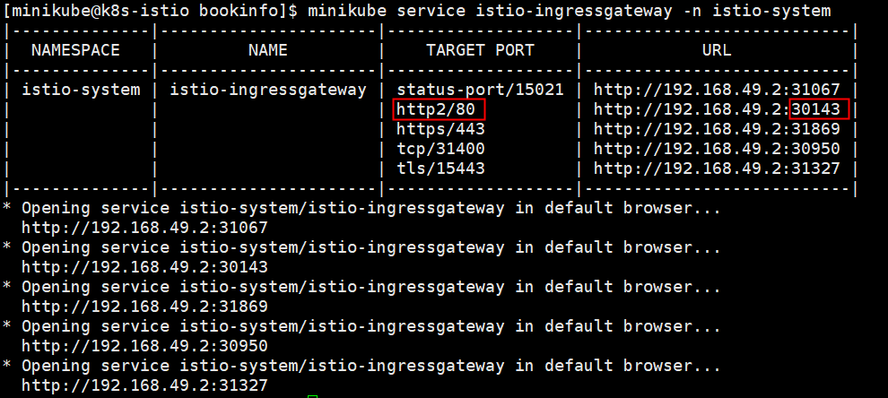

- root 账号登录服务器，修改 `proxy_pass` 为 http2 的服务地址

```bash
vim  /etc/nginx/nginx.conf
```


- 重启 nginx

```bash
systemctl restart nginx
```

#### 访问 productpage

[http://121.43.225.226/productpage](http://121.43.225.226/productpage)

## 可观测演练

### 指标 (Metrics)

部署 BookInfo 时，开启 Pod 自定义采集时，配置了 `measurement_name = "istio_prom"`。

登录「<<< custom_key.brand_name >>>」 - 「指标」，查看 istio_prom 指标集。


### 链路 (Traces)

#### RUM

通过用户访问监测模块，查看 UV、PV、会话数、访问的页面等信息。


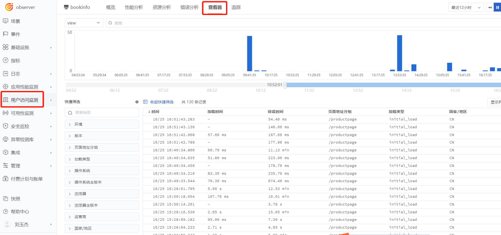

#### APM

通过应用性能监测，查看链路数据。


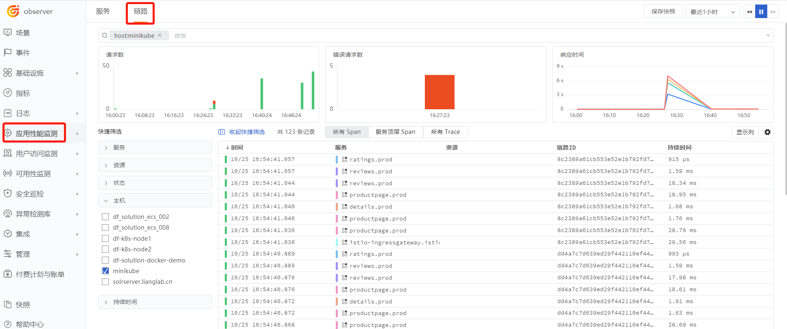

### 日志 (logs)

#### stdout

DataKit 默认采集输出到 `/dev/stdout` 的日志，如果需要使用更深层的功能，请参考<[容器日志采集](../../integrations/container.md)>。

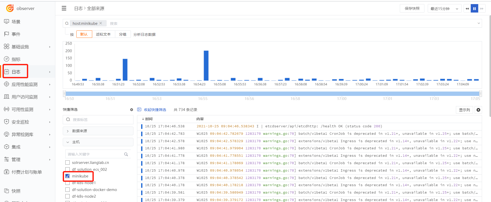

#### log 文件

本示例未涉及到日志文件的采集，如需要请参考<[Kubernetes 应用的 RUM-APM-LOG 联动分析](./k8s-rum-apm-log.md)>

### 链路超时分析

- 执行 `virtual-service-ratings-test-delay.yaml`

```bash
cd /usr/local/df-demo/bookinfo
kubectl apply -f virtual-service-ratings-test-delay.yaml
```

- 使用 jason 登录，密码为空，访问 productpage 界面

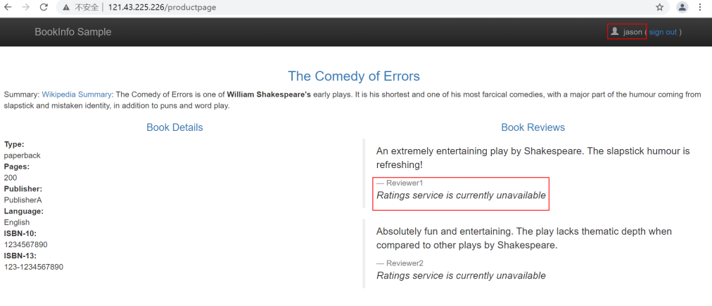

- 点击超时的链路，观测火焰图，找出超时调用。

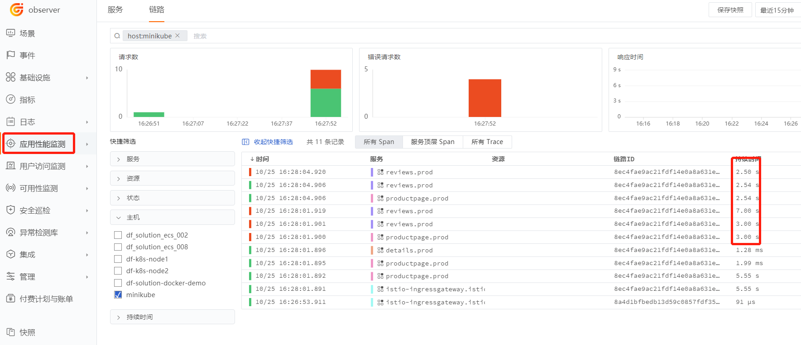

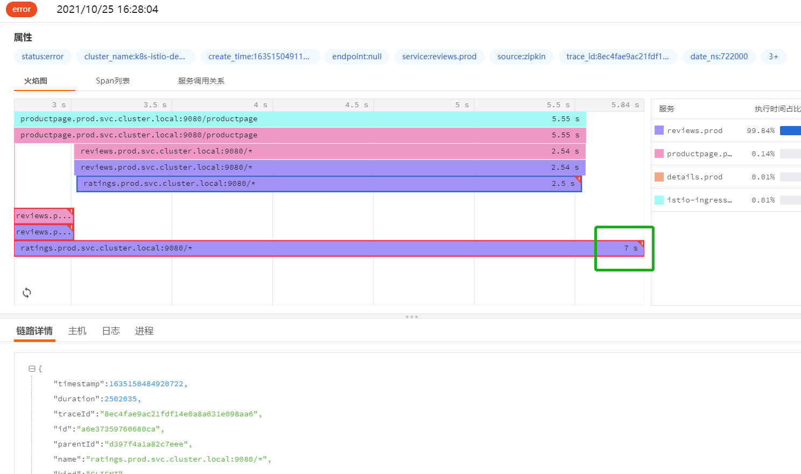
