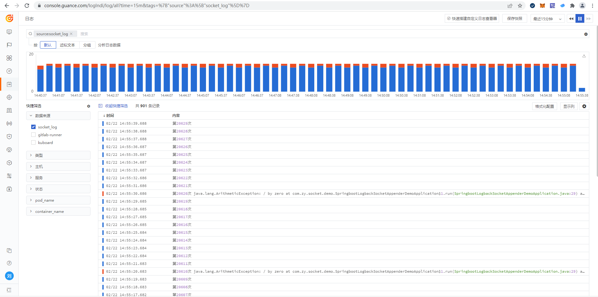

# K8s 日志采集之 Logback Socket 最佳实践

---

## 应用场景介绍

Logback 日志输出除了常用的 file 和 stdout 外，还可以进行 socket（TCP）输出，基于 socket 日志上报最大的优势在于降低了存储费用，程序生成的日志在本地进行一部分内存缓冲继而上报到采集端。

同样 DataKit 也支持 Socket 日志采集。本文主要介绍基于 K8s 下 Spring Boot 应用将日志通过 Logback Socket 方式推送至观测云平台进行观测。

## 前置条件

1. 需要先创建一个[观测云账号](https://www.guance.com/)
1. Spring Boot应用
1. docker-harbor
1. K8s 集群

## 安装部署

### K8s 下 Datakit 安装配置

Kubernetes 下 DataKit 安装参照文档 <[Kubernetes 应用的 RUM-APM-LOG 联动分析](./k8s-rum-apm-log.md)>。

#### 1 配置日志采集文件

接收日志，需要开启 log socket，开启一个 9541 端口，并配置 Pipeline 解析。

??? quote "`logging-socket-demo.conf`"

    ```toml
          [[inputs.logging]]
            ## required
            #  logfiles = [
            #    "/var/log/syslog",
            #    "/var/log/message",
            #  ]
              # only two protocols are supported:TCP and UDP
              sockets = [
                      "tcp://0.0.0.0:9541",
              #      "udp://0.0.0.0:9531",
              ]
              ## glob filteer
              ignore = [""]

              ## your logging source, if it's empty, use 'default'
              source = "socket_log"

              ## add service tag, if it's empty, use $source.
              service = "socket_service"

              ## grok pipeline script name
              pipeline = "logback_socket_pipeline.p"

              ## optional status:
              ##   "emerg","alert","critical","error","warning","info","debug","OK"
              ignore_status = []

              ## optional encodings:
              ##    "utf-8", "utf-16le", "utf-16le", "gbk", "gb18030" or ""
              character_encoding = ""

              ## The pattern should be a regexp. Note the use of '''this regexp'''
              ## regexp link: [https://golang.org/pkg/regexp/syntax/#hdr-Syntax](https://golang.org/pkg/regexp/syntax/#hdr-Syntax)
              # multiline_match = '''^\S'''

              ## removes ANSI escape codes from text strings
              remove_ansi_escape_codes = false

              [inputs.logging.tags]
                service = "socket-demo"
    ```

#### 2 Pipeline 解析日志

`logback_socket_pipeline.p` 用于解析 socket 日志格式，便于您在观测云平台查看使用。<br/>全文如下：

??? quote "`logback_socket_pipeline.p`"

    ```bash
            #------------------------------------   警告   -------------------------------------**
            # 不要修改本文件，如果要更新，请拷贝至其它文件，最好以某种前缀区分，避免重启后被覆盖**
            #-----------------------------------------------------------------------------------        **
            # access log**
            json(_,msg,"message")**
            json(_,class,"class")**
            json(_,appName,"service")**
            json(_,thread,"thread")**
            json(_,severity,"status")**
            json(_,trace,"trace_id")**
            json(_,span,"span_id")**
            json(_,`@timestamp`,"time")**
            default_time(time)**
    ```

#### 3 替换 token

需要将 `datakit.yaml` 中的 token 修改成您自己的 token，全文如下：

??? quote "`datakit.yaml`"

    ```yaml
    apiVersion: v1
    kind: Namespace
    metadata:
      name: datakit
    ---
    apiVersion: rbac.authorization.k8s.io/v1
    kind: ClusterRole
    metadata:
      name: datakit
    rules:
      - apiGroups:
          - rbac.authorization.k8s.io
        resources:
          - clusterroles
        verbs:
          - get
          - list
          - watch
      - apiGroups:
          - ""
        resources:
          - nodes
          - nodes/proxy
          - namespaces
          - pods
          - pods/log
          - events
          - services
          - endpoints
          - ingresses
        verbs:
          - get
          - list
          - watch
      - apiGroups:
          - apps
        resources:
          - deployments
          - daemonsets
          - statefulsets
          - replicasets
        verbs:
          - get
          - list
          - watch
      - apiGroups:
          - batch
        resources:
          - jobs
          - cronjobs
        verbs:
          - get
          - list
          - watch
      - apiGroups:
          - metrics.k8s.io
        resources:
          - pods
          - nodes
        verbs:
          - get
          - list
      - nonResourceURLs: ["/metrics"]
        verbs: ["get"]

    ---
    apiVersion: v1
    kind: ServiceAccount
    metadata:
      name: datakit
      namespace: datakit

    ---
    apiVersion: v1
    kind: Service
    metadata:
      name: datakit-service
      namespace: datakit
    spec:
      selector:
        app: daemonset-datakit
      ports:
        - protocol: TCP
          port: 9529
          targetPort: 9529

    ---
    apiVersion: rbac.authorization.k8s.io/v1
    kind: ClusterRoleBinding
    metadata:
      name: datakit
    roleRef:
      apiGroup: rbac.authorization.k8s.io
      kind: ClusterRole
      name: datakit
    subjects:
      - kind: ServiceAccount
        name: datakit
        namespace: datakit

    ---
    apiVersion: apps/v1
    kind: DaemonSet
    metadata:
      labels:
        app: daemonset-datakit
      name: datakit
      namespace: datakit
    spec:
      revisionHistoryLimit: 10
      selector:
        matchLabels:
          app: daemonset-datakit
      template:
        metadata:
          labels:
            app: daemonset-datakit
          annotations:
            datakit/logs: |
              [
                {
                  "disable": true
                }
              ]
        spec:
          hostNetwork: true
          dnsPolicy: ClusterFirstWithHostNet
          containers:
            - env:
                - name: HOST_IP
                  valueFrom:
                    fieldRef:
                      apiVersion: v1
                      fieldPath: status.hostIP
                - name: NODE_NAME
                  valueFrom:
                    fieldRef:
                      apiVersion: v1
                      fieldPath: spec.nodeName
                - name: ENV_DATAWAY
                  value: https://openway.guance.com?token=<you token>
                - name: ENV_GLOBAL_HOST_TAGS
                  value: host=__datakit_hostname,host_ip=__datakit_ip,cluster_name=k8s-dev
                - name: ENV_DEFAULT_ENABLED_INPUTS
                  value: cpu,disk,diskio,mem,swap,system,hostobject,net,host_processes,container,statsd,ddtrace
                - name: ENV_ENABLE_ELECTION
                  value: enable
                - name: ENV_HTTP_LISTEN
                  value: 0.0.0.0:9529
                - name: ENV_LOG_LEVEL
                  value: info
              image: pubrepo.jiagouyun.com/datakit/datakit:1.2.6
              imagePullPolicy: IfNotPresent
              name: datakit
              ports:
                - containerPort: 9529
                  hostPort: 9529
                  name: port
                  protocol: TCP
              securityContext:
                privileged: true
              volumeMounts:
                - mountPath: /var/run/docker.sock
                  name: docker-socket
                  readOnly: true
                - mountPath: /usr/local/datakit/conf.d/container/container.conf
                  name: datakit-conf
                  subPath: container.conf
                #- mountPath: /usr/local/datakit/conf.d/log/logging.conf
                #  name: datakit-conf
                #  subPath: logging.conf
                - mountPath: /usr/local/datakit/pipeline/demo_system.p
                  name: datakit-conf
                  subPath: log_demo_system.p
                - mountPath: /usr/local/datakit/conf.d/log/logging-socket-demo.conf
                  name: datakit-conf
                  subPath: logging-socket-demo.conf
                - mountPath: /usr/local/datakit/pipeline/logback_socket_pipeline.p
                  name: datakit-conf
                  subPath: logback_socket_pipeline.p
                - mountPath: /host/proc
                  name: proc
                  readOnly: true
                - mountPath: /host/dev
                  name: dev
                  readOnly: true
                - mountPath: /host/sys
                  name: sys
                  readOnly: true
                - mountPath: /rootfs
                  name: rootfs
                - mountPath: /sys/kernel/debug
                  name: debugfs
              workingDir: /usr/local/datakit
          hostIPC: true
          hostPID: true
          restartPolicy: Always
          serviceAccount: datakit
          serviceAccountName: datakit
          volumes:
            - configMap:
                name: datakit-conf
              name: datakit-conf
            - hostPath:
                path: /var/run/docker.sock
              name: docker-socket
            - hostPath:
                path: /proc
                type: ""
              name: proc
            - hostPath:
                path: /dev
                type: ""
              name: dev
            - hostPath:
                path: /sys
                type: ""
              name: sys
            - hostPath:
                path: /
                type: ""
              name: rootfs
            - hostPath:
                path: /sys/kernel/debug
                type: ""
              name: debugfs
      updateStrategy:
        rollingUpdate:
          maxUnavailable: 1
        type: RollingUpdate
    ---
    apiVersion: v1
    kind: ConfigMap
    metadata:
      name: datakit-conf
      namespace: datakit
    data:
      #### container
      container.conf: |-
        [inputs.container]
          docker_endpoint = "unix:///var/run/docker.sock"
          containerd_address = "/var/run/containerd/containerd.sock"

          enable_container_metric = true
          enable_k8s_metric = true
          enable_pod_metric = true

          ## Containers logs to include and exclude, default collect all containers. Globs accepted.
          container_include_log = []
          container_exclude_log = ["image:pubrepo.jiagouyun.com/datakit/logfwd*", "image:pubrepo.jiagouyun.com/datakit/datakit*"]

          exclude_pause_container = true

          ## Removes ANSI escape codes from text strings
          logging_remove_ansi_escape_codes = false

          kubernetes_url = "https://kubernetes.default:443"

          ## Authorization level:
          ##   bearer_token -> bearer_token_string -> TLS
          ## Use bearer token for authorization. ('bearer_token' takes priority)
          ## linux at:   /run/secrets/kubernetes.io/serviceaccount/token
          ## windows at: C:\var\run\secrets\kubernetes.io\serviceaccount\token
          bearer_token = "/run/secrets/kubernetes.io/serviceaccount/token"
          # bearer_token_string = "<your-token-string>"

          [inputs.container.tags]
            # some_tag = "some_value"
            # more_tag = "some_other_value"

      #### logging
      logging.conf: |-
        [[inputs.logging]]
          ## required
          logfiles = [
            "/rootfs/var/log/k8s/ruoyi-system/info.log",
            "/rootfs/var/log/k8s/ruoyi-system/error.log",
          ]

          ## glob filteer
          ignore = [""]

          ## your logging source, if it's empty, use 'default'
          source = "k8s-demo-system1"

          ## add service tag, if it's empty, use $source.
          service = "k8s-demo-system1"

          ## grok pipeline script path
          pipeline = "demo_system.p"

          ## optional status:
          ##   "emerg","alert","critical","error","warning","info","debug","OK"
          ignore_status = []

          ## optional encodings:
          ##    "utf-8", "utf-16le", "utf-16le", "gbk", "gb18030" or ""
          character_encoding = ""

          ## The pattern should be a regexp. Note the use of '''this regexp'''
          ## regexp link: https://golang.org/pkg/regexp/syntax/#hdr-Syntax
          multiline_match = '''^\d{4}-\d{2}-\d{2}'''

          [inputs.logging.tags]
          # some_tag = "some_value"
          # more_tag = "some_other_value"

      #### system-log
      log_demo_system.p: |-
        #日志样式
        #2021-06-25 14:27:51.952 [http-nio-9201-exec-7] INFO  c.r.s.c.SysUserController - [list,70] ruoyi-08-system 5430221015886118174 6503455222153372731 - 查询用户

        grok(_, "%{TIMESTAMP_ISO8601:time} %{NOTSPACE:thread_name} %{LOGLEVEL:status}%{SPACE}%{NOTSPACE:class_name} - \\[%{NOTSPACE:method_name},%{NUMBER:line}\\] - %{DATA:service_name} %{DATA:trace_id} %{DATA:span_id} - %{GREEDYDATA:msg}")

        default_time(time,"Asia/Shanghai")

      logback_socket_pipeline.p: |-
        #------------------------------------   警告   -------------------------------------
        # 不要修改本文件，如果要更新，请拷贝至其它文件，最好以某种前缀区分，避免重启后被覆盖
        #-----------------------------------------------------------------------------------
        # access log
        json(_,msg,"message")
        json(_,class,"class")
        json(_,appName,"service")
        json(_,thread,"thread")
        json(_,severity,"status")
        json(_,trace,"trace_id")
        json(_,span,"span_id")
        json(_,`@timestamp`,"time")
        default_time(time)

      logging-socket-demo.conf: |-
        [[inputs.logging]]
          ## required
        #  logfiles = [
        #    "/var/log/syslog",
        #    "/var/log/message",
        #  ]
          # only two protocols are supported:TCP and UDP
          sockets = [
                "tcp://0.0.0.0:9541",
          #      "udp://0.0.0.0:9531",
          ]
          ## glob filteer
          ignore = [""]

          ## your logging source, if it's empty, use 'default'
          source = "socket_log"

          ## add service tag, if it's empty, use $source.
          service = "socket_service"

          ## grok pipeline script name
          pipeline = "logback_socket_pipeline.p"

          ## optional status:
          ##   "emerg","alert","critical","error","warning","info","debug","OK"
          ignore_status = []

          ## optional encodings:
          ##    "utf-8", "utf-16le", "utf-16le", "gbk", "gb18030" or ""
          character_encoding = ""

          ## The pattern should be a regexp. Note the use of '''this regexp'''
          ## regexp link: https://golang.org/pkg/regexp/syntax/#hdr-Syntax
          # multiline_match = '''^\S'''

          ## removes ANSI escape codes from text strings
          remove_ansi_escape_codes = false

          [inputs.logging.tags]
            service = "sign"
    ```

#### 4 部署

```bash
 kubectl apply -f datakit.yaml
```

查看部署情况

```
 [root@master ~]# kubectl get pods -n datakit
 NAME            READY   STATUS    RESTARTS   AGE
 datakit-pf4sp   1/1     Running   0          22h
 datakit-tj9zq   1/1     Running   0          22h
```

### Spring Boot 应用

基于 Spring Boot 应用，操作步骤如下。

#### 1 新增 pom 依赖

```xml
<dependency>
   <groupId>net.logstash.logback</groupId>
   <artifactId>logstash-logback-encoder</artifactId>
   <version>4.9</version>
</dependency>
```

#### 2 logback socket 配置

??? quote "logback socket 配置"

    ```xml
    <!-- 对日志进行了json序列化处理，dk支持文本格式的日志，可以通过socket直接推送过去-->
        <appender name="socket" class="net.logstash.logback.appender.LogstashTcpSocketAppender">
            <!-- datakit host: logsocket_port -->
            <destination>${dkSocketHost}:${dkSocketPort}</destination>
            <!-- 日志输出编码 -->
            <encoder class="net.logstash.logback.encoder.LoggingEventCompositeJsonEncoder">
                <providers>
                    <timestamp>
                        <timeZone>UTC+8</timeZone>
                    </timestamp>
                    <pattern>
                            <pattern>
                                {
                                "severity": "%level",
                                "appName": "${logName:-}",
                                "trace": "%X{dd.trace_id:-}",
                                "span": "%X{dd.span_id:-}",
                                "pid": "${PID:-}",
                                "thread": "%thread",
                                "class": "%logger{40}",
                                "msg": "%message\n%exception"
                                }
                            </pattern>
                    </pattern>
                </providers>
            </encoder>
        </appender>

    <root level="info">
        <!-- socket appender -->
        <appender-ref ref="socket" />
    </root>
    ```

#### 3 logback-spring.xml

全文如下：（**注意：可以根据实际应用情况进行调整。**）

??? quote "`logback-spring.xml`"

    ```xml
    <?xml version="1.0" encoding="UTF-8"?>
    <configuration scan="true" scanPeriod="30 seconds">
        <!-- 部分参数需要来源于properties文件 -->
        <springProperty scope="context" name="logName" source="spring.application.name" defaultValue="localhost.log"/>
        <springProperty scope="context" name="dkSocketHost" source="datakit.socket.host" />
        <springProperty scope="context" name="dkSocketPort" source="datakit.socket.port" />
        <!-- 配置后可以动态修改日志级别-->
        <jmxConfigurator />
        <property name="log.pattern" value="%d{yyyy-MM-dd HH:mm:ss.SSS} [%thread] %-5level %logger{20} - [%method,%line] %X{dd.service} %X{dd.trace_id} %X{dd.span_id} - %msg%n" />

        <!-- %m输出的信息,%p日志级别,%t线程名,%d日期,%c类的全名,,,, -->
        <appender name="STDOUT" class="ch.qos.logback.core.ConsoleAppender">
            <encoder>
                <pattern>${log.pattern}</pattern>
                <charset>UTF-8</charset>
            </encoder>
        </appender>

        <appender name="FILE" class="ch.qos.logback.core.rolling.RollingFileAppender">
            <file>logs/${logName}/${logName}.log</file>    <!-- 使用方法 -->
            <append>true</append>
            <rollingPolicy class="ch.qos.logback.core.rolling.SizeAndTimeBasedRollingPolicy">
                <fileNamePattern>logs/${logName}/${logName}-%d{yyyy-MM-dd}.log.%i</fileNamePattern>
                <maxFileSize>64MB</maxFileSize>
                <maxHistory>30</maxHistory>
                <totalSizeCap>1GB</totalSizeCap>
            </rollingPolicy>
            <encoder>
                <pattern>${log.pattern}</pattern>
                <charset>UTF-8</charset>
            </encoder>
        </appender>

        <!-- 对日志进行了json序列化处理，dk支持文本格式的日志，可以通过socket直接推送过去-->
        <appender name="socket" class="net.logstash.logback.appender.LogstashTcpSocketAppender">
            <!-- datakit host: logsocket_port -->
            <destination>${dkSocketHost}:${dkSocketPort}</destination>
            <!-- 日志输出编码 -->
            <encoder class="net.logstash.logback.encoder.LoggingEventCompositeJsonEncoder">
                <providers>
                    <timestamp>
                        <timeZone>UTC+8</timeZone>
                    </timestamp>
                    <pattern>
                            <pattern>
                                {
                                "severity": "%level",
                                "appName": "${logName:-}",
                                "trace": "%X{dd.trace_id:-}",
                                "span": "%X{dd.span_id:-}",
                                "pid": "${PID:-}",
                                "thread": "%thread",
                                "class": "%logger{40}",
                                "msg": "%message\n%exception"
                                }
                            </pattern>
                    </pattern>
                </providers>
            </encoder>
        </appender>


        <!-- 只打印error级别的内容 -->
        <logger name="com.netflix" level="ERROR" />
        <logger name="net.sf.json" level="ERROR" />
        <logger name="org.springframework" level="ERROR" />
        <logger name="springfox" level="ERROR" />

        <!-- sql 打印 配置-->
        <logger name="com.github.pagehelper.mapper" level="DEBUG" />
        <logger name="org.apache.ibatis" level="DEBUG" />

        <root level="info">
            <appender-ref ref="STDOUT" />
            <appender-ref ref="FILE" />
            <appender-ref ref="socket" />
        </root>
    </configuration>
    ```


#### 4 application.properties

```bash
datakit.socket.host=192.168.11.12
datakit.socket.port=9542
server.port=8080
spring.application.name=socket-demo
```

#### 5 Dockfile

```bash
FROM openjdk:8u292
RUN /bin/cp /usr/share/zoneinfo/Asia/Shanghai /etc/localtime
RUN echo 'Asia/Shanghai' >/etc/timezone

ENV jar springboot-logback-socket-appender-demo.jar
ENV workdir /data/app/
RUN mkdir -p ${workdir}
COPY ${jar} ${workdir}
WORKDIR ${workdir}

ENTRYPOINT ["sh", "-ec", "exec java ${JAVA_OPTS}   -jar ${jar} ${PARAMS}  2>&1 > /dev/null"]
```

#### 6 Docker 镜像发布

将 jar copy 到当前目录，打包镜像

```bash
docker build -t registry.cn-shenzhen.aliyuncs.com/lr_715377484/springboot-logback-socket-appender-demo:v1 .
```

推送到 `docker-hub`，这里的示例推送到了阿里云 hub 仓库。

```bash
docker push registry.cn-shenzhen.aliyuncs.com/lr_715377484/springboot-logback-socket-appender-demo:v1
```

#### 7 部署

1、 编写 `springboot-logback-socket-appender-demo-deployment.yaml`文件，需要修改参数：

- DATAKIT_SOCKET_PORT：datakit 日志 socket 端口。
- dd-java-agent 为 datadog 的 Java-agent，用于 trace，如果不需要的话，可以移除相关配置。

全文内容如下：

??? quote "`springboot-logback-socket-appender-demo-deployment.yaml`"

    ```yaml
    apiVersion: v1
    kind: Service
    metadata:
      name: logback-socket-service
      labels:
        app: logback-socket-service
    spec:
      selector:
        app: logback-socket-service
      ports:
        - protocol: TCP
          port: 8080
          nodePort: 32100
          targetPort: 8080
      type: NodePort
    ---
    apiVersion: apps/v1
    kind: Deployment
    metadata:
      name: logback-socket-service
      labels:
        app: logback-socket-service
    spec:
      replicas: 1
      selector:
        matchLabels:
          app: logback-socket-service
      template:
        metadata:
          labels:
            app: logback-socket-service
        spec:
          nodeName: master
          containers:
            - env:
                - name: POD_NAME
                  valueFrom:
                    fieldRef:
                      fieldPath: metadata.name
                - name: DATAKIT_SOCKET_PORT
                  value: "9541"
                - name: JAVA_OPTS
                  value: |-
                    -javaagent:/usr/dd-java-agent/agent/dd-java-agent.jar -Ddd.service.name=demo-k8s-logback-socket  -Ddd.tags=container_host:$(PODE_NAME) -Ddd.service.mapping=mysql:mysql-k8s,redis:redisk8s -Ddd.env=dev -Ddd.agent.port=9529
                - name: PARAMS
                  value: "--datakit.socket.host=$(DD_AGENT_HOST) --datakit.socket.port=$(DATAKIT_SOCKET_PORT)"
                - name: DD_AGENT_HOST
                  valueFrom:
                    fieldRef:
                      apiVersion: v1
                      fieldPath: status.hostIP
              name: logback-socket-service
              image: registry.cn-shenzhen.aliyuncs.com/lr_715377484/springboot-logback-socket-appender-demo:v1
              #command: ["sh","-c"]
              ports:
                - containerPort: 8080
                  protocol: TCP
              volumeMounts:
                - name: ddagent
                  mountPath: /usr/dd-java-agent/agent
              resources:
                limits:
                  memory: 512Mi
                requests:
                  memory: 256Mi
          initContainers:
            - command:
              - sh
              - -c
              - set -ex;mkdir -p /ddtrace/agent;cp -r /datadog-init/* /ddtrace/agent;
              image: pubrepo.jiagouyun.com/datakit-operator/dd-lib-java-init
              imagePullPolicy: Always
              name: ddtrace-agent-sidecar
              volumeMounts:
                - mountPath: /ddtrace/agent
                  name: ddagent
          restartPolicy: Always
          volumes:
            - name: ddagent
              emptyDir: {}
    ```

2、 发布应用

```bash
kubectl apply -f springboot-logback-socket-appender-demo-deployment.yaml
```

3、 查看应用状态

```bash
[root@master logback-socket]# kubectl get pods  -l app=logback-socket-service
NAME                                      READY   STATUS    RESTARTS   AGE
logback-socket-service-74bd778fcf-cqcn9   1/1     Running   0          5h41m
```

## 观测云查看日志

日志查看器



日志明细


## 相关最佳实践

<[Kubernetes 应用的 RUM-APM-LOG 联动分析](./k8s-rum-apm-log.md)>

<[观测云日志采集分析最佳实践](./logs.md)>

<[Pod 日志采集最佳实践](./pod-log.md)>
