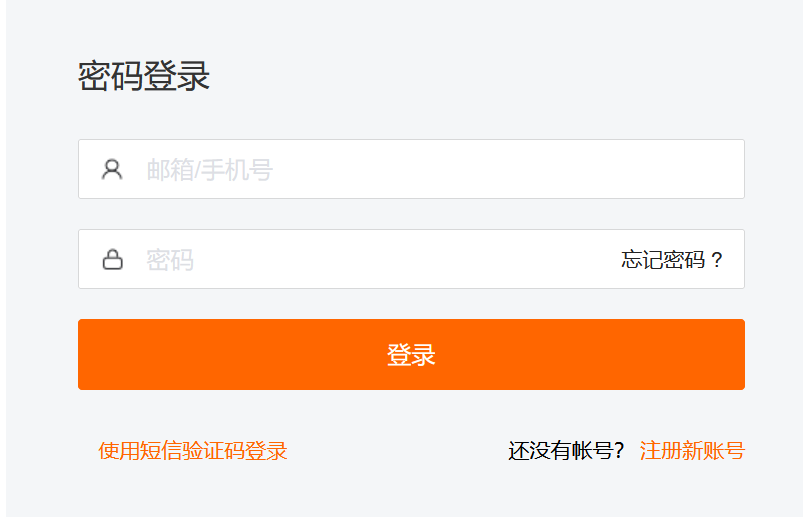

# Kubernetes 应用的 RUM-APM-LOG 联动分析

---

## 应用场景介绍

企业最重要的营收来源即是业务，而当下，绝大多数企业的业务都是由对应的 IT 系统承载的。那如何保障企业的业务稳健，归根到企业内部就是如何保障企业内部的 IT 系统。当业务系统出现异常或故障时，往往是业务、应用开发、运维等多方面同事一起协调进行问题的排查，存在**跨平台、跨部门、跨专业领域**等多种问题，排查**既耗时、又费力**。

为了解决这一问题，目前业界已经有比较成熟的方式，即是通过 **RUM + APM + LOG** 实现对整个业务系统的**前后端、日志**进行统一监控，同时将三方数据通过关键字段进行打通，实现**联动分析**，从而提升相关工作人员的工作效率，保障系统平稳运行。

- APM ： Application Performance Monitoring 应用性能监控
- RUM ： Real User Moitoring 真实用户体验监控
- LOG ： 日志

本文将从如何接入这三方监控，以及如何利用观测云进行联动分析的角度进行阐述。用于演示的 Demo 为若依权限管理系统，具体内容可查看 <[从 0 到 1 利用观测云构建 Spring cloud 服务的可观测性](../monitoring/spring-cloud-sample.md)>。

关于日志，本文将使用 DataKit 的 Logfwd 采集器采集业务 Pod 的日志，DataKit 开通 Logfwd 采集器，Pod 增加 lLgfwd 的 Sidecar 来采集业务容器的日志，推送给 DataKit。由于业务对 Sidecar 是可见的，所以日志文件不需要落到宿主机上，详细使用请在下方的 [部署 System](#system) 模块查看。DataKit 接收到日志后，使用配置的 Pipeline 做日志文件切割。

## 前置条件

### 账号注册

前往 [观测云](https://console.guance.com/) 注册账号，使用已注册的账号/密码登录。



---

### DaemonSet 方式部署 DataKit

#### 获取 OpenWay 地址的 token

点击 「管理」 - 「基本设置」，复制下图中的 token 。


点击 「集成」 - 「DataKit」 - 「Kubernetes」，获取最新的 `datakit.yaml` 文件。


#### 执行安装

- 按照上步中的 `datakit.yaml` 文件，并把上图获取的 token，替换文件中的 `your-token`。
- 开启 container 采集器、logfwd 采集器、ddtrace 采集器，即在 DataKit 容器中挂载 `container.conf`、`logfwdserver.conf` 、`ddtrace.conf` 文件。

> **注意:** DataKit 版本不同，配置可能存在差异，请以最新版为准。此 yaml 是本次部署完整配置，已包含后面针对 DataKit 的操作步骤。

??? quote "yaml 完整内容"

    ```yaml
    apiVersion: v1
    kind: Namespace
    metadata:
      name: datakit
    ---
    apiVersion: rbac.authorization.k8s.io/v1
    kind: ClusterRole
    metadata:
      name: datakit
    rules:
      - apiGroups:
          - rbac.authorization.k8s.io
        resources:
          - clusterroles
        verbs:
          - get
          - list
          - watch
      - apiGroups:
          - ""
        resources:
          - nodes
          - nodes/proxy
          - namespaces
          - pods
          - pods/log
          - events
          - services
          - endpoints
        verbs:
          - get
          - list
          - watch
      - apiGroups:
          - apps
        resources:
          - deployments
          - daemonsets
          - statefulsets
          - replicasets
        verbs:
          - get
          - list
          - watch
      - apiGroups:
          - batch
        resources:
          - jobs
          - cronjobs
        verbs:
          - get
          - list
          - watch
      - apiGroups:
          - guance.com
        resources:
          - datakits
        verbs:
          - get
          - list
      - apiGroups:
          - metrics.k8s.io
        resources:
          - pods
          - nodes
        verbs:
          - get
          - list
      - nonResourceURLs: ["/metrics"]
        verbs: ["get"]

    ---
    apiVersion: v1
    kind: ServiceAccount
    metadata:
      name: datakit
      namespace: datakit

    ---
    apiVersion: v1
    kind: Service
    metadata:
      name: datakit-service
      namespace: datakit
    spec:
      selector:
        app: daemonset-datakit
      ports:
        - protocol: TCP
          port: 9529
          targetPort: 9529

    ---
    apiVersion: rbac.authorization.k8s.io/v1
    kind: ClusterRoleBinding
    metadata:
      name: datakit
    roleRef:
      apiGroup: rbac.authorization.k8s.io
      kind: ClusterRole
      name: datakit
    subjects:
      - kind: ServiceAccount
        name: datakit
        namespace: datakit

    ---
    apiVersion: apps/v1
    kind: DaemonSet
    metadata:
      labels:
        app: daemonset-datakit
      name: datakit
      namespace: datakit
    spec:
      revisionHistoryLimit: 10
      selector:
        matchLabels:
          app: daemonset-datakit
      template:
        metadata:
          labels:
            app: daemonset-datakit
        spec:
          hostNetwork: true
          dnsPolicy: ClusterFirstWithHostNet
          containers:
          - env:
            - name: HOST_IP
              valueFrom:
                fieldRef:
                  apiVersion: v1
                  fieldPath: status.hostIP
            - name: ENV_K8S_NODE_NAME
              valueFrom:
                fieldRef:
                  apiVersion: v1
                  fieldPath: spec.nodeName
            - name: ENV_DATAWAY
              value: https://openway.guance.com?token=XXXXXX
            - name: ENV_GLOBAL_HOST_TAGS # 非选举类的tag
              value: host=__datakit_hostname,host_ip=__datakit_ip,cluster_name_k8s=k8s-prod
            - name: ENV_DEFAULT_ENABLED_INPUTS
              value: cpu,disk,diskio,mem,swap,system,hostobject,net,host_processes,container,statsd,ebpf,rum
            - name: ENV_ENABLE_ELECTION
              value: enable
            - name: ENV_GLOBAL_ENV_TAGS # 只对选举类的tag有用
              value: cluster_name_k8s=k8s-prod
            - name: ENV_HTTP_LISTEN
              value: 0.0.0.0:9529
            - name: ENV_NAMESPACE # 选举用的
              value: guance-k8s-demo
            #- name: ENV_LOG_LEVEL
            #  value: debug
            #- name: ENV_K8S_CLUSTER_NAME
            #  value: k8s-prod
            image: pubrepo.jiagouyun.com/datakit/datakit:1.4.10
            imagePullPolicy: Always
            name: datakit
            ports:
            - containerPort: 9529
              hostPort: 9529
              name: port
              protocol: TCP
            securityContext:
              privileged: true
            volumeMounts:
            - mountPath: /var/run
              name: run
            - mountPath: /var/lib
              name: lib
            - mountPath: /var/log
              name: log
            #- mountPath: /var/run/containerd/containerd.sock
            #  name: containerd-socket
            #  readOnly: true
            - mountPath: /usr/local/datakit/conf.d/container/container.conf
              name: datakit-conf
              subPath: container.conf
            - mountPath: /usr/local/datakit/conf.d/log/logfwdserver.conf
              name: datakit-conf
              subPath: logfwdserver.conf
            - mountPath: /usr/local/datakit/conf.d/ddtrace/ddtrace.conf
              name: datakit-conf
              subPath: ddtrace.conf
            - mountPath: /host/proc
              name: proc
              readOnly: true
            - mountPath: /host/dev
              name: dev
              readOnly: true
            - mountPath: /host/sys
              name: sys
              readOnly: true
            - mountPath: /rootfs
              name: rootfs
            - mountPath: /sys/kernel/debug
              name: debugfs

            workingDir: /usr/local/datakit
          hostIPC: true
          hostPID: true
          restartPolicy: Always
          serviceAccount: datakit
          serviceAccountName: datakit
          tolerations:
            - operator: Exists
          volumes:
            - configMap:
                name: datakit-conf
              name: datakit-conf
            - hostPath:
                path: /var/run
              name: run
            - hostPath:
                path: /var/lib
              name: lib
            - hostPath:
                path: /var/log
              name: log

            - hostPath:
                path: /proc
                type: ""
              name: proc
            - hostPath:
                path: /dev
                type: ""
              name: dev
            - hostPath:
                path: /sys
                type: ""
              name: sys
            - hostPath:
                path: /
                type: ""
              name: rootfs
            - hostPath:
                path: /sys/kernel/debug
                type: ""
              name: debugfs
      updateStrategy:
        rollingUpdate:
          maxUnavailable: 1
        type: RollingUpdate
    ---
    apiVersion: v1
    kind: ConfigMap
    metadata:
      name: datakit-conf
      namespace: datakit
    data:
      #### container
      container.conf: |-
        [inputs.container]
          docker_endpoint = "unix:///var/run/docker.sock"
          containerd_address = "/var/run/containerd/containerd.sock"

          enable_container_metric = true
          enable_k8s_metric = true
          enable_pod_metric = true

          ## Containers logs to include and exclude, default collect all containers. Globs accepted.
          container_include_log = []
          container_exclude_log = ["image:*"]
          #container_exclude_log = ["image:pubrepo.jiagouyun.com/datakit/logfwd*", "image:pubrepo.jiagouyun.com/datakit/datakit*"]

          exclude_pause_container = true

          ## Removes ANSI escape codes from text strings
          logging_remove_ansi_escape_codes = false

          kubernetes_url = "https://kubernetes.default:443"

          ## Authorization level:
          ##   bearer_token -> bearer_token_string -> TLS
          ## Use bearer token for authorization. ('bearer_token' takes priority)
          ## linux at:   /run/secrets/kubernetes.io/serviceaccount/token
          ## windows at: C:\var\run\secrets\kubernetes.io\serviceaccount\token
          bearer_token = "/run/secrets/kubernetes.io/serviceaccount/token"
          # bearer_token_string = "<your-token-string>"

          [inputs.container.tags]
            # some_tag = "some_value"
            # more_tag = "some_other_value"

      #### ddtrace
      ddtrace.conf: |-
        [[inputs.ddtrace]]
          endpoints = ["/v0.3/traces", "/v0.4/traces", "/v0.5/traces"]
          # ignore_resources = []
          customer_tags = ["node_ip"]
          [inputs.ddtrace.close_resource]
            "*" = ["PUT /nacos/*","GET /nacos/*","POST /nacos/*"]
          ## tags is ddtrace configed key value pairs
          # [inputs.ddtrace.tags]
            # some_tag = "some_value"
            # more_tag = "some_other_value"

      #### logfwdserver
      logfwdserver.conf: |-
        [inputs.logfwdserver]
          ## logfwd 接收端监听地址和端口
          address = "0.0.0.0:9531"

          [inputs.logfwdserver.tags]
          # some_tag = "some_value"
          # more_tag = "some_other_value"
    ```

不同的 Kubernetes 集群，为区分集群内 DaemonSet 部署的 DataKit 选举，需要增加 `ENV_NAMESPACE` 环境变量，同一个 token 下值不能重复。

同一个 token 下为区分不同的 Kubernetes 集群，需要增加全局 tag，值是 `cluster_name_k8s=k8s-prod` 。

> 详情请参考 <[多个 Kubernetes 集群指标采集最佳实践](multi-cluster.md)>

执行命令

```shell
$ cd /usr/local/k8s/
$ kubectl apply -f  datakit.yaml
$ kubectl get pod -n datakit
```


DataKit 安装完成后，已经默认开启 Linux 主机常用插件，可以在「观测云」 - 「场景」 - 「基础设施 Linux 主机监控视图」查看。

| 采集器名称   | 说明                                           |
| ------------ | ---------------------------------------------- |
| cpu          | 采集主机的 CPU 使用情况                        |
| disk         | 采集磁盘占用情况                               |
| diskio       | 采集主机的磁盘 IO 情况                         |
| mem          | 采集主机的内存使用情况                         |
| swap         | 采集 Swap 内存使用情况                         |
| system       | 采集主机操作系统负载                           |
| net          | 采集主机网络流量情况                           |
| host_process | 采集主机上常驻（存活 10min 以上）进程列表      |
| hostobject   | 采集主机基础信息（如操作系统信息、硬件信息等） |
| kubernetes   | 采集 Kubernetes 集群指标                       |
| container    | 采集主机上可能的容器对象以及容器日志           |

点击「基础设施」模块，查看所有已安装 DataKit 的主机列表。


点击「主机名」， 可以查看该主机的详细系统信息，集成运行情况 (该主机所有已安装的插件)。


### 部署应用示例

#### 示例说明

Web 层通过网关访问后端的 Auth 和 System 服务，Web 是 Vue 开发的，后端是 Java 开发的。<br />
示例中开启 Statsd 采集 JVM，示例中使用的镜像仓库是 `172.16.0.215:5000`，示例中使用 ddtrace 采集 Java 应用的 JVM 指标，示例中使用的 Nacos、Redis、MySQL 的内网 IP 是 `172.16.0.230`。


#### 编写 Web 部署文件

把 Web 应用的内容复制到 `/usr/local/k8s/dist` 目录。


新建 `/usr/local/k8s/DockerfileWeb` 文件。

```shell
$ vim /usr/local/k8s/DockerfileWeb
```

内容如下：

```
FROM nginx:1.21.0
RUN /bin/cp /usr/share/zoneinfo/Asia/Shanghai /etc/localtime
RUN echo 'Asia/Shanghai' >/etc/timezone

COPY nginx.conf /etc/nginx/nginx.conf
RUN mkdir -p /data/nginx/web/dist/
COPY ./dist/ /data/nginx/web/dist/
WORKDIR /etc/nginx
CMD ["nginx","-g","daemon off;"]
EXPOSE 80
EXPOSE 443
```

新建 `/usr/local/k8s/nginx.conf` ，内容如下：

??? quote "`/usr/local/k8s/nginx.conf`"

    ```toml
    events {
        worker_connections  1024;
    }

    http {
        include       mime.types;
        default_type  application/octet-stream;

        sendfile        on;
        #tcp_nopush     on;

        client_max_body_size  50m;
        #keepalive_timeout  0;
        keepalive_timeout  65;
        #gzip  on;
        server {
            listen       80;
            server_name  localhost;

            location / {
                root  /data/nginx/web/dist;
                index  index.html index.htm;
                try_files $uri $uri/ /index.html;
            }

                location /prod-api/{
                proxy_set_header Host $http_host;
                proxy_set_header X-Real-IP $remote_addr;
                proxy_set_header REMOTE-HOST $remote_addr;
                proxy_set_header X-Forwarded-For $proxy_add_x_forwarded_for;
                proxy_pass http://172.16.0.229:30001/;
            }

            location /nginx_status{
                stub_status;
            }

            #error_page  404              /404.html;

            # redirect server error pages to the static page /50x.html
            #
            error_page   500 502 503 504  /50x.html;
            location = /50x.html {
                root   html;
            }
        }
    }
    ```

新建 `/usr/local/k8s/web-deployment.yaml` ，文件内容如下：

??? quote "`/usr/local/k8s/web-deployment.yaml`"

    ```yaml
    apiVersion: v1
    kind: Service
    metadata:
      name: web-service
      labels:
        app: web-service
    spec:
      selector:
        app: web-service
      ports:
        - protocol: TCP
          port: 80
          nodePort: 30000
          targetPort: 80
      type: NodePort
    ---
    apiVersion: apps/v1
    kind: Deployment
    metadata:
      name: web-service
      labels:
        app: web-service
    spec:
      replicas: 1
      selector:
        matchLabels:
          app: web-service
      template:
        metadata:
          labels:
            app: web-service
        spec:
          containers:
          - env:
            - name: POD_NAME
              valueFrom:
                fieldRef:
                  fieldPath: metadata.name

            name: web-service
            image: 47.96.6.150:5000/df-demo/demo-web:v1
            #command: ["sh","-c"]
            ports:
            - containerPort: 80
              protocol: TCP
    ```

#### dd-java-agent 镜像

使用 `java -jar` 方式启动用户的 jar 时，需要使用 `-javaagent:/usr/local/datakit/data/dd-java-agent.jar` 。而在用户的镜像中并不一定存在这个 jar，为了不侵入客户的业务镜像，我们需要制作一个包含 `dd-java-agent.jar` 的镜像，再以 Init 容器的方式先于业务容器启动，以共享存储的方式提供 `dd-java-agent.jar` 。

观测云已提供这个镜像。

```
pubrepo.jiagouyun.com/datakit-operator/dd-lib-java-init
```

本示例使用的是 Sidecar 的方式，如果您想直接把 jar 打入镜像，请下载 [dd-java-agent](https://github.com/GuanceCloud/dd-trace-java)，并在您的 Dockerfile 中参考下面的脚本把 jar 打入中镜像中，在部署的 yaml 中 -javaagent 使用的 jar 改成您打入的即可。

```
FROM openjdk:8u292

ENV workdir /data/app/
RUN mkdir -p ${workdir}

COPY  dd-java-agent.jar ${workdir}  #此处是把 dd-java-agent 打入镜像
```

#### 编写 Gateway 部署文件

新建 `/usr/local/k8s/DockerfileGateway`

```bash
$ vim /usr/local/k8s/DockerfileGateway
```

文件内容如下：

```
FROM openjdk:8u292
RUN /bin/cp /usr/share/zoneinfo/Asia/Shanghai /etc/localtime
RUN echo 'Asia/Shanghai' >/etc/timezone
ENV jar demo-gateway.jar
ENV workdir /data/app/
RUN mkdir -p ${workdir}
COPY ${jar} ${workdir}
WORKDIR ${workdir}
ENTRYPOINT ["sh", "-ec", "exec java ${JAVA_OPTS} -jar ${jar} ${PARAMS} 2>&1 > /dev/null"]
```

新建 `/usr/local/k8s/gateway-deployment.yaml` ，文件内容如下：

??? quote "`/usr/local/k8s/gateway-deployment.yaml`"

    ```yaml
    apiVersion: v1
    kind: Service
    metadata:
      name: gateway-service
      labels:
        app: gateway-service
    spec:
      selector:
        app: gateway-service
      ports:
        - protocol: TCP
          port: 9299
          nodePort: 30001
          targetPort: 9299
      type: NodePort
    ---
    apiVersion: apps/v1
    kind: Deployment
    metadata:
      name: gateway-service
      labels:
        app: gateway-service
    spec:
      replicas: 2
      selector:
        matchLabels:
          app: gateway-service
      template:
        metadata:
          labels:
            app: gateway-service
        spec:
          containers:
          - env:
            - name: DD_AGENT_HOST
              valueFrom:
                fieldRef:
                  apiVersion: v1
                  fieldPath: status.hostIP
            - name: POD_NAME
              valueFrom:
                fieldRef:
                  fieldPath: metadata.name
            - name: NACOS_IP
              value: "172.16.0.230"
            - name: JAVA_OPTS
              value: |-
                -javaagent:/usr/dd-java-agent/agent/dd-java-agent.jar -Ddd.service.name=demo-k8s-gateway  -Ddd.tags=container_host:$(POD_NAME),node_ip:$(DD_AGENT_HOST) -Ddd.service.mapping=redis:redisk8s -Ddd.env=dev -Ddd.agent.port=9529
            - name: PARAMS
              value: "--spring.redis.host=$(NACOS_IP) --spring.nacos.ip=$(NACOS_IP)"
            name: gateway-service
            image: 47.96.6.150:5000/df-demo/demo-gateway:v1
            #command: ["sh","-c"]
            ports:
            - containerPort: 9299
              protocol: TCP
            volumeMounts:
            - mountPath: /usr/dd-java-agent/agent
              name: ddagent
          initContainers:
          - command:
            - sh
            - -c
            - set -ex;mkdir -p /ddtrace/agent;cp -r /datadog-init/* /ddtrace/agent;
            image: pubrepo.jiagouyun.com/datakit-operator/dd-lib-java-init
            imagePullPolicy: Always
            name: ddtrace-agent-sidecar
            volumeMounts:
            - mountPath: /ddtrace/agent
              name: ddagent
          restartPolicy: Always
          volumes:
          - emptyDir: {}
            name: ddagent
    ```

#### 编写 Auth 部署文件

新建 `/usr/local/k8s/DockerfileAuth`

```shell
$ vim  /usr/local/k8s/DockerfileAuth
```

文件内容如下：

```
FROM openjdk:8u292
RUN /bin/cp /usr/share/zoneinfo/Asia/Shanghai /etc/localtime
RUN echo 'Asia/Shanghai' >/etc/timezone
ENV jar demo-auth.jar
ENV workdir /data/app/
RUN mkdir -p ${workdir}
COPY ${jar} ${workdir}
WORKDIR ${workdir}
ENTRYPOINT ["sh", "-ec", "exec java ${JAVA_OPTS} -jar ${jar} ${PARAMS} 2>&1 > /dev/null"]
```

新建 `/usr/local/k8s/auth-deployment.yaml` ，文件内容如下：

??? quote "`/usr/local/k8s/auth-deployment.yaml`"

    ```yaml
    apiVersion: v1
    kind: Service
    metadata:
      name: auth-service
      labels:
        app: auth-service
    spec:
      selector:
        app: auth-service
      ports:
        - protocol: TCP
          port: 9200
          targetPort: 9200
      type: NodePort
    ---
    apiVersion: apps/v1
    kind: Deployment
    metadata:
      name: auth-service
      labels:
        app: auth-service
    spec:
      replicas: 2
      selector:
        matchLabels:
          app: auth-service
      template:
        metadata:
          labels:
            app: auth-service
        spec:
          containers:
          - env:
            - name: DD_AGENT_HOST
              valueFrom:
                fieldRef:
                  apiVersion: v1
                  fieldPath: status.hostIP
            - name: POD_NAME
              valueFrom:
                fieldRef:
                  fieldPath: metadata.name
            - name: NACOS_IP
              value: "172.16.0.230"
            - name: JAVA_OPTS
              value: |-
                -javaagent:/usr/dd-java-agent/agent/dd-java-agent.jar -Ddd.service.name=demo-k8s-auth  -Ddd.tags=container_host:$(POD_NAME),node_ip:$(DD_AGENT_HOST) -Ddd.service.mapping=redis:redisk8s -Ddd.env=dev -Ddd.agent.port=9529 
            - name: PARAMS
              value: "--spring.redis.host=$(NACOS_IP) --spring.nacos.ip=$(NACOS_IP)"
            name: auth-service
            image: 47.96.6.150:5000/df-demo/demo-auth:v1
            #command: ["sh","-c"]
            ports:
            - containerPort: 9200
              protocol: TCP
            volumeMounts:
            - mountPath: /usr/dd-java-agent/agent
              name: ddagent
          initContainers:
          - command:
            - sh
            - -c
            - set -ex;mkdir -p /ddtrace/agent;cp -r /datadog-init/* /ddtrace/agent;
            image: pubrepo.jiagouyun.com/datakit-operator/dd-lib-java-init
            imagePullPolicy: Always
            name: ddtrace-agent-sidecar
            volumeMounts:
            - mountPath: /ddtrace/agent
              name: ddagent
          restartPolicy: Always
          volumes:
          - emptyDir: {}
            name: ddagent
    ```

#### 编写 System 部署文件

新建 `/usr/local/k8s/DockerfileSystem`

```shell
$ vim /usr/local/k8s/DockerfileSystem
```

文件内容如下：

```
FROM openjdk:8u292
RUN /bin/cp /usr/share/zoneinfo/Asia/Shanghai /etc/localtime
RUN echo 'Asia/Shanghai' >/etc/timezone
ENV jar demo-modules-system.jar
ENV workdir /data/app/
RUN mkdir -p ${workdir}
COPY ${jar} ${workdir}
WORKDIR ${workdir}

ENTRYPOINT ["sh", "-ec", "exec java ${JAVA_OPTS}   -jar ${jar} ${PARAMS}  2>&1 > /dev/null"]
```

新建 `/usr/local/k8s/system-deployment.yaml` ，Pod 中使用了 3 个镜像 `172.16.0.238/df-ruoyi/demo-system:v1` 、`pubrepo.jiagouyun.com/datakit/logfwd:1.2.7` 、`pubrepo.jiagouyun.com/datakit-operator/dd-lib-java-init`。 <br />
其中 dd-lib-java-init 是提供 `dd-java-agent.jar` 文件给 system-container 业务容器使用，logfwd 采集业务容器的日志文件。logfwd 的配置文件是通过 ConfigMap 来挂载到容器中的，在配置文件中指明需要采集的日志文件位置、source 名称等。

`system-deployment.yaml` 完整内容如下：

??? quote "`system-deployment.yaml`"

    ```yaml
    apiVersion: v1
    kind: Service
    metadata:
      name: system-service
    spec:
      selector:
        app: system-pod
      ports:
        - protocol: TCP
          port: 9201
          #nodePort: 30001
          targetPort: 9201
      type: NodePort
    ---
    apiVersion: apps/v1
    kind: Deployment
    metadata:
      name: system-deployment
      #labels:
      #  app: system-deployment
    spec:
      replicas: 1
      selector:
        matchLabels:
          app: system-pod
      template:
        metadata:
          labels:
            app: system-pod
        spec:          
          containers:
          - name: system-container      
            env:
            - name: POD_NAME
              valueFrom:
                fieldRef:
                  fieldPath: metadata.name
            - name: DD_AGENT_HOST
              valueFrom:
                fieldRef:
                  apiVersion: v1
                  fieldPath: status.hostIP
            - name: NACOS_IP
              value: "172.16.0.229"
            - name: DB_IP
              value: "172.16.0.230"
            - name: JAVA_OPTS
              value: |-
                -javaagent:/usr/dd-java-agent/agent/dd-java-agent.jar -Ddd.service.name=demo-k8s-system  -Ddd.tags=container_host:$(POD_NAME),node_ip:$(DD_AGENT_HOST) -Ddd.service.mapping=mysql:mysql-k8s,redis:redisk8s -Ddd.env=dev -Ddd.agent.port=9529 
            - name: PARAMS
              value: "--spring.redis.host=$(DB_IP) --spring.nacos.ip=$(NACOS_IP) --spring.db.ip=$(DB_IP)"
            image: 172.16.0.238/df-ruoyi/demo-system:v1
            #command: ["sh","-c"]
            ports:
            - containerPort: 9201
              protocol: TCP
            volumeMounts:
            - name: ddagent
              mountPath: /usr/dd-java-agent/agent
            - name: varlog
              mountPath: /data/app/logs/ruoyi-system
            resources:
              limits: 
                memory: 512Mi
              requests:
                memory: 256Mi
          - name: logfwd
            image: pubrepo.jiagouyun.com/datakit/logfwd:1.2.7
            env:
            - name: LOGFWD_DATAKIT_HOST
              valueFrom:
                fieldRef:
                  apiVersion: v1
                  fieldPath: status.hostIP
            - name: LOGFWD_DATAKIT_PORT
              value: "9531"
            - name: LOGFWD_LOGFWD_ANNOTATION_DATAKIT_LOG_CONFIGS
              valueFrom:
                fieldRef:
                  apiVersion: v1
                  fieldPath: metadata.annotations['datakit/log']
            - name: LOGFWD_POD_NAME
              valueFrom:
                fieldRef:
                  apiVersion: v1
                  fieldPath: metadata.name
            - name: LOGFWD_POD_NAMESPACE
              valueFrom:
                fieldRef:
                  apiVersion: v1
                  fieldPath: metadata.namespace  
            volumeMounts:
            - mountPath: /var/log
              name: varlog 
            - mountPath: /opt/logfwd/config
              name: logfwd-config
              subPath: config               
          initContainers:
          - name: ddtrace-agent-sidecar
            command:
            - sh
            - -c
            - set -ex;mkdir -p /ddtrace/agent;cp -r /datadog-init/* /ddtrace/agent;
            image: pubrepo.jiagouyun.com/datakit-operator/dd-lib-java-init
            imagePullPolicy: Always
            volumeMounts:
            - mountPath: /ddtrace/agent
              name: ddagent
          restartPolicy: Always
          volumes:
          - name: varlog
            emptyDir: {} 
          - name: ddagent
            emptyDir: {} 
          - configMap:
              name: logfwd-conf
            name: logfwd-config 
              
    ---
            
    apiVersion: v1
    kind: ConfigMap
    metadata:
      name: logfwd-conf
    data:
      config: |
        [
            {            
                "loggings": [
                    {
                        "logfiles": ["/var/log/info.log","/var/log/error.log"],
                        "source": "k8s-log-system",                   
                        "multiline_match": "^\\d{4}-\\d{2}-\\d{2}"
                    }
                ]
            }
        ] 
    ```

另外，`system-deployment.yaml` 文件中使用了环境变量来指定 DataKit 和 logfwd 端口。

环境变量说明：

- LOGFWD_DATAKIT_HOST: DataKit 地址
- LOGFWD_DATAKIT_PORT: logfwd 端口

logfwd-conf 参数说明：

- logfiles: 日志文件列表。
- ignore: 文件路径过滤，使用 glob 规则，符合任意一条过滤条件将不会对该文件进行采集。
- source: 数据来源。
- service: 新增标记 tag，如果为空，则默认使用 $source。
- pipeline: 使用 pipeline 时，定义脚本路径。
- character_encoding: 选择编码。
- multiline_match: 多行匹配。
- remove_ansi_escape_codes: 是否删除 ANSI 转义码，例如标准输出的文本颜色等，值为 true 或 false。

#### 链路数据增加 node_ip 标签

在 `datakit.yaml` 增加 ConfigMap：

```toml
ddtrace.conf: |-
  [[inputs.ddtrace]]
    endpoints = ["/v0.3/traces", "/v0.4/traces", "/v0.5/traces"]
    # ignore_resources = []
    customer_tags = ["node_ip"]
```

volumeMounts 下面增加：

```yaml
- mountPath: /usr/local/datakit/conf.d/ddtrace/ddtrace.conf
  name: datakit-conf
  subPath: ddtrace.conf
```

## 用户访问监测 (RUM)

#### 新建应用

登录「观测云平台」，选择「用户访问监测」 - 「新建应用」 - 「选择 Web 类型」 - 「同步载入」，应用名称输入 web-k8s-demo


#### 开通前端 RUM 监控

DataKit 开启 RUM 采集器是通过 `ENV_DEFAULT_ENABLED_INPUTS` 环境变量值中最后增加 `rum`。

```yaml
- name: ENV_DEFAULT_ENABLED_INPUTS
  value: cpu,disk,diskio,mem,swap,system,hostobject,net,host_processes,container,statsd,ebpf,rum
```

用户访问监测使用的 DataKit 地址，需要客户的网络能够访问到的地址，则需要修改 DataKit 的配置文件 `/usr/local/datakit/conf.d/datakit.conf` 的 `listen="0.0.0.0:9529"`。<br />
本示例使用的 DataKit 是 DaemonSet 方式部署的，已经修改了默认的配置。实际生产中 RUM 使用的 DataKit 建议单独部署。

修改 `/usr/local/k8s/dist/index.html` 文件，在 head 中增加如下内容：

```
<script src="https://static.guance.com/browser-sdk/v2/dataflux-rum.js" type="text/javascript"></script>
<script>
  window.DATAFLUX_RUM &&
    window.DATAFLUX_RUM.init({
      applicationId: 'appid_ddxxxxxxxxxxxxxxxxxx5',
      datakitOrigin: 'http://172.16.0.230:9529',
      env: 'production',
      version: '1.0.0',
      trackInteractions: true,
      traceType: 'ddtrace',
      allowedTracingOrigins: ["http://8.136.207.182:30000","http://8.136.193.105:30000","http://8.136.204.98:30000"]
    })
</script>
```
参数说明：

- applicationId: 应用 id。

- datakitOrigin:是用户可访问到的 DataKit 的地址或域名，这里的 172.16.0.23 0 是 k8s 的 node1 的 ip 地址。

- env: 必填，应用所属环境，是 test 或 product 或其他字段。

- version: 必填，应用所属版本号。

- allowedTracingOrigins: RUM 与 APM 打通，配置后端服务器地址或域名，由于本示例前端和后端访问地址都是 [http://8.136.193.105:30000/](http://8.136.193.105:30000/)，在配置时需要把 30000 端口加上。

- trackInteractions: 用户行为统计，例如点击按钮，提交信息等动作。

- traceType: 非必填，默认为 ddtrace，目前支持 ddtrace、zipkin、skywalking_v3、jaeger、zipkin_single_header、w3c_traceparent 6 种类型。

> 需要详细了解用户访问监测，可参考 <[Web 应用监控（RUM）最佳实践](../monitoring/web.md)>

## 应用性能监测 (APM)

#### 开通 ddtrace

详见 <[链路数据增加 node_ip 标签](#node_ip)>。

#### Java 应用接入 ddtrace

在制作 system 镜像文件 `DockerfileSystem` 中，启动 jar 的命令是：

```
exec java ${JAVA_OPTS}   -jar ${jar}
```

环境变量 `JAVA_OPTS` 在部署文件 `system-deployment.yaml` 中有如下定义：

```
- name: JAVA_OPTS
  value: |-
    -javaagent:/usr/dd-java-agent/agent/dd-java-agent.jar -Ddd.service.name=demo-k8s-system  -Ddd.tags=container_host:$(POD_NAME) -Ddd.service.mapping=mysql:mysql-k8s,redis:redisk8s -Ddd.env=dev -Ddd.agent.port=9529

```

JAVA_OPTS 详细说明：

```
-Ddd.env：应用的环境类型，选填
-Ddd.tags：自定义标签，多个采用,隔开，选填
-Ddd.service.name: JVM数据来源的应用名称，必填
-Ddd.agent.host=localhost    DataKit 地址，选填
-Ddd.agent.port=9529         DataKit 端口，必填
-Ddd.version:版本，选填
-Ddd.jmxfetch.check-period 表示采集频率，单位为毫秒，默认 1500，选填
-Ddd.jmxfetch.statsd.host=127.0.0.1 statsd 采集器的连接地址同 DataKit 地址，选填
-Ddd.jmxfetch.statsd.port=8125 表示 DataKit 上 statsd 采集器的 UDP 连接端口，默认为 8125，选填
-Ddd.trace.health.metrics.statsd.host=127.0.0.1  自身指标数据采集发送地址同 DataKit 地址，选填
-Ddd.trace.health.metrics.statsd.port=8125  自身指标数据采集发送端口，选填
-Ddd.service.mapping:应用调用的 redis、mysql 等别名，选填
```

> **注意：** `JAVA_OPTS` 中并没有指定链路数据上报到的 DataKit 地址，而是通过在 yaml 中定义环境变量 `DD_AGENT_HOST` 来指定链路数据上报的 DataKit 地址。在 Kubernetes 集群中，链路数据上报的原则是 POD 链路数据上报到部署在同宿主机内的 DataKit 上，详细配置请参考 `system-deployment.yaml`。

```yaml
- name: DD_AGENT_HOST
  valueFrom:
    fieldRef:
      apiVersion: v1
      fieldPath: status.hostIP
```

#### 设置跨域请求白名单

response.headers.add('Access-Control-Allow-Headers','x-datadog-parent-id,x-datadog-sampled,x-datadog-sampling-priority,x-datadog-trace-id')

## 日志

#### 配置 logback.xml

修改 `logback.xml`，把 traceId 、spanId 和 service 输出到日志，用来与链路关联。


#### 开启 log 采集

Kubernetes 日志采集，推荐使用 datakit 的 logfwd 采集器，

```toml
    logfwdserver.conf: |-
      [inputs.logfwdserver]
        ## logfwd 接收端监听地址和端口
        address = "0.0.0.0:9531"

        [inputs.logfwdserver.tags]
        # some_tag = "some_value"
        # more_tag = "some_other_value"
```

volumeMounts 下面增加：

```yaml
- mountPath: /usr/local/datakit/conf.d/log/logfwdserver.conf
  name: datakit-conf
  subPath: logfwdserver.conf
```

#### 日志分割 Pipeline

使用 Pipeline 分割 System 系统生成的日志，把关键信息切成 tag，比如 traceID，这样可以与链路做关联。

点击「日志」 模块，进入「Pipelines*」，新建 Pipeline，过滤中选择 System 模块采集日志时设置的 `Source：k8s-log-system` ，输入如下内容，测试成功后点击「保存」。

```
#2022-08-09 13:39:57.392 [http-nio-9201-exec-4] INFO  c.r.s.c.SysUserController - [list,70] - demo-k8s-system 1241118275256671447 9052729774571622516 - 查询用户列表开始

grok(_, "%{TIMESTAMP_ISO8601:time} %{NOTSPACE:thread_name} %{LOGLEVEL:status}%{SPACE}%{NOTSPACE:class_name} - \\[%{NOTSPACE:method_name},%{NUMBER:line}\\] - %{DATA:service_name} %{DATA:trace_id} %{DATA:span_id} - %{GREEDYDATA:msg}")

default_time(time,"Asia/Shanghai")
```


## 部署应用

#### 制作镜像并上传到 harbor 仓库

```shell
$ cd /usr/local/k8s/
$ docker build -t 172.16.0.215:5000/df-demo/demo-web:v1 -f DockerfileWeb .
$ docker push 172.16.0.215:5000/df-demo/demo-web:v1

$ docker build -t 172.16.0.215:5000/df-demo/demo-gateway:v1 -f DockerfileGateway .
$ docker push 172.16.0.215:5000/df-demo/demo-gateway:v1

$ docker build -t 172.16.0.215:5000/df-demo/demo-auth:v1 -f DockerfileAuth .
$ docker push 172.16.0.215:5000/df-demo/demo-auth:v1

$ docker build -t 172.16.0.215:5000/df-demo/demo-system:v1 -f DockerfileSystem .
$ docker push 172.16.0.215:5000/df-demo/demo-system:v1
```

#### 部署

```shell
$ cd /usr/local/k8s/
$ kubectl apply -f web-deployment.yaml
$ kubectl apply -f gateway-deployment.yaml
$ kubectl apply -f auth-deployment.yaml
$ kubectl apply -f system-deployment.yaml
```


## 链路分析

#### RUM APM 联动

访问 Web 应用，点击「系统管理」 - 「用户管理」，此时触发用户列表查询请求 list， `dataflux-rum.js` 会生成 trace-id 存入 header 中，可以看到 list 接口对应的 trace-id 是 2772508174716324531。请求调用后端的 list 接口，后端的 ddtrace 会读取到 trace-id 并记录到自己的 trace 数据里，在 `logback.xml` 增加了 `%X{dd.trace_id}，trace_id` 会随日志输出，从而实现了 **RUM、APM 和 Log 的联动**。


点击「用户访问监测」 - 「ruoyi-k8s-web」 - 「查看器」 - 「view」，前面操作是用户管理列表的查询，所以点击列表中的 `/system/user`


点击「Fetch/XHR」


点击上图中的 `prod-api/system/user/list`，prod-api 是 nginx 增加的转发请求，`/system/user/list` 是后端的 api 接口，进去后可以看到具体的请求及耗时情况。


#### 日志分析

点击「日志」模块，选择「全部来源」，默认查询最近 15 分钟的日志。根据 前端生成的 `trace_id 2772508174716324531`，填写在「搜索栏」，回车进行搜索。


点击「应用性能监控」 - 「链路筛选框」 - 输入 `trace_id:704229736283371775` ，回车检索出链路的调用情况。


点击「SysUserController.list」查看详细信息。


