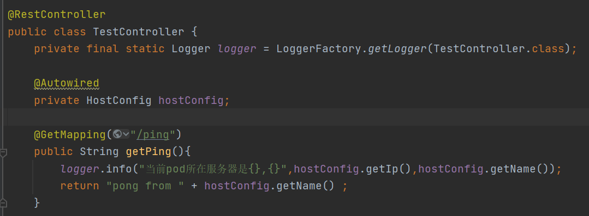
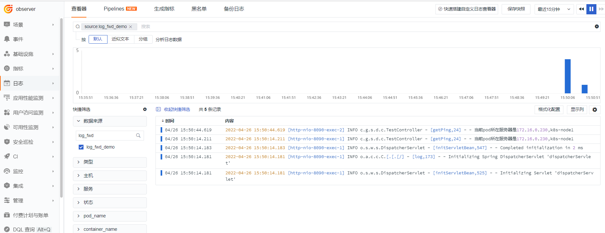

# Kubernetes 集群日志上报到同节点的 DataKit 最佳实践

---

## 简介

Kubernetes 集群中，在使用 DaemonSet 部署的 DataKit 来采集指标、链路、日志数据时，想要提高 Pod 与 DataKit 交互的性能，最好的方式是部署在该 Pod 所在的节点的 DataKit 来采集这些数据。以 DaemonSet 部署的 DataKit，集群的每一个节点都会启动一个 DataKit，只需要把流量路由到该节点的 DataKit 上，即可实现同节点的数据采集。


在 Kubernetes 的 Service 资源中，有一个叫 “externalTrafficPolicy”的字段，可以设置 Cluster 或者 Local 策略，使用这个外部策略，要求 Service 的服务类型是 NodePort 或者 LoadBalancer。

1. Cluster：流量可以转发到其它节点的 Pod 上，这是默认模式。
2. Local：流量只发给本机的 Pod 上。

默认的 Cluster 模式，Kube-proxy 收到请求流量，在转发时会做一次 SNAT(source network address translation)，把源 IP 变成了节点的 IP，这是为了确保请求按原路返回。改成 Local 模式之后，Kube-proxy 在转发请求时会保留源 IP，只转发到本节点上的 POD，绝不跨节点转发。

## 安装部署

### 部署 DataKit

##### 1.1.1 下载部署文件

登录『[<<< custom_key.brand_name >>>](https://<<< custom_key.studio_main_site >>>/)』，点击『集成』模块，再点击左上角『DataKit』，选择『Kubernetes』，下载 datakit.yaml。

##### 1.1.2 配置 token
登录『[<<< custom_key.brand_name >>>](https://<<< custom_key.studio_main_site >>>/)』，进入『管理』模块，找到下图中 token，替换 datakit.yaml 文件中的 ENV_DATAWAY 环境变量的 value 值中的 <your-token>。

```yaml
        - name: ENV_DATAWAY
          value: https://openway.guance.com?token=<your-token>
```


##### 1.1.3 设置全局 Tag

在 datakit.yaml 文件中的 ENV_GLOBAL_HOST_TAGS 环境变量值最后增加 cluster_name_k8s=k8s-istio，其中  k8s-istio 为全局 tag。

```yaml
        - name: ENV_GLOBAL_HOST_TAGS
          value: host=__datakit_hostname,host_ip=__datakit_ip,cluster_name_k8s=k8s-prod
```

##### 1.1.4 设置名称空间

DataKit 在选举时为了区分不同集群，这里需要设置 ENV_NAMESPACE 环境变量，不同集群值不能相同。在 datakit.yaml 文件中的环境变量部分增加如下内容。

```yaml
        - name: ENV_NAMESPACE
          value: guance-k8s
```

##### 1.1.5 开通采集器

本案例使用 logfwd 采集日志，所以需要开通 logfwd 及挂载 pipeline。

```yaml

        volumeMounts:
        # 下面是新增内容
        - mountPath: /usr/local/datakit/conf.d/log/logfwdserver.conf
          name: datakit-conf
          subPath: logfwdserver.conf 
        - mountPath: /usr/local/datakit/pipeline/pod-logging-demo.p
          name: datakit-conf
          subPath: pod-logging-demo.p
```

```yaml
apiVersion: v1
kind: ConfigMap
metadata:
  name: datakit-conf
  namespace: datakit
data:
    #  ...  下面是新增内容
    #### logfwdserver
    logfwdserver.conf: |-
      [inputs.logfwdserver]
        ## logfwd 接收端监听地址和端口
        address = "0.0.0.0:9531"

        [inputs.logfwdserver.tags]
        # some_tag = "some_value"
        # more_tag = "some_other_value"
    pod-logging-demo.p: |-
        #日志样式
        grok(_, "%{TIMESTAMP_ISO8601:time} %{NOTSPACE:thread_name} %{LOGLEVEL:status}%{SPACE}%{NOTSPACE:class_name} - \\[%{NOTSPACE:method_name},%{NUMBER:line}\\] -  - %{GREEDYDATA:msg}")
        default_time(time,"Asia/Shanghai")
```

##### 1.1.6 部署 DataKit

```
kubectl apply -f datakit.yaml
```

```yaml
apiVersion: v1
kind: Namespace
metadata:
  name: datakit
---
apiVersion: rbac.authorization.k8s.io/v1
kind: ClusterRole
metadata:
  name: datakit
rules:
- apiGroups:
  - rbac.authorization.k8s.io
  resources:
  - clusterroles
  verbs:
  - get
  - list
  - watch
- apiGroups:
  - ""
  resources:
  - nodes
  - nodes/proxy
  - namespaces
  - pods
  - pods/log
  - events
  - services
  - endpoints
  verbs:
  - get
  - list
  - watch
- apiGroups:
  - apps
  resources:
  - deployments
  - daemonsets
  - statefulsets
  - replicasets
  verbs:
  - get
  - list
  - watch
- apiGroups:
  - batch
  resources:
  - jobs
  - cronjobs
  verbs:
  - get
  - list
  - watch
- apiGroups:
  - metrics.k8s.io
  resources:
  - pods
  - nodes
  verbs:
  - get
  - list
- nonResourceURLs: ["/metrics"]
  verbs: ["get"]

---

apiVersion: v1
kind: ServiceAccount
metadata:
  name: datakit
  namespace: datakit

---

apiVersion: v1
kind: Service
metadata:
  name: datakit-service
  namespace: datakit
spec:
  selector:
    app: daemonset-datakit
  ports:
    - protocol: TCP
      port: 9529
      targetPort: 9529

---

apiVersion: rbac.authorization.k8s.io/v1
kind: ClusterRoleBinding
metadata:
  name: datakit
roleRef:
  apiGroup: rbac.authorization.k8s.io
  kind: ClusterRole
  name: datakit
subjects:
- kind: ServiceAccount
  name: datakit
  namespace: datakit

---

apiVersion: apps/v1
kind: DaemonSet
metadata:
  labels:
    app: daemonset-datakit
  name: datakit
  namespace: datakit
spec:
  revisionHistoryLimit: 10
  selector:
    matchLabels:
      app: daemonset-datakit
  template:
    metadata:
      labels:
        app: daemonset-datakit
      annotations:
        datakit/logs: |
          [
            {
              "disable": true
            }
          ]

    spec:
      hostNetwork: true
      dnsPolicy: ClusterFirstWithHostNet
      containers:
      - env:
        - name: HOST_IP
          valueFrom:
            fieldRef:
              apiVersion: v1
              fieldPath: status.hostIP
        - name: NODE_NAME
          valueFrom:
            fieldRef:
              apiVersion: v1
              fieldPath: spec.nodeName
        - name: ENV_DATAWAY
          value: https://openway.guance.com?token=<your-token> # 此处填上 dataway 真实地址
        - name: ENV_GLOBAL_HOST_TAGS
          value: host=__datakit_hostname,host_ip=__datakit_ip
        - name: ENV_DEFAULT_ENABLED_INPUTS
          value: cpu,disk,diskio,mem,swap,system,hostobject,net,host_processes,container
        - name: ENV_ENABLE_ELECTION
          value: enable
        - name: ENV_LOG
          value: stdout
        - name: ENV_HTTP_LISTEN
          value: 0.0.0.0:9529
        - name: ENV_K8S_CLUSTER_NAME
          value: k8s-prod
        - name: ENV_NAMESPACE
          value: guance-k8s
        image: pubrepo.jiagouyun.com/datakit/datakit:1.2.16
        imagePullPolicy: Always
        name: datakit
        ports:
        - containerPort: 9529
          hostPort: 9529
          name: port
          protocol: TCP
        securityContext:
          privileged: true
        volumeMounts:
        - mountPath: /var/run/docker.sock
          name: docker-socket
          readOnly: true
        - mountPath: /var/run/containerd/containerd.sock
          name: containerd-socket
          readOnly: true
        - mountPath: /usr/local/datakit/conf.d/log/logfwdserver.conf
          name: datakit-conf
          subPath: logfwdserver.conf 
        - mountPath: /usr/local/datakit/pipeline/pod-logging-demo.p
          name: datakit-conf
          subPath: pod-logging-demo.p
        - mountPath: /host/proc
          name: proc
          readOnly: true
        - mountPath: /host/dev
          name: dev
          readOnly: true
        - mountPath: /host/sys
          name: sys
          readOnly: true
        - mountPath: /rootfs
          name: rootfs
        - mountPath: /sys/kernel/debug
          name: debugfs
        #- mountPath: /usr/local/datakit/conf.d/db/mysql.conf
        #  name: datakit-conf
        #  subPath: mysql.conf
        #  readOnly: true
        #- mountPath: /usr/local/datakit/conf.d/db/redis.conf
        #  name: datakit-conf
        #  subPath: redis.conf
        #  readOnly: true
        workingDir: /usr/local/datakit
      hostIPC: true
      hostPID: true
      restartPolicy: Always
      serviceAccount: datakit
      serviceAccountName: datakit
      tolerations:
      - operator: Exists
      volumes:
      - configMap:
          name: datakit-conf
        name: datakit-conf
      - hostPath:
          path: /var/run/docker.sock
        name: docker-socket
      - hostPath:
          path: /var/run/containerd/containerd.sock
        name: containerd-socket
      - hostPath:
          path: /proc
          type: ""
        name: proc
      - hostPath:
          path: /dev
          type: ""
        name: dev
      - hostPath:
          path: /sys
          type: ""
        name: sys
      - hostPath:
          path: /
          type: ""
        name: rootfs
      - hostPath:
          path: /sys/kernel/debug
          type: ""
        name: debugfs
  updateStrategy:
    rollingUpdate:
      maxUnavailable: 1
    type: RollingUpdate

---

apiVersion: v1
kind: ConfigMap
metadata:
  name: datakit-conf
  namespace: datakit
data:
    #mysql.conf: |-
    #  [inputs.mysql]
    #  ...
    #redis.conf: |-
    #  [inputs.redis]
    #  ...
    #### logfwdserver
    logfwdserver.conf: |-
      [inputs.logfwdserver]
        ## logfwd 接收端监听地址和端口
        address = "0.0.0.0:9531"

        [inputs.logfwdserver.tags]
        # some_tag = "some_value"
        # more_tag = "some_other_value"
    pod-logging-demo.p: |-
        #日志样式
        grok(_, "%{TIMESTAMP_ISO8601:time} %{NOTSPACE:thread_name} %{LOGLEVEL:status}%{SPACE}%{NOTSPACE:class_name} - \\[%{NOTSPACE:method_name},%{NUMBER:line}\\] -  - %{GREEDYDATA:msg}")
        default_time(time,"Asia/Shanghai")

```

### 部署应用

#### 编写微服务

为了方便查看日志是在哪个 node 节点输出的，编写代码输出日志时把节点服务器名打印出来，节点 IP来自环境变量 HOST_IP，节点服务器名来自环境变量 HOST_NAME。完整项目 [datakit-springboot-demo](https://github.com/stevenliu2020/datakit-springboot-demo)。




#### 制作镜像

编写 Dockerfile

```
FROM openjdk:8u292

RUN /bin/cp /usr/share/zoneinfo/Asia/Shanghai /etc/localtime
RUN echo 'Asia/Shanghai' >/etc/timezone
ENV jar service-demo-1.0-SNAPSHOT.jar

ENV workdir /data/app/
RUN mkdir -p ${workdir}
COPY ${jar} ${workdir}
WORKDIR ${workdir}
ENTRYPOINT ["sh", "-ec", "exec java ${JAVA_OPTS} -jar ${jar} ${PARAMS} "]
```

把项目的 Jar 和 Dockerfile 放到相同目录。执行下面命令制作镜像，并上传到私有仓库。

```shell
docker build -t 172.16.0.238/df-demo/service-demo:v1  .
docker push 172.16.0.238/df-demo/service-demo:v1
```

#### 编写部署文件

编写 demo-service.yaml 部署文件，在 Service 资源文件中增加 externalTrafficPolicy: Local 来开启外部策略的 Local 模式。增加 HOST_IP 和 HOST_NAME 环境变量，用于输出 ip 和 服务器名称。

```shell
 kubectl  apply -f demo-service.yaml
```

关于 logfwd 的使用请参考 [Pod 日志采集最佳实践](../pod-log)，在 logfwd 指定 DataKit 的环境变量中，使用 DataKit Service 的域名 datakit-service.datakit.svc.cluster.local。

```yaml
        - name: LOGFWD_DATAKIT_HOST
          value: "datakit-service.datakit.svc.cluster.local"
```

demo-service.yaml 完整内容如下。

```yaml
apiVersion: v1
kind: Service
metadata:
  name: guance-service
  labels:
    app: guance-service
spec:
  selector:
    app: guance-pod
  externalTrafficPolicy: Local
  ports:
    - protocol: TCP
      port: 8090
      targetPort: 8090
      nodePort: 30090
  type: NodePort  
---

apiVersion: apps/v1
kind: Deployment
metadata:
  name: guance-deployment
spec:
  replicas: 1
  selector:
    matchLabels:
      app: guance-pod
  template:
    metadata:
      labels:
        app: guance-pod
      annotations:          
    spec:
      containers:
      - name: guance-demo-container
        image: 172.16.0.238/df-demo/service-demo:v1
        env:
        - name: HOST_IP
          valueFrom:
            fieldRef:
              apiVersion: v1
              fieldPath: status.hostIP
        - name: HOST_NAME
          valueFrom:
            fieldRef:
              apiVersion: v1
              fieldPath: spec.nodeName  
        - name: POD_NAME
          valueFrom:
            fieldRef:
              fieldPath: metadata.name
        - name: DD_AGENT_HOST
          value: $(HOST_IP)    
        - name: JAVA_OPTS
          value: |-
            -javaagent:/usr/dd-java-agent/agent/dd-java-agent.jar -Ddd.service.name=k8s-guance-service  -Ddd.tags=container_host:$(PODE_NAME)  -Ddd.tags=node_ip:$(DD_AGENT_HOST) -Ddd.env=dev -Ddd.agent.port=9529                   
        ports:
        - containerPort: 8090
          protocol: TCP
        volumeMounts:
        - mountPath: /data/app/logs
          name: varlog 
      - name: logfwd
        image: pubrepo.jiagouyun.com/datakit/logfwd:1.2.12
        env:
        - name: LOGFWD_DATAKIT_HOST
          value: "datakit-service.datakit.svc.cluster.local"
        - name: LOGFWD_DATAKIT_PORT
          value: "9531"
        - name: LOGFWD_ANNOTATION_DATAKIT_LOGS
          valueFrom:
            fieldRef:
              apiVersion: v1
              fieldPath: metadata.annotations['datakit/logs']
        - name: LOGFWD_POD_NAME
          valueFrom:
            fieldRef:
              apiVersion: v1
              fieldPath: metadata.name
        - name: LOGFWD_POD_NAMESPACE
          valueFrom:
            fieldRef:
              apiVersion: v1
              fieldPath: metadata.namespace
        volumeMounts:
        - mountPath: /var/log
          name: varlog 
        - mountPath: /opt/logfwd/config
          name: logfwd-config
          subPath: config          
      restartPolicy: Always
      volumes:
      - name: varlog
        emptyDir: {} 
      - configMap:
          name: guance-logfwd-conf
        name: logfwd-config 

---
        
apiVersion: v1
kind: ConfigMap
metadata:
  name: guance-logfwd-conf
data:
  config: |
    [
        {            
            "loggings": [
                {
                    "logfiles": ["/var/log/log.log"],
                    "source": "log_fwd_demo",                    
                    "pipeline": "pod-logging-demo.p",
                    "multiline_match": "^\\d{4}-\\d{2}-\\d{2}",
                    "tags": {
                        "flag": "tag1"
                    }
                }
            ]
        }
    ]

```

### 流量验证

登录集群的 master 节点，执行如下命令来生成日志。


登录『[<<< custom_key.brand_name >>>](https://<<< custom_key.studio_main_site >>>/)』，进入『日志』模块，根据数据来源搜索 log_fwd_demo，找到日志点击查看详情。



可以看到 host 与日志输出的服务器名称完全 一致，多次请求，上报的 host 还是相同。


