# service mesh 微服务架构从研发到金丝雀发布全流程最佳实践(上)

---

## 简介

一般企业创建自己的容器云环境后，企业为了简化繁琐的发布流程，一般会使用 GitlabCi 、Jenkins 进行应用部署。同时会考虑使用 Rancher 进行统一的资源编排管理，通过 Rancher 的应用商店简化应用管理。通过应用商店一键安装 DataKit （具体见 DataKit 文档的 Helm 安装方式），<<< custom_key.brand_name >>>对 Rancher 管控的 Kubernetes 集群，提供了大量开箱即用的可观测功能。本文通过一个耳熟能详的 Bookinfo 案例，详细解释如何利用<<< custom_key.brand_name >>>实现 GitlabCI、Kubernetes 与微服务的可观测性。

## 案例假设

某公司利用 Rancher 管理了两套 Kubernetes ，一套研发测试，一套线上。公司在研发测试环境部署了 gitlab 做 CICD，BookInfo 项目是个电子书城，是个典型的多语言微服务项目。一个正在研发的发版本部署在研发测试环境，通过测试后，对线上环境的 BookInfo 做金丝雀灰度发布。该公司的可观测体系组成部分如下： <br />1.1 SRE 对整体两套环境的 Kubernetes 资源情况在<<< custom_key.brand_name >>>上进行观测，做好容量规划和应急处理 <br />2.1 开发人员对 cicd 的流程进行观测从而了解软件迭代的速度和质量，及时处理出错的 pipeline。<br />2.2 SRE 对线上环境的金丝雀发布进行观测从而了解版本流量切换的状态，及时回滚避免对线上用户产生影响。 <br />3.1 SRE 通过 istio 对整个应用进行链路追踪，在<<< custom_key.brand_name >>>上查看应用的健康关键指标，及时处理异常请求。<br />3.2 开发对自己的日志进行管理，出现健康异常时，在<<< custom_key.brand_name >>>上及时通过链路追踪找到日志上下文解决问题<br />我们分三篇讲解整体实践。

## 前置条件

- 安装 [Kubernetes](https://kubernetes.io/docs/setup/production-environment/tools/)。
- 安装 [Rancher](https://rancher.com/docs/rancher/v2.6/en/installation/)。
- 安装 [Gitlab](https://about.gitlab.com/  )。
- 安装 [Metrics-Server 组件](https://github.com/kubernetes-sigs/metrics-server#installation)。
- 部署 harbor 仓库或其它镜像仓库。
- 部署 Istio，已熟悉 [基于 Istio 实现微服务可观测最佳实践](../istio)。
- 配置 Gitlab-runner，已熟悉 [Gitlab-CI 可观测最佳实践](../monitoring/gitlab-ci)。

## 部署步骤

### 步骤 1： 使用 Rancher 安装 DataKit

#### 1.1 部署 DataKit

##### 1.1.1 下载部署文件

登录『[<<< custom_key.brand_name >>>](https://<<< custom_key.studio_main_site >>>/)』，点击『集成』模块，再点击左上角『DataKit』，选择『Kubernetes』，下载 datakit.yaml。

##### 1.1.2 配置 token

登录『[<<< custom_key.brand_name >>>](https://<<< custom_key.studio_main_site >>>/)』，进入『管理』模块，找到下图中 token，替换 datakit.yaml 文件中的 ENV_DATAWAY 环境变量的 value 值中的 <your-token>。

```yaml
        - name: ENV_DATAWAY
          value: https://openway.<<< custom_key.brand_main_domain >>>?token=<your-token>
```

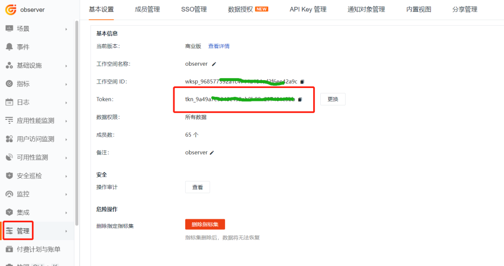	 

##### 1.1.3 设置全局标签

在 datakit.yaml 文件中的 ENV_GLOBAL_HOST_TAGS 环境变量值最后增加 cluster_name_k8s=k8s-istio，其中  k8s-istio 为您的集群名称，此步骤为集群设置全局 tag。

```yaml
        - name: ENV_GLOBAL_HOST_TAGS
          value: host=__datakit_hostname,host_ip=__datakit_ip,cluster_name_k8s=k8s-istio
```

##### 1.1.4 设置名称空间

DataKit 在选举时为了区分不同集群，这里需要设置 ENV_NAMESPACE 环境变量，不同集群值不能相同。在 datakit.yaml 文件中的环境变量部分增加如下内容。

```yaml
        - name: ENV_NAMESPACE
          value: k8s-istio
```

##### 1.1.5 开通采集器

开通 ddtrace 和 statsd 采集器，在 datakit.yaml 文件中找到 ENV_DEFAULT_ENABLED_INPUTS 环境变量，最后增加 statsd,ddtrace。

```yaml
        - name: ENV_DEFAULT_ENABLED_INPUTS
          value: cpu,disk,diskio,mem,swap,system,hostobject,net,host_processes,container,statsd,ddtrace
```

##### 1.1.6 部署 DataKit

登录『Rancher』，在浏览集群标签下，选择『k8s-solution-cluster』集群，打开 datakit.yaml，根据资源文件内容，在 k8s-solution-cluster 集群中找到对应的菜单并一一创建资源。

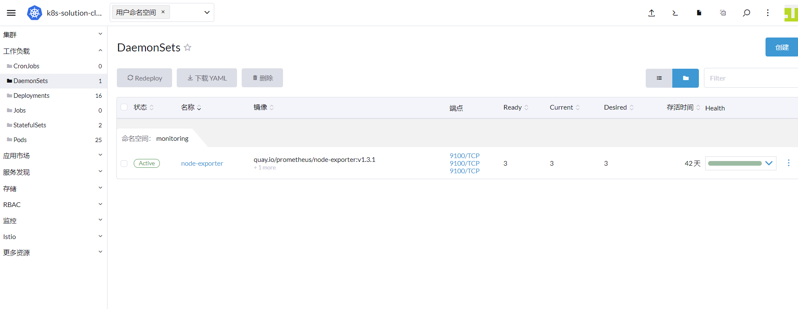	 

『注意』为了快速实现下一步操作，本次操作将合并 ConfigMap 后，直接使用 kubectl 命令部署 DataKit。

#### 1.2 创建 ConfigMap

开通 container 采集器和 zipkin 采集器，需要先定义 container.conf 和 zipkin.conf。

```yaml
apiVersion: v1
kind: ConfigMap
metadata:
  name: datakit-conf
  namespace: datakit
data:
    #### container
    container.conf: |-  
      [inputs.container]
        docker_endpoint = "unix:///var/run/docker.sock"
        containerd_address = "/var/run/containerd/containerd.sock"

        enable_container_metric = true
        enable_k8s_metric = true
        enable_pod_metric = true

        ## Containers logs to include and exclude, default collect all containers. Globs accepted.
        container_include_log = []
        container_exclude_log = ["image:pubrepo.<<< custom_key.brand_main_domain >>>/datakit/logfwd*", "image:pubrepo.<<< custom_key.brand_main_domain >>>/datakit/datakit*"]

        exclude_pause_container = true

        ## Removes ANSI escape codes from text strings
        logging_remove_ansi_escape_codes = false

        kubernetes_url = "https://kubernetes.default:443"

        ## Authorization level:
        ##   bearer_token -> bearer_token_string -> TLS
        ## Use bearer token for authorization. ('bearer_token' takes priority)
        ## linux at:   /run/secrets/kubernetes.io/serviceaccount/token
        ## windows at: C:\var\run\secrets\kubernetes.io\serviceaccount\token
        bearer_token = "/run/secrets/kubernetes.io/serviceaccount/token"
        # bearer_token_string = "<your-token-string>"

        [inputs.container.tags]
          # some_tag = "some_value"
          # more_tag = "some_other_value"
          
    #### zipkin
    zipkin.conf: |-          
        [[inputs.zipkin]]
          pathV1 = "/api/v1/spans"
          pathV2 = "/api/v2/spans"
```

[inputs.container]参数说明

- container_include_metric：须要采集的容器指标。
- container_exclude_metric：不须要采集的容器指标。
- container_include_log：须要采集的容器日志。
- container_exclude_log：不须要采集的容器日志。
- exclude_pause_container：true 是排除 pause 容器。
- `container_include` 和 `container_exclude` 必须以 `image` 开头，格式为 `"image:<glob规则>"`，表示 glob 规则是针对容器 image 生效
- [Glob 规则](https://en.wikipedia.org/wiki/Glob_(programming))是一种轻量级的正则表达式，支持 `*` `?` 等基本匹配单元

然后登录『Rancher』，在浏览集群标签下，选择『k8s-solution-cluster』集群，依次进入『更多资源』-> 『Core』-> 『ConfigMaps』，使用 yaml 格式把上述定义的 ConfigMap 创建。

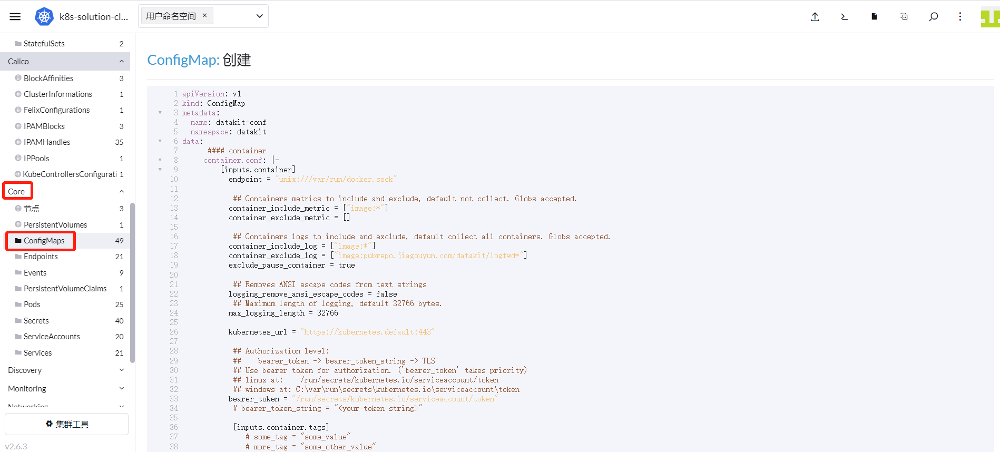	 

最后在把 DataKit 与 ConfigMap 做下关联，在『k8s-solution-cluster』集群，进入 『工作负载』-> 『DaemonSets』找到 DataKit，在右边选择『编辑 YAML』，添加如下内容，最后点击『保存』。

	 

```yaml
        - mountPath: /usr/local/datakit/conf.d/container/container.conf
          name: datakit-conf
          subPath: container.conf
        - mountPath: /usr/local/datakit/conf.d/zipkin/zipkin.conf
          name: datakit-conf
          subPath: zipkin.conf
```

如果使用 kubectl 命令创建 DataKit，请把 ConfigMap 中定义的内容添加在 datakit.yaml 文件最后，再把上面的配置加到 文件中 volumeMounts 下面。<br />『注意』使用 --- 做分割。
       
#### 1.3 查看 DataKit 运行状态

DataKit 部署成功后，可以看到如下图的运行状态。
		
	 

### 步骤 2： 映射 DataKit 服务

使用 Istio 上报链路数据时，链路数据会被打到 **zipkin.istio-system** 的 Service上，且上报端口是 9411，由于 DataKit 服务的名称空间是 datakit，端口是 9529，所以这里需要做一下转换，详情请参考 [Kubernetes 集群使用 ExternalName 映射 DataKit 服务](../kubernetes-external-name)。

### 步骤 3： DataFlux Function 配置 DataKit

在使用 Gitlab-CI 部署微服务时，为了收集 Gitlab 执行数据，需要部署 DataFlux Function 并配置 DataKit，详细步骤请参考 [Gitlab-CI 可观测最佳实践](../monitoring/gitlab-ci)。

### 步骤 4： 部署 Bookinfo

#### 2.1 下载源码

下载 [istio-1.13.2.zip](https://github.com/istio/istio/releases)，后面使用的部署文件全部来自此压缩包，为了操作方便，将使用 kubectl 命令代替 Rancher 的图形化界面创建资源的操作。

#### 2.2 开启 RUM

为了观测网站被调用的信息，需要开通前端的数据采集。登录『 [<<< custom_key.brand_name >>>](https://<<< custom_key.studio_main_site >>>/)』，进入『用户访问监测』，新建应用 **devops-bookinfo** ，复制下方 JS。

	 

上述的 JS 需要放置到 productpage 项目所有界面都能访问到的地方，本项目把上面的 JS 复制到 **istio-1.13.2\samples\bookinfo\src\productpage\templates\productpage.html** 文件中。
『注意』关于 RUM 数据上报的 DataKit 地址，请参考 [RUM 数据上报 DataKit 集群最佳实践](../monitoring/rum-datakit-cluster)。

	 

然后对 productpage 重新发布镜像并上传到镜像仓库。

```shell
cd istio-1.13.2\samples\bookinfo\src\productpage
docker build -t 172.16.0.238/df-demo/product-page:v1  .
docker push 172.16.0.238/df-demo/product-page:v1
```

#### 2.3 开通 Sidecar 注入

新建 prod 命名空间，开启该空间下创建 Pod 时自动注入 Sidecar，让 Pod 的出入流量都转由 Sidecar 进行处理。

```shell
kubectl create ns prod 
kubectl label namespace prod istio-injection=enabled
```

#### 2.4 部署 productpage、details、ratings

在 istio-1.13.2\samples\bookinfo\platform\kube\bookinfo.yaml 文件中，移除关于 reviews 微服务部署的部分，把 Service 和 Deployment 都部署到 prod 名称空间，并在所有 Deployment 控制器，Pod 模板上增加 annotations，来开启 Pod 的自定义采集。把 productpage 镜像修改为上步创建的。完整文件如下：

```yaml

# Copyright Istio Authors
#
#   Licensed under the Apache License, Version 2.0 (the "License");
#   you may not use this file except in compliance with the License.
#   You may obtain a copy of the License at
#
#       http://www.apache.org/licenses/LICENSE-2.0
#
#   Unless required by applicable law or agreed to in writing, software
#   distributed under the License is distributed on an "AS IS" BASIS,
#   WITHOUT WARRANTIES OR CONDITIONS OF ANY KIND, either express or implied.
#   See the License for the specific language governing permissions and
#   limitations under the License.

##################################################################################################
# This file defines the services, service accounts, and deployments for the Bookinfo sample.
#
# To apply all 4 Bookinfo services, their corresponding service accounts, and deployments:
#
#   kubectl apply -f samples/bookinfo/platform/kube/bookinfo.yaml
#
# Alternatively, you can deploy any resource separately:
#
#   kubectl apply -f samples/bookinfo/platform/kube/bookinfo.yaml -l service=reviews # reviews Service
#   kubectl apply -f samples/bookinfo/platform/kube/bookinfo.yaml -l account=reviews # reviews ServiceAccount
#   kubectl apply -f samples/bookinfo/platform/kube/bookinfo.yaml -l app=reviews,version=v3 # reviews-v3 Deployment
##################################################################################################

##################################################################################################
# Details service
##################################################################################################
apiVersion: v1
kind: Service
metadata:
  name: details
  namespace: prod
  labels:
    app: details
    service: details
spec:
  ports:
  - port: 9080
    name: http
  selector:
    app: details
---
apiVersion: v1
kind: ServiceAccount
metadata:
  name: bookinfo-details
  namespace: prod
  labels:
    account: details
---
apiVersion: apps/v1
kind: Deployment
metadata:
  name: details-v1
  namespace: prod
  labels:
    app: details
    version: v1
spec:
  replicas: 1
  selector:
    matchLabels:
      app: details
      version: v1
  template:
    metadata:
      labels:
        app: details
        version: v1
      annotations:
        datakit/prom.instances: |
          [[inputs.prom]]
            url = "http://$IP:15020/stats/prometheus"
            source = "bookinfo-istio-details"
            metric_types = ["counter", "gauge"]
            interval = "60s"
			tags_ignore = ["cache","cluster_type","component","destination_app","destination_canonical_revision","destination_canonical_service","destination_cluster","destination_principal","group","grpc_code","grpc_method","grpc_service","grpc_type","reason","request_protocol","request_type","resource","responce_code_class","response_flags","source_app","source_canonical_revision","source_canonical-service","source_cluster","source_principal","source_version","wasm_filter"]
            #measurement_prefix = ""
            metric_name_filter = ["istio_requests_total","pilot_k8s_cfg_events","istio_build","process_virtual_memory_bytes","process_resident_memory_bytes","process_cpu_seconds_total","envoy_cluster_assignment_stale","go_goroutines","pilot_xds_pushes","pilot_proxy_convergence_time_bucket","citadel_server_root_cert_expiry_timestamp","pilot_conflict_inbound_listener","pilot_conflict_outbound_listener_http_over_current_tcp","pilot_conflict_outbound_listener_tcp_over_current_tcp","pilot_conflict_outbound_listener_tcp_over_current_http","pilot_virt_services","galley_validation_failed","pilot_services","envoy_cluster_upstream_cx_total","envoy_cluster_upstream_cx_connect_fail","envoy_cluster_upstream_cx_active","envoy_cluster_upstream_cx_rx_bytes_total","envoy_cluster_upstream_cx_tx_bytes_total","istio_request_duration_milliseconds_bucket","istio_request_duration_seconds_bucket","istio_request_bytes_bucket","istio_response_bytes_bucket"]
            measurement_name = "istio_prom"
            #[[inputs.prom.measurements]]
            # prefix = "cpu_"
            # name = "cpu"         
            [inputs.prom.tags]
            namespace = "$NAMESPACE"
    spec:
      serviceAccountName: bookinfo-details
      containers:
      - name: details
        image: docker.io/istio/examples-bookinfo-details-v1:1.16.2
        imagePullPolicy: IfNotPresent
        ports:
        - containerPort: 9080
        securityContext:
          runAsUser: 1000
---
##################################################################################################
# Ratings service
##################################################################################################
apiVersion: v1
kind: Service
metadata:
  name: ratings
  namespace: prod
  labels:
    app: ratings
    service: ratings
spec:
  ports:
  - port: 9080
    name: http
  selector:
    app: ratings
---
apiVersion: v1
kind: ServiceAccount
metadata:
  name: bookinfo-ratings
  namespace: prod
  labels:
    account: ratings
---
apiVersion: apps/v1
kind: Deployment
metadata:
  name: ratings-v1
  namespace: prod
  labels:
    app: ratings
    version: v1
spec:
  replicas: 1
  selector:
    matchLabels:
      app: ratings
      version: v1
  template:
    metadata:
      labels:
        app: ratings
        version: v1
      annotations:
        datakit/prom.instances: |
          [[inputs.prom]]
            url = "http://$IP:15020/stats/prometheus"
            source = "bookinfo-istio-ratings"
            metric_types = ["counter", "gauge"]
            interval = "60s"
			tags_ignore = ["cache","cluster_type","component","destination_app","destination_canonical_revision","destination_canonical_service","destination_cluster","destination_principal","group","grpc_code","grpc_method","grpc_service","grpc_type","reason","request_protocol","request_type","resource","responce_code_class","response_flags","source_app","source_canonical_revision","source_canonical-service","source_cluster","source_principal","source_version","wasm_filter"]
            #measurement_prefix = ""
            metric_name_filter = ["istio_requests_total","pilot_k8s_cfg_events","istio_build","process_virtual_memory_bytes","process_resident_memory_bytes","process_cpu_seconds_total","envoy_cluster_assignment_stale","go_goroutines","pilot_xds_pushes","pilot_proxy_convergence_time_bucket","citadel_server_root_cert_expiry_timestamp","pilot_conflict_inbound_listener","pilot_conflict_outbound_listener_http_over_current_tcp","pilot_conflict_outbound_listener_tcp_over_current_tcp","pilot_conflict_outbound_listener_tcp_over_current_http","pilot_virt_services","galley_validation_failed","pilot_services","envoy_cluster_upstream_cx_total","envoy_cluster_upstream_cx_connect_fail","envoy_cluster_upstream_cx_active","envoy_cluster_upstream_cx_rx_bytes_total","envoy_cluster_upstream_cx_tx_bytes_total","istio_request_duration_milliseconds_bucket","istio_request_duration_seconds_bucket","istio_request_bytes_bucket","istio_response_bytes_bucket"]
            measurement_name = "istio_prom"
            #[[inputs.prom.measurements]]
            # prefix = "cpu_"
            # name = "cpu"         
            [inputs.prom.tags]
            namespace = "$NAMESPACE"
    spec:
      serviceAccountName: bookinfo-ratings
      containers:
      - name: ratings
        image: docker.io/istio/examples-bookinfo-ratings-v1:1.16.2
        imagePullPolicy: IfNotPresent
        ports:
        - containerPort: 9080
        securityContext:
          runAsUser: 1000
---
##################################################################################################
# Productpage services
##################################################################################################
apiVersion: v1
kind: Service
metadata:
  name: productpage
  namespace: prod
  labels:
    app: productpage
    service: productpage
spec:
  ports:
  - port: 9080
    name: http
  selector:
    app: productpage
---
apiVersion: v1
kind: ServiceAccount
metadata:
  name: bookinfo-productpage
  namespace: prod
  labels:
    account: productpage
---
apiVersion: apps/v1
kind: Deployment
metadata:
  name: productpage-v1
  namespace: prod
  labels:
    app: productpage
    version: v1
spec:
  replicas: 1
  selector:
    matchLabels:
      app: productpage
      version: v1
  template:
    metadata:
      labels:
        app: productpage
        version: v1
      annotations:
        datakit/prom.instances: |
          [[inputs.prom]]
            url = "http://$IP:15020/stats/prometheus"
            source = "bookinfo-istio-product"
            metric_types = ["counter", "gauge"]
            interval = "60s"
			tags_ignore = ["cache","cluster_type","component","destination_app","destination_canonical_revision","destination_canonical_service","destination_cluster","destination_principal","group","grpc_code","grpc_method","grpc_service","grpc_type","reason","request_protocol","request_type","resource","responce_code_class","response_flags","source_app","source_canonical_revision","source_canonical-service","source_cluster","source_principal","source_version","wasm_filter"]
            metric_name_filter = ["istio_requests_total","pilot_k8s_cfg_events","istio_build","process_virtual_memory_bytes","process_resident_memory_bytes","process_cpu_seconds_total","envoy_cluster_assignment_stale","go_goroutines","pilot_xds_pushes","pilot_proxy_convergence_time_bucket","citadel_server_root_cert_expiry_timestamp","pilot_conflict_inbound_listener","pilot_conflict_outbound_listener_http_over_current_tcp","pilot_conflict_outbound_listener_tcp_over_current_tcp","pilot_conflict_outbound_listener_tcp_over_current_http","pilot_virt_services","galley_validation_failed","pilot_services","envoy_cluster_upstream_cx_total","envoy_cluster_upstream_cx_connect_fail","envoy_cluster_upstream_cx_active","envoy_cluster_upstream_cx_rx_bytes_total","envoy_cluster_upstream_cx_tx_bytes_total","istio_request_duration_milliseconds_bucket","istio_request_duration_seconds_bucket","istio_request_bytes_bucket","istio_response_bytes_bucket"]
            #measurement_prefix = ""
            measurement_name = "istio_prom"
            #[[inputs.prom.measurements]]
            # prefix = "cpu_"
            # name = "cpu"         
            [inputs.prom.tags]
            namespace = "$NAMESPACE"
    spec:
      serviceAccountName: bookinfo-productpage
      containers:
      - name: productpage
        #image: docker.io/istio/examples-bookinfo-productpage-v1:1.16.2
        image: 172.16.0.238/df-demo/product-page:v1
        imagePullPolicy: IfNotPresent
        ports:
        - containerPort: 9080
        volumeMounts:
        - name: tmp
          mountPath: /tmp
        securityContext:
          runAsUser: 1000
      volumes:
      - name: tmp
        emptyDir: {}
---

```

```shell
kubectl apply -f bookinfo.yaml
```

#### 2.5 创建 Gateway 资源和虚拟服务

修改 istio-1.13.2\samples\bookinfo\networking\bookinfo-gateway.yaml 文件，增加 prod 名称空间。

```yaml
apiVersion: networking.istio.io/v1alpha3
kind: Gateway
metadata:
  name: bookinfo-gateway
  namespace: prod
spec:
  selector:
    istio: ingressgateway # use istio default controller
  servers:
  - port:
      number: 80
      name: http
      protocol: HTTP
    hosts:
    - "*"
---
apiVersion: networking.istio.io/v1alpha3
kind: VirtualService
metadata:
  name: bookinfo
  namespace: prod
spec:
  hosts:
  - "*"
  gateways:
  - bookinfo-gateway
  http:
  - match:
    - uri:
        exact: /productpage
    - uri:
        prefix: /static
    - uri:
        exact: /login
    - uri:
        exact: /logout
    - uri:
        prefix: /api/v1/products
    route:
    - destination:
        host: productpage
        port:
          number: 9080
```

```shell
kubectl apply -f bookinfo-gateway.yaml 
```

#### 2.6 访问 productpage

查看 ingresgateway 对外暴露的端口。

```shell
kubectl get svc -n istio-system
```

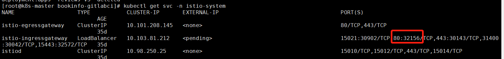	 

根据虚拟服务规则，浏览器访问 [http://8.136.193.105:32156/productpage](http://8.136.193.105:32156/productpage)，即可访问 productpage，由于此时 reviews 服务还没部署，所以会出现** Sorry, product reviews are currently unavailable for this book** 的提示。
		
	 

### 步骤 5： 自动化部署

#### 5.1 创建 Gitlab 项目

登录 Gitlab，创建 bookinfo-views 项目。
		
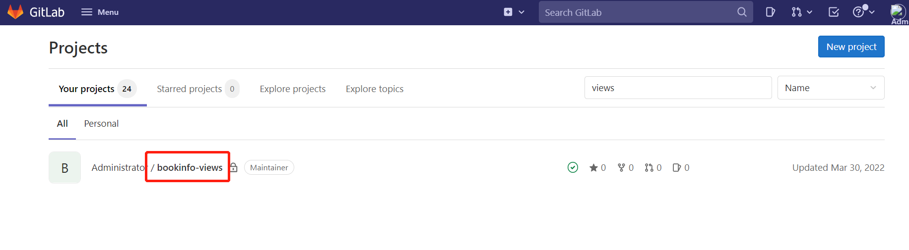
	 
#### 5.2 打通 Gitlab 与 DataKit

请参考 [gitlab 集成文档](/integrations/gitlab) 打通 Gitlab 和 DataKit，这里只配置 Gitlab CI。<br />        登录『Gitlab』，进入『bookinfo-views』-> 『Settings』-> 『Webhooks』，在 url 中输入URL 中输入 DataKit 所在的主机 IP 和 DataKit 的 9529 端口，再加 /v1/gitlab。如下图。

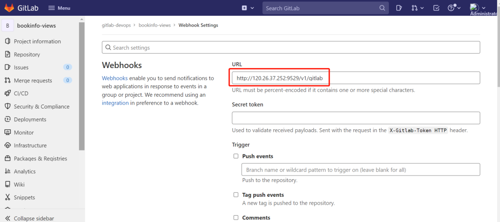	 

选中 Job events 和 Pipeline events，点击 Add webhook。
		
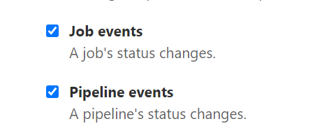

点击刚才创建的 Webhooks 右边的 Test，选择 Pipeline events，出现下图的 HTTP 200 说明配置成功。
			
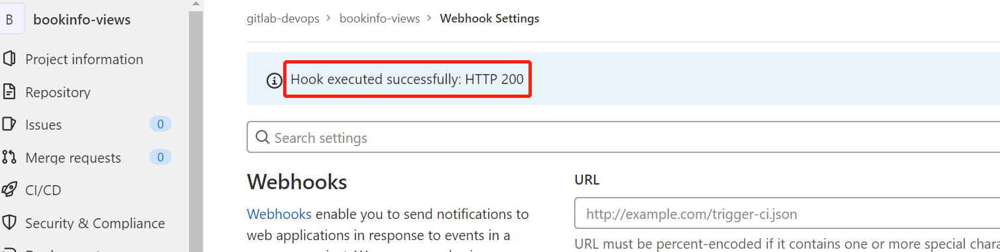	 

       
#### 5.3 为 reviews 微服务配置 Gitlab-CI

登录『Gitlab』，进入『bookinfo-views』，根目录新建 deployment.yaml 和 .gitlab-ci.yml 文件。在 annotations 定义了 project、env、version 标签，用于不同项目、不同版本的区分。

```yaml
apiVersion: v1
kind: Service
metadata:
  name: reviews
  namespace: prod
  labels:
    app: reviews
    service: reviews
spec:
  ports:
  - port: 9080
    name: http
  selector:
    app: reviews
---
apiVersion: v1
kind: ServiceAccount
metadata:
  name: bookinfo-reviews
  namespace: prod
  labels:
    account: reviews
---
apiVersion: apps/v1
kind: Deployment
metadata:
  name: reviews-__version__
  namespace: prod
  labels:
    app: reviews
    version: __version__
spec:
  replicas: 1
  selector:
    matchLabels:
      app: reviews
      version: __version__
  template:
    metadata:
      labels:
        app: reviews
        version: __version__
      annotations:
        datakit/prom.instances: |
          [[inputs.prom]]
            url = "http://$IP:15020/stats/prometheus"
            source = "bookinfo-istio-review"
            metric_types = ["counter", "gauge"]
            interval = "60s"
            tags_ignore = ["cache","cluster_type","component","destination_app","destination_canonical_revision","destination_canonical_service","destination_cluster","destination_principal","group","grpc_code","grpc_method","grpc_service","grpc_type","reason","request_protocol","request_type","resource","responce_code_class","response_flags","source_app","source_canonical_revision","source_canonical-service","source_cluster","source_principal","source_version","wasm_filter"]
            metric_name_filter = ["istio_requests_total","pilot_k8s_cfg_events","istio_build","process_virtual_memory_bytes","process_resident_memory_bytes","process_cpu_seconds_total","envoy_cluster_assignment_stale","go_goroutines","pilot_xds_pushes","pilot_proxy_convergence_time_bucket","citadel_server_root_cert_expiry_timestamp","pilot_conflict_inbound_listener","pilot_conflict_outbound_listener_http_over_current_tcp","pilot_conflict_outbound_listener_tcp_over_current_tcp","pilot_conflict_outbound_listener_tcp_over_current_http","pilot_virt_services","galley_validation_failed","pilot_services","envoy_cluster_upstream_cx_total","envoy_cluster_upstream_cx_connect_fail","envoy_cluster_upstream_cx_active","envoy_cluster_upstream_cx_rx_bytes_total","envoy_cluster_upstream_cx_tx_bytes_total","istio_request_duration_milliseconds_bucket","istio_request_duration_seconds_bucket","istio_request_bytes_bucket","istio_response_bytes_bucket"]
            #measurement_prefix = ""
            measurement_name = "istio_prom"
            #[[inputs.prom.measurements]]
            # prefix = "cpu_"
            # name = "cpu"
            [inputs.prom.tags]
            namespace = "$NAMESPACE"
        proxy.istio.io/config: |
          tracing:
            zipkin:
              address: zipkin.istio-system:9411
            custom_tags:
              project:
                literal:
                  value: "reviews"
              version:
                literal:
                  value: __version__
              env:
                literal:
                  value: "test"        
    spec:
      serviceAccountName: bookinfo-reviews
      containers:
      - name: reviews
        image: docker.io/istio/examples-bookinfo-reviews-__version__:1.16.2
        imagePullPolicy: IfNotPresent
        env:
        - name: LOG_DIR
          value: "/tmp/logs"
        ports:
        - containerPort: 9080
        volumeMounts:
        - name: tmp
          mountPath: /tmp
        - name: wlp-output
          mountPath: /opt/ibm/wlp/output
        securityContext:
          runAsUser: 1000
      volumes:
      - name: wlp-output
        emptyDir: {}
      - name: tmp
        emptyDir: {}
```

```yaml
variables:
  APP_VERSION: "v1"

stages:
  - deploy

deploy_k8s:
  image: bitnami/kubectl:1.22.7
  stage: deploy
  tags:
    - kubernetes-runner
  script:
    - echo "执行deploy"
    - ls
    - sed -i "s#__version__#${APP_VERSION}#g" deployment.yaml
    - cat deployment.yaml
    - kubectl apply -f deployment.yaml
  after_script:
    - sleep 10
    - kubectl get pod  -n prod

```

### 步骤 6：Gitlab CI 可观测

#### 6.1 发布 reviews 微服务

修改 .gitlab-ci.yml 文件中的 APP_VERSION 的值为 "v1"，提交一次代码，修改成 "v2"，提交一次代码，修改成 "v3" 提交一次代码。
		
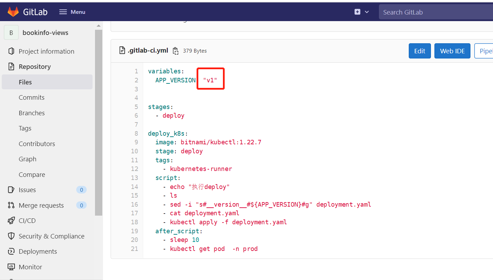

此时 Pipeline 被触发 3次。

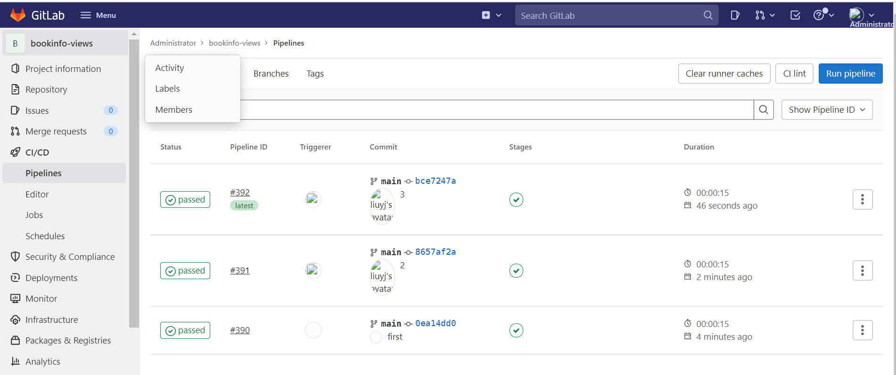	 

#### 6.2 Gitlab CI 流水线可观测

登录『[<<< custom_key.brand_name >>>](https://<<< custom_key.studio_main_site >>>/)』，进入『CI』，点击『概览』选择 bookinfo-views 项目，查看 Pipeline 和 Job 的执行情况。
		  
	 

	 

登录『[<<< custom_key.brand_name >>>](https://<<< custom_key.studio_main_site >>>/)』，进入『CI』,点击『查看器』，选择 gitlab_pipeline。
		 
	 

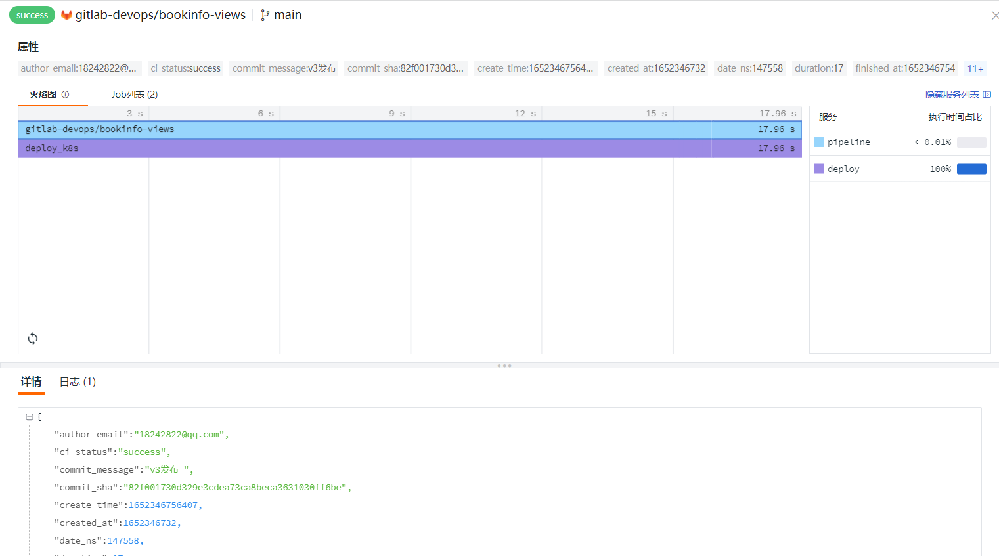	 

登录『[<<< custom_key.brand_name >>>](https://<<< custom_key.studio_main_site >>>/)』，进入『CI』,点击『查看器』，选择 gitlab_job。
		 
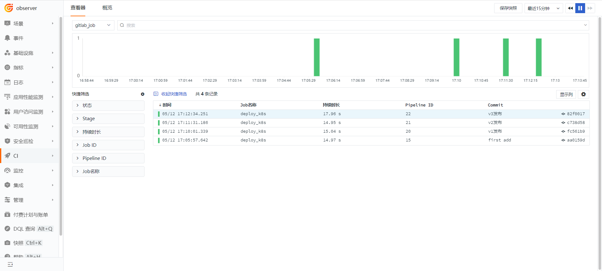	 

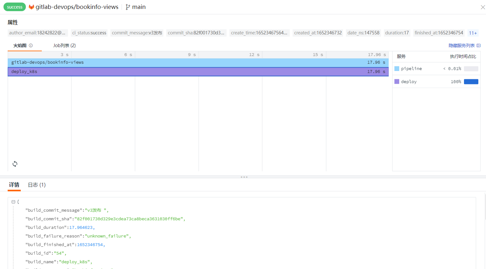	

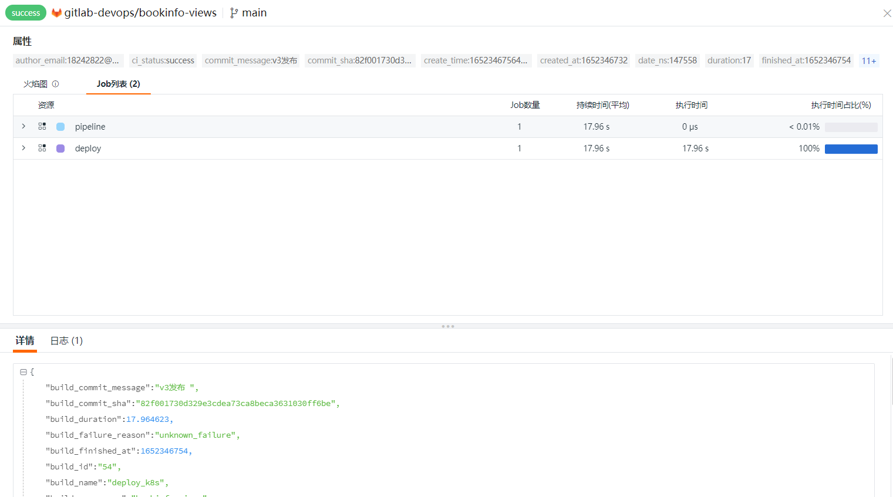	
