# service mesh 微服务架构从研发到金丝雀发布全流程最佳实践(中)

---

## 简介

上篇文件介绍了在 Kubernetes 环境部署 DataKit，在 Istio 环境部署 Bookinfo 项目，为 reviews 微服务配置 CICD 的 Pipeline 并使用金丝雀发布 reviews 的三个版本。本篇将介绍 Kubernetes 的可观测和 Istio 的可观测。

## 1 Kubernetes 可观测

### 1.1 Docker 监控视图

在 Kubernetes 集群中， Pod 是最小的调度单元，一个 Pod 可以包含一个或多个容器，在<<< custom_key.brand_name >>>中，可以使用 **Docker 监控视图**对容器进行可观测。<br />        登录『[<<< custom_key.brand_name >>>](https://<<< custom_key.studio_main_site >>>/)』，点击『场景』->『新建仪表板』，选择 **Docker 监控视图**。

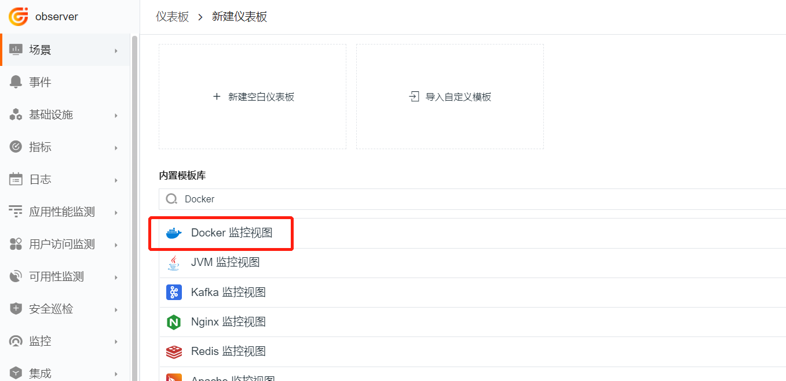

仪表板名称填 **Docker 监控视图1**，名称可以自定义，点击『确定』。
		


进入监控视图，选择主机名和容器名。

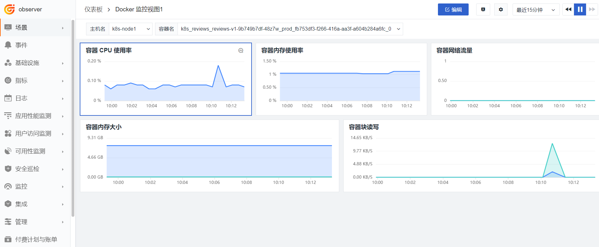

### 1.2 Kubernetes 监控视图

登录『[<<< custom_key.brand_name >>>](https://<<< custom_key.studio_main_site >>>/)』，点击『场景』->『新建仪表板』，选择 **Kubernetes 监控视图**。

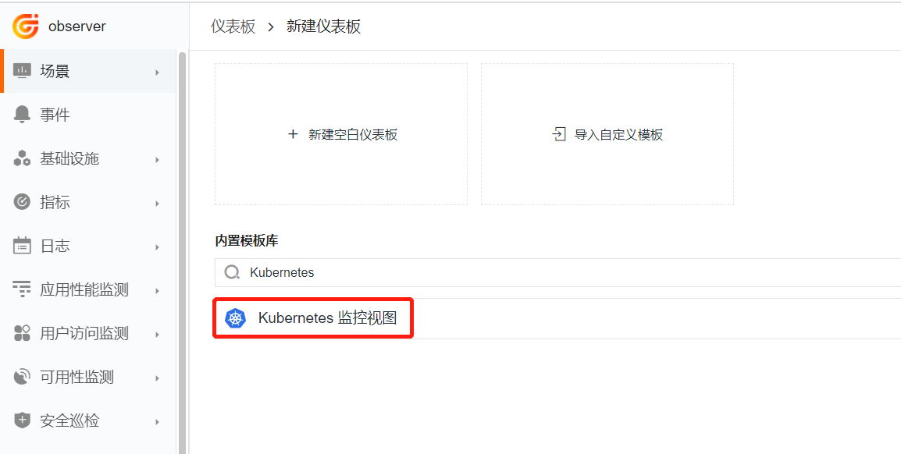

仪表板名称填 **Kubernetes 监控视图**，名称可以自定义，点击『确定』。
		
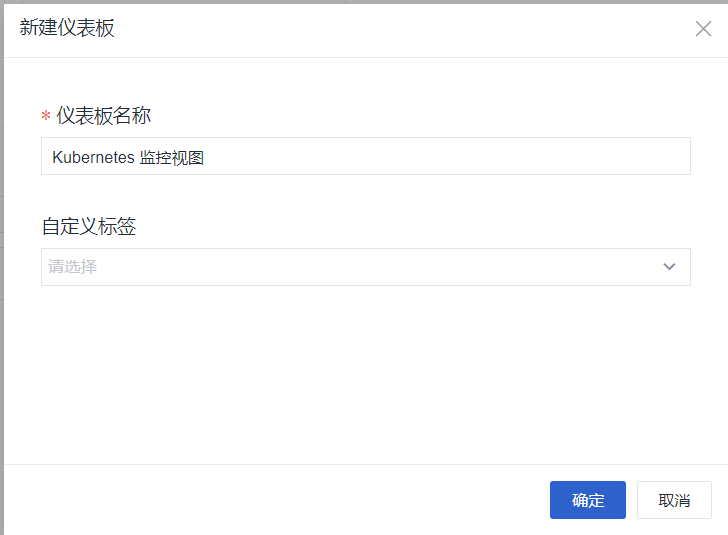

进入监控视图，选择集群名称和命名空间。<br />『注意』集群名称下拉框是在上篇中部署 DataKit 设置的。
		 
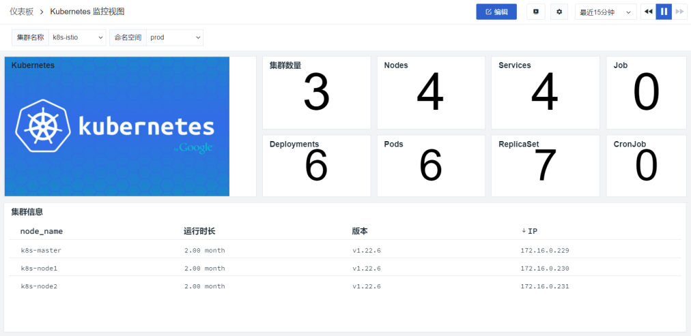


### 1.3 ETCD 监控视图

#### 1.3.1 开通 ETCD 采集器

在 Kubernetes 集群，开通采集器需要使用 ConfigMap 定义配置，然后挂载到 DataKit 相应目录。etcd.conf 内容如下：

```yaml
apiVersion: v1
kind: ConfigMap
metadata:
  name: datakit-conf
  namespace: datakit
data:
    #### etcd
    etcd.conf: |-    
        [[inputs.prom]]
          ## Exporter地址或者文件路径（Exporter地址要加上网络协议http或者https）
          ## 文件路径各个操作系统下不同
          ## Windows example: C:\\Users
          ## UNIX-like example: /usr/local/
          urls = ["https://172.16.0.229:2379/metrics"]

          ## 采集器别名
          source = "etcd"

          ## 指标类型过滤, 可选值为 counter, gauge, histogram, summary
          # 默认只采集 counter 和 gauge 类型的指标
          # 如果为空，则不进行过滤
          metric_types = ["counter", "gauge"]

          ## 指标名称过滤
          # 支持正则，可以配置多个，即满足其中之一即可
          # 如果为空，则不进行过滤
          metric_name_filter = ["etcd_server_proposals","etcd_server_leader","etcd_server_has","etcd_network_client"]

          ## 指标集名称前缀
          # 配置此项，可以给指标集名称添加前缀
          measurement_prefix = ""

          ## 指标集名称
          # 默认会将指标名称以下划线"_"进行切割，切割后的第一个字段作为指标集名称，剩下字段作为当前指标名称
          # 如果配置measurement_name, 则不进行指标名称的切割
          # 最终的指标集名称会添加上measurement_prefix前缀
          # measurement_name = "prom"

          ## 采集间隔 "ns", "us" (or "µs"), "ms", "s", "m", "h"
          interval = "60s"

          ## 过滤tags, 可配置多个tag
          # 匹配的tag将被忽略
          # tags_ignore = ["xxxx"]

          ## TLS 配置
          tls_open = true
          #tls_ca = "/etc/kubernetes/pki/etcd/ca.crt"
          tls_cert = "/etc/kubernetes/pki/etcd/peer.crt"
          tls_key = "/etc/kubernetes/pki/etcd/peer.key"

          ## 自定义指标集名称
          # 可以将包含前缀prefix的指标归为一类指标集
          # 自定义指标集名称配置优先measurement_name配置项
          [[inputs.prom.measurements]]
            prefix = "etcd_"
            name = "etcd"

          ## 自定义认证方式，目前仅支持 Bearer Token
          # [inputs.prom.auth]
          # type = "bearer_token"
          # token = "xxxxxxxx"
          # token_file = "/tmp/token"

          ## 自定义Tags


```

登录『Rancher』，在浏览集群标签下，选择『k8s-solution-cluster』集群，依次进入『更多资源』-> 『Core』-> 『ConfigMaps』，选择 datakit 空间，在 datakit.conf 行点击『编辑配置』，点击『添加』，加入 etcd.conf 配置后点击『保存』。
		


登录『Rancher』，在浏览集群标签下，选择『k8s-solution-cluster』集群，依次进入『工作负载』-> 『DaemonSets』，选择 datakit 工作空间，在 datakit 列，点击右边『编辑配置』。 
	  


进入**存储**界面，添加 etcd.conf 挂载的目录 /usr/local/datakit/conf.d/etcd/etcd.conf，点击『保存』
		
     

#### 1.3.2 挂载证书文件

使用 https 采集 etcd 指标，需要使用 Kubernetes 集群的证书。即需要把 Kubeadmin 部署集群的 /etc/kubernetes/pki/etcd 目录，挂载到 DataKit 的 /etc/kubernetes/pki/etcd 目录。

```yaml
      volumes:
      - hostPath:
          path: /etc/kubernetes/pki/etcd
        name: dir-etcd
```

```yaml
          volumeMounts:
          - mountPath: /etc/kubernetes/pki/etcd
          name: dir-etcd   
```

下面使用 Rancher 来完成配置。登录『Rancher』，在浏览集群标签下，选择『k8s-solution-cluster』集群，依次进入『工作负载』-> 『DaemonSets』，选择 datakit 工作空间，在 datakit 列，点击右边**编辑 YAML**。
		


添加如图内容后，点击保存。
		 
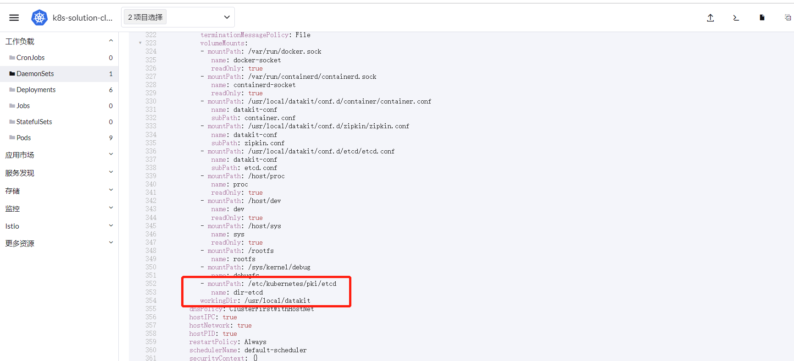

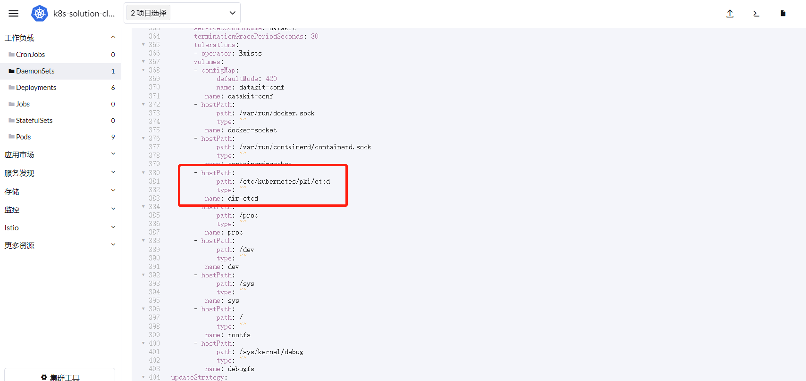


#### 1.3.3 实现 ETCD 可观测

登录『[<<< custom_key.brand_name >>>](https://<<< custom_key.studio_main_site >>>/)』，点击『场景』->『新建仪表板』，选择 **ETCD 监控视图**。

仪表板名称填 **ETCD 监控视图**，名称可以自定义，点击『确定』。
		 


进入监控视图，选择集群名称。
		 


需要了解更多 ETCD 接入方式，请参考 [ETCD](../../integrations/container/etcd.md) 集成文档 集成文档。

## 2 Istio 可观测

### 2.1 Istio Mesh 监控视图

登录『[<<< custom_key.brand_name >>>](https://<<< custom_key.studio_main_site >>>/)』，点击『场景』->『新建仪表板』，选择 **Istio Mesh 监控视图**。
		
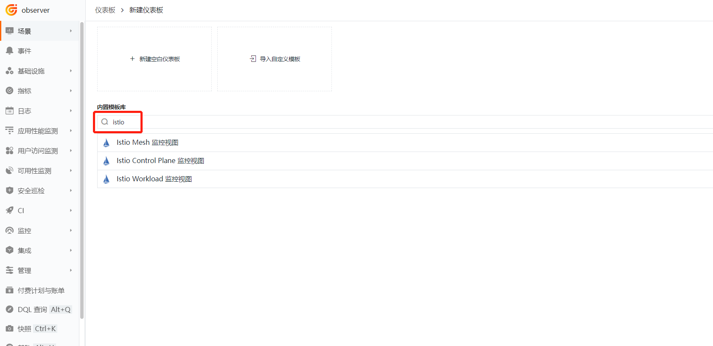

仪表板名称填 **Istio Mesh 监控视图**，名称可以自定义，点击『确定』。
		


进入监控视图，选择集群名称。
		 
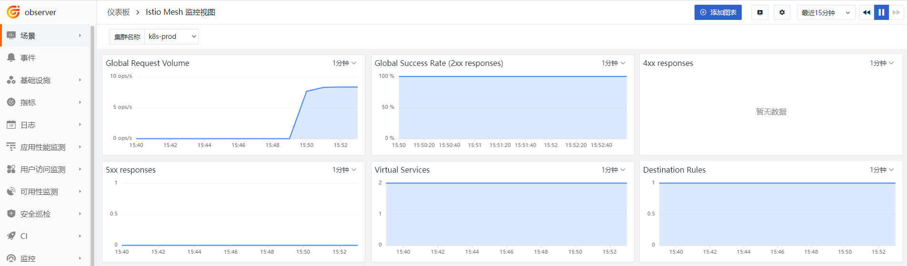

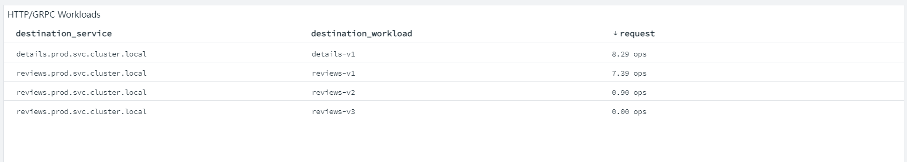


### 2.2 Istio Control Plan 监控视图

登录『[<<< custom_key.brand_name >>>](https://<<< custom_key.studio_main_site >>>/)』，点击『场景』->『新建仪表板』，选择 **Istio Control Plane 监控视图**。
		 


进入监控视图，选择集群名称。
		 


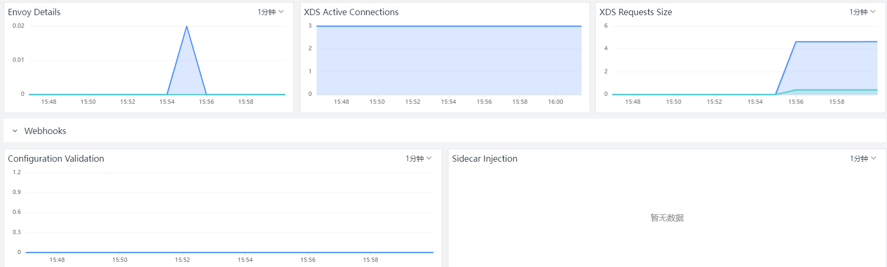

### 2.3 Istio Service 监控视图

登录『[<<< custom_key.brand_name >>>](https://<<< custom_key.studio_main_site >>>/)』，点击『场景』->『新建仪表板』，选择 **Istio Service 监控视图**。

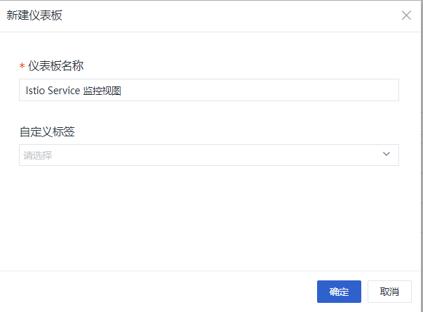

进入监控视图，选择集群名称。


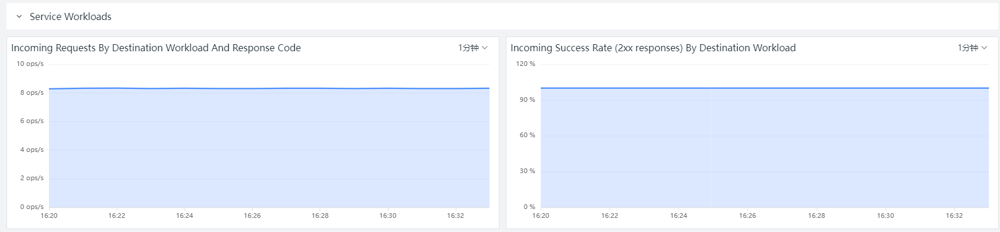

### 2.4 Istio Workload 监控视图

登录『[<<< custom_key.brand_name >>>](https://<<< custom_key.studio_main_site >>>/)』，点击『场景』->『新建仪表板』，选择 **Istio Workload 监控视图**。
		 
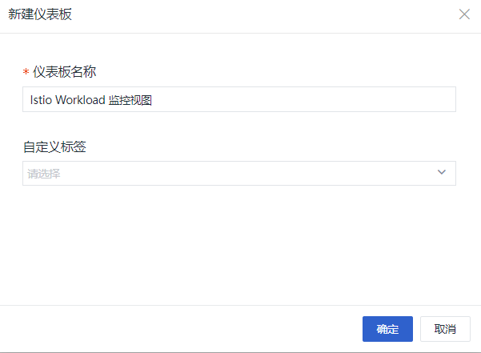

进入监控视图，选择集群名称。
		 
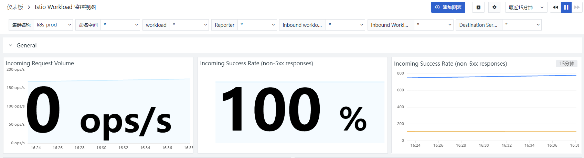


