# service mesh 微服务架构从研发到金丝雀发布全流程最佳实践(下)

---

## 简介

本篇将介绍金丝雀发布的整体情况，利用<<< custom_key.brand_name >>>对微服务的指标、链路、日志进行可观测。以下关于 Rancher 的操作都是在 k8s-solution-cluster 集群，不再重复提示。 

## 金丝雀发布

为了实现金丝雀发布，在部署微服务的 Deployment 上增加 app=reviews 的标签，用来区分微服务名称。第一次部署的版本增加 version=v1 的标签，第二次部署的版本增加 version=v2 的标签。这样根据标签就可以控制每个版本流量进入的多少，比如发布完 v2 后，让 90% 的流量进入 v1 版本，10% 的流量进入 v2 版本，等验证没问题，流量完全切换到 v2 版本，下线 v1 版本。整个发布完成。
		


### 步骤一： 删除 reviews 

第一篇操作中，为了讲述 Gitlab-CI 自动化部署，部署了 reviews 的三个版本，本次操作前，需要删掉 reviews 的三个部署版本。 登录『Rancher』，在集群中，依次进入『工作负载』-> 『Deployments』找到 reviews-v1，在右边选择『删除』。然后再用同样的方式删除 reviews-v2、reviews-v3。


### 步骤二： 发布 reviews-v1

登录『gitlab』，找到 bookinfo-views 项目， 修改 .gitlab-ci.yml 文件中的 APP_VERSION 的值为 "v1"，提交一次代码。登录『Rancher』，在集群中，依次进入『工作负载』-> 『Deployments』可以看到 reviews-v1 部署完成。

	

### 步骤三： 创建 DestinationRule

定义目标地址，为 reviews Service 做服务发现时划分 subsets，分别是 v1 和 v2，为了使用 kubectl 部署该资源，把以下内容保存到 destination-rule-reviews.yaml 文件。

```yaml
apiVersion: networking.istio.io/v1alpha3
kind: DestinationRule
metadata:
  name: reviews
  namespace: prod
spec:
  host: reviews
  subsets:
  - name: v1
    labels:
      version: v1
  - name: v2
    labels:
      version: v2
```

```shell
kubectl create -f destination-rule-reviews.yaml
```

### 步骤四： 创建 VirtualService

再没发布 v2 之前，先把流量完全切换到 v1。把下面的内容存入 virtual-service-reviews.yaml 文件。

```yaml
apiVersion: networking.istio.io/v1alpha3
kind: VirtualService
metadata:
  name: reviews
  namespace: prod
spec:
  hosts:
    - reviews
  http:
  - route:
    - destination:
        host: reviews
        subset: v1
```

```
kubectl create -f virtual-service-reviews.yaml
```

访问 [http://8.136.193.105:32156/productpage](http://8.136.193.105:32156/productpage)。

	

### 步骤五： 发布 reviews-v2

登录『gitlab』，找到 bookinfo-views 项目， 修改 .gitlab-ci.yml 文件中的 APP_VERSION 的值为 "v2"，提交一次代码。登录『Rancher』，在集群中，依次进入『工作负载』-> 『Deployments』可以看到 reviews-v2 部署完成。虽然发布了 v2，此时访问 [http://8.136.193.105:32156/productpage](http://8.136.193.105:32156/productpage)，reviews 微服务只能请求到 V1 版本。

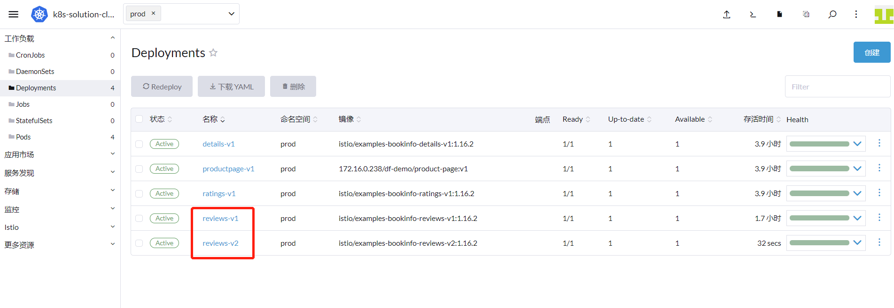	

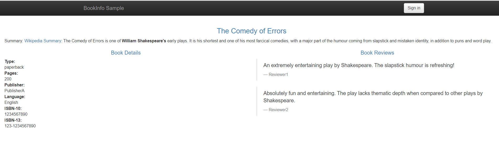	

### 步骤六： 切换 10% 流量到 reviews-v2

修改 virtual-service-reviews.yaml 文件，内容如下：

```yaml
apiVersion: networking.istio.io/v1alpha3
kind: VirtualService
metadata:
  name: reviews
  namespace: prod
spec:
  hosts:
    - reviews
  http:
  - route:
    - destination:
        host: reviews
        subset: v1
      weight: 90
    - destination:
        host: reviews
        subset: v2
      weight: 10
```

重新部署。

```shell
kubectl replace -f virtual-service-reviews.yaml
```

多次访问  [http://8.136.193.105:32156/productpage](http://8.136.193.105:32156/productpage)，reviews 微服务的 v1 版本和 v2 版本分别会接收到 90% 和 10% 的流量， 

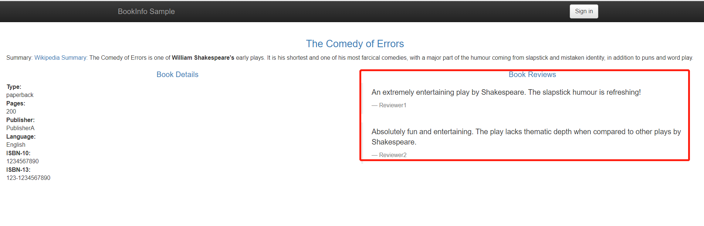	

	

### 步骤七： 观测 reviews-v2

#### 1. 应用性能监测

登录『<<< custom_key.brand_name >>>』->『应用性能监测』-> 右上角拓扑图表。打开区分环境和版本开关，reviews 有两个版本，其中 reviews:test:v2 调用 ratings 服务。
		
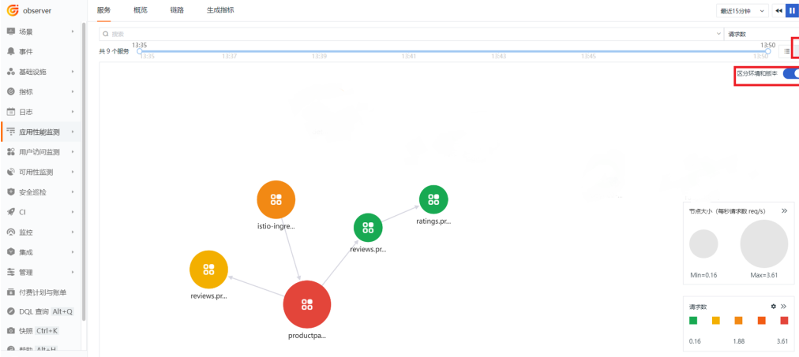	

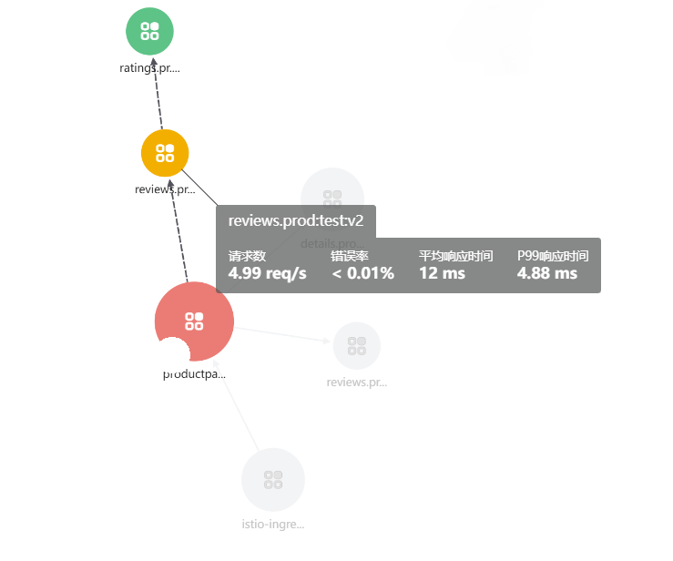	

点击上方的『链路』，本次使用按资源查找功能，选择 reviews.prod，找到 reviews 版本是 v2 的链路，点击进去。
	  
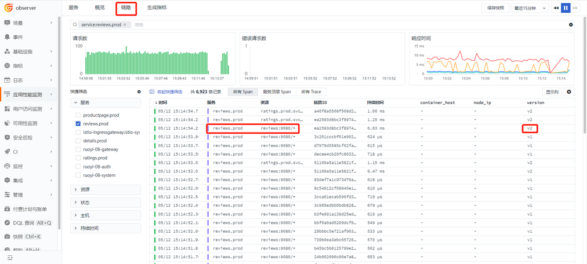

在详情界面观测火焰图，如果有链路调用错误，或者超时等问题，都能清晰地看到。这里的 project、version 和 env 标签，就是在 gitlab 中 bookinfo-views 项目的 deployment.yaml 文件定义的 annotations。

	

Span 列表中查看每个 Span 的执行耗时。   

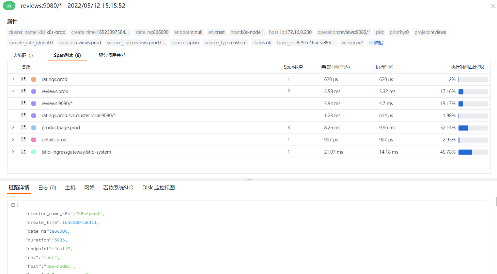	

服务调用关系中，可以看到清晰的拓扑图。

	

##### 2 Istio Mesh 监控视图

登录『[<<< custom_key.brand_name >>>](https://console.guance.com/)』，点击『场景』->『新建仪表板』，选择 **Istio Mesh 监控视图**。在这个视图里面可以看到调用 reviews-v1 和 reviews-v2 的比例基本是 9:1.

	

### 步骤八： 完成发布

在 reviews-v2 版本的微服务经过验证正常后，流量可以完全切换到 v2 版本。 修改 virtual-service-reviews.yaml 文件，内容如下：

```yaml
apiVersion: networking.istio.io/v1alpha3
kind: VirtualService
metadata:
  name: reviews
  namespace: prod
spec:
  hosts:
    - reviews
  http:
  - route:
    - destination:
        host: reviews
        subset: v2
```

重新部署。

```shell
kubectl replace -f virtual-service-reviews.yaml
```

	

『注意』如果 reviews-v2 版本有问题，请登录『 [<<< custom_key.brand_name >>>](https://console.guance.com/)』参考本章最后一节的链路超时分析来分析问题，参考步骤六把流量完全切回 reviews-v1，等问题修复后，重新发布。

# 指标

部署 Bookinfo 时，在使用自定义配置开启 Pod 时，在 annotations 配置中增加了 measurement_name = "istio_prom"，这就是把指标采集到 **istio_prom** 指标集中。登录『<<< custom_key.brand_name >>>』->『指标』，查看 istio_prom 指标集。

	

利用这些指标可以根据自身项目需要，制作类似上步介绍的 **Istio Mesh 监控视图**。 

## 链路

### RUM

登录『 [<<< custom_key.brand_name >>>](https://console.guance.com/)』，进入『用户访问监测』，找到  **devops-bookinfo** 应用，点击进入。

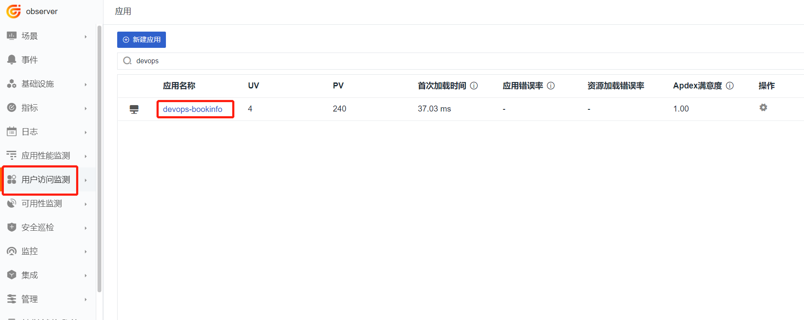

查看 UV、PV、会话数、访问的页面等信息。


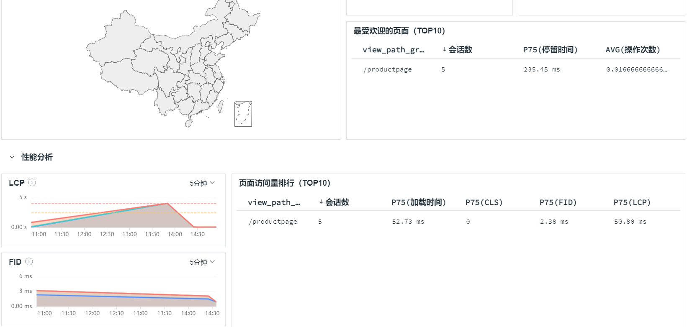

『温馨提示』如果是前后端分离的项目，可以在查看器中与后端链路和日志打通。详细操作步骤请参考 [Kubernetes 应用的 RUM-APM-LOG 联动分析](../k8s-rum-apm-log)。


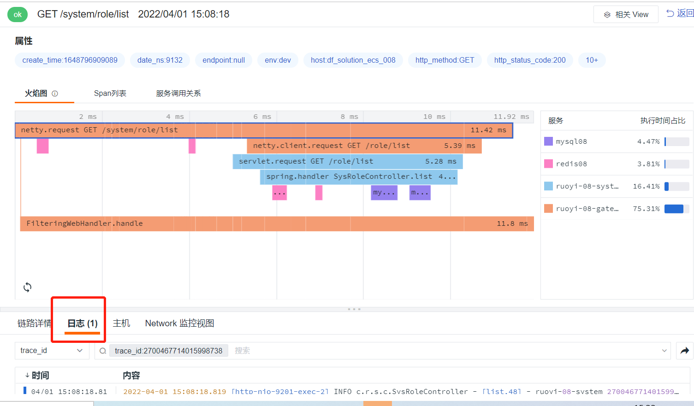

### APM

登录『 [<<< custom_key.brand_name >>>](https://console.guance.com/)』，进入『应用性能监测』。通过应用性能监测，查看链路数据。
		
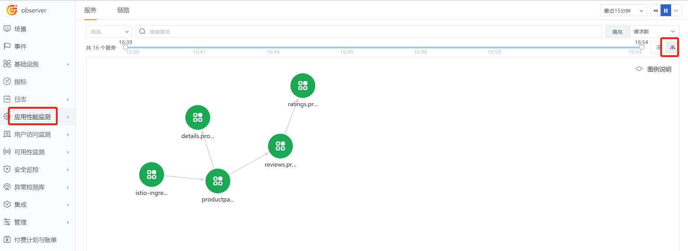

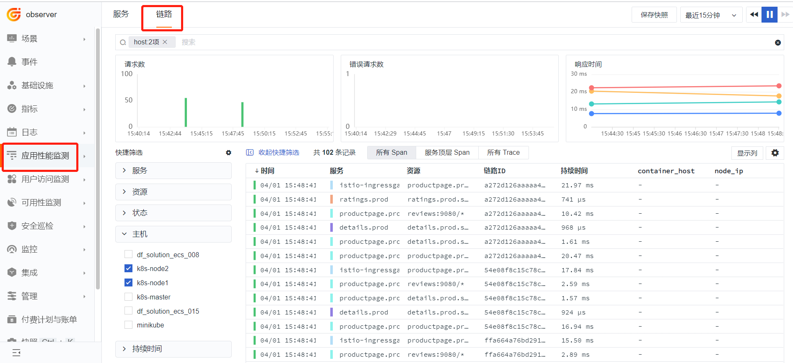

## 日志

### stdout

根据部署 DataKit 时的配置，默认采集输出到 /dev/stdout 的日志。 登录『 [<<< custom_key.brand_name >>>](https://console.guance.com/)』，进入『日志』，查看日志信息。
		


『温馨提示』更多日志采集方式，请参考：

[Pod 日志采集最佳实践](../pod-log)

[Kubernetes 集群中日志采集的几种玩法](../k8s-logs)

## 链路超时分析

Bookinfo 项目有个演示超时的示例，使用 jason 用户登录，ratings 服务会超时。新建 virtual-service-ratings-test-delay.yaml  内容如下：

```yaml
apiVersion: networking.istio.io/v1alpha3
kind: VirtualService
metadata:
  name: ratings
  namespace: prod
spec:
  hosts:
  - ratings
  http:
  - match:
    - headers:
        end-user:
          exact: jason
    fault:
      delay:
        percentage:
          value: 100.0
        fixedDelay: 7s
    route:
    - destination:
        host: ratings
        subset: v1
  - route:
    - destination:
        host: ratings
        subset: v1

```

创建资源。

```shell
kubectl apply -f virtual-service-ratings-test-delay.yaml 
```

使用 jason 登录，密码为空。

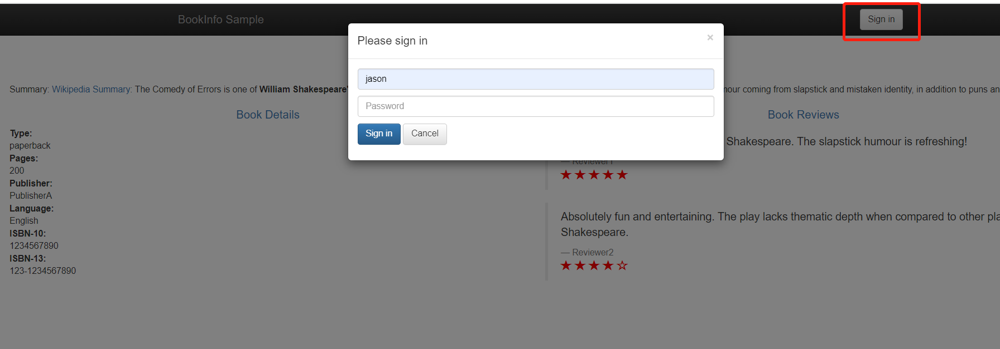

访问  [http://8.136.193.105:32156/productpage](http://8.136.193.105:32156/productpage)，此时 ratings 服务不可达。


登录『 [<<< custom_key.brand_name >>>](https://console.guance.com/)』，进入『应用性能监测』。点击超时的链路。

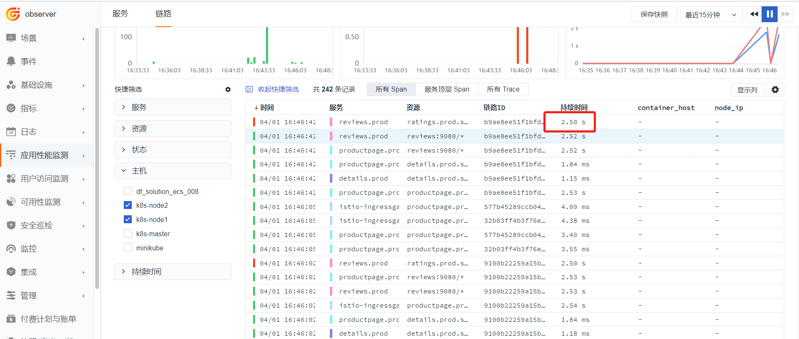

观测火焰图，找出超时调用。

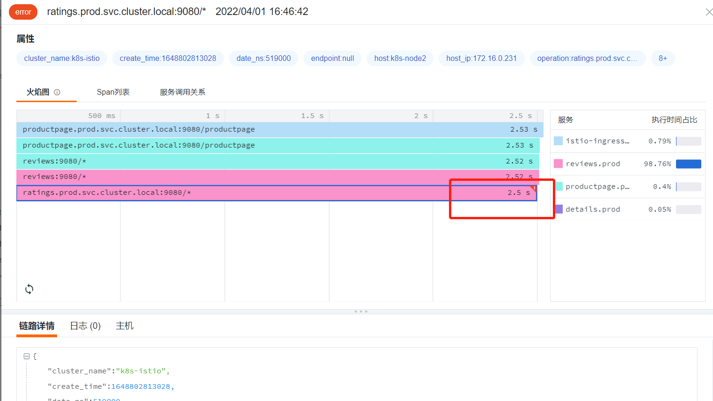
