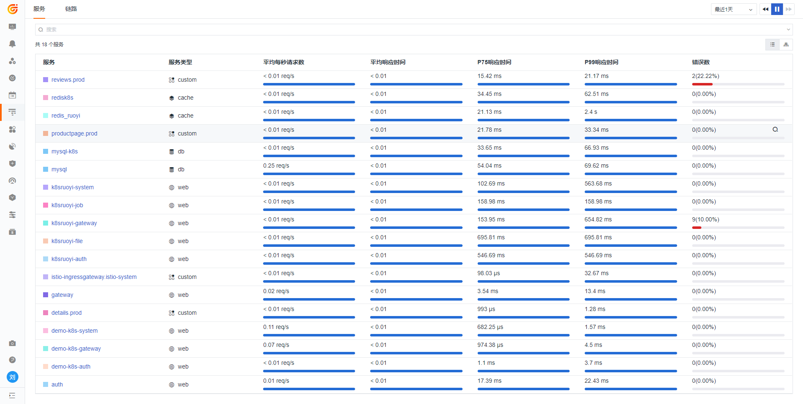

# 海量微服务项目的性能可观测最佳实践

---

> *作者： 刘锐*

## 背景介绍



当您把越来越多的系统集成到{{{ custom_key.brand_name }}}上时，**[应用性能检测]** 列表布满了所有采集上来的 APM 服务。从这些服务当中，查看您想要的项目的服务，可能会眼花缭乱。<br />

此时，您会想到有没有这样的一个视图，像 RUM 一样，也能够概览 APM ，可以让您快速查看各个项目的运行状态：当前项目 API 调用了多少次？有多少次是调用失败的？Top10 延迟的 API 有哪些? 等等。

{{{ custom_key.brand_name }}}在视图方面具备强大的拓展能力，可以根据您的意向构建项目视图。假设您有两个 Java SpringCloud 微服务项目，每个项目又有多个微服务，通过{{{ custom_key.brand_name }}}的视图可以达到如下效果，供您参考：

- **Project A ：**


- **Project B ：**


## 前置条件

- 您已经将应用 APM 集成到{{{ custom_key.brand_name }}} 

- 您的应用基于 K8s 环境部署（非 K8s 环境部署步骤基本上一样，只是不是修改 yaml 文件） 

- 您有多个项目（如 Project A 、Project B ），当然单项目也支持这种做法 

- APM 基于 ddtrace 

## APM链路采集优化

若要实现上述视图效果，需要您对应用和 DataKit 配置做部分微调。<br />
实现上述的视图思路是：

- 在应用端（微服务）启动的时候新增 tag（埋点）为`app_id`，value 值为 projectId（可以用 UUID 生成 32 位的 projectId）。

- 准备两个 `app_id`，分别是 `4a10ede2a69f11eca952fa163e23efe1`（ Project A ）、`aea5a70da66811eca952fa163e23efe1`（ Project B ）。

### 优化微服务应用 yaml

假设您的应用部署在 K8s 上

- Project A 相关微服务 yaml ，部分配置如下：

```yaml
        - name: APP_ID
          value: "4a10ede2a69f11eca952fa163e23efe1"
        - name: JAVA_OPTS
          value: |-
            -javaagent:/usr/dd-java-agent/agent/dd-java-agent.jar -Ddd.service.name=demo-k8s-auth  -Ddd.tags=container_host:$(POD_NAME),app_id:$(APP_ID) -Ddd.service.mapping=redis:redisk8s -Ddd.env=dev -Ddd.agent.port=9529
```

- Project B 相关微服务 yaml ，部分配置如下：

```yaml
        - name: APP_ID
          value: "aea5a70da66811eca952fa163e23efe1"
        - name: JAVA_OPTS
          value: |-
            -javaagent:/usr/dd-java-agent/agent/dd-java-agent.jar -Ddd.service.name=k8sruoyi-auth  -Ddd.tags=container_host:$(POD_NAME),app_id:$(APP_ID) -Ddd.service.mapping=redis:redisk8s -Ddd.env=$(SPRING_BOOT_PROFILE) -Ddd.agent.port=9529
```

### 优化 DataKit yaml

#### 在 ConfigMap 新增 ddtrace.conf

```yaml
    ddtrace.conf: |-
        [[inputs.ddtrace]]
          endpoints = ["/v0.3/traces", "/v0.4/traces", "/v0.5/traces"]
          customer_tags = ["app_id"]

```

这里定义了一个 customer_tags 标签，在这里配置您的 tag 。

同时需要新增 mountPath

```yaml
        - mountPath: /usr/local/datakit/conf.d/ddtrace/ddtrace.conf
          name: datakit-conf
          subPath: ddtrace.conf 
```

#### 关闭 Nacos 注册中心相关链路

如果您的应用用到了注册中心，比如 Nacos 。由于注册中心存在心跳检测，每一次心跳就会产生一个 trace，而这些 trace 在实际生产中数据上报存在着资源浪费，如果您想忽略注册中心相关的 trace，您可以这么做：

(若您不介意的话，可以忽略此步骤。)

```yaml
    ddtrace.conf: |-
        [[inputs.ddtrace]]
          endpoints = ["/v0.3/traces", "/v0.4/traces", "/v0.5/traces"]
          customer_tags = ["app_id"]
            [inputs.ddtrace.close_resource]
               "*" = ["PUT /nacos/*","GET /nacos/*","POST /nacos/*"]

```

> Nacos 注册中心心跳上报检查主要用到了三个 URL ，这里采用了正则的方式进行过滤：<br />
` GET /nacos/v1/ns/instance/list`、`PUT /nacos/v1/ns/instance/beat`、`POST /nacos/v1/cs/configs/listener`。

重启 DataKit 和 应用。至此，优化配置基本完成，快去看看效果吧。


## 更多文档
<[ddtrace 配置](../../integrations/ddtrace.md)>

<[Kubernetes 应用的 RUM-APM-LOG 联动分析](../cloud-native/k8s-rum-apm-log.md)>

