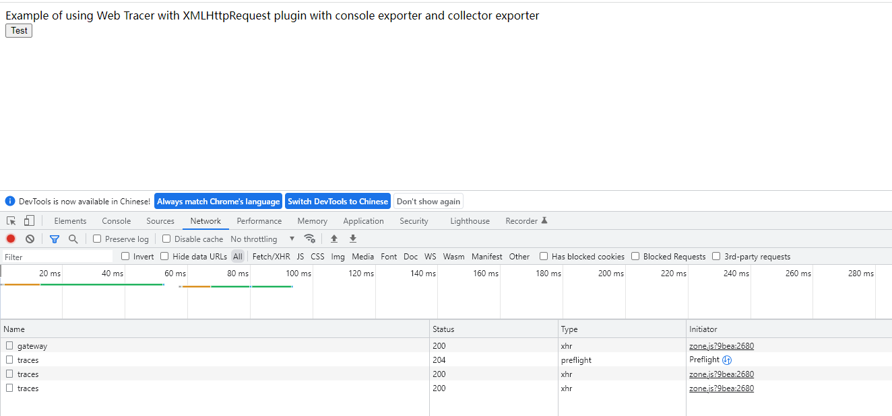
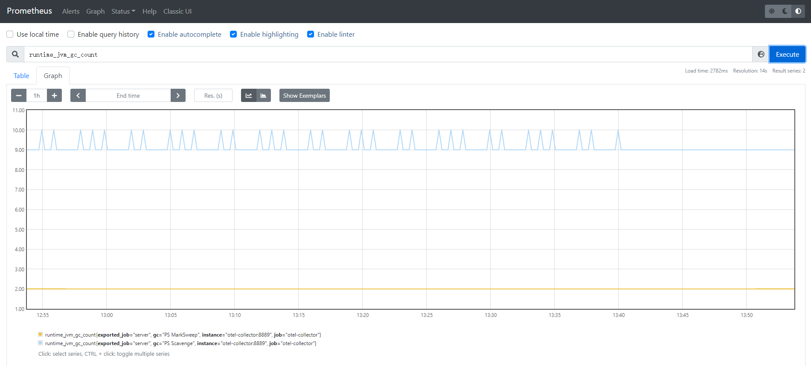
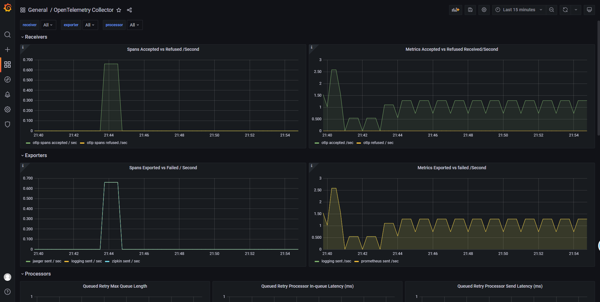

# OpenTelemetry to Jaeger 、Grafana、ELK

----

OpenTelemetry 有很多种开源组合方案，我们通过三种平台/架构来分别介绍并演示 OpenTelemetry 在不同技术架构下部署

> 1、[OpenTelemetry to Jaeger 、Grafana、ELK](./opentelemetry-elk.md)

> 2、[OpenTelemetry to Grafana](./opentelemetry-grafana.md)

> 3、[OpenTelemetry to {{{ custom_key.brand_name }}}](./opentelemetry-guance.md)

## OpenTelemetry
OTEL 是 OpenTelemetry 的简称， 是 CNCF 的一个可观测性项目，旨在提供可观测性领域的标准化方案，解决观测数据的数据模型、采集、处理、导出等的标准化问题，提供与三方 vendor 无关的服务。

OpenTelemetry 是一组标准和工具的集合，旨在管理观测类数据，如 Traces、Metrics、Logs 等 (未来可能有新的观测类数据类型出现)。目前已经是业内的标准。

## OTLP
OTLP（全称 OpenTelemetry Protocol ）是 OpenTelemetry 原生的遥测信号传递协议，虽然在 OpenTelemetry 的项目中组件支持了Zipkin v2或Jaeger Thrift的协议格式的实现，但是都是以第三方贡献库的形式提供的。只有 OTLP 是 OpenTelemetry 官方原生支持的格式。OTLP 的数据模型定义是基于 ProtoBuf 完成的，如果你需要实现一套可以收集 OTLP 遥测数据的后端服务，那就需要了解里面的内容，对应可以参考代码仓库：opentelemetry-proto（[https://github.com/open-telemetry/opentelemetry-proto](https://github.com/open-telemetry/opentelemetry-proto)）

## OpenTelemetry-Collector

OpenTelemetry Collector （以下简称“otel-collector”）针对如何接收、处理和导出遥测数据提供了与供应商无关的实现。它消除了运行、操作和维护多个代理/收集器的需要，以支持将开源可观察性数据格式（例如 Jaeger、Prometheus 等）发送到一个或多个开源或商业后端。此外，收集器让最终用户可以控制他们的数据。收集器是默认位置检测库导出其遥测数据。

## OpenTelemetry-Java

OpenTelemetry基于java语言开发的sdk，支持将数据通过各种exporter 推送到不同的观测平台。

## OpenTelemetry-JS

OpenTelemetry 推出的基于前端 js 的链路追踪。

## 架构

### 架构说明
1、应用 server 和 client 将 metric 、trace 数据通过 otlp-exporter push 到 otel-collector

2、front-app 为前端链路，将链路信息 push 到 otel-collector，并访问应用服务 API

3、otel-collector 对数据进行收集、转换后，将数据 push 到 Jaeger、Zipkin

4、同时 Prometheus 从 otel-collector pull 数据。

日志两种推送方式：

方式一：通过 OTLP 上报日志

应用 server 和 client 将 log 通过 otlp-exporter push 到 otel-collector，再通过 otel-collector exporter 到 Elasticsearch。由于 OpenTelemetry log 方面还不稳定，所以推荐log单独处理，不走 otel-collector，在测试过程中也发下了 同时配置 log 和 metric 存在冲突问题，主要表现在 otel-collector 上，等待官方修复吧。

方式二：通过 Logback-logstash 上报日志

应用 server 和client将 log 通过 Logback-logstash 推送到 logstash。

otel-collector 配置了四个 exporter.

```yaml
  prometheus:
    endpoint: "0.0.0.0:8889"
    const_labels:
      label1: value1
  zipkin:
    endpoint: "http://otel_collector_zipkin:9411/api/v2/spans"
    format: proto
  jaeger:
    endpoint: otel_collector_jaeger:14250
    tls:
      insecure: true
  elasticsearch:
    endpoints: "http://192.168.0.17:9200"
```

> 注意，所有的应用都部署在同一个机器上，机器 ip 为 192.168.0.17。如果应用和一些中间件单独分开部署，则注意修改对应的 IP。如果是云服务器，则注意开放相关端口，以免访问失败。

## 安装部署

### 安装 OpenTelemetry-Collector

#### 源码地址

[https://github.com/lrwh/observable-demo/tree/main/opentelemetry-collector-to-all](https://github.com/lrwh/observable-demo/tree/main/opentelemetry-collector-to-all)

#### 配置 otel-collector-config.yaml

新增 collecter 配置，配置1个recevier（otlp）、4个exporter(prometheus、zipkin、jaeger 和 elasticsearch。

```yaml
receivers:
  otlp:
    protocols:
      grpc:
      http:
        cors:
          allowed_origins:
            - http://*
            - https://*
exporters:
  prometheus:
    endpoint: "0.0.0.0:8889"
    const_labels:
      label1: value1
  zipkin:
    endpoint: "http://otel_collector_zipkin:9411/api/v2/spans"
    format: proto

  jaeger:
    endpoint: otel_collector_jaeger:14250
    tls:
      insecure: true
  elasticsearch:
    endpoints: "http://192.168.0.17:9200"

processors:
  batch:

extensions:
  health_check:
  pprof:
    endpoint: :1888
  zpages:
    endpoint: :55679

service:
  extensions: [pprof, zpages, health_check]
  pipelines:
    traces:
      receivers: [otlp]
      processors: [batch]
      exporters: [zipkin, jaeger]
    metrics:
      receivers: [otlp]
      processors: [batch]
      exporters: [prometheus]
    logs:
      receivers: [otlp]
      processors: [batch]
      exporters: [elasticsearch]


```

通过 docker-compose 安装 otel-collector
```yaml
version: '3.3'

services:
    jaeger:
        image: jaegertracing/all-in-one:1.29
        container_name: otel_collector_jaeger
        ports:
            - 16686:16686
            - 14250
            - 14268
    zipkin:
        image: openzipkin/zipkin:latest
        container_name: otel_collector_zipkin
        ports:
            - 9411:9411
    # Collector
    otel-collector:
        image: otel/opentelemetry-collector:0.50.0
        command: ["--config=/etc/otel-collector-config.yaml"]
        volumes:
            - ./otel-collector-config.yaml:/etc/otel-collector-config.yaml
        ports:
            - "1888:1888"   # pprof extension
            - "8888:8888"   # Prometheus metrics exposed by the collector
            - "8889:8889"   # Prometheus exporter metrics
            - "13133:13133" # health_check extension
            - "4317:4317"        # OTLP gRPC receiver
            - "4318:4318"        # OTLP http receiver
            - "55670:55679" # zpages extension
        depends_on:
            - jaeger
            - zipkin
    prometheus:
        container_name: prometheus
        image: prom/prometheus:latest
        volumes:
            - ./prometheus.yaml:/etc/prometheus/prometheus.yml
        ports:
            - "9090:9090"
    grafana:
        container_name: grafana
        image: grafana/grafana
        ports:
            - "3000:3000"


```
#### 配置 Prometheus
```yaml
scrape_configs:
  - job_name: 'otel-collector'
    scrape_interval: 10s
    static_configs:
      - targets: ['otel-collector:8889']
      - targets: ['otel-collector:8888']
```
#### 启动容器

```yaml
docker-compose up -d
```

#### 查看启动情况

```yaml
docker-compose ps
```


### Docker 安装 ELK

采用 Docker 安装 ELK ,简单又方便，相关组件版本为`7.16.2`。

#### 拉取镜像

```shell
docker pull docker.elastic.co/elasticsearch/elasticsearch:7.16.2
docker pull docker.elastic.co/logstash/logstash:7.16.2
docker pull docker.elastic.co/kibana/kibana:7.16.2
```
#### 配置目录

```shell
# Linux 特有配置
sysctl -w vm.max_map_count=262144
sysctl -p
# Linux 配置结束

mkdir -p ~/elk/elasticsearch/plugins
mkdir -p ~/elk/elasticsearch/data
mkdir -p ~/elk/logstash
chmod 777 ~/elk/elasticsearch/data
```

#### Logstash配置

```shell
input {
  tcp {
    mode => "server"
    host => "0.0.0.0"
    port => 4560
    codec => json_lines
  }
}
output {
  elasticsearch {
    hosts => "es:9200"
    index => "springboot-logstash-demo-%{+YYYY.MM.dd}"
  }
}
```
input 参数说明：

> tcp : 为tcp协议。
> port： tcp 端口
> codec：json行解析

#### Docker-compose 配置

```shell
version: '3'
services:
  elasticsearch:
    image: docker.elastic.co/elasticsearch/elasticsearch:7.16.2
    container_name: elasticsearch
    volumes:
      - ~/elk/elasticsearch/plugins:/usr/share/elasticsearch/plugins #插件文件挂载
      - ~/elk/elasticsearch/data:/usr/share/elasticsearch/data #数据文件挂载
    environment:
      - "cluster.name=elasticsearch" #设置集群名称为elasticsearch
      - "discovery.type=single-node" #以单一节点模式启动
      - "ES_JAVA_OPTS=-Xms512m -Xmx512m" #设置使用jvm内存大小
      - "ingest.geoip.downloader.enabled=false" # (Dynamic, Boolean) If true, Elasticsearch automatically downloads and manages updates for GeoIP2 databases from the ingest.geoip.downloader.endpoint. If false, Elasticsearch does not download updates and deletes all downloaded databases. Defaults to true.
    ports:
      - 9200:9200
  logstash:
    image: docker.elastic.co/logstash/logstash:7.16.2
    container_name: logstash
    volumes:
      - ~/elk/logstash/logstash.conf:/usr/share/logstash/pipeline/logstash.conf #挂载logstash的配置文件
    depends_on:
      - elasticsearch #kibana在elasticsearch启动之后再启动
    links:
      - elasticsearch:es #可以用es这个域名访问elasticsearch服务
    ports:
      - 4560:4560
  kibana:
    image: docker.elastic.co/kibana/kibana:7.16.2
    container_name: kibana
    depends_on:
      - elasticsearch #kibana在elasticsearch启动之后再启动
    links:
      - elasticsearch:es #可以用es这个域名访问elasticsearch服务
    environment:
      - "elasticsearch.hosts=http://es:9200" #设置访问elasticsearch的地址
    ports:
      - 5601:5601
```

#### 启动容器

```yaml
docker-compose up -d
```

#### 查看启动情况

```yaml
docker-compose ps
```


### Springboot 应用接入（APM）

#### 源码地址

[https://github.com/lrwh/observable-demo/tree/main/springboot-server](https://github.com/lrwh/observable-demo/tree/main/springboot-server)

#### 启动 server

```yaml
java -javaagent:opentelemetry-javaagent-1.13.1.jar \
-Dotel.traces.exporter=otlp \
-Dotel.exporter.otlp.endpoint=http://localhost:4350 \
-Dotel.resource.attributes=service.name=server,username=liu \
-Dotel.metrics.exporter=otlp \
-Dotel.logs.exporter=otlp \
-Dotel.propagators=b3 \
-jar springboot-server.jar --client=true
```

#### 启动 client

```yaml
java -javaagent:opentelemetry-javaagent-1.13.1.jar \
-Dotel.traces.exporter=otlp \
-Dotel.exporter.otlp.endpoint=http://localhost:4350 \
-Dotel.resource.attributes=service.name=client,username=liu \
-Dotel.metrics.exporter=otlp \
-Dotel.logs.exporter=otlp \
-Dotel.propagators=b3 \
-jar springboot-client.jar
```

#### 参数说明

otel.traces.exporter：otlp # 配置exporter类型为 otlp，默认otlp。

otel.exporter.otlp.endpoint： otlp exporter endpoint （grpc）

otel.resource.attributes： 配置tag。

otel.metrics.exporter：otlp # 配置 metrics exporter类型，默认none。

otel.logs.exporter：otlp # 配置 logs exporter 类型，默认none。

otel.propagators： 配置trace的传播器。

由于 OpenTelemetry log 方面并不成熟稳定，所以不推荐生产使用，测试过程中也出现一些 Bug，仅作为学习。

### Springboot 应用接入（Log）

#### 方式一：通过 OTLP 上报日志

应用 server 和 client 将 log 通过 otlp-exporter push 到 otel-collector，再通过 otel-collector exporter 到 Elasticsearch。

##### 修改启动参数

需要在应用启动时添加参数`-Dotel.logs.exporter=otlp`
```yaml
java -javaagent:opentelemetry-javaagent-1.13.1.jar \
-Dotel.traces.exporter=otlp \
-Dotel.exporter.otlp.endpoint=http://localhost:4350 \
-Dotel.resource.attributes=service.name=server,username=liu \
-Dotel.metrics.exporter=otlp \
-Dotel.logs.exporter=otlp \
-Dotel.propagators=b3 \
-jar springboot-server.jar --client=true
```
```yaml
java -javaagent:opentelemetry-javaagent-1.13.1.jar \
-Dotel.traces.exporter=otlp \
-Dotel.exporter.otlp.endpoint=http://localhost:4350 \
-Dotel.resource.attributes=service.name=client,username=liu \
-Dotel.metrics.exporter=otlp \
-Dotel.logs.exporter=otlp \
-Dotel.propagators=b3 \
-jar springboot-client.jar
```
启动后，日志会通过 otlp 协议传输到 otel-collector，并由 otel-collector exporter 到 Elasticsearch。

#### 方式二：通过 Logstash-logback 上报日志

主要是通过 Logstash-logback  提供的 socket 方式将日志上传到 Logstash 上，需要对代码做部分调整。

##### 1、项目Maven引用 Logstash-logback

```toml
<dependency>
  <groupId>net.logstash.logback</groupId>
  <artifactId>logstash-logback-encoder</artifactId>
  <version>7.0.1</version>
</dependency>
```
#### 2、新增 logback-logstash.xml
```java
<?xml version="1.0" encoding="UTF-8"?>
<configuration scan="true" scanPeriod="30 seconds">
    <!-- 部分参数需要来源于properties文件 -->
    <springProperty scope="context" name="logName" source="spring.application.name" defaultValue="localhost.log"/>
    <!-- 配置后可以动态修改日志级别-->
    <jmxConfigurator />
    <property name="log.pattern" value="%d{HH:mm:ss} [%thread] %-5level %logger{10} [traceId=%X{trace_id} spanId=%X{span_id} userId=%X{user-id}] %msg%n" />

    <springProperty scope="context" name="logstashHost" source="logstash.host" defaultValue="logstash"/>
    <springProperty scope="context" name="logstashPort" source="logstash.port" defaultValue="4560"/>
    <!-- %m输出的信息,%p日志级别,%t线程名,%d日期,%c类的全名,,,, -->
    <appender name="STDOUT" class="ch.qos.logback.core.ConsoleAppender">
        <encoder>
            <pattern>${log.pattern}</pattern>
            <charset>UTF-8</charset>
        </encoder>
    </appender>

    <appender name="FILE" class="ch.qos.logback.core.rolling.RollingFileAppender">
        <file>logs/${logName}/${logName}.log</file>    <!-- 使用方法 -->
        <append>true</append>
        <rollingPolicy class="ch.qos.logback.core.rolling.SizeAndTimeBasedRollingPolicy">
            <fileNamePattern>logs/${logName}/${logName}-%d{yyyy-MM-dd}.log.%i</fileNamePattern>
            <maxFileSize>64MB</maxFileSize>
            <maxHistory>30</maxHistory>
            <totalSizeCap>1GB</totalSizeCap>
        </rollingPolicy>
        <encoder>
            <pattern>${log.pattern}</pattern>
            <charset>UTF-8</charset>
        </encoder>
    </appender>

    <!-- LOGSTASH输出设置 -->
    <appender name="LOGSTASH" class="net.logstash.logback.appender.LogstashTcpSocketAppender">
        <!-- 配置logStash 服务地址 -->
        <destination>${logstashHost}:${logstashPort}</destination>
        <!-- 日志输出编码 -->
        <encoder class="net.logstash.logback.encoder.LoggingEventCompositeJsonEncoder">
            <providers>
                <timestamp>
                    <timeZone>UTC+8</timeZone>
                </timestamp>
                <pattern>
                    <pattern>
                        {
                        "podName":"${podName:-}",
                        "namespace":"${k8sNamespace:-}",
                        "severity": "%level",
                        "serverName": "${logName:-}",
                        "traceId": "%X{trace_id:-}",
                        "spanId": "%X{span_id:-}",
                        "pid": "${PID:-}",
                        "thread": "%thread",
                        "class": "%logger{40}",
                        "message": "%message\n%exception"
                        }
                    </pattern>
                </pattern>
            </providers>
        </encoder>
        <!-- 保活 -->
        <keepAliveDuration>5 minutes</keepAliveDuration>
    </appender>

    <!-- 只打印error级别的内容 -->
    <logger name="net.sf.json" level="ERROR" />
    <logger name="org.springframework" level="ERROR" />

    <root level="info">
        <appender-ref ref="STDOUT"/>
        <appender-ref ref="LOGSTASH"/>
    </root>
</configuration>

```
##### 3、新增 application-logstash.yml

```java
logstash:
  host: localhost
  port: 4560
logging:
  config: classpath:logback-logstash.xml
```

##### 4、重新打包

```java
mvn clean package -DskipTests
```

##### 5、启动服务

```yaml
java -javaagent:opentelemetry-javaagent-1.13.1.jar \
-Dotel.traces.exporter=otlp \
-Dotel.exporter.otlp.endpoint=http://localhost:4350 \
-Dotel.resource.attributes=service.name=server,username=liu \
-Dotel.metrics.exporter=otlp \
-Dotel.propagators=b3 \
-jar springboot-server.jar --client=true \
--spring.profiles.active=logstash \
--logstash.host=localhost \
--logstash.port=4560
```
```yaml
java -javaagent:opentelemetry-javaagent-1.13.1.jar \
-Dotel.traces.exporter=otlp \
-Dotel.exporter.otlp.endpoint=http://localhost:4350 \
-Dotel.resource.attributes=service.name=client,username=liu \
-Dotel.metrics.exporter=otlp \
-Dotel.logs.exporter=otlp \
-Dotel.propagators=b3 \
-jar springboot-client.jar \
--spring.profiles.active=logstash \
--logstash.host=localhost \
--logstash.port=4560
```

### JS 接入（RUM）

#### 源码地址

[https://github.com/lrwh/observable-demo/tree/main/opentelemetry-js](https://github.com/lrwh/observable-demo/tree/main/opentelemetry-js)

#### 配置 OTLPTraceExporter

```javascript
const otelExporter = new OTLPTraceExporter({
  // optional - url default value is http://localhost:55681/v1/traces
  url: 'http://192.168.91.11:4318/v1/traces',
  headers: {},
});
```

此处 url 为 otel-collector 的 otlp 接收地址（ http 协议）。

#### 配置server_name

```javascript
const providerWithZone = new WebTracerProvider({
      resource: new Resource({
        [SemanticResourceAttributes.SERVICE_NAME]: 'front-app',
      }),
    }
);
```

#### 安装

```toml
npm install
```

#### 启动

```toml
npm start
```
默认端口`8090`

## APM 与 RUM 关联

APM 与 RUM 主要通过 header 参数进行关联，为了保持一直，需要配置统一的传播器（`Propagator`），这里RUM 采用的是 `B3`，所以 APM 也需要配置`B3`，只需要在 APM 启动参数加上`-Dotel.propagators=b3`即可。

## APM 与 Log 关联

APM 与 Log 主要是通过在日志埋点 traceId 和 spanId。不同的日志接入方式，埋点有差异。

## UI展示

通过访问前端url产生 trace 信息。



### ELK 日志展示

ELK 为 ElasticSearch 、Logstash 、Kibana 简称。

#### 通过 OTLP 上报日志


展开后日志 source 部分

```json
"_source": {
  "@timestamp": "2022-05-18T08:39:20.661000000Z",
  "Body": "this is method3,null",
  "Resource.container.id": "7478",
  "Resource.host.arch": "amd64",
  "Resource.host.name": "cluster-ecs07",
  "Resource.os.description": "Linux 3.10.0-1160.15.2.el7.x86_64",
  "Resource.os.type": "linux",
  "Resource.process.command_line": "/usr/java/jdk1.8.0_111/jre:bin:java -javaagent:opentelemetry-javaagent-1.13.1.jar -Dotel.traces.exporter=otlp -Dotel.exporter.otlp.endpoint=http://localhost:4350 -Dotel.resource.attributes=service.name=server,username=liu -Dotel.metrics.exporter=otlp -Dotel.logs.exporter=otlp -Dotel.propagators=b3",
  "Resource.process.executable.path": "/usr/java/jdk1.8.0_111/jre:bin:java",
  "Resource.process.pid": 5728,
  "Resource.process.runtime.description": "Oracle Corporation Java HotSpot(TM) 64-Bit Server VM 25.111-b14",
  "Resource.process.runtime.name": "Java(TM) SE Runtime Environment",
  "Resource.process.runtime.version": "1.8.0_111-b14",
  "Resource.service.name": "server",
  "Resource.telemetry.auto.version": "1.13.1",
  "Resource.telemetry.sdk.language": "java",
  "Resource.telemetry.sdk.name": "opentelemetry",
  "Resource.telemetry.sdk.version": "1.13.0",
  "Resource.username": "liu",
  "SeverityNumber": 9,
  "SeverityText": "INFO",
  "SpanId": "bb890485f7b6ba05",
  "TraceFlags": 1,
  "TraceId": "b4841a6b3ec9aa93d7f002393a156ff5"
  },
```

通过 otlp 协议，实现了traceId 和 spanId 在 log 上的自动埋点。

### 通过 Logstash-logback 上报日志


展开后日志 source 部分

```json
  "_source": {
    "@timestamp": "2022-05-18T13:43:34.790Z",
    "port": 55630,
    "serverName": "otlp-server",
    "namespace": "k8sNamespace_IS_UNDEFINED",
    "message": "this is tag\n",
    "@version": "1",
    "severity": "INFO",
    "thread": "http-nio-8080-exec-1",
    "pid": "3975",
    "host": "gateway",
    "class": "c.z.o.server.controller.ServerController",
    "traceId": "a7360264491f074a1b852cfcabb10fdb",
    "spanId": "e4a8f1c4606ca598",
    "podName": "podName_IS_UNDEFINED"
  },
```

通过 Logstash-logback 方式需要将 traceId 和 spanId 手动埋点。

### Prometheus & Grafana 指标展示





### Jaeger、Zipkin 链路展示


[下一篇 ](./opentelemetry-grafana.md)我们来介绍 OpenTelemetry 是如何基于 grafana 相关组件进行可观测。
