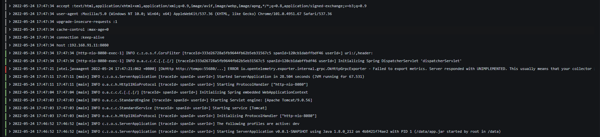

# OpenTelemetry to Grafana

---

[上一篇](./opentelemetry-elk.md) 我们主要介绍并演示了基于 OpenTelemetry 传统的开源组件的可观测。随着这两年可观测的流行，Grafana 也开始进军可观测行业。
### 概念

> OTEL
>  
> OTEL 是 OpenTelemetry 的简称， 是 CNCF 的一个可观测性项目，旨在提供可观测性领域的标准化方案，解决观测数据的数据模型、采集、处理、导出等的标准化问题，提供与三方 vendor 无关的服务。
>  
> OpenTelemetry 是一组标准和工具的集合，旨在管理观测类数据，如 Trace、Metrics、Logs 等 (未来可能有新的观测类数据类型出现)。目前已经是业内的标准。


> Tempo
>  
> Grafana Tempo 是一个开源、易于使用且大规模的分布式跟踪后端。Tempo 具有成本效益，只需要对象存储即可运行，并且与 Grafana、Prometheus 和 Loki 深度集成。Tempo 可与任何开源跟踪协议一起使用，包括 Jaeger、Zipkin 和 OpenTelemetry。
>  
> Tempo 项目于 2020 年在 Grafana 实验室启动，并于 10 月在 Grafana ObservabilityCON 上宣布。Tempo 是在 AGPLv3 许可下发布的。


> Loki
>  
> Loki是 Grafana Labs 团队最新的开源项目，是一个水平可扩展，高可用性，多租户的日志聚合系统。它的设计非常经济高效且易于操作，因为它不会为日志内容编制索引，而是为每个日志流编制一组标签。项目受 Prometheus 启发，官方的介绍就是：Like Prometheus, but for logs.，类似于 Prometheus 的日志系统。


### 架构


执行流程

1.  OTEL 采集输出 Springboot 应用的 Trace数据，并为对应的日志打上 tag: Traceid、Spanid 标签。 
1.  Tempo 收集处理 OTEL 数据并本地化存储。Tempo Query 为 Tempo 的检索后端服务。 
1.  Loki 收集 Springboot 应用的日志数据。 
1.  Grafana Dashboard 用于展示和查看Tempo traces 数据和日志数据。 

###  安装配置

#### 1、配置 docker-compose.yaml

```yaml
version: '3.3'

services:
    server:
        image: registry.cn-shenzhen.aliyuncs.com/lr_715377484/springboot-server:latest
        container_name: springboot_server
        ports:
            - 8080:8080
        environment:
            - OTEL_EXPORTER=otlp_span,prometheus
            - OTEL_EXPORTER_OTLP_ENDPOINT=http://tempo:55680
            - OTEL_EXPORTER_OTLP_INSECURE=true
            - OTEL_RESOURCE_ATTRIBUTES=service.name=springboot-server
            - JAVA_OPTS=-javaagent:/opentelemetry-javaagent.jar
        logging:
            driver: loki
            options:
                loki-url: 'http://localhost:3100/api/prom/push'
    loki:
        image: grafana/loki:2.2.0
        container_name: loki
        command: -config.file=/etc/loki/local-config.yaml
        ports:
            - "3100:3100"
        logging:
            driver: loki
            options:
                loki-url: 'http://localhost:3100/api/prom/push'
    tempo:
        image: grafana/tempo:0.6.0
        container_name: tempo
        command: ["--target=all", "--storage.trace.backend=local", "--storage.trace.local.path=/var/tempo", "--auth.enabled=false"]
        ports:
            - 8081:80
            - 55680:55680
    tempo-query:
        image: grafana/tempo-query:0.6.0
        container_name: tempo-query
        #command: ["--grpc-storage-plugin.configuration-file=/etc/tempo-query.yaml"]
        environment:
            - BACKEND=tempo:80
        volumes:
            - ./etc/tempo-query.yaml:/etc/tempo-query.yaml
        ports:
            - "16686:16686"  # jaeger-ui
        depends_on:
            - tempo
        logging:
            driver: loki
            options:
                loki-url: 'http://localhost:3100/api/prom/push'
    grafana:
        image: grafana/grafana:7.3.7
        container_name: grafana
        volumes:
            - ./config/grafana:/etc/grafana/provisioning/datasources
        environment:
            - GF_AUTH_ANONYMOUS_ENABLED=true
            - GF_AUTH_ANONYMOUS_ORG_ROLE=Admin
            - GF_AUTH_DISABLE_LOGIN_FORM=true
        ports:
            - "3000:3000"
        logging:
            driver: loki
            options:
                loki-url: 'http://localhost:3100/api/prom/push'                
```

#### 2、配置 Grafana

当我们把程序部署好后，可以在 Grafana 配置数据源，新版 Grafana 支持采用 yaml 方式方便提前配置好数据源.

```yaml
apiVersion: 1

deleteDatasources:
  - name: Prometheus
  - name: Tempo

datasources:
- name: Tempo
  type: tempo
  access: proxy
  orgId: 1
  url: http://tempo-query:16686
  basicAuth: false
  isDefault: false
  version: 1
  editable: false
  apiVersion: 1
  uid: tempo
- name: Loki
  type: loki
  access: proxy
  orgId: 1
  url: http://loki:3100
  basicAuth: false
  isDefault: false
  version: 1
  editable: false
  apiVersion: 1
  jsonData:
    derivedFields:
      - datasourceUid: tempo
        matcherRegex: (?:traceID|trace_id)=(\w+)
        name: TraceID
        url: $${__value.raw}
```

Loki 通过日志解析，将匹配到的 traceid 设置 Url，便于我们通过日志直接关联查询链路相关信息，实现日志链路的打通。

#### 3、docker 安装 loki 插件
> _docker plugin install grafana/loki-docker-driver:latest --alias loki --grant-all-permissions_

#### 4、启动
> docker-compose up -d

#### 5、查看启动情况
> docker-compose ps


#### 6、访问产生链路信息和日志信息
> curl http://localhost:8080/gateway


### 观测

通过 Grafana，输入应用的过滤条件，即可查到对应应用的日志信息。如果当前日志级别是 Error，Grafana标红显示让我们一目了然。



点击日志记录，可以查看日志相关的 Tag，若当前日志存在 traceid，Grafana 将自动匹配到 Tempo，点击 Tempo 按钮可以跳转到当前日志 Trace下的链路详情。通过这样的方式，方便我们快速定位问题。


切换 Tempo 视图，通过 traceId可以查询链路明细。


### 拓展

Tempo 存储和检索跟踪，是一个后端服务，tempo同时需要与其他链路追踪协议一起使用：Jaeger、Zipkin 、OPTL 。Tempo 并不能算是 Traces 采集器，而是中转站，链路用其他协议，如 Jaeger、Zipkin 等，将数据汇聚至 Tempo。

Tempo 作为 Grafana-labs 新的孵化产品并不成熟，在使用 Tempo 过程中如若出现的一些问题，需极大的依赖Grafana 团队社区协助，增加了沟通成本。

Loki 的作为新型的日志存储工具，也有着自身的优缺点：

优点

-  Loki 的架构非常简单，使用了和 Prometheus 一样的标签来作为索引，通过这些标签既可以查询日志的内容也可以查询到监控的数据，不但减少了两种查询之间的切换成本，也极大地降低了日志索引的存储。 
-  与 ELK 相比，消耗的成本更低，具有成本效益。 
-  在日志的收集以及可视化上可以连用 Grafana，实现在日志上的筛选以及查看上下行的功能。 

缺点：

-  技术比较新颖，相对应的论坛不是非常活跃。 
-  功能单一，只针对日志的查看，筛选有好的表现，对于数据的处理以及清洗没有ELK强大，同时与ELK相比，对于后期，ELK 可以连用各种技术进行日志的大数据处理，但是 Loki 不行。 


本文demo 源码 [https://github.com/lrwh/observable-demo/blob/main/opentelemetry-to-grafana](https://github.com/lrwh/observable-demo/blob/main/opentelemetry-to-grafana)

[下一篇](./opentelemetry-guance.md)我们主要介绍并演示 OpenTelemetry 基于<<< custom_key.brand_name >>>平台的可观测。

