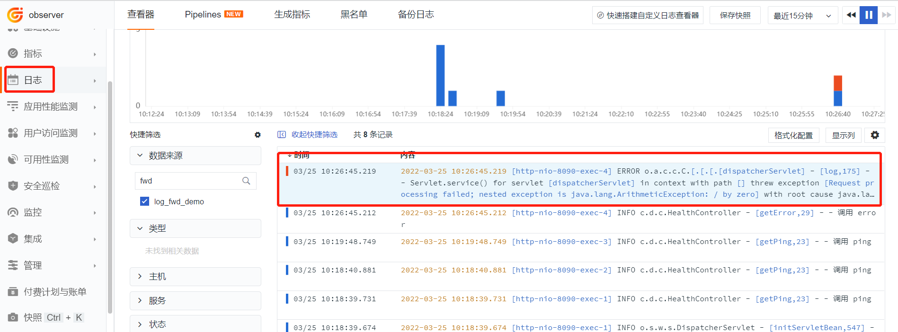
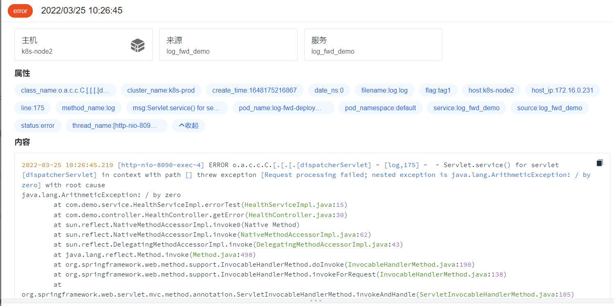
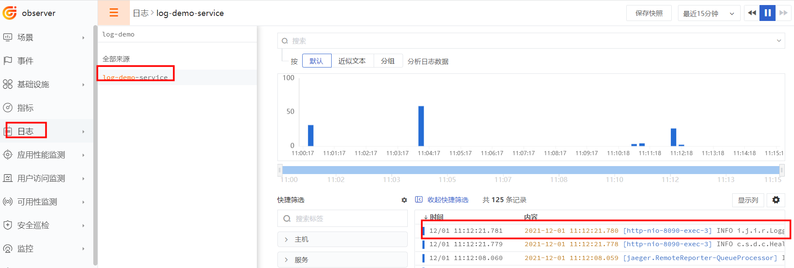
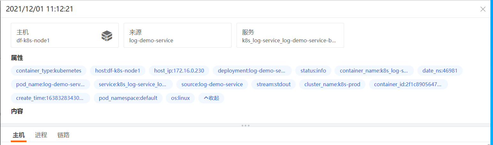

# Pod 日志采集最佳实践

---

## 前言

使用容器化部署微服务时，微服务运行在容器中。Pod 是由一个或一组紧耦合的容器组成，是 Kubernetes 中最小的调度单元。

针对 Pod 中日志，本文列举了通过 DataKit 收集日志的三种方案。

## 方案一

DataKit 开通 Logfwd 采集器，Logfwd 以 Sidecar 模式收集业务容器日志。

### 1 开通 Logfwd 采集器

如果 Kubernetes 未集成 DataKit ，请登录[<<< custom_key.brand_name >>>](https://console.guance.com/)，「集成」 - 「Datakit」 - 「Kubernetes」，使用 `datakit.yaml` 文件集成 DataKit 。


下面修改 `datakit.yaml` 文件，把 logfwdserver.conf 文件挂载到 DataKit 的 `/usr/local/datakit/conf.d/log/` 目录。

在 `datakit.yaml` 中增加如下配置：

```yaml
---
apiVersion: v1
kind: ConfigMap
metadata:
  name: datakit-conf
  namespace: datakit
data:
  #### logfwdserver
  logfwdserver.conf: |-
    [inputs.logfwdserver]
      ## logfwd 接收端监听地址和端口
      address = "0.0.0.0:9531"

      [inputs.logfwdserver.tags]
      # some_tag = "some_value"
      # more_tag = "some_other_value"
```

在 Daemonset 资源中增加：

```yaml
- mountPath: /usr/local/datakit/conf.d/log/logfwdserver.conf
  name: datakit-conf
  subPath: logfwdserver.conf
```

### 2 挂载 Pipeline

修改 `datakit.yaml` 文件，把 `pod-logging-demo.p` 文件挂载到 DataKit 的 `/usr/local/datakit/pipeline/` 目录。

在 ConfigMap 资源中增加：

```toml
    pod-logging-demo.p: |-
        #日志样式
        #2021-12-01 10:41:06.015 [http-nio-8090-exec-2] INFO  c.s.d.c.HealthController - [getPing,19] -  - 调用 ping接口
        grok(_, "%{TIMESTAMP_ISO8601:time} %{NOTSPACE:thread_name} %{LOGLEVEL:status}%{SPACE}%{NOTSPACE:class_name} - \\[%{NOTSPACE:method_name},%{NUMBER:line}\\] -  - %{GREEDYDATA:msg}")


        default_time(time,"Asia/Shanghai")
```

在 Daemonset 资源中增加：

```yaml
- mountPath: /usr/local/datakit/pipeline/pod-logging-demo.p
  name: datakit-conf
  subPath: pod-logging-demo.p
```

> **注意：**如果不需要使用 Pipeline 做日志切割，此步骤可忽略。

### 3 重启 Datakit

```shell
kubectl delete -f datakit.yaml
kubectl apply -f datakit.yaml
```

### 4 Logfwd side 采集日志

把 Logfwd 镜像和业务镜像部署在同一个 Pod 中，下面以 `log-demo-service:v1` 作为业务镜像，生成 `/data/app/logs/log.log` 日志文件，使用 logfwd 以共享存储的方式读取日志文件，把日志传给 Datakit。使用 `pod-logging-demo.p` 切割日志，使用日期做多行匹配。

??? quote " 相关配置文件示例"

    ```yaml
    apiVersion: apps/v1
    kind: Deployment
    metadata:
      name: log-fwd-deployment
    spec:
      replicas: 1
      selector:
        matchLabels:
          app: log-fwd-pod
      template:
        metadata:
          labels:
            app: log-fwd-pod
          annotations:
        spec:
          nodeName: k8s-node2
          containers:
            - name: log-fwd-container
              image: 172.16.0.238/df-demo/log-demo-service:v2
              ports:
                - containerPort: 8090
                  protocol: TCP
              volumeMounts:
                - mountPath: /data/app/logs
                  name: varlog
            - name: logfwd
              image: pubrepo.jiagouyun.com/datakit/logfwd:1.2.12
              env:
                - name: LOGFWD_DATAKIT_HOST
                  valueFrom:
                    fieldRef:
                      apiVersion: v1
                      fieldPath: status.hostIP
                - name: LOGFWD_DATAKIT_PORT
                  value: "9531"
                - name: LOGFWD_ANNOTATION_DATAKIT_LOGS
                  valueFrom:
                    fieldRef:
                      apiVersion: v1
                      fieldPath: metadata.annotations['datakit/logs']
                - name: LOGFWD_POD_NAME
                  valueFrom:
                    fieldRef:
                      apiVersion: v1
                      fieldPath: metadata.name
                - name: LOGFWD_POD_NAMESPACE
                  valueFrom:
                    fieldRef:
                      apiVersion: v1
                      fieldPath: metadata.namespace
              volumeMounts:
                - mountPath: /var/log
                  name: varlog
                - mountPath: /opt/logfwd/config
                  name: logfwd-config
                  subPath: config
          restartPolicy: Always
          volumes:
            - name: varlog
              emptyDir: {}
            - configMap:
                name: logfwd-conf
              name: logfwd-config
    ---
    apiVersion: v1
    kind: ConfigMap
    metadata:
      name: logfwd-conf
    data:
      config: |
        [
            {            
                "loggings": [
                    {
                        "logfiles": ["/var/log/log.log"],
                        "source": "log_fwd_demo",                    
                        "pipeline": "pod-logging-demo.p",
                        "multiline_match": "^\\d{4}-\\d{2}-\\d{2}",
                        "tags": {
                            "flag": "tag1"
                        }
                    }
                ]
            }
        ]
    ```

logfwd-conf 参数说明

- logfiles: 日志文件列表。
- ignore: 文件路径过滤，使用 glob 规则，符合任意一条过滤条件将不会对该文件进行采集。
- source: 数据来源。
- service: 新增标记 tag，如果为空，则默认使用 $source。
- pipeline: 使用 pipeline 时，定义脚本路径。
- character_encoding: 选择编码。
- multiline_match: 多行匹配。
- remove_ansi_escape_codes: 是否删除 ANSI 转义码，例如标准输出的文本颜色等，值为 true 或 false。
- tags：以 key 和 value 的方式定义标签，非必填项。

环境变量说明

- LOGFWD_DATAKIT_HOST: DataKit 地址。
- LOGFWD_DATAKIT_PORT: Logfwd 端口

```shell
kubectl apply -f log-fwd-deployment.yaml
```

### 5 查看日志

登录<<< custom_key.brand_name >>> - 「日志」，数据源搜索 log_fwd_demo。





## 方案二

DataKit 默认采集 Pod 中输出到 Stdout 中的日志。为了对日志格式进行特殊处理，通常会在部署 Pod 的 Deployment 控制器的 yaml 文件中增加 Annotations。

下面以 Springboot 的微服务项目做的一个日志采集示例，jar 包是 `log-springboot-demo-1.0-SNAPSHOT.jar`，日志使用 Logback。具体步骤如下：

### 1 编写 logback-spring.xml

??? quote "`logback-spring.xml`"

    ```xml
    <?xml version="1.0" encoding="UTF-8"?>

    <configuration scan="true" scanPeriod="60 seconds" debug="false">
        <contextName>logback</contextName>

        <!-- 日志根目录 - - 
        <property name="log.root.dir" value="./logs"/>
        <!-- 日志输出格式 - - 
        <property name="log.pattern" value="%d{yyyy-MM-dd HH:mm:ss.SSS} [%thread] %-5level %logger{20} - [%method,%line] -  - %msg%n" />

        <!-- 打印日志到控制台 - - 
        <appender name="Console" class="ch.qos.logback.core.ConsoleAppender">
            <encoder>
                <pattern>${log.pattern}</pattern>
            </encoder>
        </appender>

        <root level="INFO">
            <appender-ref ref="Console"/>
        </root>
    </configuration>
    ```

### 2 制作镜像

Dockerfile 如下：

```bash
FROM openjdk:8u292

RUN /bin/cp /usr/share/zoneinfo/Asia/Shanghai /etc/localtime
RUN echo 'Asia/Shanghai' >/etc/timezone
ENV jar log-springboot-demo-1.0-SNAPSHOT.jar

ENV workdir /data/app/
RUN mkdir -p ${workdir}
WORKDIR ${workdir}
ENTRYPOINT ["sh", "-ec", "exec java ${JAVA_OPTS} -jar ${jar} "]
```

制作镜像并上传到 harbor 仓库：

```bash
 docker build -t <your-harbor>/log-demo-service:v1  .
 docker push <your-harbor>/log-demo-service:v1
```

### 3 编写 pod-log-service.yaml 文件

??? quote "`pod-log-service.yaml`"

    ```yaml
    apiVersion: v1
    kind: Service
    metadata:
      name: log-demo-service
      labels:
        app: log-demo-service
    spec:
      selector:
        app: log-demo-service
      ports:
        - protocol: TCP
          port: 8090
          nodePort: 30053
          targetPort: 8090
      type: NodePort
    ---
    apiVersion: apps/v1
    kind: Deployment
    metadata:
      name: log-demo-service
      labels:
        app: log-demo-service
    spec:
      replicas: 1
      selector:
        matchLabels:
          app: log-demo-service
      template:
        metadata:
          labels:
            app: log-demo-service
          annotations:
            datakit/logs: |
              [
                {
                  "source": "pod-logging-testing-demo",
                  "service": "pod-logging-testing-demo",
                  "pipeline": "pod-logging-demo.p",
                  "multiline_match": "^\\d{4}-\\d{2}-\\d{2}"
                }
              ]

        spec:
          containers:
            - env:
                - name: POD_NAME
                  valueFrom:
                    fieldRef:
                      fieldPath: metadata.name
              name: log-service
              image: <your-harbor>/log-demo-service:v1
              ports:
                - containerPort: 8090
                  protocol: TCP

          restartPolicy: Always
          volumes:
            - name: ddagent
              emptyDir: {}
    ```

Annotations 参数说明

- source: 数据来源
- service: tag 标记
- pipeline: pipeline 脚本路径
- ignore_status:
- multiline_match: 正则表达式匹配一行日志，如示例中以日期(比如 2021-11-26)开始的为一行日志，下行中如果不是此日期开始则认为此行日志是上条日志一部分
- remove_ansi_escape_codes: 是否删除 ANSI 转义码，例如标准输出的文本颜色等

### 4 配置 Pipeline

`datakit-default.yaml` 文件的 ConfigMap 资源中增加 `pod-logging-demo.p` 部分

```yaml
apiVersion: v1
kind: ConfigMap
metadata:
  name: datakit-conf
  namespace: datakit
data:
  pod-logging-demo.p: |-
    #日志样式
    #2021-12-01 10:41:06.015 [http-nio-8090-exec-2] INFO  c.s.d.c.HealthController - [getPing,19] -  - 调用 ping接口
    grok(_, "%{TIMESTAMP_ISO8601:time} %{NOTSPACE:thread_name} %{LOGLEVEL:status}%{SPACE}%{NOTSPACE:class_name} - \\[%{NOTSPACE:method_name},%{NUMBER:line}\\] -  - %{GREEDYDATA:msg}")

    default_time(time)
```

把 `Pod-logging-demo.p` 挂载到 DataKit 中

```yaml
- mountPath: /usr/local/datakit/pipeline/pod-logging-demo.p
  name: datakit-conf
  subPath: pod-logging-demo.p
```

### 5 查看日志

执行如下命令部署 Pod :

```bash
kuectl apply -f pod-log-service.yaml
```

访问微服务:

```shell
curl localhost:30053/ping
```

登录[<<< custom_key.brand_name >>>](https://console.guance.com/) 「日志」模块，输入 log-demo-service ，成功查看到日志。





## 方案三

Pod 挂载 Volume ，使用卷类型是 hostPath ，把日志文件挂载到宿主机上，再使用 Daemonset 部署 DataKit ，同样挂载 hostPath 类型的 Volume ，这样 DataKit 就能采集到 Pod 中的日志文件。
