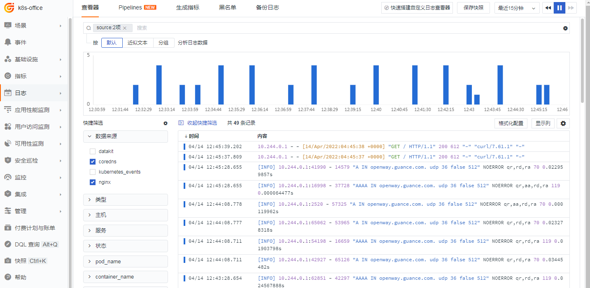
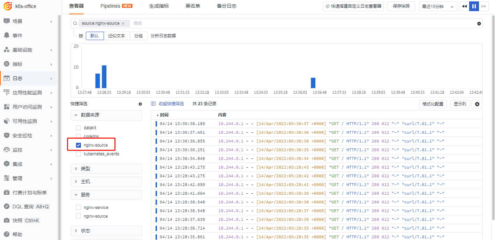
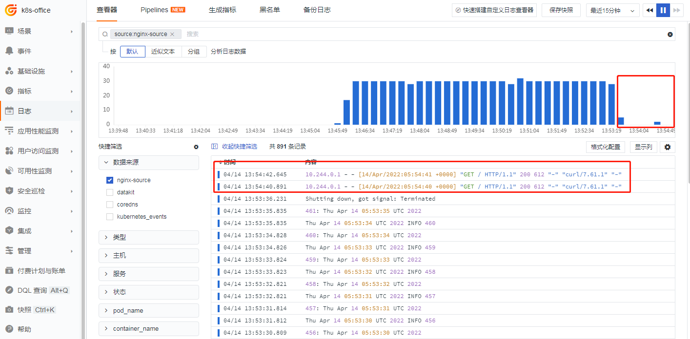

# Kubernetes 下 StdOut 日志白名单最佳实践

---

## 环境准备

已有 Kubernetes 环境（简称 K8s），本实践基于自建 Kubernetes v1.23.1，观测云 Datakit 版本 1.2.13，Nginx 1.17。

Datakit 已经部署好，Datakit 配置文件 `container.conf` 通过 ConfigMap 方式管理。

> **注意：**阿里云容器服务（Alibaba Cloud Container Service for Kubernetes）或其他云服务商的 Kubernetes 配置原理类似。

## 前置条件

Nginx 日志在 K8s 环境中的输出为 StdOut 方式，而非文件方式。观测云 Datakit 以 DaemonSet 部署后，默认采集 K8s 内部所有 StdOut 日志输出，包括集群内部组件的 StdOut 输出方式，如 CoreDNS（需开启日志）。本文涉及的日志均为 Stdout 方式输出。

注：StdOut 是开发工程师写代码时，选择日志控制台的输出方式，如：

```
<appender name="console" class="ch.qos.logback.core.ConsoleAppender">
```

## 白名单需求

Datakit 部署完成后，按需采集指定的业务 Pod 日志、K8s 集群组件的日志，后续新增的未指定的业务 Pod 日志不会采集，另外对同一个 Pod 里的多容器日志采集只采集其中一个或多个。

本文通过观测云采集器 Datakit 不同的日志过滤方法来实现，使用给日志加 Annotation 标注（包括过滤 Pod 内部其他容器产生的日志）和 `container.conf` 中的 `container_include_log = []`组合来实现。

> 更详细日志处理原理，可参考<[Datakit 日志处理综述](../../integrations/datakit-logging-how.md)>

## 实现方式

### 方式一 使用 container_include_log = []

只采集集群组件 coredns 和 nginx 日志，`container_include_log` 用正则语法编写 image 的名称。
> 具体见<[根据容器 image 配置指标和日志采集](../../integrations/container.md)>

```toml
      [inputs.container]
        docker_endpoint = "unix:///var/run/docker.sock"
        containerd_address = "/var/run/containerd/containerd.sock"

        enable_container_metric = true
        enable_k8s_metric = true
        enable_pod_metric = true

        ## Containers logs to include and exclude, default collect all containers. Globs accepted.
        container_include_log = ["image:*coredns*","image:*nginx*"]
        container_exclude_log = ["image:pubrepo.jiagouyun.com/datakit/logfwd*", "image:pubrepo.jiagouyun.com/datakit/datakit*"]

        exclude_pause_container = true

        ## Removes ANSI escape codes from text strings
        logging_remove_ansi_escape_codes = false

        kubernetes_url = "https://kubernetes.default:443"

        ## Authorization level:
        ##   bearer_token -> bearer_token_string -> TLS
        ## Use bearer token for authorization. ('bearer_token' takes priority)
        ## linux at:   /run/secrets/kubernetes.io/serviceaccount/token
        ## windows at: C:\var\run\secrets\kubernetes.io\serviceaccount\token
        bearer_token = "/run/secrets/kubernetes.io/serviceaccount/token"
        # bearer_token_string = "<your-token-string>"

        [inputs.container.tags]
          # some_tag = "some_value"
          # more_tag = "some_other_value"
```

#### 实现效果

这样就按需采集指定 image 名称的 Pod 日志，如下图：



### 方式二 组合 container_include_log = []和 Annotation 标记

只采集集群组件 coredns 和 nginx 日志，同时通过 Annotation 对 nginx 标记，当然未在 `container_include_log` 中开启的白名单，比如另外的镜像 busybox，也可以通过 Annotation 方式标记后采集上来。这是由于 Annotation 标记的方式优先级高。

> 更详细日志处理原理，可参考<[Datakit 日志处理综述](../../integrations/datakit-logging-how.md)>

Nginx 的 Annotation 标记

```bash
      labels:
         app: nginx-pod
      annotations:
        datakit/logs: |
          [
            {
              "disable": false,
              "source": "nginx-source",
              "service": "nginx-source",
              "pipeline": "",
              "multiline_match": ""
            }
          ]
    spec:
```

```toml
[inputs.container]
  docker_endpoint = "unix:///var/run/docker.sock"
  containerd_address = "/var/run/containerd/containerd.sock"

  ## Containers metrics to include and exclude, default not collect. Globs accepted.
  container_include_metric = []
  container_exclude_metric = ["image:*"]

  ## Containers logs to include and exclude, default collect all containers. Globs accepted.
  container_include_log = ["image:*coredns*","image:*nginx*"]
  container_exclude_log = []

  exclude_pause_container = true

  ## Removes ANSI escape codes from text strings
  logging_remove_ansi_escape_codes = false
  ## Maximum length of logging, default 32766 bytes.
  max_logging_length = 32766

  kubernetes_url = "https://kubernetes.default:443"

  ## Authorization level:
  ##   bearer_token -> bearer_token_string -> TLS
  ## Use bearer token for authorization. ('bearer_token' takes priority)
  ## linux at:   /run/secrets/kubernetes.io/serviceaccount/token
  ## windows at: C:\var\run\secrets\kubernetes.io\serviceaccount\token
  bearer_token = "/run/secrets/kubernetes.io/serviceaccount/token"
  # bearer_token_string = "<your-token-string>"

  [inputs.container.tags]
    # some_tag = "some_value"
    # more_tag = "some_other_value"
```

#### 实现效果



### 方式三 过滤 Pod 中的某容器日志

只采集集群组件 coredns 和 nginx 日志，同时通过 Annotation 对 nginx 标记里的 `"only_images"` 字段开启只需要容器的 image，也就是在 Pod 内部也有个白名单策略。

#### 开启 Pod 内白名单前

如下图，nginx 和 busybox 日志均采集


#### 开启 Pod 内白名单

```bash
      labels:
         app: nginx-pod
      annotations:
        datakit/logs: |
          [
            {
              "disable": false,
              "source": "nginx-source",
              "service": "nginx-source",
              "pipeline": "",
              "only_images": ["image:*nginx*"],
              "multiline_match": ""
            }
          ]
    spec:
```

#### 实现效果

仅保留 Pod 内 Nginx 日志<br />



## 总结

其实不建议开启白名单策略，白名单可能会造成很多问题，且不好调试，白名单可能会有无法预期的效果，比如开发打个日志没看到，实际上是没加某个 Tag。要过滤日志来源，黑名单失效最差情况是数据采集上来，黑名单过滤比如在 Datakit 采集器 `container.conf` 中的

```bash
container_exclude_log = ["image:pubrepo.jiagouyun.com/datakit/logfwd*"]
```

方式一，是没有使用 Annotation 标记，而是用采集器 `container.conf` 中内置的过滤方式，更偏向底层的方式实现。但是这种方式不如方式二，因为标记的方式可以对日志的来源做更好的 Tag，未来分析问题，做筛选方便些，另外也更灵活点，标记是在业务 Pod 上，可以做到，同一批业务 Image 进行精细化的日志过滤管控。<br />方式三结合具体的业务场景，过滤掉一些不必要的 Sidecar 等日志，可以过滤掉不必要的日志，达到日志采集降噪的效果。
