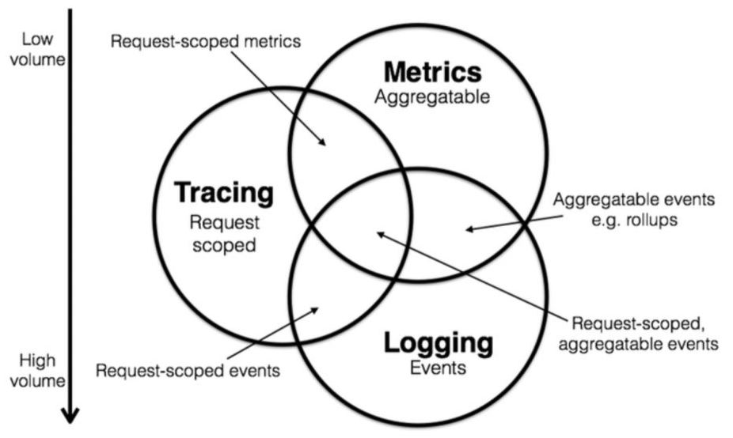
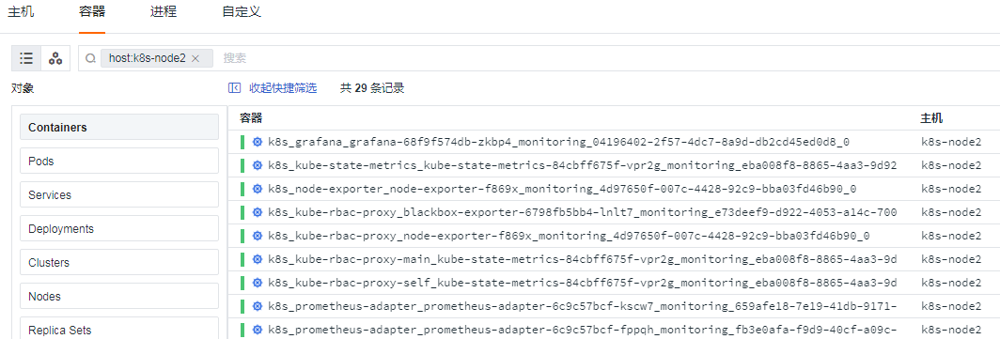
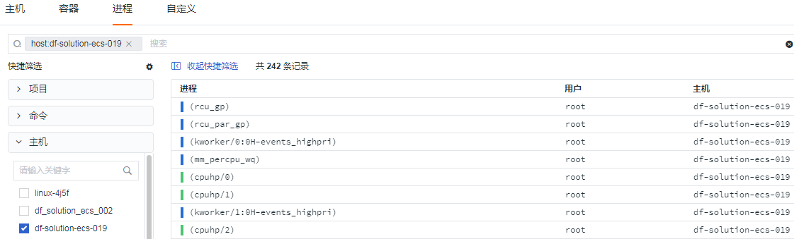
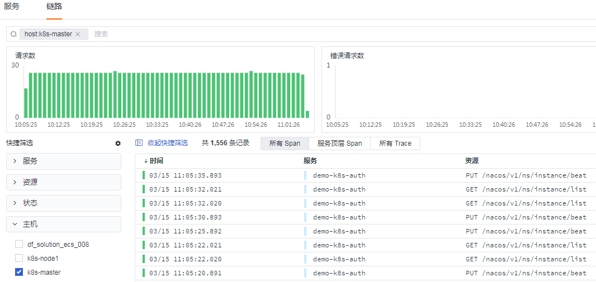
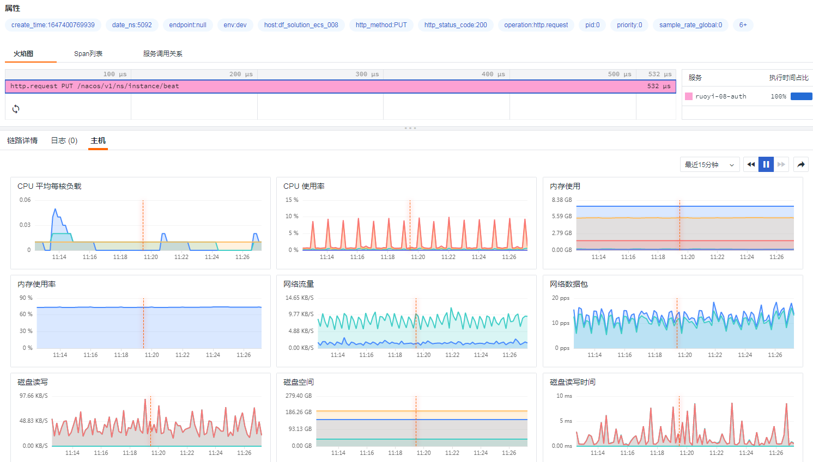
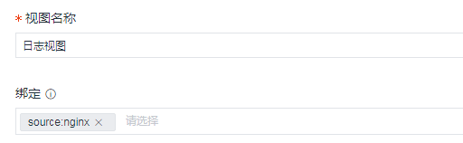

# 数据关联最佳实践

---

## 前言

Opentelemetry 协议，是 CNCF (Cloud Native Computing Foundation -云原生计算基金会) 定义的最新一代可观测规范，该规范定义了可观测性的三大支柱：Metrics、Trace、Log (指标、链路、日志)，三者之间的关联数据分析成为了各大厂商的必争之地。



{{{ custom_key.brand_name }}}作为国内领先的可观测产品，如何打破技术壁垒，攻克难关？

## 数据关联

### 指标
通常由一个"值"表示，可以是数字，字符串，浮点，布尔值等等

#### 指标关联

前置条件

- 视图里必须添加 by 条件 (单击任意视图可查看)

- 关联目标必须带有该条件 (标签)

```
M::`cpu`:(LAST(`usage_total`)) BY `host`
```

#### 日志
点击视图，**查看相关日志**，即可跳转至日志模块


#### 容器

**查看相关容器**，即可跳转至容器模块，快速查询该宿主机 (Node) 上所有的容器



#### 进程

**查看相关进程**，即可跳转至进程模块，快速查询该主机上所有的进程 (需要开启 [Processes 采集](/datakit/host_processes/))



#### 链路

**查看相关链路**，即可跳转至链路模块，快速查询该主机上所有的链路


### 日志

系统/应用运行过程中所产生的记录，故障排查的依据，也可以用作数据统计分析

#### 日志关联

前置条件

- 通常以主机名作为关联条件 (可自定义)

- 关联目标必须带有该条件 (标签)

#### 指标

点击任意一条日志记录，选择 **指标视图**，即可查看该日志所在的主机系统运行情况 (虚线代表日志记录时刻)


#### 容器

点击任意一条日志记录，选择主机，**查看相关容器**，即可跳转至容器模块


#### 进程

**查看相关进程**，即可跳转至进程模块，快速查询该主机上所有的进程 (需要开启 [Processes 采集](/datakit/host_processes/))


#### 链路

(主机关联) **查看相关链路**，即可跳转至链路模块，快速查询该主机上所有的链路



#### 安全

**查看相关巡检**，即可跳转至安全巡检模块，快速查询该主机上的安全漏洞 (需要部署 [Scheck](/datakit/sec-checker/))


### 链路

随着互联网架构扩张，分布式系统的广泛使用，应用间的调用变得极为复杂，链路追踪可以有效地快速定位问题。

#### 链路关联

前置条件

- 通常以主机名/trace_id 作为关联条件 (可自定义)

- 关联目标必须带有该条件 (标签)

#### 指标

点击任意一条链路记录，选择 **主机 - 指标视图**，即可查看该链路所在的主机系统运行情况 (虚线代表链路记录时刻)


#### 日志

点击任意一条链路记录，选择 **日志 - traceid**，即可查看该链路所产生的日志记录 (需要配置日志输出 trace_id)


### 自定义

{{{ custom_key.brand_name }}}产品除了默认的数据关联功能外，还支持更加灵活的用户自定义视图关联

#### 自定义关联

管理 - 内置视图 - 用户视图 - 创建视图，支持五种字段，分别对应不同的数据

- service (链路服务)

- app_id (应用)

- source (日志源)

- project (项目)

- label (标记)




