# {{{ custom_key.brand_name }}} vs 阿里云ARMS 3.0

---

## 产品对比
背景介绍：

40 台阿里云服务器，日志量 70-80 GB/天（含链路数据） 约为 6000 万行/天，PV 3 万/天

### 部署架构对比

### 产品费用对比

（仅代表本次测试）

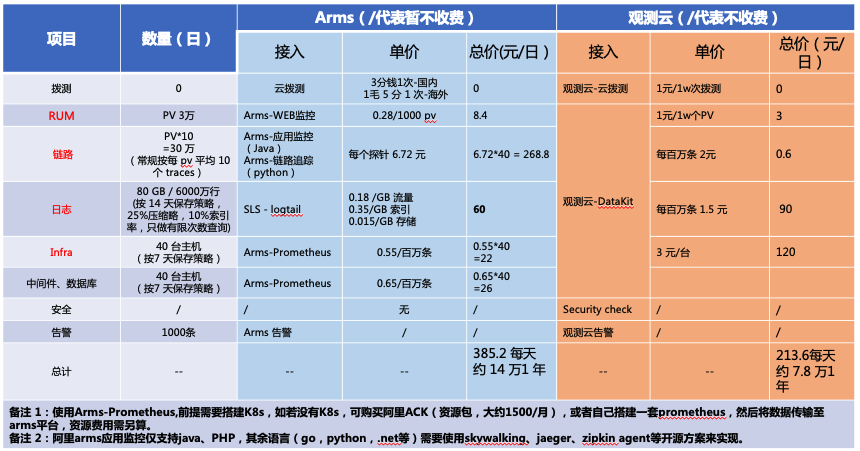

### 资源消耗对比

（仅代表本次测试）

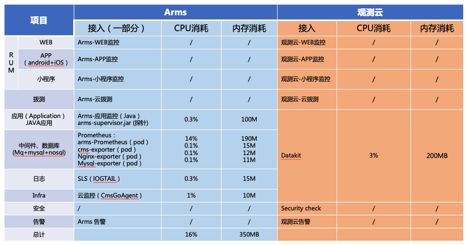

## ARMS 3.0

应用实时监控服务 ARMS (Application Real-Time Monitoring Service) 是一款应用性能管理 (APM) 产品，包含应用监控、Prometheus 监控和前端监控三大子产品，涵盖分布式应用、容器环境、浏览器、小程序、APP 等领域的性能管理，能帮助最终用户实现全栈式性能监控和端到端全链路追踪诊断，让应用运维变得轻轻松高效。

### Prometheus

阿里云 Prometheus 监控全面对接开源 Prometheus 生态，支持类型丰富的组件监控，提供多种开箱即用的预置监控大盘，且提供全面托管的 Prometheus 服务。

#### 接入方式

1. ACK (阿里云容器服务) Kubernetes 版集群 

2. 自建 Kubernetes 集群

3. RemoteWrite (远程存储) 

#### 实施配置

Prometheus 数据接入是基于 Kubernetes 集群的，直接创建 [[Kubernetes托管版集群](https://help.aliyun.com/document_detail/85903.htm?spm=a2c4g.11186623.2.6.472e7cb6yXVXyj#task-mmv-33q-n2b)]，创建完成后可以在页面看到 Kubernetes 相关的内置视图大盘

#### 产品计费

Prometheus 监控按照指标上报次数收费。指标分为两种类型：基础指标和自定义指标。其中，[[基础指标](https://help.aliyun.com/document_detail/148104.html#concept-2372936)] 不收费，自定义指标收费。

| 日上报指标范围(百万条) | 单价(元/百万条) | 日付费范围(元) |
| --- | --- | --- |
| 0~50 | 0.8 | 0~40 |
| 50~150 | 0.65 | 40~105 |
| 150~300 | 0.55 | 105~187.5 |
| 300~600 | 0.45 | 187.5~322.5 |
| 600~1200 | 0.35 | 322.5~530.5 |
| 1200以上 | 0.25 | 530.5以上 |

##### 备注说明

1. 每条上报指标最大不能超过2 KB。

2. 每条指标最多存储15天，超过15天的指标数据会被清理，可以联系调整。

### 云监控

云监控（CloudMonitor）是一项针对阿里云资源和互联网应用进行监控的服务。

#### 接入方式

Prometheus 集成了阿里云云监控，可以通过云监控在 Prometheus 中监控当前云账号在指定地域下的云服务。

目前支持接入 ECS、RDS MongoDB、Redis、OSS、RDS、NAT、SLB、RocketMQ、Kafka、EIP、ES 和 DRDS。

#### 实施配置

Prometheus 配置界面添加云服务接入

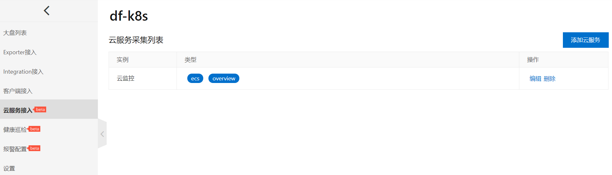

#### 产品计费

Prometheus 集成云监控后，云监控不会额外收费，采集的监控数据会 **按照 Prometheus 的规则 **收费。 

### 前端监控

ARMS 前端监控专注于对 Web 场景、Weex 场景和小程序场景的监控，从页面打开速度（测速）、页面稳定性 (JS Error) 和外部服务调用成功率 (API) 这三个方面监测 Web 和小程序页面的健康度。

#### 接入方式

Web场景

- CDN 方式安装探针

- NPM 方式安装探针

Weex场景

- Weex 接入

小程序场景

- 钉钉小程序

- 支付宝小程序

- 微信小程序

- 其他类别

#### 实施配置

创建应用站点，选择 Web 类型接入，复制 BI 探针 (代码) 放到 HTML `<body>` 内容的第一行

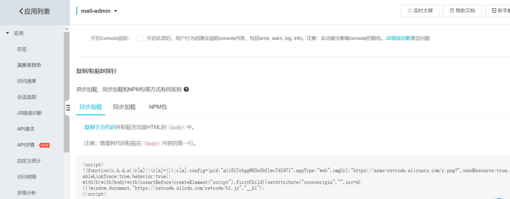

#### 产品计费

##### 基础版

按量计费

| 计费量 | 计费单价 |
| --- | --- |
| 所有站点 前端数据上报次数 | 0.028元 / 1000页面上报次数 |

##### 专业版

按量计费

| 计费量 | 计费单价 |
| --- | --- |
| 所有站点 前端数据上报次数 | 0.28元 / 1000页面上报次数 |

资源包

| 名称 | 规格 | 价格 | 折合计费价格 | 有效期 |
| --- | --- | --- | --- | --- |
| 初级资源包 | 200万页面上报次数 | 420元 | 0.21元 / 1000前端数据上报次数 | 6个月 |
| 中级资源包 | 1600万页面上报次数 | 2,520元 | 0.158元 / 1000前端数据上报次数 | 1年 |
| 高级资源包 | 12800万页面上报次数 | 15,120元 | 0.118元 / 1000前端数据上报次数 | 1年 |
| 黄金资源包 | 60000万页面上报次数 | 60000元 | 0.1元 / 1000前端数据上报次数 | 1年 |

##### 备注说明

1. 前端监控：计费计量主要为页面PV调用和API调用上报次数，自定义上报次数。按天结算，不足1000上报次数部分按1000算。 前端监控数据默认缓存储30天。

2. 前端监控计算公式参考：每日上报流量 = 每天 PV +（每天API调用次数 - 每天 50 万）* 0.1 + 自定义上报。

3. 一次 PV 产生的数据上报次数 = 1 + API 调用次数 + 自定义数据上报次数。大多数情况，页面数据上报次数与页面访问次数大致相同。

### 应用监控

ARMS 应用监控是一款应用性能管理（Application Performance Management，简称APM）产品。您无需修改代码，只需为应用安装一个探针，ARMS 就能够对应用进行全方位监控，帮助您快速定位出错接口和慢接口、重现调用参数、发现系统瓶颈，从而大幅提升线上问题诊断的效率。

#### 数据接入

按部署环境接入

- EDAS

- ACK (阿里云容器服务)

- 开源K8s集群

- Docker集群

- 其他环境 (如自建IDC)

按开发语言接入

- JAVA

- PHP

#### 实施配置

接入应用，选择 Java 语言，脚本自动安装方式

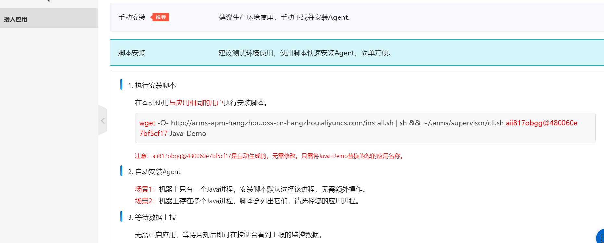

#### 产品计费 

##### 基础版

| 名称 | 计费内容 | 备注 |
| --- | --- | --- |
| 应用监控基础版 - 统计指标存储费用 | 统计指标存储3天，免费。 统计指标存储30天，每探针每天1.2元。 统计指标存储90天，每探针每天2.4元。 统计指标存储180天，每探针每天3.6元。 | （1）统计指标默认存储周期为 3天，免费使用。如需延长指标存储周期，可在应用监控 - 全局配置 - 存储周期配置页面进行调整。 （2）一个探针可以监控一个应用实例（比如一个Tomcat实例，一个Java进程）。 （3）支持升级为专家版，开通专家版后按专家版收费。 |
| 应用监控基础版 - 调用链存储费用 | 0.2元 / 百万条请求链路 * 天 默认采样策略存储1天，免费。 | （1）每个接口每分钟第1条请求链路，免费采样并存储1天。如需存储更多请求链路，先打开指定应用页面，在应用设置 - 自定义配置 - 采样率页面进行调整，按量计费。 （2）同一个 TraceId 下的所有调用视为一条请求链路，单条链路最多包含十个 Span，超出部分按照十分之一请求链路计费。 （3）支持升级为专家版，开通专家版后按专家版收费。 |

##### 专业版

按量计费：

| 计费项 | 计费单价 |
| --- | --- |
| 按量计费 | 每探针每天6.72元 |

资源包计费：

| 名称 | 规格 | 价格 | 折合计费价格 | 有效期 |
| --- | --- | --- | --- | --- |
| 初级资源包 | 150 探针*天 (包含资源可供150个探针使用1天，或5个探针使用30天） | 700元 | 4.68元 / 探针*天 | 6个月 |
| 中级资源包 | 1200 探针*天 (包含资源可供1200个探针使用1天，或40个探针使用30天） | 4,200元 | 4.38元 / 探针*天 | 1年 |
| 高级资源包 | 9600 探针*天 (包含资源可供9600个探针使用1天，或320个探针使用30天） | 25,200元 | 2.616元 / 探针*天 | 1年 |
| 黄金资源包 | 36500 探针*天（包含资源可供100个探针使用365天） | 66,838元 | 1.8312 / 探针*天 | 1年 |
| 铂金资源包 | 109500 探针*天（包含资源可供300个探针使用365天） | 174,000元 | 1.5696 / 探针*天 | 1年 |
| 顶级资源包 | 182500 探针*天（包含资源可供500探针使用365天） | 238,710元 | 1.308 / 探针*天 | 1年 |

##### 备注说明

1. 一个探针可以监控一个应用实例（比如一个Tomcat实例，一个Java进程）。

2. 应用监控：流量按照实际所有应用在线时间总长计算，按天结算。 应用监控数据默认缓存储60天。

### 云拨测

云拨测是一种针对互联网应用（Web页面、网络链路等）进行应用性能和用户体验监测的服务。

#### 接入方式

云拨测可以利用分布全球的监测网络，对目标Web应用（如网站、服务器等）进行浏览或网络拨测，目前每个任务支持最多添加50个监测点。

#### 实施配置

创建拨测任务，添加需要被监控的 URL 和监测点 (最多50个)

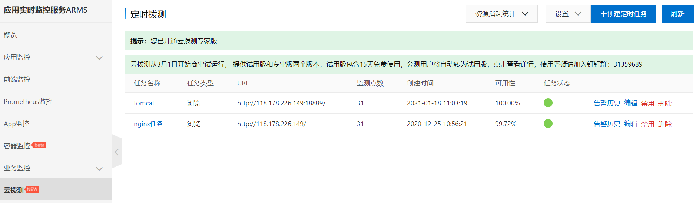
#### 产品计费

云拨测于2020年11月20日开启公测，您可以开通ARMS 15天免费试用版或任意收费版本来使用云拨测。在公测期内，即使15天试用到期，您仍可以 **免费使用** 云拨测。

### 日志监控

对于高度定制化的业务场景，可以通过创建日志监控任务来自由统计所需指标，生成需要的数据与报表，灵活地配置报警。

#### 接入方式

ARMS日志监控支持完全自定义的监控任务，其流程包含配置数据源和配置指标两个关键步骤，如下图所示。

#### 配置实施

前置条件：[[开通阿里云日志服务](https://www.aliyun.com/product/sls?spm=a2c4g.11186623.2.9.2f287973Qu3iYk)]，同步 LogHub，并生成需要的指标

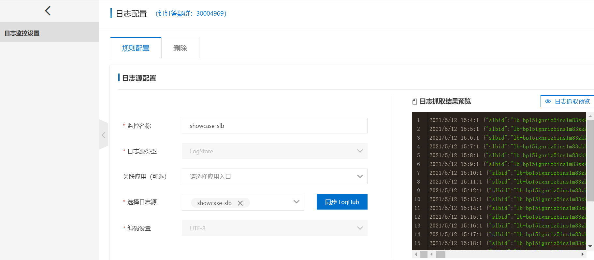

#### 产品计费

日志接入生成的指标 **按照** **Prometheus 的规则 **收费

## {{{ custom_key.brand_name }}}

{{{ custom_key.brand_name }}}是一款旨在解决云计算，以及云原生时代系统为每一个完整的应用构建 **全链路的可观测性 **的云服务平台。

### 接入方式

- 前端页面配置

- Datakit 数据采集

### 实施配置

#### 主机基础设施

安装 Datakit，默认开启 [CPU，System，Mem，Disk，DiskIO，Swap，Net 信息采集]，查看 **基础设施** 信息

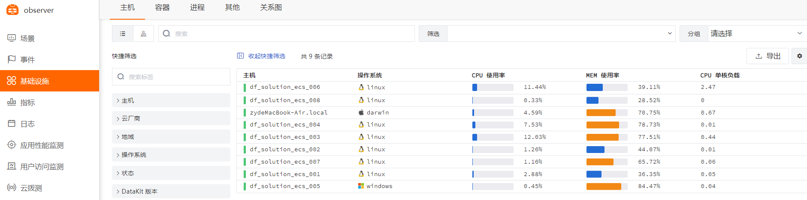

#### 应用中间件

配置 Datakit  [[Mysql 数据采集](/../../integrations/mysql.md)] 和 [[Nginx 数据采集](/datakit/nginx/)]，点击主机 `集成运行情况 `的 

Nginx 跳转到内置视图

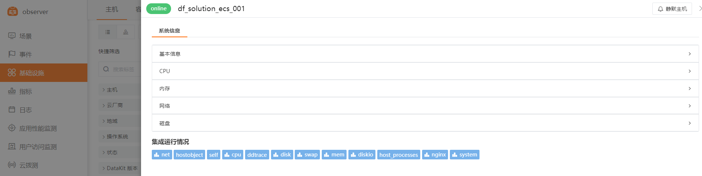

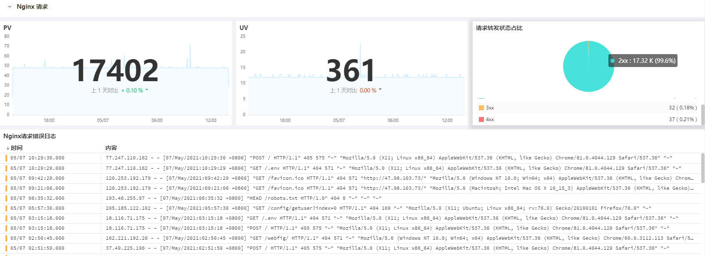

#### 日志
配置 Datakit  [[Mysql 数据采集](/../../integrations/mysql.md)] 和 [[Nginx 数据采集](/datakit/nginx/)] 中的日志配置，或者开启自定义日志配置 [Tailf 数据采集]，创建完成可以看到日志列表

点击日志来源查看具体日志信息 (已进行数据切割处理 Grok)

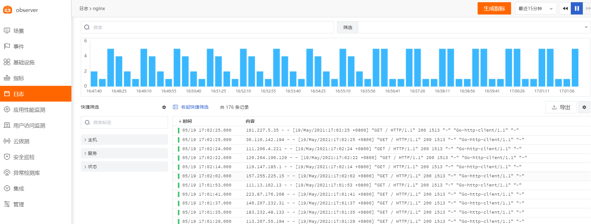

#### 应用性能监测

下载 dd-java-agent.jar，作为 javaagent 参数加入到 java 应用的启动命令里 (-javaagent:/root/mall/dd-java-agent-0.75.0.jar)，配置 Datakit 的 [dd-trace 数据采集]，创建成功后可以看到应用列表

点击服务名可以看到概览

点击链路可以看到链路信息

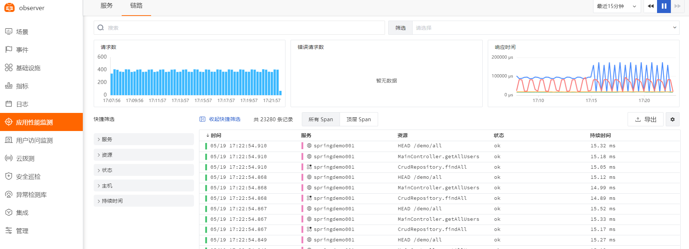

点击服务名可以看到火焰图以及详细信息

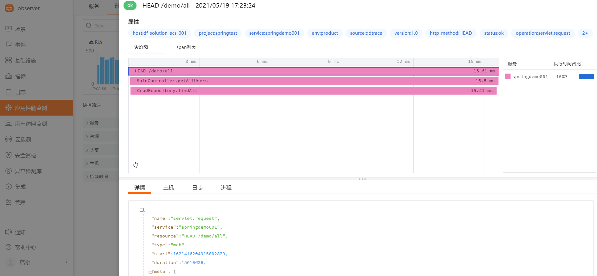

#### 用户访问监测

创建应用，选择 Web 类型接入，复制探针 (代码) 放到 HTML `<body>` 内容的第一行

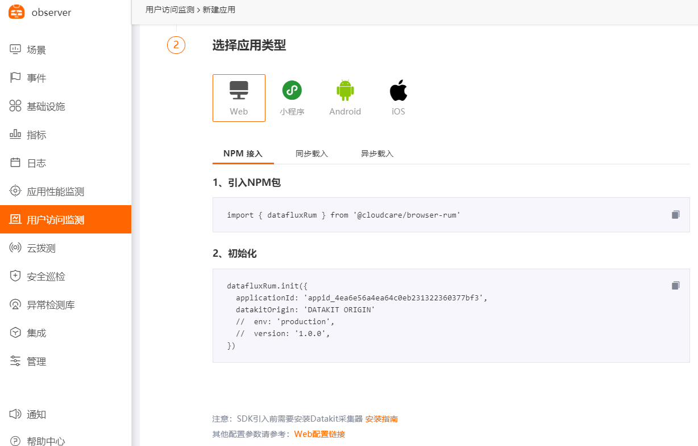

#### 云拨测

新建拨测 URL 和拨测点及频率
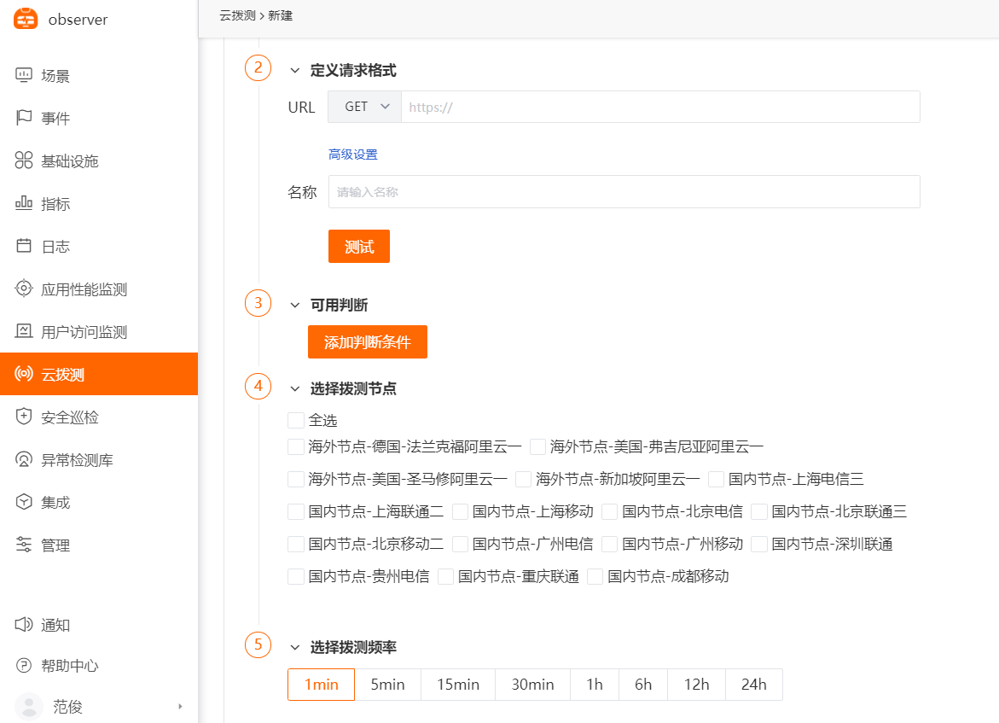

#### 异常检测库

内置主机检测库 (无需配置)，其他检测库按实际应用添加

### 产品计费

#### 按量基础计费模式

{{{ custom_key.brand_name }}}提供两种计费模式，可在费用中心切换选择。一种是统计“DataKit+时间线”数量的计费模式，另外一种是仅统计“时间线”数量的计费模式。其他计费项备份日志数据数量、API拨测次数、任务调度次数、短信发送次数为通用计费项。

###### 1.统计“DataKit+时间线”数量

| **计费项** | **计费单元** | **商业版单价** |
| --- | --- | --- |
| Datakit 数量 | 每 1 台 | 3 元 |
| 时间线数量 | 每 500 条 | 3 元 |
| 备份日志数据数量 | 每千万条 | 2 元 |
| API 拨测次数 | 每 1 万次 | 1 元 注意：统计不包含自建节点产生的API拨测的数据 |
| 任务调度次数 | 每 1 万次 | 1 元 |

时间线计算公式：

- 计费时间线数量 = 时间线数量 - DataKit数量 * 500

- 计费时间线数量账单 = （时间线数量 - DataKit数量 * 500）/ 500 * 3

- 若计算得出的计费时间线数量 <= 0，则按照 0 条计算。

###### 2.统计“时间线”数量

| **计费项** | **计费单元** | **商业版单价** |
| --- | --- | --- |
| 时间线数量 | 每 300 条 | 3 元 |
| 备份日志数据数量 | 每千万条 | 2 元 |
| API 拨测次数 | 每 1 万次 | 1 元 注意：统计不包含自建节点产生的API拨测的数据 |
| 任务调度次数 | 每 1 万次 | 1 元 |
| 短信发送次数 | 每 10 次 | 1 元 |

时间线计算公式：

- 计费时间线数量 = 时间线数量

- 计费时间线数量账单 = 时间线数量  / 300 * 3

##### 梯度计费模式

###### 日志类数据

| **计费项** | **计费单元** | **商业版梯度价格** |  |  |
| --- | --- | --- | --- | --- |
| 数据存储策略 |  | 14 天 | 30 天 | 60 天 |
| 日志类数据数量 | 每百万条 | 1.5 元 | 2 元 | 2.5 元 |

###### 应用性能 Trace

| **计费项** | **计费单元** | **商业版梯度价格** |  |
| --- | --- | --- | --- |
| 数据存储策略 |  | 7 天 | 14 天 |
| 应用性能 Trace 数量 | 每百万个 | 3 元 | 6 元 |

###### 用户访问 PV

| **计费项** | **计费单元** | **商业版梯度价格** |  |
| --- | --- | --- | --- |
| 数据存储策略 |  | 7 天 | 14 天 |
| 用户访问 PV 数量 | 每万个 | 1 元 | 2 元 |

#### **包年套餐**

##### 初创加速包

| **计费项** | **容量** | **按量付费价格（372天）** | **套餐价格** |
| --- | --- | --- | --- |
| DataKit | 20台 | **￥ 72,168** | **￥ 42,000** |
| 日志类数据 | 4000万 |  |  |
| 应用性能Trace | 500万 |  |  |
| 用户访问PV | 40万 |  |  |
| 任务调用 | 19万 |  |  |

##### 创业发展包

| **计费项** | **容量** | **按量付费价格（372天）** | **套餐价格** |
| --- | --- | --- | --- |
| DataKit | 100台 | **￥ 517,080** | **￥ 280,000** |
| 日志类数据 | 4亿 |  |  |
| 应用性能Trace | 5000万 |  |  |
| 用户访问PV | 200万 |  |  |
| 任务调用 | 140万 |  |  |

##### 企业标准包

| **计费项** | **容量** | **按量付费价格（372天）** | **套餐价格** |
| --- | --- | --- | --- |
| DataKit | 200台 | **￥ 1019,280** | **￥ 510,000** |
| 日志类数据 | 8亿 |  |  |
| 应用性能Trace | 1亿 |  |  |
| 用户访问PV | 400万 |  |  |
| 任务调用 | 240万 |  |  |

##### 流量包

流量包按照购买的容量大小会给到不同的折扣，具体可联系客户经理。

| **流量包** | **基础单位** | **购买基础容量** | **默认数据存储策略** | **单价** | **价格（天）** |
| --- | --- | --- | --- | --- | --- |
| DataKit | 1 | 20台 | / | 3 | 60 |
| 日志类数据（万条） | 100万 | 100万条 | 14 天 | 1.5 | 1.5 |
| 备份日志（万条） | 1000万 | 1000万条 | / | 2 | 2 |
| 应用Trace（万个） | 100万 | 100万个 | 7 天 | 3 | 3 |
| 用户PV（万个） | 10000 | 10万个 | 7 天 | 1 | 10 |
| API调用（万次） | 1万 | 10万次 | / | 1 | 10 |
| 任务调用（万次） | 1万 | 30万次 | / | 1 | 30 |
| 短信 | 1 | 100条 | / | 0.1 | 10 |

##### 注意事项

- 一旦超过套餐包的限定容量，超出的部分可以购买流量包或者根据“按量付费”的方式基于**默认数据保存策略的单价**进行结算。
- 套餐中涉及到梯度计费项的数据存储策略按照默认策略，即日志类数据（14天）、应用Trace（7天）、用户访问PV（7天）。
- 若套餐中涉及到梯度计费项的数据存储策略不是按照默认策略，即日志类数据（30天或者60天）、应用Trace（14天）、用户访问PV（14天），那么在{{{ custom_key.brand_name }}}计费平台出具账单的时候，需要根据工作空间上报的使用量和数据保存策略做对应的换算。换算策略如下：
   - 日志类数据换算系数：默认 14天，30天 使用量 * 2，60 天 使用量 * 3
   - 应用性能 Trace 换算系数：默认 7天，14天 使用量 * 2
   - 用户访问 PV 换算系数：默认 7天，14天 使用量 * 2

时间线计算公式：

- 计费时间线数量 = 时间线数量 - DataKit数量 * 500
- 计费时间线数量账单 = （时间线数量 - DataKit数量 * 500）/ 500 * 3
- 若计算得出的计费时间线数量 <= 0，则按照 0 条计算。
