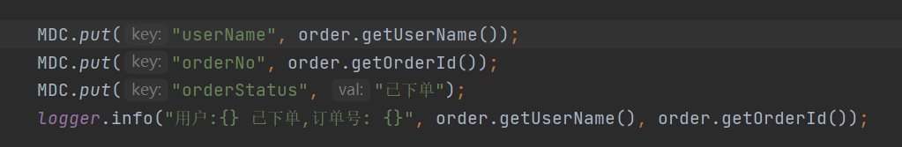
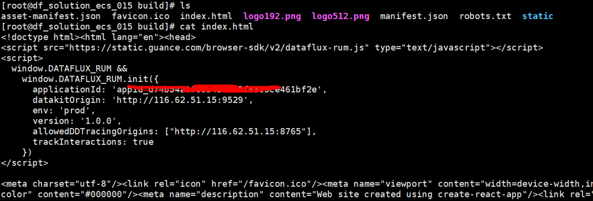
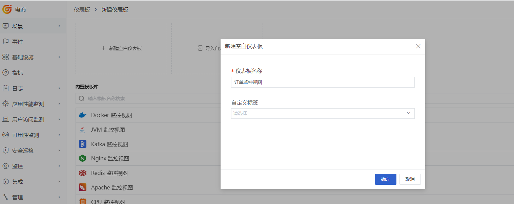
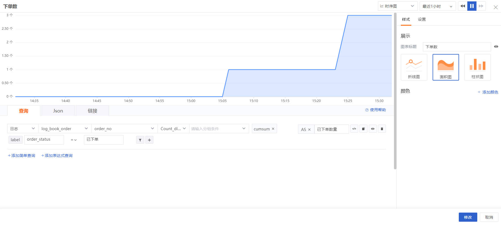
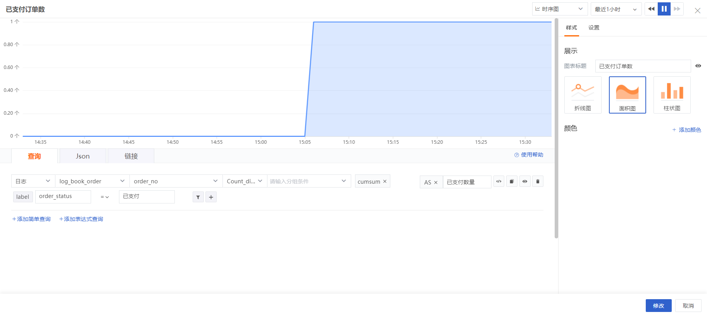

# 电商订单全流程可观测最佳实践

---

## 简介

为了满足快速迭代和流量的激增，电商系统常常使用微服务的方式来进行开发部署，某个微服务系统性能瓶颈直接会影响到客户的购物体验，特别是出现了支付异常、订单取消后，我们要观测订单的整个链路，梳理出实时已支付的订单数量、异常订单数量、取消订单数量，用这些指标帮助我们分析业务瓶颈是很有帮助的。本最佳实践是基于 Java 的一个分布式电商平台，结合观测云用订单的维度来观测订单成功支付的数量，实时剖析出未成功支付的原因。 

## 前置条件
### 安装 Datakit

- <[安装 Datakit](/datakit/datakit-install/)>
## 数据接入

订单数据接入观测云的方式是通过 log ，微服务输出日志文件到云服务器，在这台云服务器上安装 DataKit ，并开通日志采集，指定日志文件的路径。为了解析出日志文件中的订单号、下单人、订单状态，需要编写Pipeline 把日志文件中的订单号、下单人、订单状态做切割。

### 开启 Input

1、 开启 ddtrace

```shell
cd /usr/local/datakit/conf.d/ddtrace
cp ddtrace.conf.sample ddtrace.conf  
```

2、 编写 Pipeline

```shell
cd /usr/local/datakit/pipeline
vi log_book_order.p
```

其中 **%{DATA:username}** 是下单人，**%{DATA:order_no}** 是订单号，**%{DATA:order_status}** 是订单状态。

```toml
#2021-12-22 10:09:53.443 [http-nio-7001-exec-7] INFO  c.d.s.b.s.i.OrderServiceImpl - [createOrder,164] - ecs009-book-order 7547183777837932733 2227975860088333788 test d6a3337d-ff82-4b00-9b4d-c07fb00c0cfb - 用户:test 已下单,订单号: d6a3337d-ff82-4b00-9b4d-c07fb00c0cfb


grok(_, "%{TIMESTAMP_ISO8601:time} %{NOTSPACE:thread_name} %{LOGLEVEL:status}%{SPACE}%{NOTSPACE:class_name} - \\[%{NOTSPACE:method_name},%{NUMBER:line}\\] - %{DATA:service1} %{DATA:trace_id} %{DATA:span_id} %{DATA:username} %{DATA:order_no} %{DATA:order_status} - %{GREEDYDATA:msg}")

default_time(time)

```

3、 开启 Logging插件，复制 sample文件

```shell
cd /usr/local/datakit/conf.d/log
cp logging.conf.sample log_book_order.conf
```
修改 log_book_order.conf文件，logfiles指定日志文件，Pipeline 指定上步创建的 log_book_order.p。source 指定log_book_order，方便在视图中使用该日志。

```toml
[[inputs.logging]]
  ## required
  logfiles = [
    "/usr/local/df-demo/book-shop/logs/order/log.log"    
  ]

  ## glob filteer
  ignore = [""]

  ## your logging source, if it's empty, use 'default'
  source = "log_book_order"

  ## add service tag, if it's empty, use $source.

  service = "book-store"

  ## grok pipeline script path
  pipeline = "log_book_order.p"

  ## optional status:
  ##   "emerg","alert","critical","error","warning","info","debug","OK"
  ignore_status = []

  ## optional encodings:
  ##    "utf-8", "utf-16le", "utf-16le", "gbk", "gb18030" or ""
  character_encoding = ""

  ## The pattern should be a regexp. Note the use of '''this regexp'''
  ## regexp link: https://golang.org/pkg/regexp/syntax/#hdr-Syntax
  multiline_match = '''^\d{4}-\d{2}-\d{2}'''

  ## removes ANSI escape codes from text strings
  remove_ansi_escape_codes = false

  [inputs.logging.tags]
    app = "book-shop"
  # some_tag = "some_value"
  # more_tag = "some_other_value"

```

4、 重启 DataKit 

```shell
systemctl restart datakit
```
### 电商数据接入

项目源码：[book-store](https://github.com/devdcores/BookStoreApp-Distributed-Application)。

使用 Pipeline 切割的日志，这里的日志是微服务产生的日志，所以需要把下单人、订单号、订单状态输出到日志中。本示例的日志工具是 Logback，要想把业务数据通过 Logback 输出，那就需要使用 MDC 机制，即在打印日志前把下单人、订单号、订单状态 Put 到 MDC，然后在 logback-spring.xml 的 PATTERN 中输出，本示例需要修改 bookstore-order-service 微服务代码。

1、 新建切片

新建切片，把 userName、orderNo、orderStatus 添加到 MDC ，请求结束再移出。

```java
@Component
@Aspect
public class LogAop {
    private static final String USER_NAME = "userName";
    private static final String ORDER_NO = "orderNo";
    private static final String ORDER_STATUS = "orderStatus";

    @Pointcut("execution(public * com.devd.spring.bookstoreorderservice.controller..*.*(..))")
    public void controllerCall() {
    }

    @Before("controllerCall()")
    public void logInfoBefore(JoinPoint jp) throws UnsupportedEncodingException {
        MDC.put(USER_NAME, "");
        MDC.put(ORDER_NO, "");
        MDC.put(ORDER_STATUS, "");
    }

    @AfterReturning(returning = "req", pointcut = "controllerCall()")
    public void logInfoAfter(JoinPoint jp, Object req) throws Exception {
        MDC.remove(USER_NAME);
        MDC.remove(ORDER_NO);
        MDC.remove(ORDER_STATUS);
    }

}
```

2、 订单数据写入日志

在下单成功后输出日志



3、 配置 logback-spring.xml

```xml
<property name="CONSOLE_LOG_PATTERN" value="%d{yyyy-MM-dd HH:mm:ss.SSS} [%thread] %-5level %logger{20} - [%method,%line] - %X{dd.service} %X{dd.trace_id} %X{dd.span_id} %X{userName} %X{orderNo} %X{orderStatus} - %msg%n" />
```

### 打包发布

- 前端打包，会生成 build 目录

```shell
cd bookstore-frontend-react-app
yarn  build
```

- 后端打包，生成 bookstore-account-service-0.0.1-SNAPSHOT.jar，

bookstore-payment-service-0.0.1-SNAPSHOT.jar，

bookstore-api-gateway-service-0.0.1-SNAPSHOT.jar，

bookstore-billing-service-0.0.1-SNAPSHOT.jar，

bookstore-catalog-service-0.0.1-SNAPSHOT.jar，

bookstore-eureka-discovery-service-0.0.1-SNAPSHOT.jar，

bookstore-order-service-0.0.1-SNAPSHOT.jar 

```shell
mvn clean install -DskipTests
```
### 开启RUM

- 登录[观测云](https://console.guance.com/)

点击【用户访问监测】- 【新建应用】输入 book-shop，选择Web，复制js。


-  Copy build 目录到服务器


打开 index.html ，把上步复制的 js 粘贴到 head中，并修改 datakitOrigin 值为当前云服务器所部署的 DataKit 地址，allowedDDtracingOrgins 的值是 Gateway 的地址。



- 安装 Nginx ，部署 web 项目

```
server {
        listen       80;
        location / {            
            proxy_set_header   Host    $host:$server_port;
            proxy_set_header   X-Real-IP   $remote_addr;
            proxy_set_header   X-Forwarded-For  $proxy_add_x_forwarded_for;
			      root   /usr/local/df-demo/book-shop/build;
            index  index.html index.htm;
        }
}

```

### 开启 APM

观测云获取 Trace 数据，需要使用: /usr/local/datakit/data/dd-java-agent.jar。

```shell
java -jar bookstore-eureka-discovery-service-0.0.1-SNAPSHOT.jar
 
 
java  -javaagent:/usr/local/datakit/data/dd-java-agent.jar \
 -Ddd.service.name=book-gateway \
 -Ddd.env=dev  \
 -Ddd.agent.port=9529   \
 -jar bookstore-api-gateway-service-0.0.1-SNAPSHOT.jar
 
 
java  -javaagent:/usr/local/datakit/data/dd-java-agent.jar \
 -Ddd.service.name=book-account \
 -Ddd.env=dev  \
 -Ddd.agent.port=9529   \
 -jar bookstore-account-service-0.0.1-SNAPSHOT.jar  
 
java  -javaagent:/usr/local/datakit/data/dd-java-agent.jar \
 -Ddd.service.name=book-order \
 -Ddd.env=dev  \
 -Ddd.agent.port=9529   \
 -jar bookstore-order-service-0.0.1-SNAPSHOT.jar
 
 
java  -javaagent:/usr/local/datakit/data/dd-java-agent.jar \
 -Ddd.service.name=book-billing \
 -Ddd.env=dev  \
 -Ddd.agent.port=9529   \
 -jar bookstore-billing-service-0.0.1-SNAPSHOT.jar
 
 
java  -javaagent:/usr/local/datakit/data/dd-java-agent.jar \
 -Ddd.service.name=book-payment \
 -Ddd.env=dev  \
 -Ddd.agent.port=9529   \
 -jar bookstore-payment-service-0.0.1-SNAPSHOT.jar
 
 
java  -javaagent:/usr/local/datakit/data/dd-java-agent.jar \
 -Ddd.service.name=book-catalog \
 -Ddd.env=dev  \
 -Ddd.agent.port=9529   \
 -jar bookstore-catalog-service-0.0.1-SNAPSHOT.jar 
```
 
### 订单监控视图

登录[观测云](https://console.guance.com/)，【场景】->【新建仪表板】->【新建空白仪表板】，输入“订单监控视图”，点击【确定】。



点击上步创建的仪表板，点击【编辑】，拖一个“时序图”，图标标题是“下单数”，时序图中选择“日志”，然后再选择 log_book_order，log_book_order 是 log_book_order.conf 中的 source 的值，再选择order_no，排序方式选“Count_distinct_by”。筛选条件选择“order_status”，值选择“已下单”，这个时序图就是统计已下单的订单数量。最后点击“+”-> 转换函数 -> cumsum，订单数量在单位时间内会转换成累计。



拖一个“时序图”，图标标题是“已支付订单数”，时序图中选择“日志”，然后再选择 log_book_order，log_book_order 是 log_book_order.conf 中的 source 的值，再选择 order_no，排序方式选“Count_distinct_by”。筛选条件选择“order_status”，值选择“已支付”，这个时序图就是统计已支付的订单数量。最后点击“+”-> 转换函数 -> Cumsum，订单数量在单位时间内会转换成累计。



拖一个“时序图”，图标标题是“异常订单数”，时序图中选择“日志”，然后再选择 log_book_order，log_book_order 是 log_book_order.conf 中的 source 的值，再选择 order_no，排序方式选“Count_distinct_by”。筛选条件选择“order_status”，值选择“支付异常”，这个时序图就是统计支付异常的订单数量。最后点击“+”-> 转换函数 -> Cumsum，订单数量在单位时间内会转换成累计。


