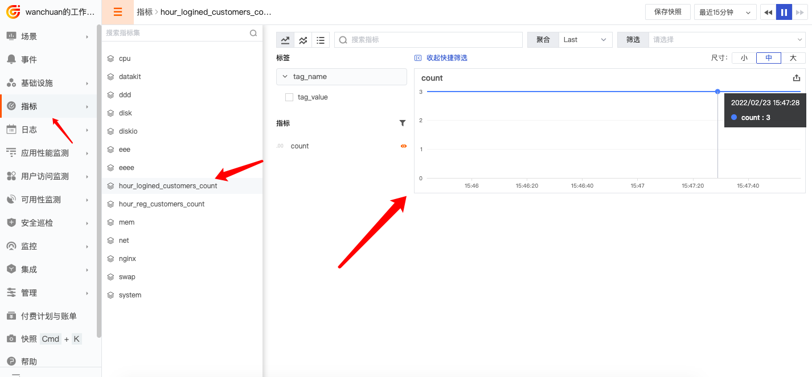

# 快速上手 Pythond 采集器的最佳实践

---

Pythond 是定时触发用户自定义 Python 采集脚本的一整套方案。本文以 “获取每个小时登录的用户数” 作为指标上报给中心为例。

## 业务演示介绍

业务流程大致如下： <br/>
从数据库中采集数据 (Python 脚本) -> Pythond 采集器定时触发该脚本上报数据(datakit) -> 从中心可看到指标(web)

数据库现在有一张表叫 `customers`, 表中有如下字段:

- name: 姓名 (字符串)
- last_logined_time : 登录时间 (时间戳)

建表语句如下:

```sql
create table customers
(
  `id`                BIGINT(20)  not null AUTO_INCREMENT COMMENT '自增 ID',
  `last_logined_time` BIGINT(20)  not null DEFAULT 0      COMMENT '登录时间 (时间戳)',
  `name`              VARCHAR(48) not null DEFAULT ''     COMMENT '姓名',

  primary key(`id`),
  key idx_last_logined_time(last_logined_time)
) ENGINE=InnoDB DEFAULT CHARSET=utf8mb4;
```

在上面的表中插入测试数据:

```sql
INSERT INTO customers (id, last_logined_time, name) VALUES (1, 1645600127, 'zhangsan');
INSERT INTO customers (id, last_logined_time, name) VALUES (2, 1645600127, 'lisi');
INSERT INTO customers (id, last_logined_time, name) VALUES (3, 1645600127, 'wangwu');
```

使用以下 SQL 语句来获取 "获取每个小时登录的用户数"：

```sql
select count(1) from customers where last_logined_time>=(unix_timestamp()-3600);
```

把上面的数据以指标形式上报给中心。

下面详细讲述实现上述业务的具体步骤。

## 前置条件

### Python 环境

目前处于 alpha 阶段，**只兼容 Python 3+**。已测试的版本：

- [x] 3.10.1

### Python 依赖库

需要安装以下依赖库:

- requests（操作网络，用于上报指标）
- pymysql（操作 MySQL 数据库，用于连接数据库获取业务数据）

安装方法如下:

```shell
# python3
python3 -m pip install requests
python3 -m pip install pymysql
```

上述的安装需要安装 pip，如果你没有，可以参考以下方法(源自: [这里](https://pip.pypa.io/en/stable/installation/)):

```shell
# Linux/MacOS
python3 -m ensurepip --upgrade

# Windows
py -m ensurepip --upgrade
```

## 安装部署

### 1 编写用户自定义脚本

需要用户继承 `DataKitFramework` 类，然后对 `run` 方法进行改写。`DataKitFramework` 类源代码文件是 `datakit_framework.py`，路径是 `datakit/python.d/core/datakit_framework.py`。

> 具体使用可以参见源代码文件 `datakit/python.d/core/demo.py`

示例这里根据上述需求，写成如下的 Python 脚本，命名为 `hellopythond.py`:

??? quote "hellopythond.py"

    ```python
    from datakit_framework import DataKitFramework
    import pymysql
    import re
    import logging

    class MysqlConn():
        def __init__(self, logger, config):
            self.logger = logger
            self.config = config
            self.re_errno = re.compile(r'^\((\d+),')

            try:
                self.conn = pymysql.Connect(**self.config)
                self.logger.info("pymysql.Connect() ok, {0}".format(id(self.conn)))
            except Exception as e:
                raise e

        def __del__(self):
            self.close()

        def close(self):
            if self.conn:
                self.logger.info("conn.close() {0}".format(id(self.conn)))
                self.conn.close()


        def execute_query(self, sql_str, sql_params=(), first=True):
            res_list = None
            cur = None
            try:
                cur = self.conn.cursor()
                cur.execute(sql_str, sql_params)
                res_list = cur.fetchall()
            except Exception as e:
                err = str(e)
                self.logger.error('execute_query: {0}'.format(err))
                if first:
                    retry = self._deal_with_network_exception(err)
                    if retry:
                        return self.execute_query(sql_str, sql_params, False)
            finally:
                if cur is not None:
                    cur.close()
            return res_list

        def execute_write(self, sql_str, sql_params=(), first=True):
            cur = None
            n = None
            err = None
            try:
                cur = self.conn.cursor()
                n = cur.execute(sql_str, sql_params)
            except Exception as e:
                err = str(e)
                self.logger.error('execute_query: {0}'.format(err))
                if first:
                    retry = self._deal_with_network_exception(err)
                    if retry:
                        return self.execute_write(sql_str, sql_params, False)
            finally:
                if cur is not None:
                    cur.close()
            return n, err

        def _deal_with_network_exception(self, stre):
            errno_str = self._get_errorno_str(stre)
            if errno_str != '2006' and errno_str != '2013' and errno_str != '0':
                return False
            try:
                self.conn.ping()
            except Exception as e:
                return False
            return True

        def _get_errorno_str(self, stre):
            searchObj = self.re_errno.search(stre)
            if searchObj:
                errno_str = searchObj.group(1)
            else:
                errno_str = '-1'
            return errno_str

        def _is_duplicated(self, stre):
            errno_str = self._get_errorno_str(stre)
            # 1062：字段值重复，入库失败
            # 1169：字段值重复，更新记录失败
            if errno_str == "1062" or errno_str == "1169":
                return True
            return False

    class HelloPythond(DataKitFramework):
        __name = 'HelloPythond'
        interval = 10 # 每 10 秒钟采集上报一次。这个根据实际业务进行调节，这里仅作演示。

        # if your datakit ip is 127.0.0.1 and port is 9529, you won't need use this,
        # just comment it.
        # def __init__(self, **kwargs):
        #     super().__init__(ip = '127.0.0.1', port = 9529)

        def run(self):
            config = {
                "host": "172.16.2.203",
                "port": 30080,
                "user": "root",
                "password": "Kx2ADer7",
                "db": "df_core",
                "autocommit": True,
                # "cursorclass": pymysql.cursors.DictCursor,
                "charset": "utf8mb4"
            }

            mysql_conn = MysqlConn(logging.getLogger(''), config)
            query_str = "select count(1) from customers where last_logined_time>=(unix_timestamp()-%s)"
            sql_params = ('3600')
            n = mysql_conn.execute_query(query_str, sql_params)

            data = [
            {
                "measurement": "hour_logined_customers_count", # 指标名称。
                "tags": {
                    "tag_name": "tag_value", # 自定义 tag，根据自己想要标记的填写，我这里是随便写的
                },
                "fields": {
                    "count": n[0][0], # 指标，这里是每个小时登录的用户数
                },
            },
            ]

            in_data = {
                'M':data,
                'input': "pyfromgit"
            }

            return self.report(in_data) # you must call self.report here
    ```

### 2 将自定义脚本放入正确的位置

在 Datakit 安装目录的 `python.d` 目录下新建一个文件夹，并命名为 `hellopythond`，这个文件夹名称要与上面编写的类名相同，即为 `hellopythond`。

然后将上面写好的脚本 `hellopythond.py` 放入此文件夹下，即最后的目录结构如下:

```
├── ...
├── datakit
└── python.d
    ├── core
    │   ├── datakit_framework.py
    │   └── demo.py
    └── hellopythond
        └── hellopythond.py
```

> **注意：**上面的 `core` 文件夹是 Pythond 的核心文件夹，不要动。

上面是在没有开启 `gitrepos` 功能的情况下，如果是开启了 `gitrepos` 功能，那么路径结构就是这样的:

```
├── ...
├── datakit
├── python.d
├── gitrepos
│   └── yourproject
│       ├── conf.d
│       ├── pipeline
│       └── python.d
│           └── hellopythond
│               └── hellopythond.py
```

### 3 开启 Pythond 配置文件

将 Pythond 配置文件复制出来。<br/>
在 `conf.d/pythond` 目录下复制 `pythond.conf.sample` 为 `pythond.conf`，然后将配置成如下形式:

```toml
[[inputs.pythond]]

	# Python 采集器名称
	name = 'some-python-inputs'  # required

	# 运行 Python 采集器所需的环境变量
	#envs = ['LD_LIBRARY_PATH=/path/to/lib:$LD_LIBRARY_PATH',]

	# Python 采集器可执行程序路径(尽可能写绝对路径)
	cmd = "python3" # required. python3 is recommended.

	# 用户脚本的相对路径(填写文件夹，填好后该文件夹下一级目录的模块和 py 文件都将得到应用)
	dirs = ["hellopythond"] # 这里填的是文件夹名，即类名
```

### 4 重启 DataKit

```shell
sudo datakit --restart
```

## 效果展示

如果一切顺利的话，大概 1 分钟内我们就能在中心看到指标图。



## 参考文档

<[官方手册: 用 Python 开发自定义采集器](../../integrations/ddtrace-python.md)>

<[官方手册: 通过 Git 管理配置文件](../../datakit/git-config-how-to.md)>
