# 基于<<< custom_key.brand_name >>>，使用 SkyWalking 实现 RUM、APM 和日志联动分析

---

## 应用场景

分布式应用环境下，常常通过日志和链路来排查问题。<<< custom_key.brand_name >>>可以实现用户通过 Web 端进行的请求，通过 traceId 与后端的接口关联起来，如果后端接口输出了日志，通过 traceId 把链路和日志关联起来，最终形成 **RUM、APM 和日志的联动**，再运用**<<< custom_key.brand_name >>>**平台进行综合分析，能非常方便快捷地发现问题、定位问题。

本文用一个简单容易上手的开源项目为例，一步一步实现全链路可观测。

## 前置条件

- 您需要先创建一个[<<< custom_key.brand_name >>>账号](https://www.guance.com/)。
- Spring Boot 和 vue 应用。
- 一台部署了 Nginx 的 Linux 服务器。

## 操作步骤

???+ warning

    本文示例所使用的版本信息如下：DataKit `1.4.15`、SkyWalking `8.7.0`、Nginx `1.20.2`、JDK `1.8`、Vue `3.2`

### 1 部署 DataKit

#### 1.1 安装 DataKit

登录「[<<< custom_key.brand_name >>>](https://console.guance.com/)」，依次进入「集成」 - 「DataKit」 - 「Linux」，点击「复制图标」复制安装命令。


登录 Linux 服务器，执行复制的命令。

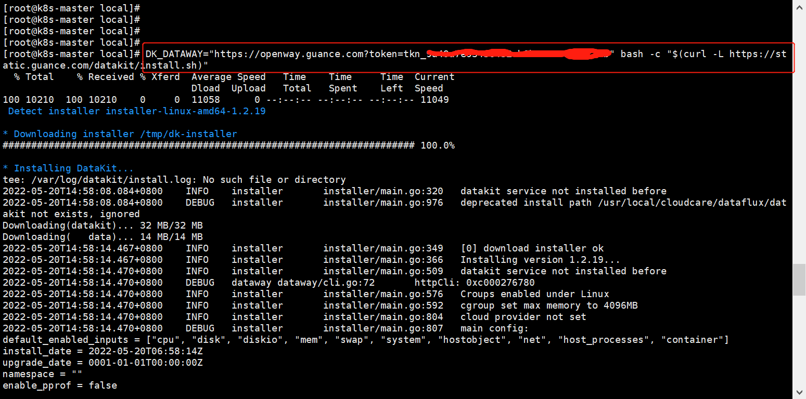

#### 1.2 开通采集器

开通 RUM，需要让用户远程访问到 DataKit 的 9529 端口，编辑下面文件。

```shell
vi /usr/local/datakit/conf.d/datakit.conf
```

修改 listen 的值是 `0.0.0.0:9529` 


复制 conf 文件，开通 SkyWalking 采集器。

```shell
cd /usr/local/datakit/conf.d/skywalking
cp skywalking.conf.sample skywalking.conf
```

开通日志采集器。

```shell
cd /usr/local/datakit/conf.d/log
cp logging.conf.sample skywalking-service-log.conf
```

编辑 `skywalking-service-log.conf` 文件

- logfiles 填日志的文件路径，由于要把 jar 部署到 `/usr/local/df-demo/skywalking` 目录，这里日志路径是 `/usr/local/df-demo/skywalking/logs/log.log`
- source 为 `skywalking-service-log`

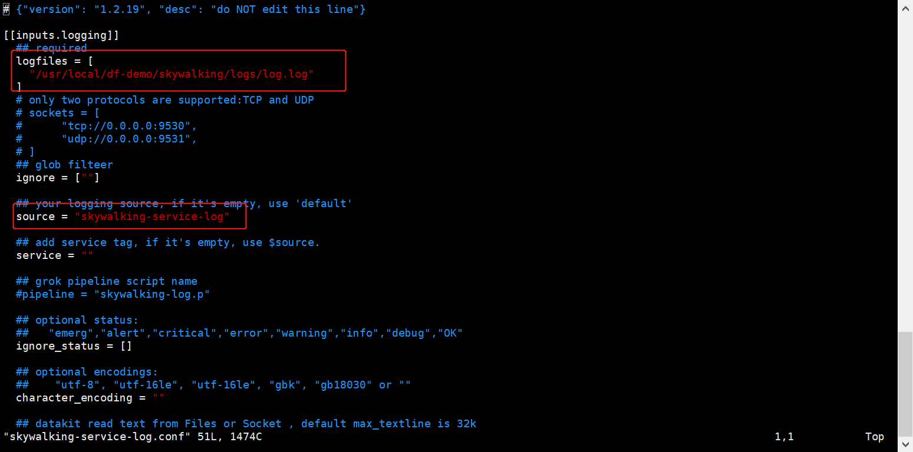

#### 1.3 重启 DataKit

```shell
systemctl restart datakit
```

### 2 部署应用

#### 2.1 部署后端服务

下载[ skywalking-demo ](https://github.com/stevenliu2020/skywalking-demo)项目，使用 Idea 打开，点击右边「package」，即可生成 `skywalking-user-service.jar` 文件。


上传 `skywalking-user-service.jar` 到 `/usr/local/df-demo/skywalking` 目录。


> **注意：**<br/>
> 1.项目需要添加依赖<br/>

    ```xml
            <dependency>
                <groupId>org.apache.skywalking</groupId>
                <artifactId>apm-toolkit-logback-1.x</artifactId>
                <version>8.7.0</version>
            </dependency>
    ```

> 2.输出日志，需要把 traceId 输出。
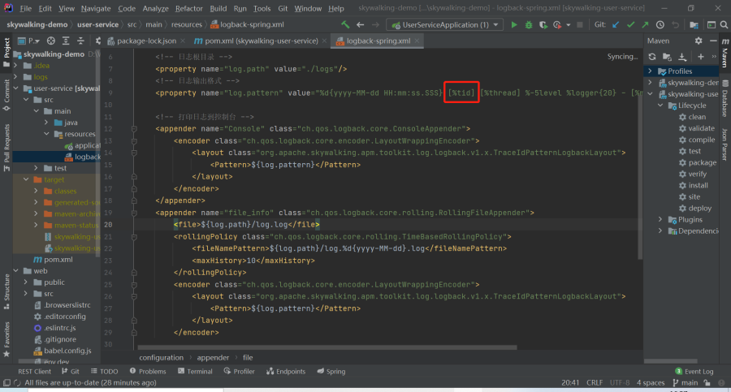


#### 2.2 部署 web

进入 web 项目的目录，命令行执行 `cnpm install`


执行 `npm run build` 生成部署文件。

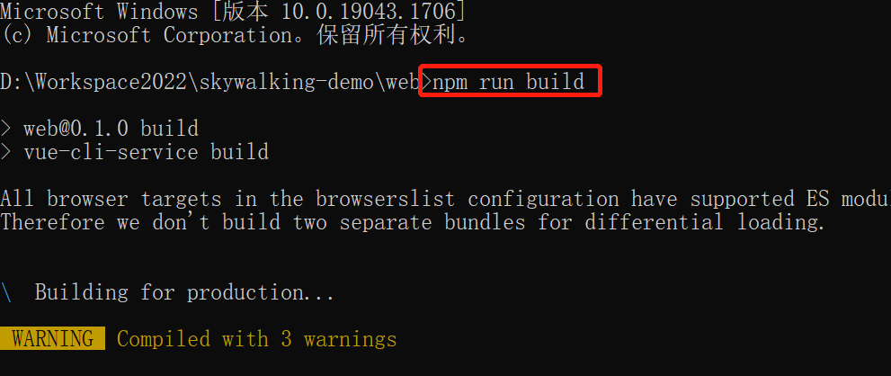

复制 disk 目录下的文件到服务器的 `/usr/local/web` 目录。

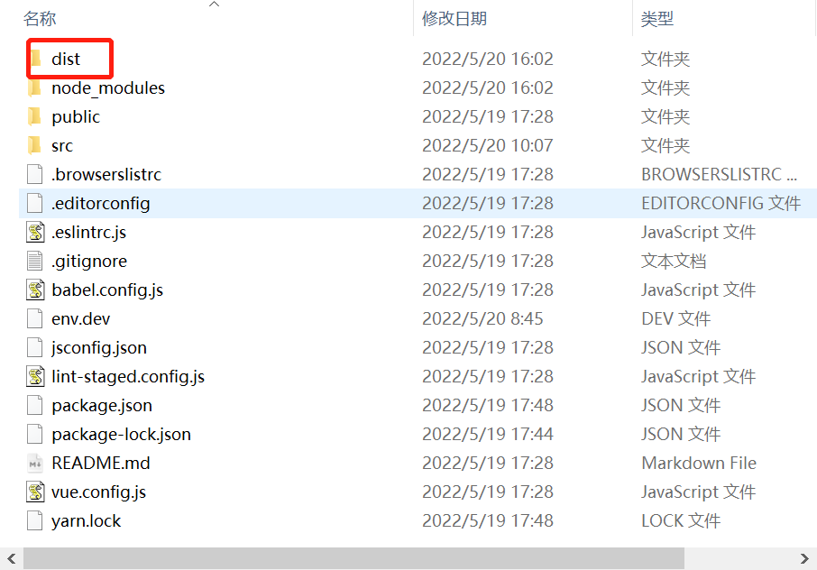

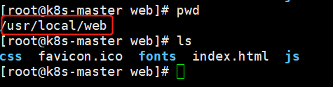

编辑 `/etc/nginx/nginx.conf` 文件，增加如下内容。

```toml
   location / {
            root   /usr/local/web;
            try_files $uri $uri/ /index.html;
            index  index.html index.htm;

        }

```


nginx 重新加载配置。

```shell
nginx -s reload
```

浏览器输入 Linux 服务 IP，访问前端界面。


### 3 开启 APM

下载 [SkyWalking](https://archive.apache.org/dist/skywalking/8.7.0/)

把 agent 目录上传到 Linux 的 `/usr/local/df-demo/skywalking` 目录。

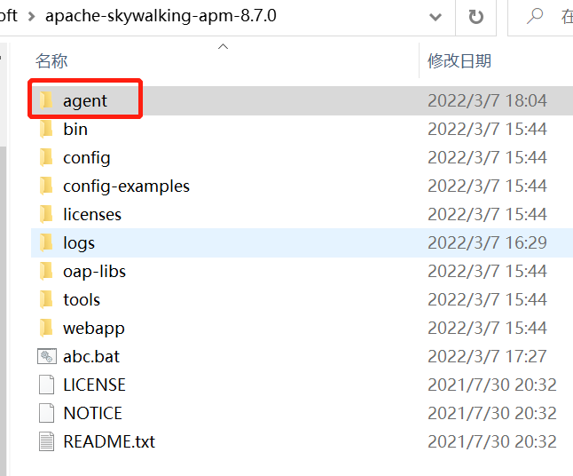

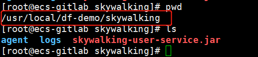

如果微服务使用了 springcloud gateway，必须把 `agent/optional-plugins/` 目录下的 `apm-spring-cloud-gateway-2.1.x-plugin-8.7.0.jar` 和 `apm-spring-webflux-5.x-plugin-8.7.0.jar` ，<br/>
复制到 `skywalking-agent/plugins/` 目录下。

> **注意：** apm-spring-cloud-gateway 的版本需要和具体使用的 springcloud gateway 版本相对应。

```shell
cp /usr/local/df-demo/skywalking/agent/optional-plugins/apm-spring-cloud-gateway-2.1.x-plugin-8.7.0.jar /usr/local/df-demo/skywalking/agent/plugins/
cp /usr/local/df-demo/skywalking/agent/optional-plugins/apm-spring-webflux-5.x-plugin-8.7.0.jar /usr/local/df-demo/skywalking/agent/plugins/
```

执行如下命令，启动后端服务，点击前端界面的按钮，调用后端服务。

```shell
cd /usr/local/df-demo/skywalking
java  -javaagent:agent/skywalking-agent.jar -Dskywalking.agent.service_name=skywalking-log  -Dskywalking.collector.backend_service=localhost:11800 -jar skywalking-user-service.jar
```

登录「[<<< custom_key.brand_name >>>](https://console.guance.com/)」，进入「应用性能监测」，查看服务、链路及拓扑图。

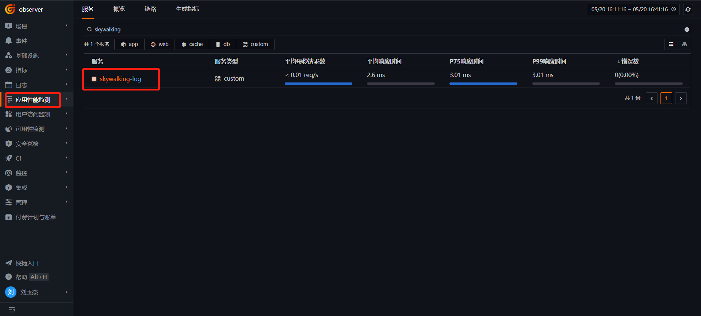

### 4 开启 RUM

登录「 [<<< custom_key.brand_name >>>](https://console.guance.com/)」，进入「用户访问监测」，新建应用 **skywalking-web-demo** ，复制下方 JS。

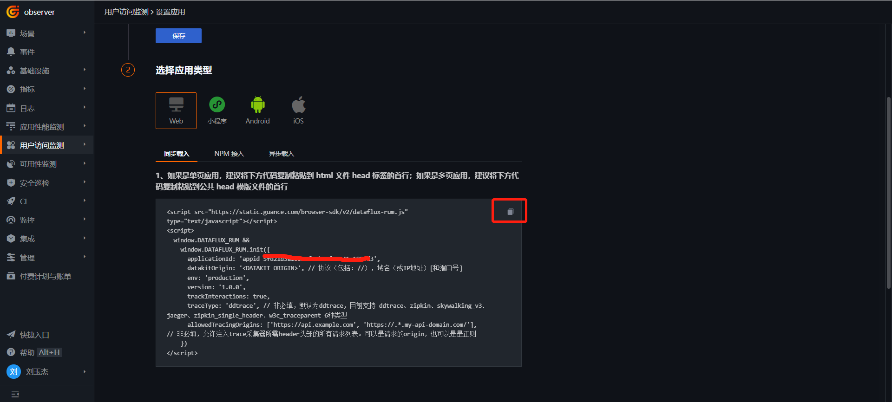

修改 `/usr/local/web/index.html`，把 JS 复制到 head 中

- 修改 datakitOrigin 为 DataKit 的地址，这里是 Linux 的 IP 地址加 9529 端口
- allowedTracingOrigins 为后端接口的地址，这里是 Linux 的 IP 地址加 8090 端口

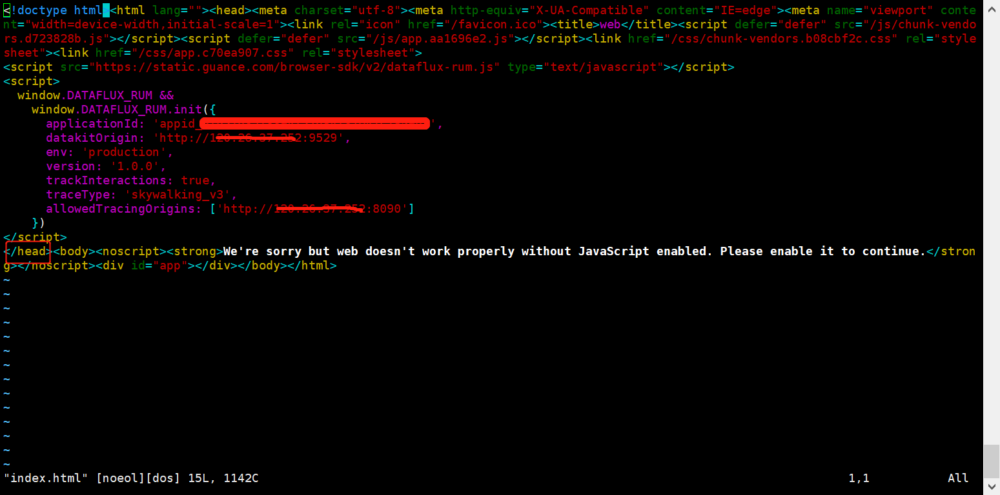

参数说明

- datakitOrigin：数据传输地址，这里是 datakit 的域名或 IP，必填。
- env：应用所属环境，必填。
- version：应用所属版本，必填。
- trackInteractions：是否开启用户行为统计，例如点击按钮、提交信息等动作，必填。
- traceType：trace 类型，默认为 ddtrace，非必填。
- allowedTracingOrigins：实现 APM 与 RUM 链路打通，填写后端服务的域名或 IP ，非必填。

点击前端界面的按钮。登录「 [<<< custom_key.brand_name >>>](https://console.guance.com/)」 - 「用户访问监测」，点击「skywalking-web-demo」，查看 UV、PV、会话数、访问的页面等信息。


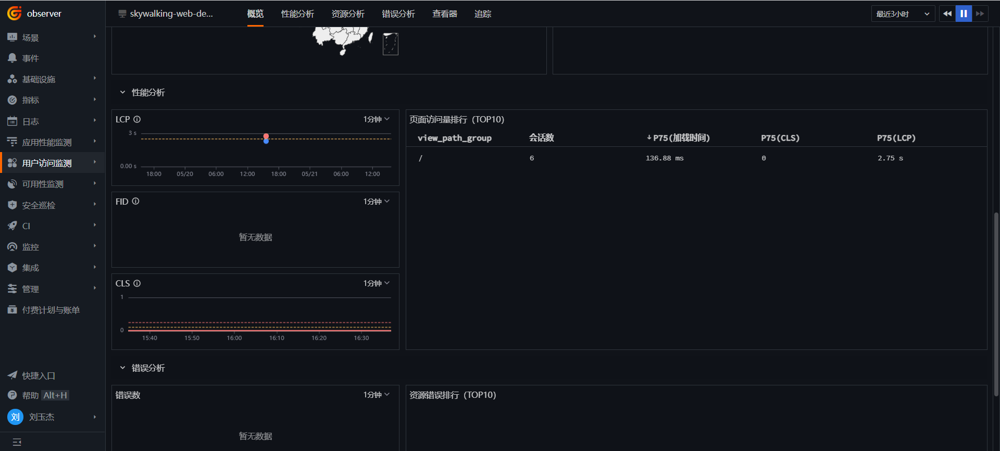

### 5 全链路可观测

登录「 [<<< custom_key.brand_name >>>](https://console.guance.com/)」 - 「用户访问监测」，点击 「skywalking-web-demo」，进入后点击「查看器」，选择「view」，查看页面调用情况，然后点击「route_change」进入。


选择「链路」


点击一条请求记录，可以观测“火焰图”、“Span 列表”、“服务调用关系”及这条链路调用产生的日志。

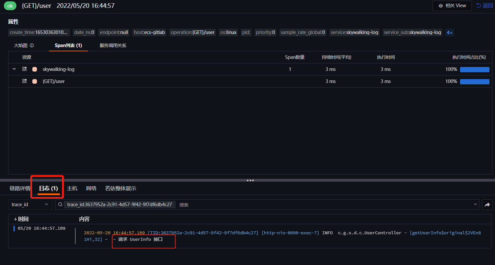
