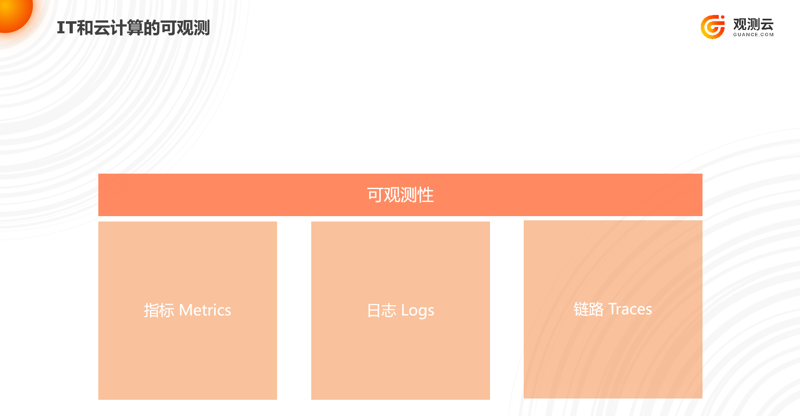
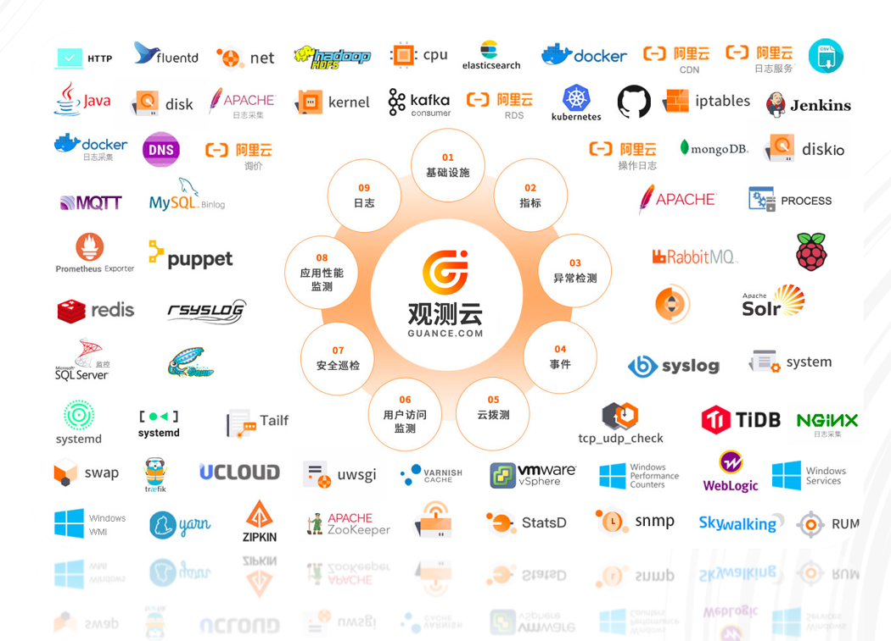
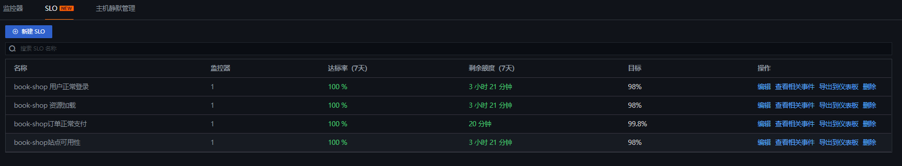
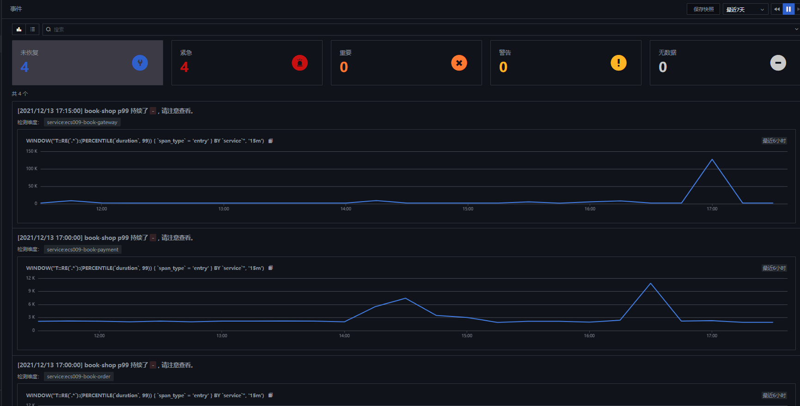

# SLO 从方法论到实践：Part2 SLO 工具选型

---

服务水平目标或 SLO 是站点可靠性工程工具包的关键部分。SLO 提供了一个框架，用于围绕应用程序性能定义明确的目标，最终帮助团队提供一致的客户体验、平衡功能开发与平台稳定性，并改善与内部和外部用户的沟通。

### SLO 和 SLI
正如我们在[第 1 部分](slo-part1.md)中看到的，SLO 为您的 SLI 设置了精确的目标，这些目标是反映服务运行状况和性能的指标。通过在[ {{{ custom_key.brand_name }}}](https://guance.com/)中管理您的 SLO，您可以无缝访问监控数据——包括来自 APM 的跟踪指标、自定义指标、合成数据和从日志生成的指标——以用作 SLI。例如，如果您想确保快速处理典型的用户请求，您可以使用来自 APM 的服务的中位延迟作为 SLI。然后，您可以将 SLO 定义为“在任何日历月 99% 的时间里，所有用户请求的中位延迟（按每分钟计算）将小于 250 毫秒。”
为了准确跟踪实际性能与您设定的目标的比较情况，您需要一种方法来不仅监控实时性能（例如，每 60 秒计算一次中位延迟并将其与 250 毫秒阈值进行比较），而且还需要测量在更长的时间跨度内违反该阈值的频率（以确保每个日历月都达到 99% 的目标）。{{{ custom_key.brand_name }}}跟踪您的 SLI 并可视化它们与您建立的 SLO 相关的状态，因此您可以立即看到在给定时间段内实际性能与您的目标的比较情况。

### 工具选择
对于SLI指标，数据主要源于三大件：Metrics、Logs、Traces

Metrics：指标，主要是收集系统及应用程序指标，这些指标对我们的服务有很大的影响，比如CPU突然暴增100%带来的后果是应用处理能力极具下降，对用户表现就是卡顿现象严重。

Traces: 链路，基于有向无环图构建的软件各个模块直接的调用关系，服务调用链路情况，通过链路信息，我们能够快速的定位哪些服务、哪些语句对客户有很大的影响，比如数据库慢查询。

Logs: 日志，系统/应用输出的时间相关的记录，通常由系统/软件开发人员输出，方便定位系统的错误和状态。将日志中有关联性的数据提取为Tag或Field，Tag方便进行聚合和分组，Field方便基于计算和聚合。

常用工具
> Metrics
> promethues、OpenTelemetry...
> Traces
> skyworking、OpenTelemetry、jaeger、Sleuth、Zipkin...
> Logs
> ELK 、filebeat、flume...

太多的免费开源工具且每个体系都是有特定的 Console 和语法，这些工具对您来说都有着高额的学习成本以及昂贵的维护成本，分散的系统和用户体系不得不让您在多个平台间不断来回切换，恰恰SLI需要这样一个能够集中各系统组件的平台聚合，通过一个平台能够接入多方工具并统一语法，能够有效的降低学习成本。[{{{ custom_key.brand_name }}}](https://guance.com/)是最好的选择，{{{ custom_key.brand_name }}}为您提供了一站式解决方案，目前已经接入了 200+ 开源工具组件。当然您也可以组建团队来构建这样一个平台，但并不建议您这么做。

### 在一处管理您的所有 SLO
如果您的组织致力于跨多个产品和团队的各种 SLO，在一个地方可视化所有 SLO 的状态可以帮助您设置优先级并解决问题。{{{ custom_key.brand_name }}}的服务级别目标视图允许您查看所有 SLO 的状态，以及每个SLO 的剩余错误预算。

### 根据指标和监视器创建 SLO

在 SLO 列表视图中，您可以通过单击 新建 SLO按钮。{{{ custom_key.brand_name }}}中的 SLO 可以基于现有的监视器（例如，将 p90 延迟与目标阈值进行比较的监视器）或根据指标计算的实时状态。基于指标的 SLO 可用于监控满足特定定义的指标百分比，例如来自负载均衡器的非 5xx 响应数除以响应总数。

### 一目了然地查看您的 SLO 和错误预算

单击 SLO 或者打开事件会打开一个侧面板，其中显示 SLO 的详细信息，例如其状态、目标值和剩余错误预算。{{{ custom_key.brand_name }}}自动生成一个错误预算对于每个 SLO，这表示在违反 SLO 之前您可以承受的不可靠性程度。这有助于快速了解您是否正在实现目标，以及您的开发速度是否适合您既定的性能和稳定性目标。{{{ custom_key.brand_name }}}会根据您指定的 SLO 目标和时间窗口自动计算错误预算。例如，7 天期间 99% 的 SLO 目标将为您提供大约三个半小时的错误预算，该期间的性能不合标准。

### 可视化 SLO 状态

	要在上下文中跟踪 SLO 的状态以及有关相关服务或基础架构组件的详细数据，您可以将 SLO 小部件添加到您的 {{{ custom_key.brand_name }}}仪表板。然后，您可以在内部或外部共享您的仪表板，将您的 SLO 的实时状态传达给依赖您的服务的任何人。

您还可以通过常见的 SLO 基准（例如上周、上月、本周至今或本月至今）可视化违反该阈值的频率。如果您将过去 30 天的目标设置为 99%，并将警告目标设置为 99.5%，则您的 SLO 状态在高于 99.5% 时显示为绿色，低于 99.5% 时显示为黄色，下降时显示为红色低于 99%。

### 展示并共享您的服务状态

{{{ custom_key.brand_name }}} 使在您已经监控应用程序、基础设施、用户体验等的同一个地方监控和管理您的 SLO 变得简单。也许同样重要的是，{{{ custom_key.brand_name }}} 使您能够向依赖于满足这些 SLO 的任何利益相关者或用户提供透明度。如果您还没有使用 {{{ custom_key.brand_name }}} 来监控您的服务的运行状况和性能，您可以从这里开始[免费试用帐户](https://auth.guance.com/redirectpage/register)。

继续阅读本系列的[下一部分和最后一部分](slo-part3.md)，我们将分享在{{{ custom_key.brand_name }}}中充分利用您的SLO的最佳实践。

