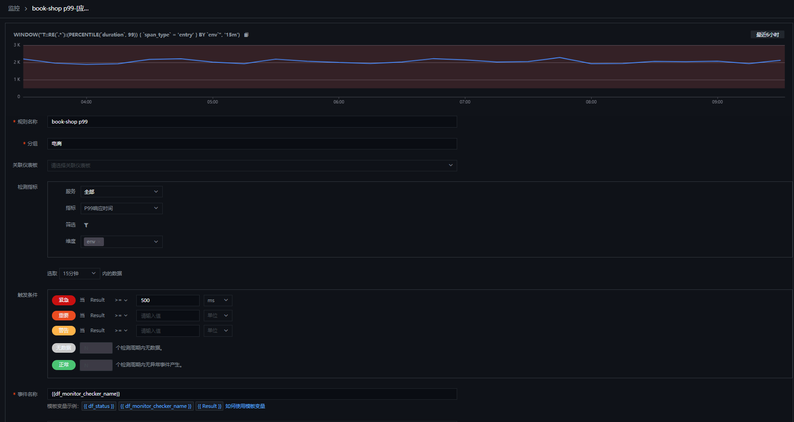
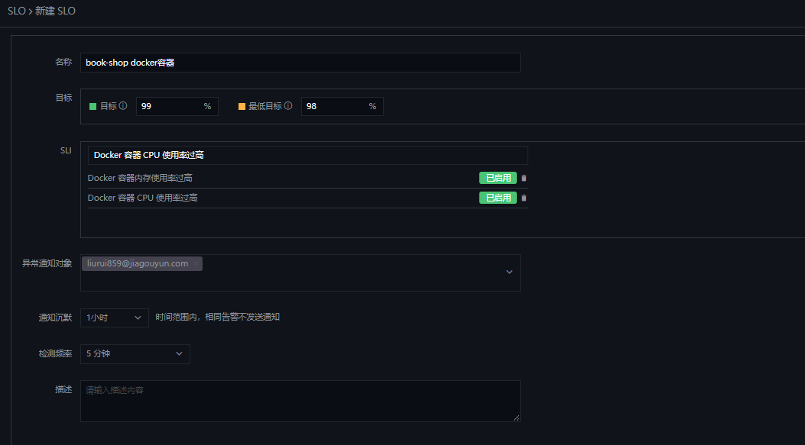

# SLO 从方法论到实践：Part3 使用{{{ custom_key.brand_name }}}管理SLO 的最佳实践

---

我们在[上一部做了 SLO 工具选型](slo-part2.md)，现在我们来看看 SLO 在[{{{ custom_key.brand_name }}}](https://guance.com/)的最佳实践

协作和沟通对于成功实施服务水平目标至关重要。开发和运营团队需要根据既定的服务可靠性目标评估他们的工作的影响，以改善他们的最终用户体验。{{{ custom_key.brand_name }}} 使您组织中的每个人都能在一个地方跟踪、管理和监控所有  SLO 和错误预算的状态，从而简化了跨团队协作。团队可以在仪表板上将他们的 SLO 与相关服务和基础设施组件一起可视化，并与依赖它们的任何利益相关者共享这些 SLO 的实时状态。

#### 为每个用例选择最佳 SLO

在{{{ custom_key.brand_name }}}中，可以创建多种监视器，您可以使用一个或多个监视器来计算其 SLI。SLI 被定义为您的服务表现出良好行为的时间比例（由处于非告警状态的底层监视器跟踪）。

{{{ custom_key.brand_name }}}监视器
> - 阈值检测
> - 日志检测
> - 突变检测
> - 区间检测
> - 水位检测
> - 安全巡检
> - 应用性能指标检测
> - 用户访问指标检测
> - 进程异常检测
> - 可用性监控数据检测

您可以创建不同种类的监视器来满足各自SLO的需求。

您可以创建一个基于用户访问指标检测的监视器创建 SLO，它使用您在 {{{ custom_key.brand_name }}} 中的指标来计算其 SLI。SLI 被定义为有效请求总数中的良好请求数。

如果您希望跟踪对支付端点的请求的延迟，创建一个应用性能指标检测监视器的 SLO 来跟踪基于时间的数据可能更合适：端点表现出良好行为（即，响应速度足够快）的时间百分比以满足您的 SLO 目标）。要创建此 SLO，您可以选择一个 {{{ custom_key.brand_name }}}阈值监视器，该监视器在对支付端点的请求延迟超过特定阈值时触发。

这个 SLO 可以口头表述为“在 99% 的时间里，请求的处理速度应该在 30 天的时间窗口内快于 0.5 秒。” {{{ custom_key.brand_name }}} 使用状态栏可视化基于监视器的 SLO 的历史和当前状态，让您轻松查看 SLO 被破坏的频率。此状态栏旁边的错误预算会告诉您在 SLO 变为红色之前监视器可以在告警状态下花费多少时间。

另一方面，如果您希望跟踪您的支付端点是否成功处理请求，您可以定义一个基于应用性能指标监视器指标的 SLO，应用性能指标检测主要是基于APM 的跟踪指标来跟踪请求到达端点的频率以及它们何时成功，该 SLO 使用基于计数的数据（即，与有效事件总数相比，良好事件的数量事件）为其 SLI。解决此问题的一种方法是将具有非 2xx 状态代码的 HTTP 响应的数量（我们将其视为异常事件的数量）。

如果您的应用部署在 Docker 上，您希望应用环境能够提供良好的服务，即一个安全容器的 SLO ，也可以从模板中创建一个 Docker监视器 ，并在设置 SLO 时，指定对应的监视器。

#### 使用 SLO 增强您的仪表板

您可能已经在使用仪表板来可视化来自您的基础设施和应用程序的关键性能指标。您可以通过添加SLO 摘要小部件来增强这些仪表板，以跟踪您的 SLO 随时间的状态。为了获得有关 SLO 状态的更多上下文，我们还建议添加与基于指标的 SLO 相对应的 SLI 图表，并显示构成基于监视器的 SLO的监视器的状态。

#### 使用 {{{ custom_key.brand_name }}} SLO 确保服务可靠性
在这篇文章中，我们研究了一些有用的技巧，它们将帮助您从 {{{ custom_key.brand_name }}} 中的服务级别目标中获得最大价值。SLO 与您的基础设施指标、分布式跟踪、日志、综合测试和网络数据一起，帮助您确保提供最佳的最终用户体验。{{{ custom_key.brand_name }}} 的内置协作功能不仅可以轻松定义 SLO，还可以轻松地与组织内外的利益相关者分享见解。

查看我们的[文档](https://docs.guance.com/)，开始定义和管理您的 SLO。如果您还没有使用 {{{ custom_key.brand_name }}}，您可以立即开始免费试用。
