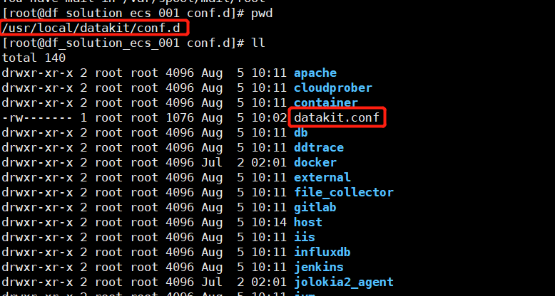
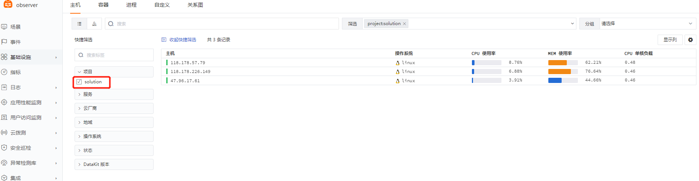
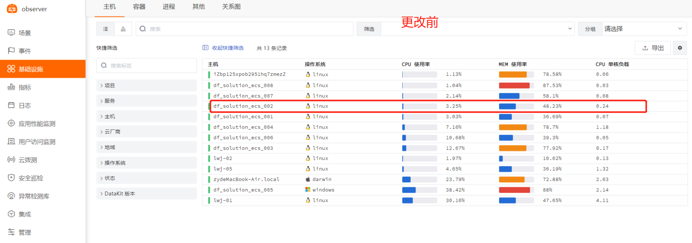
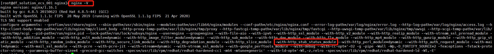
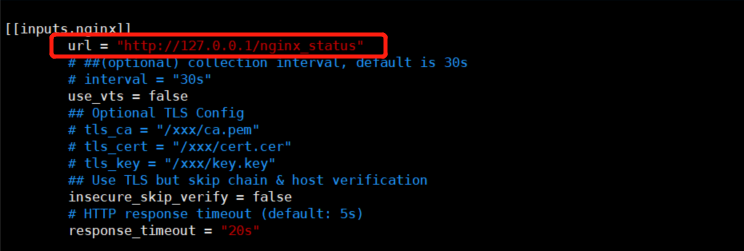
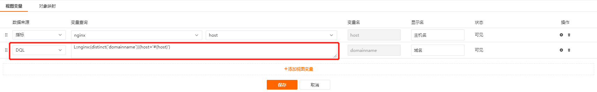
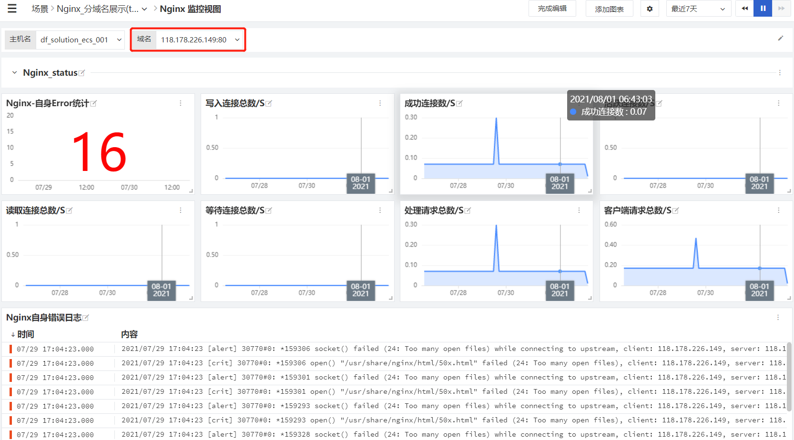
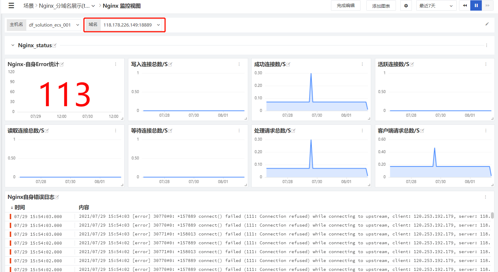
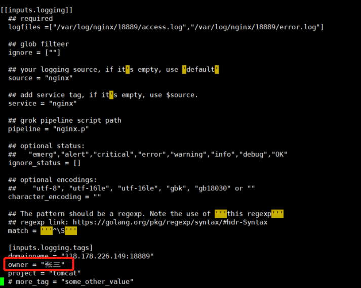

# TAG 在<<< custom_key.brand_name >>>中的最佳实践

---

此文仅用来抛砖引玉，希望各位能基于此发挥想象，创建属于自己的 tag 玩法。

## 前言

**Opentelemetry 协议**，是**CNCF（Cloud Native Computing Foundation-云原生计算基金会）**定义的最新一代的**可观测规范**（目前还在孵化中），该规范定义了可观测性的三大支柱：**metrics、trace、log（指标、链路、日志）**。但是如果仅仅是将这三支柱的数据收集起来，而不进行关联，那所谓的可观测性与传统的监控工具（APM、日志、zabbix 等）又有何区别，难道说仅仅是一套监控工具的集合吗？所以这里引申出一个很重要的观念：**TAG（标签）**，例如前后端打通的 traceID，在某种程度上也可以看做是一个 tag，将指标链路日志进行初步关联的 host 也可以看做是一个 tag，其他的例如项目、环境、版本号等等都是一个个的 tag！<br/>
总之，**通过 TAG 可以实现数据的关联，以及更多的自定义的可观测性玩法**，就显得尤为重要。<<< custom_key.brand_name >>>目前架构中所有的可观测项均支持 tag 的设置，理论上 tag 数量无上限。

举例：生活中常见的现象就是找工作或者 hr 招聘，招聘往往会有比较具体的要求，例如 xx 岗位，需要具备编程技能、计算机常识、本科学位、n 年工作经验等等，这一个个要求就好比标签，只有满足标签的人才有可能得到这个岗位，那在 IT 系统里，就可以是，xx 服务器上，跑了 xx 应用，xx 数据库，xxnginx，环境是 xx 环境，负责人是 xxx，当出现问题时，如果标签足够多，很快速的就可以知道哪台服务器有问题，具体影响了哪些业务，哪些应用组件，谁在负责相关的组件，这样就可以快速找到专业对口人员进行修复及弥补，从而提升解决问题的效率。

此文将利用<<< custom_key.brand_name >>>从四个示例对 tag 的可拓展性及可玩性进行试验。

## 实验一：给服务器进行分组

背景：企业内部往往存在**多个项目组或者事业部**，不同项目组或事业部在做自己的业务开发时，往往会用专属于自己的基础设施，如果从基础设施到应用都接入了<<< custom_key.brand_name >>>进行可观测性，那除了通过分工作空间之外，还有什么方式可以进行项目资源的区分吗？<br/>
当然有，<<< custom_key.brand_name >>>设计之初就想到了这种情况，默认的 DataKit 的主配置文件中，有一个 `global_tag` 的标签，该标签就是从基础设施层面进行标签的设定，该基础设施上的其他组件，例如应用、数据库都会默认带上这个标签。

### 1 修改 datakit-inputs，配置 global_tag

```xml
$ vim /usr/local/datakit/conf.d/datakit.conf

# 在global_tags 中添加标签，除默认的三个外，还可添加其他标签

$ [global_tags]
$  cluster = ""
$  project = "solution"
$  site = ""

```



同理，可将所有相关主机的 DataKit 都加上这个标签。

### 2 <<< custom_key.brand_name >>>-查看服务器分组



## 实验二：修改 datakit 识别的 hostname

背景：DataKit 会默认采集主机层面的 hostname，然后将识别到的 hostname 作为全局 tag，将所有的指标、链路、日志、对象等数据进行关联，但是，在很多企业内部实际环境中，hostname 是无规则的字符串，没有实际意义，而又因为 hostname 可能被用于连接应用或管理数据库等其他作用，企业内部无法评估更改 hostname（将 hostname 变更为可识别的字符串）会带来怎样的隐患，所以不愿意变更 hostname，为了避免风险，datakit 内置的 `ENV_HOSTNAME` 就可以应对这种情况。

???+ warning
    **注意：**此方法生效后，新的 hostname 所在的主机数据会重新进行上传，原有 hostname 的主机数据将不再更新。<br/>
    **建议：**如有更改 hostname 需要，最好在初次安装 datakit 时进行修改。

### 1 修改 datakit-inputs，配置[environments]

```xml
$ vim /usr/local/datakit/conf.d/datakit.conf

# 在[environments]中修改ENV_HOSTNAME,改成方便识别的hostname

[environments]
  ENV_HOSTNAME = "118.178.57.79"


```


### 2 <<< custom_key.brand_name >>>-对比更改前后的数据



## 实验三：Nginx 日志统计分服务进行数据展示

背景：企业内部的 nginx，一般担负着域名转发或者服务转发的作用，往往 nginx 所对应的域名会将前端请求转发至后端多个不同的子域名或者多个不同端口的服务，也有可能 nginx 直接会承载着多个域名服务，针对这种情况，统一化的 nginx 监控根本无法满足，那<<< custom_key.brand_name >>>是如何解决这种问题的呢？

**场景**：nginx 对外暴露 18889 跟 80 端口，分别转发至内网服务器 118.178.57.79 的 8999 及 18999 端口。

**需求**：分别统计 nginx18889 及 80 两个端口对应服务的数据，例如 PV、UV、请求错误数量等数据。

**前置条件**：nginx 的 80 及 18889 的访问日志已分别配置到不同的目录（或者配置成不同的日志文件名称）

| 80 端口日志目录    | /var/log/nginx/80/    |
| ------------------ | --------------------- |
| 18889 端口日志目录 | /var/log/nginx/18999/ |


### 1 配置 Nginx 自身指标监控

> 详细配置参考集成文档<[Nginx](../../integrations/nginx.md)>

1、 开启 `nginx.conf` 自身性能指标统计模块

查看 nginx 的 `http_stub_status_module` 模块是否已打开

（此示例已打开）



2、 在 `nginx.conf` 中增添 `nginx_status` 的 location 转发

```

$ cd /etc/nginx
   //nginx路径根据实际情况而定
$ vim nginx.conf

$  server{
     listen 80;
     server_name localhost;
     //端口可自定义

      location /nginx_status {
          stub_status  on;
          allow 127.0.0.1;
          deny all;
                             }

          }
```


3、 接下来执行 `nginx -s reload` 重新加载 nginx

4、 Datakit 中开启 `nginx.inputs`

```
$ cd /usr/local/datakit/conf.d/nginx/
$ cp nginx.conf.sample nginx.conf
$ vim  nginx.conf
```

5、 修改如下内容

```
[[inputs.nginx]]
    url = http://localhost/nginx_status
```



6、 保存 `nginx.conf` 文件后重启 DataKit

```xml
$ service datakit restart
```

### 2 分别配置配置 80 及 18889 服务对应的日志监控

```xml
$ cd /usr/local/datakit/conf.d/log/
$ cp logging.conf.sample nginx80.conf

$ vim nginx80.conf

## 修改log路径为正确的应用日志的路径
## source 、service 、pipeline 为必填字段，可以直接用应用名称，用以区分不同的日志名称
## 添加tag dominname

## 修改如下内容：
[[inputs.logging]]

  logfiles = ["/var/log/nginx/80/access.log","/var/log/nginx/80/error.log" ]

  source = "nginx"

  service = "nginx"

  pipeline = "nginx.p"

  [inputs.logging.tags]

  domainname = "118.178.226.149:80"

```

```xml

$ cd /usr/local/datakit/conf.d/log/
$ cp logging.conf.sample nginx18889.conf
$ vim nginx18889.conf

## 修改log路径为正确的应用日志的路径
## source 、service 、pipeline 为必填字段，可以直接用应用名称，用以区分不同的日志名称
## 添加tag dominname

## 修改如下内容：
[[inputs.logging]]

  logfiles = ["/var/log/nginx/18889/access.log","/var/log/nginx/18889/error.log" ]

  source = "nginx"

  service = "nginx"

  pipeline = "nginx.p"

  [inputs.logging.tags]

  domainname = "118.178.226.149:18889"
```


### 3 配置自定义视图（通过 tag 区分域名）

**步骤：**登录<<< custom_key.brand_name >>> - 「场景」 - 「新建场景」 - 「新建空白场景」 - 「系统视图」（创建 NGINX）

**重点：**在系统模板上修改 nginx 视图相关配置

1、 进入视图编辑状态，点击「修改视图变量」 - 「添加视图变量」

```
L::nginx:(distinct(`domainname`)){host='#{host}'}
```

> **含义说明：**继承 nginx 指标中的 host，在 L（日志）中查询 nginx 日志中不同的 domainname



2、 修改具体视图的参数


### 4 <<< custom_key.brand_name >>>-分服务数据展示





**同理：可以通过打不同的 tag，用以区分不同的 project、不同的负责人、不同的业务模块、不同的环境等等等等，tag 具体的能力取决于你的想象空间。**

## 实验四：通过 tag 确认服务具体 owner，进行告警通知

背景：企业内部随着企业业务的发展，微服务、容器被大量使用，服务组件越来越多，相应的开发及运维人员也越来越多，每个人的分工也越来越细，当业务系统或 IT 系统出现故障，最佳的告警实践就是可以直接指定相关负责人员，从而提高告警闭环的效率，这种方式常用的方式是告警只发送给相关的人员，或者是 jira 指派工单，那<<< custom_key.brand_name >>>是怎么操作的呢？<<< custom_key.brand_name >>>中只需要在具体的可观测 inputs 中添加 tag（理论上支持无上限的 tag 数量），例如在 `nginx-inputs` 中添加自定义 tag，`owner = "xxx"`，然后在异常检测中将 owner 设置为变量，异常检测就可以自动识别该字段并发送至钉钉或企业微信群，效果如下：

例如在上述的 nginx 自定义日志中进行添加：

### 1 在 inputs 中添加 tag



### 2 配置异常检测


### 3 触发告警，查看告警事件


