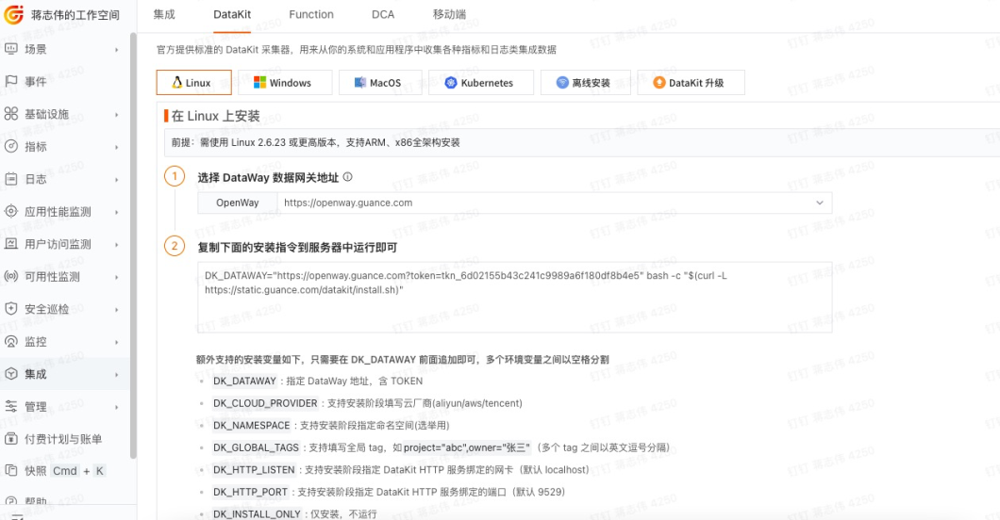
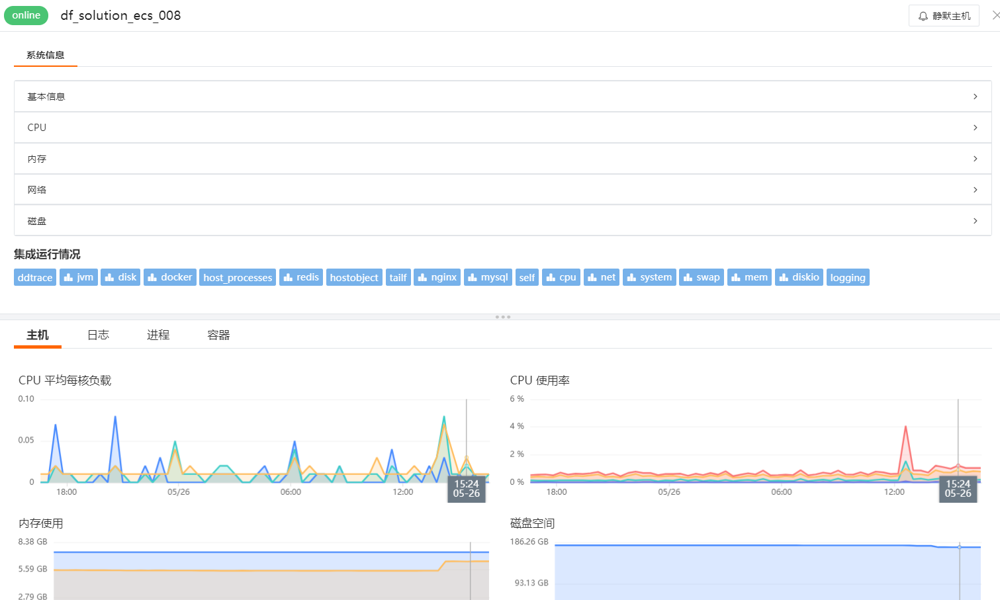
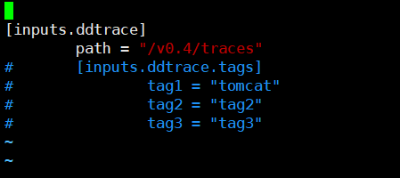
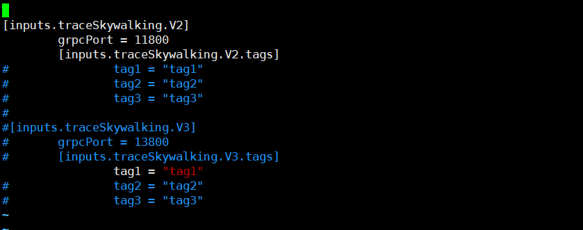
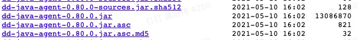
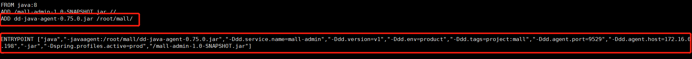
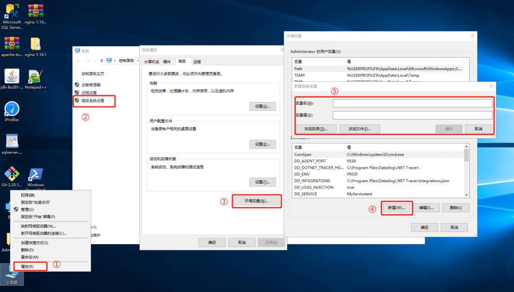
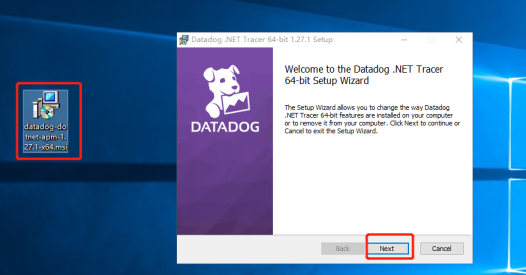

# 分布式链路追踪 (APM) 最佳实践

---

## 前置条件

账号注册：前往官方网站 [https://www.guance.com/](https://auth.guance.com/login/pwd) 注册账号，使用已注册的账号/密码登录


### 安装 Datakit

#### 获取命令

点击 [**集成**] 模块， 选择[**DataKit**]，根据您的操作系统和系统类型选择合适的安装命令。



#### 执行安装

复制 Datakit 安装命令在需要被监控的服务器上直接运行。

- 安装目录 /usr/local/datakit/
- 日志目录 /var/log/datakit/
- 主配置文件 /usr/local/datakit/conf.d/datakit.conf
- 插件配置目录 /usr/local/datakit/conf.d/

Datakit 安装完成后，已经默认开启 Linux 主机常用插件，可以在DF——基础设施——内置视图查看。

| 采集器名称 | 说明 |
| --- | --- |
| cpu | 采集主机的 CPU 使用情况 |
| disk | 采集磁盘占用情况 |
| diskio | 采集主机的磁盘 IO 情况 |
| mem | 采集主机的内存使用情况 |
| swap | 采集 Swap 内存使用情况 |
| system | 采集主机操作系统负载 |
| net | 采集主机网络流量情况 |
| host_process | 采集主机上常驻（存活 10min 以上）进程列表 |
| hostobject | 采集主机基础信息（如操作系统信息、硬件信息等） |
| docker | 采集主机上可能的容器对象以及容器日志 |

点击 [**基础设施**] 模块，查看所有已安装 Datakit 的主机列表以及基础信息，如主机名，CPU，内存等。


点击 [**主机名**] 可以查看该主机的详细系统信息，集成运行情况 (该主机所有已安装的插件)，内置视图(主机)。



点击 [**集成运行情况**] 任意插件名称 [**查看监控视图**] 可以看到该插件的内置视图。


---

### 查看链路追踪（APM）监控场景

登录 [guance](https://console.guance.com/) 进入具体的项目空间，点击应用性能监测即可查看：


---

## 链路追踪（APM）介绍

**APM**全称为 **_Application performance management（应用性能管理)_**, 这是一种随着互联网发展而衍生的一种监控技术，面世之初就是为了解决互联网用户高并发大流量带来的应用性能瓶颈问题，从开发及运维的角度将应用程序的层层调用逻辑透明化，从而方便企业内部快速进行故障定位，降低 MTTR（Mean time to repair，平均故障修复时间），从而提升整体的用户体验。从本质上，APM 与 NPM（旁路监听），日志等部署方式有比较大的区别，应用场景也略有区别，APM 的部署方式往往是侵入式的（字节码注入或者 AOP），而日志及 NPM 往往是无需在用户代码中进行侵入，APM 主要用于研发跟运维查看系统整体运行状态，健康程度，外部 API 、数据库调用乃至自身更细粒度的代码及方法调用资源消耗或异常问题，偏向于应用侧的系统性能及稳定性保障。NPM 主要应用场景为网络链路侧的延时丢包，抓包解包分析，不涉及具体应用内的代码性能分析，日志更多的是偏向于已知的问题处理，业务日志，也不涉及具体的代码质量分析。

链路追踪相关名词解释：

| 关键词 | 释义 |
| --- | --- |
| 服务 | 即service_name，可在添加Trace监控时进行自定义 |
| 资源 | 资源指Application中处理一次独立访问请求时的请求入口 |
| 持续时间 | 即响应时间，完整的请求过程为从Application接收请求开始，到Application返回响应结束 |
| 状态 | 状态分为OK以及ERROR，错误包含错误率及错误数 |
| Span | 单一操作方法调用全流程即为Trace链路，Trace由多个Span单元组成 |

DF 官方目前支持所有支持 Opentracing 协议的 APM 监控工具，例如市面上比较流行的 Skywalking、Zipkin、Jaeger、Ddtrace 等，具体接入方式也与原开源监控工具接入方式保持一致，即在原代码里添加或引入相关监控文件（例如Java 引入一个Jar包）。之后在 datakit 中开启对应的 inputs 即可实现将链路数据打至 DF 平台，也可与日志、指标、基础设施数据进行关联分析，实现一体化监控运维开发，提升整体的排障效率。

## 链路追踪（APM）采集相关配置

### 开启 datakit.conf 中链路追踪 inputs

```shell
###########--------linux环境---------##########
$ cd /usr/local/datakit/conf.d/

###########--------windows环境-------##########
$ C:\Program Files\datakit\conf.d


## 使用不同的监控工具需要开启不同的conf文件，如果只采用了一种，只需复制并开启对应的conf文件即可，本文所使用的是ddtrace

#############----------skywalking----------###########
$ cd /traceSkywalking
$ cp traceSkywalking.conf.sample traceSkywalking.conf
#############----------skywalking----------###########

#############------------jaeger------------###########
$ cd /traceJaeger
$ cp traceJaeger.conf.sample traceJaeger.conf
#############------------jaeger------------###########

#############------------zipkin------------###########
$ cd /traceZipkin
$ cp traceZipkin.conf.sample traceZipkin.conf
#############------------zipkin------------###########

#############------------ddtrace------------###########
$ cd /ddtrace
$ cp ddtrace.conf.sample ddtrace.conf
#############------------zipkin------------###########

## 复制完文件后，vim进入编辑模式，放开inputs的注释
## 举例:ddtrace    tags相关注释可根据需要进行开启操作，添加业务或其他相关的标签

$ vim ddtrace.conf

$ [inputs.ddtrace]
$         path = "/v0.4/traces"
$ #       [inputs.ddtrace.tags]
$ #               tag1 = "tomcat"
$ #               tag2 = "tag2"
$ #               tag3 = "tag3"

$ wq!

## 重启datakit 
###########--------linux环境---------##########
$ datakit --restart

###########--------windows环境---------##########
## 右键——任务管理器——服务——datakit——重启
```





---

### 应用接入链路追踪（APM）相关步骤 {#ddtrace}

ddtrace 探针下载地址

- Python: [https://github.com/DataDog/dd-trace-py](https://github.com/DataDog/dd-trace-py)
- Golang: [https://github.com/DataDog/dd-trace-go](https://github.com/DataDog/dd-trace-go)
- NodeJS: [https://github.com/DataDog/dd-trace-js](https://github.com/DataDog/dd-trace-js)
- PHP: [https://github.com/DataDog/dd-trace-php](https://github.com/DataDog/dd-trace-php)
- Ruby: [https://github.com/DataDog/dd-trace-rb](https://github.com/DataDog/dd-trace-rb)
- C#（dotnet）: [https://github.com/DataDog/dd-trace-dotnet](https://github.com/DataDog/dd-trace-dotnet)
- C++: [https://github.com/DataDog/dd-opentracing-cpp](https://github.com/DataDog/dd-opentracing-cpp)
- Java：[https://github.com/DataDog/dd-trace-java](https://github.com/DataDog/dd-trace-java)

ddtrace 相关环境变量（启动参数）释义

```java
Ddd.env：自定义环境类型    （可选项）
Ddd.service.name: 自定义应用名称   （必填项）    如果该配置配置后数据依旧无法展示，可将name去掉进行尝试
Ddd.agent.port:数据上传端口（默认9529 ）（必填项）
Ddd.version:应用版本 （可选项）
Ddd.trace.sample.rate：设置采样率（默认是全采）（可选项）
Ddd.service.mapping：当前应用调用到的redis、mysql等，可通过此参数添加别名，用以和其他应用调用到的redis、mysql进行区分 （可选项）
Ddd.host：数据传输目标IP，默认为本机localhost （可选项）
```

具体配置参考 [Datadog 官方](https://docs.datadoghq.com/tracing/setup_overview/setup/java?tab=containers)

#### Java（ddtrace）接入：

1、下载[[ddtrace-agent](https://repo1.maven.org/maven2/com/datadoghq/dd-java-agent/)]，建议用0.80.0



用放置在应用环境同级目录<br />（**1.6版本 datakit 之后，ddtrace-java-agent 已默认内置于 datakit，目录：/usr/local/datakit/data/**）<br />2、在原有应用启动脚本中添加 ddtrace.jar 启动参数，添加字段如下 -javaagent:/xxx/ddtrace.jar -Ddd.env=xxx  -Ddd.service.name=xxx -Ddd.agent.port=xxx    其中 xxx 内容都需要填写。

---

##### Tomcat接入

在 catalina.sh 添加 ddtrace 启动参数后，重启 tomcat。代码段中的 xxx 需替换为绝对路径

```shell
$ cd /xxx/tomcat/bin
$ vim catalina.sh

$ CATALINA_OPTS="$CATALINA_OPTS -javaagent:/xxx/ddtrace.jar -Ddd.env=test -Ddd.service.name=demo001 -Ddd.agent.port=9529"; export CATALINA_OPTS

$ wq!

## 重启tomcat
$ ./bin/startup.sh
```

登录 [guance](https://console.guance.com/) 进入具体的项目空间，点击应用性能监测即可查看服务名为 mall-admin 的应用数据。

---

##### 微服务接入

直接在启动脚本中添加 ddtrace 的启动参数，重启应用。代码段中的 xxx 需替换为绝对路径

```shell
## 原启动脚本：
$ nohup java -jar mall-admin.jar &

## 添加ddtrace启动参数后的启动脚本如下，执行命令重启应用：
$ nohup java -javaagent:/xxx/dd-java-agent-0.72.0.jar -Ddd.service.name=mall-admin -Ddd.agent.port=9529 -jar mall-admin.jar &
```

登录 [guance](https://console.guance.com/) 进入具体的项目空间，点击应用性能监测即可查看服务名为 mall-admin 的应用数据。

---

##### Docker接入

Docker 环境下接入方式有多种，示例会展示两种方式：<br />1、修改 Dockerfile，重新打包 **代码段中的 xxx 需替换为绝对路径**

```shell
$ vim Dockerfile

##Dockerfile中添加ddteace-agent路径,xxx指代绝对路径
$ ADD dd-java-agent-0.75.0.jar /xxx/  
$ ENTRYPOINT ["java","-javaagent:/xxx/dd-java-agent-0.75.0.jar","-Ddd.service.name=mall-admin","-Ddd.version=v1","-Ddd.env=product","-Ddd.agent.port=9529","-Ddd.agent.host=172.16.0.198","-jar", “-Dspring.profiles.active=prod","/mall-admin-1.0-SNAPSHOT.jar"]
$ wq!
```



```shell
## build & run
$ docker build -t mall/mall-admin:v1 .  [ “.” 必须添加]

## docker run
$ docker run -p 8080:8080 --name mall-admin --link mysql:db --link redis:redis -v /etc/localtime:/etc/localtime -v /mydata/app/admin/logs:/var/logs -d mall/mall-admin:v1
```

2、不修改 Dockerfile，用启动参数覆盖原有启动命令（某些场景下可能不适用）

```shell
## 原有启动命令
$ docker run -p 8080:8080 --name mall-admin --link mysql:db --link redis:redis -v /etc/localtime:/etc/localtime -v /mydata/app/admin/logs:/var/logs -d mall/mall-admin:v1

## 包含ddtrace的启动命令，需要查看dockerfile中jar包的启动命令
$ docker run -p 8080:8080 --name mall-admin --link mysql:db --link redis:redis -v /etc/localtime:/etc/localtime -v /mydata/app/admin/logs:/var/logs -d mall/mall-admin:v1 java -javaagent:/wx/dd-java-agent-0.75.0.jar -Ddd.service.name=mall-admin -Ddd.version=v1 -Ddd.env=product -Ddd.agent.port=9529 -Ddd.agent.host=172.16.0.198 -jar -Dspring.profiles.active=prod /mall-admin-1.0-SNAPSHOT.jar

## 注意：添加完java –javaagent后需要在启动脚本后添加-jar your app name.jar
```

登录 [guance](https://console.guance.com/) 进入具体的项目空间，点击应用性能监测即可查看服务名为对应 serveice.name 的应用数据。

---

#### C#（dotnet-ddtrace）接入

##### IIS 托管环境接入： 

备注：[[dotnet-agent下载链接](https://github.com/DataDog/dd-trace-dotnet/releases/)] ，可根据需求下载 x86、arm64 或者其他版本的 agent。

1、 **添加服务器环境变量**

```
## 点击 此电脑右键——属性——高级系统设置——环境变量
## 新建系统变量——输入如下内容

DD_TRACE_AGENT_URL=http://localhost:9529    （必填）
DD_ENV=   举例 test      （可选）
DD_SERVICE=   举例 myappname     （必填）
DD_VERSION=   举例 1.0     （可选）
DD_TRACE_SERVICE_MAPPING=  举例 mysql:main-mysql-db    （可选）

## TRACE_AGENT_URL为数据上传IP加端口，需填为http://localhost:9529，不建议更改
## ENV为系统环境，可根据需求设置为pro或者test或其他内容
## SERVICE为设置df平台上所展现的应用名称，可设置为具体服务名称
## VERSION为版本号，可根据需要进行设置
## TRACE_SERVICE_MAPPING 使用配置重命名服务，以便在df平台上与其他业务系统调用的组件进行区分展示。接受要重命名的服务名称键的映射，以及要使用的名称，格式为[from-key]:[to-name]
   注意：[from-key]内容为标准字段，例如 mysql、redis、mongodb、oracle，请勿进行自定义更改
   示例：TRACE_SERVICE_MAPPING=mysql:main-mysql-db
         TRACE_SERVICE_MAPPING=mongodb:offsite-mongodb-service

```



2、 **安装 ddtrace-agent**

已管理员权限运行 dotnet-agent 安装包，点击下一步，直到安装成功。



3、 **在 PowerShell 执行如下命令，重启iis**

```shell
## 停止 iis 服务
net stop /y was

## 启动 iis 服务
net start w3svc
```

登录 df 平台在应用性能检测模块查看对应 servicename 的应用

---

#### Python（ddtrace）接入

[[Python 相关部署介绍](/integrations/ddtrace-python)]

---

#### .NET Core（ddtrace）接入

备注：[[dotnet.core-agent下载链接](https://github.com/DataDog/dd-trace-dotnet/releases/)] ，.NET Tracer 目前支持 .NET Core 2.1、3.1 和 .NET 5 上的应用追踪。

1、 **分环境运行如下命令命令安装 .net core-agent**

```shell
Debian 或 Ubuntu
sudo dpkg -i ./datadog-dotnet-apm_<TRACER_VERSION>_amd64.deb && /opt/datadog/createLogPath.sh

CentOS 或 Fedora
sudo rpm -Uvh datadog-dotnet-apm<TRACER_VERSION>-1.x86_64.rpm && /opt/datadog/createLogPath.sh

Alpine 或其他基于 musl 的发行版
sudo tar -xzf -C /opt/datadog datadog-dotnet-apm<TRACER_VERSION>-musl.tar.gz && sh /opt/datadog/createLogPath.sh

其他发行版
sudo tar -xzf -C /opt/datadog datadog-dotnet-apm<TRACER_VERSION>-tar.gz && /opt/datadog/createLogPath.sh
```

2、 **添加应用环境变量**

在应用已配置的环境变量中添加如下配置
此处仅供参考，实际配置中 service 名称需要改动

```shell
export CORECLR_ENABLE_PROFILING=1
export CORECLR_PROFILER_PATH=/opt/datadog/Datadog.Trace.ClrProfiler.Native.so
export DD_INTEGRATIONS=/opt/datadog/integrations.json
export DD_DOTNET_TRACER_HOME=/opt/datadog
export DD_TRACE_AGENT_URL=http://localhost:9529
export DD_SERVICE=service_test
export CORECLR_PROFILER={846F5F1C-F9AE-4B07-969E-05C26BC060D8}
```

3、 **重启应用**

---

### Q&A

#### agent 与 jar 包位置关系

ddtrace-agent 的启动参数一定要放置在 java 应用启动 -jar之前，最终形式为 java -javaagent -jar

```shell
## 原启动脚本：
$ java -jar mall-admin.jar

## 添加 ddtrace 启动参数后的启动脚本如下，执行命令重启应用：
$ java -javaagent:/xxx/dd-java-agent-0.72.0.jar -Ddd.service.name=mall-admin -Ddd.agent.port=9529 -jar mall-admin.jar
```

#### tomcat-catalina.sh 参数配置

在 catalina.sh 添加 ddtrace 启动参数后，重启 tomcat。代码段中的 xxx 需替换为绝对路径<br />CATALINA_OPTS 相关配置务必要让 catalina.sh 内的应用启动脚本读到，否则应用正常启动不会启动 ddtrace-agent

```shell
$ cd /xxx/tomcat/bin
$ vim catalina.sh

$ CATALINA_OPTS="$CATALINA_OPTS -javaagent:/xxx/ddtrace.jar -Ddd.env=test -Ddd.service.name=demo001 -Ddd.agent.port=9529"; export CATALINA_OPTS

$ wq!

## 重启tomcat
$ ./bin/startup.sh
```

登录 [guance](https://console.guance.com/) 进入具体的项目空间，点击应用性能监测即可查看服务名为 mall-admin 的应用数据。