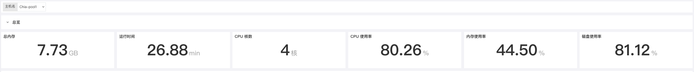
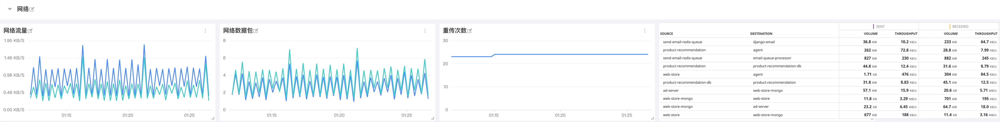

# Chia Harvesters 保障最佳实践
---

## 简介
Chia 用户需要对多个主机的 Harvesters 进行全实时监测，细致的分析了不同的 Harvesters 的可用性、状态和收益，不断提升 Chia 用户对 Harvesters 的掌控力。Dataflux 采取主被动监测，全域异常检测模块，真实与 chia 用户的需求结合，建设统一的 chia 业务管 理平台，方便 chia 用户全局直观掌控 Harvesters 运行状态，提高产出效率，方便排查 Harvesters 的故障或是预期收益不足的问题。 同时提供 Chia 性能专家级服务和驻场支持服务， 助力 chia 用户取得更高收益。需要监视的几个关键领域是：

- **Harvesters**

- **CPU**
- **内存**
- **磁盘**
- **网络**

## 场景视图



## 内置视图

## 磁盘


## 前置条件

已安装 DataKit ([DataKit 安装文档](/datakit/datakit-install/))

## 配置

### 日志采集

本文以 Windows 客户端为例( Linux 同理)

#### 创建 chia farm 日志收集脚本

已安装git ([GIt 安装参考](https://git-scm.com/))

进入 `chia-blockchain` 目录(C:\Users\{您的用户}\AppData\Local\chia-blockchain\app-{您的chia版本}\resources\app.asar.unpacked\daemon) 创建日志收集脚本 farmer.sh ，将 chia 客户端 farm 信息保存到 farmer.log 中

> 请先在 C:\Users\{您的用户}\AppData\Local\chia-blockchain\app-{您的chia版本}\ 中创建 data_collect 文件夹

```shell
#!/bin/bash

while true; do
	sleep 2
	./chia.exe farm summary  | awk '{line=line "," $0} NR%10==0{print substr(line,1); line=""}' >> ../../../data_collect/farmer.log
done

```
### DataKit 的 pipeline 配置
进入 DataKit 安装目录下的 `pipeline` 目录，分别创建 `farm_log.p`、`chai_debug_log.p`来完成收集日志的切割工作。示例如下:
#### chia_debug_log.p
```shell
#chia_debug_log
#名称	描述
#strptime($timestamp, "2006-01-02T15:04:05") 
#total_plots  Plot 数量
#eligible_plots   通过初筛 Plot 数量
#proofs_found  	爆块数量
#check_duration  查询时间

# 日志示例：
#2021-04-24T11:01:53.390 harvester chia.harvester.harvester: INFO     1 plots were eligible for farming 940b588c2a... Found 0 proofs. Time: 0.98087 s. Total 19 plots


grok(_, "%{TIMESTAMP_ISO8601:strptime} harvester chia.harvester.harvester: INFO \\s+ %{NUMBER:eligible_plots} plots were eligible for farming \\w+\\.\\.\\. Found %{NUMBER:proofs_found} proofs\\. Time: %{NUMBER:check_duration} s\\. Total %{NUMBER:total_plots} plots.*")

# 数值类型转换
cast(eligible_plots, "float")
cast(proofs_found, "float")
cast(check_duration, "float")
cast(total_plots, "float")

# 丢弃原内容
drop_origin_data()
```
#### farm_log.p
```shell
#farm_log
#名称	描述
#farming_status  farmer 状态
#xch_count	挖到的 XCH
#last_farm_height  Farm 高度
#total_plot  耕种数
#total_plots_size_GiB 耕种大小
#total_plots_size_TiB 耕种大小
#total_plots_size_PiB 
#network_space   全网算力 PiB

#日志示例：
#,Farming status: Farming,Total chia farmed: 0.0,User transaction fees: 0.0,Block rewards: 0.0,Last height farmed: 0,Plot count: 137,Total size of plots: 13.561 TiB,Estimated network space: 12457.266 PiB,Expected time to win: 5 months and 4 weeks,Note: log into your key using 'chia wallet show' to see rewards for each key

grok(_, ",Farming status: %{WORD:farming_status},Total chia farmed: %{NUMBER:xch_count},User transaction fees: %{NUMBER},Block rewards: %{NUMBER},Last height farmed: %{NUMBER:last_farm_height},Plot count: %{NUMBER:total_plot},Total size of plots: %{NUMBER:total_plots_size_GiB} GiB,Estimated network space: %{NUMBER:network_space_PiB} PiB.*")
grok(_, ",Farming status: %{WORD:farming_status},Total chia farmed: %{NUMBER:xch_count},User transaction fees: %{NUMBER},Block rewards: %{NUMBER},Last height farmed: %{NUMBER:last_farm_height},Plot count: %{NUMBER:total_plot},Total size of plots: %{NUMBER:total_plots_size_TiB} TiB,Estimated network space: %{NUMBER:network_space_PiB} PiB.*")
grok(_, ",Farming status: %{WORD:farming_status},Total chia farmed: %{NUMBER:xch_count},User transaction fees: %{NUMBER},Block rewards: %{NUMBER},Last height farmed: %{NUMBER:last_farm_height},Plot count: %{NUMBER:total_plot},Total size of plots: %{NUMBER:total_plots_size_PiB} PiB,Estimated network space: %{NUMBER:network_space_PiB} PiB.*")

#数值类型转换
cast(farming_status, "str")
cast(xch_count, "float")
cast(last_farm_height, "float")
cast(total_plot, "float")
cast(total_plots_size_GiB, "float")
cast(total_plots_size_TiB, "float")
cast(total_plots_size_PiB, "float")
cast(network_space_PiB, "float")

# 丢弃原内容
drop_origin_data()
```
### DataKit 日志收集配置
进入 DataKit 安装目录下的 `conf.d/log` 目录，复制 `logging.conf.sample` 并命名为 `logging.conf `。示例如下:
> 注意将两个 logfiles 的目录改为您的 chia 日志文件所在目录

```yaml

[[inputs.logging]]
    # required, glob logfiles
    logfiles = ['''C:\Users\Administrator\.chia\mainnet\log\debug.*''']

    # glob filteer
    ignore = [""]

    # your logging source, if it's empty, use 'default'
    source = "chia_harvester"

    # add service tag, if it's empty, use $source.
    service = ""

    # grok pipeline script path
    pipeline = "chia_debug_log.p"

    # optional status:
    #   "emerg","alert","critical","error","warning","info","debug","OK"
    ignore_status = []

    # optional encodings:
    #    "utf-8", "utf-16le", "utf-16le", "gbk", "gb18030" or ""
    character_encoding = ""

    # The pattern should be a regexp. Note the use of '''this regexp'''
    # regexp link: https://golang.org/pkg/regexp/syntax/#hdr-Syntax
    match = '''^\S'''

    [inputs.logging.tags]
    # tags1 = "value1"

[[inputs.logging]]
    # required, glob logfiles
    logfiles = ['''C:\Users\Administrator\AppData\Local\chia-blockchain\app-1.1.6\data_collect\farmer.log''']

    # glob filteer
    ignore = [""]

    # your logging source, if it's empty, use 'default'
    source = "chia_farmer"

    # add service tag, if it's empty, use $source.
    service = ""

    # grok pipeline script path
    pipeline = "farm_log.p"

    # optional status:
    #   "emerg","alert","critical","error","warning","info","debug","OK"
    ignore_status = []

    # optional encodings:
    #    "utf-8", "utf-16le", "utf-16le", "gbk", "gb18030" or ""
    character_encoding = ""

    # The pattern should be a regexp. Note the use of '''this regexp'''
    # regexp link: https://golang.org/pkg/regexp/syntax/#hdr-Syntax
    match = '''^\S'''

    [inputs.logging.tags]
    # tags1 = "value1"
```
#### 重新启动 DataKit 生效

## 监控指标说明

### 1 Harvsters
对多个主机的 Harvesters 进行全实时监测，细致的分析了不同的 Harvesters 的可用性、状态和收益，不断提升 Chia 用户对 Harvesters 的掌控力.


| **指标描述** | **名称** | **度量标准** |
| --- | --- | --- |
| 全网算力 | `chia_farmer.network_space` | 无 |
| 个人算力 | `chia_farmer.total_plots_size` | 无 |
| Farm高度 | `chia_farmer.last_farm_height` | 无 |
| 每日期望收益 | `chia_harvester.expected_xch` | 无 |
| 已查询的挑战 | `chia_harvester.count_eligible` | 无 |
| 通过初筛数量 | `chia_harvester.eligible_plots` | 无 |
| 爆块数量 | `chia_harvester.proofs_found` | 性能指标 |
| 平均挑战查询时长 | `chia_harvester.check_duration` | 性能指标 |
| XCH收益 | `chia_farmer.xch_count` | 无 |

#### 每日期望收益
在每日保证稳定的 plot 增长您的算力占有率稳定，这样可以保证您的每日期望收益不会有剧烈变动，如果当您发现每日期望收益快速变动的时候就要引起注意了，是否是有 Harvester 节点掉线，或者是全网算力快速增长导致您的算力占有率过低，建议时刻关注每日期望并设置告警来保障您的收益稳定。
#### Harvesters 初筛通过率
为了保障您的收益稳定请对 Harvester 通过初筛的数量进行监控，正常来说当网络状态和磁盘状态都是健康的状态时 Harvesters 初筛通过率会保持稳定在一个区间内不会有剧烈波动，当您发现 Harvesters 初筛通过率发生了剧烈波动的时候请及时排查磁盘和网络的状态来保障您的收益稳定。
#### 平均挑战查询时长
请您及时的关注 Harvesters 的平均挑战查询时长并设置告警保证各 Harvester 的查询不要超过 5s，如果发现超过 5s 以上请及时排查网络信息，或者磁盘信息来保障您的收益稳定。
### 2 CPU 监控

CPU 监控可以帮助分析 CPU 负载峰值，并识别过度活动的 CPU 使用情况。可以通过 CPU 监控指标改进 CPU 能力或减少负载、查找潜在的问题并避免由于不必要的升级而产生的过高成本。CPU 监视指标还可以帮助您识别正在运行的不必要的后台进程，并找出进程或应用程序的资源利用率及其对整个网络的影响。


| **指标描述** | **名称** | **度量标准** |
| --- | --- | --- |
| CPU 负载 | `system.load1`<br />`systeml.load5`<br />`system.load15` | 资源利用率 |
| CPU 使用率 | `cpu.usage_idle`<br />`cpu.usage_user`<br />`cpu.usage_system` | 资源利用率 |


#### CPU 使用率
CPU 使用率可分为：`User Time`(执行用户进程时间百分比)；`System Time`(执行内核进程和中断的时间百分比)；`Idle Time`(CPU 处于 Idle 状态的时间百分比)。对 CPU 的性能来讲首先对于每一个 CPU 来说运行队列不要超过 3，其次如果 CPU 处于满负荷状态`User Time`应处于 65%~70%，`System Time`应处于 30%~35%，`Idle Time`应处于 0%~5%
### 3 内存监控
内存是影响 Linux 性能的主要因素之一，内存资源的充足与否直接影响应用系统的使用性能。


| **指标描述** | **名称** | **度量标准** |
| --- | --- | --- |
| 内存使用率 | `mem.used_percent` | 资源利用率 |
| 内存使用 | mem.free<br />`mem.used` | 资源利用率 |
| 内存缓存 | `mem.buffered` | 资源利用率 |
| 内存缓冲 | `mem.cached` | 资源利用率 |

#### 内存使用率
密切关注可用内存的用量是很重要的，因为对 RAM 的争用将不可避免地导致分页和性能下降。要保持机器正常运行，请确保它有足够的 RAM 来满足您的工作负载。持续的低内存可用性会导致分段错误和其他严重的问题。如有发生补救措施包括增加系统中物理内存的容量，如果可以启用内存页合并。
### 4 磁盘监控


| **指标描述** | **名称** | **度量标准** |
| --- | --- | --- |
| 磁盘健康状态 | `disk.health`<br />`disk.pre_fail` | 可用性 |
| 磁盘空间 | `disk.free`<br />`disk.used` | 资源利用率 |
| 磁盘 Inode | `disk.inodes_free`<br />`disk.inodes_used` | 资源利用率 |
| 磁盘读写 | `diskio.read_bytes`<br />`diskio.write_bytes` | 资源利用率 |
| 磁盘温度 | `disk.temperature` | 可用性 |
| 磁盘型号 | `disk.device_model` | 基础 |
| 磁盘读写时间 | `diskio.read_time`<br />`disk.io.write_time` | 资源利用率 |

#### 磁盘空间
对于任何操作系统来说，保持足够的空闲磁盘空间都是必要的。除了需要磁盘的常规进程外，核心系统进程还在磁盘上存储日志和其他类型的数据。可以配置告警当您的可用磁盘空间下降到 15% 以下时进行提醒，来保证业务的持续性。
#### 磁盘读写时间
这对指标跟踪磁盘读/写操作所花费的平均时间。可以设置预警大于 50 毫秒的值则表示相对较高的延迟(一般以少于 10 毫秒为最佳)，通常建议将业务作业通过转移到更快的磁盘来减少延迟。您可以根据服务器的角色设置不同的预警值，不同的角色可接受的阈值都是不同的。
#### 磁盘读写
如果您的服务器托管要求很高的应用程序，您将希望监控磁盘I/O速率。磁盘读写指标是由磁盘标记的读(`diskio.read_bytes`)和写(`diskio.write_bytes`)活动的聚合。持续的高磁盘活动可能会导致服务退化和系统不稳定，特别是当同时使用高RAM和页面文件时。当进行高磁盘活动时建议增加正在使用的磁盘数量(特别是当您看到队列中有大量操作时)，使用更快的磁盘，增加为文件系统缓存预留的 RAM，如果可能的话可以将工作负载分配到更多的机器上。
#### 磁盘温度
对于您的业务对于磁盘的可用性要求十分高的化，可以设置预警时刻对磁盘工作温度进行监控，当温度大于 65℃(SSD75℃ 以上)以上就值得注意了，如果您的硬盘过热保护或者温控机制的话就要注意了，如果硬盘温度继续升高的话可能会损坏硬盘导致业务数据丢失。
### 5 网络监控
您的应用程序和基础架构组件以越来越复杂的架构相互依赖，无论您运行的是整体应用程序还是微服务，是否部署到云基础架构，私有数据中心，或两者都部署。虚拟化基础架构使开发人员能够响应任意规模，并创建与传统网络监视工具不太匹配的动态网络模式。为了提供对环境中每个组件以及它们之间所有连接的可见性，Datadog 引入了针对云时代的网络性能监控。



| **指标描述** | **名称** | **度量标准** |
| --- | --- | --- |
| 网络流量 | `net.bytes_recv`<br />`net.bytes_sent` | 资源利用率 |
| 网络数据包 | `net.packets_recv`<br />`net.packets_sent` | 资源利用率 |
| 重传次数 | `net.tcp_retranssegs` | 可用性 |

#### 网络流量
这两个指标合在一起可衡量给定网络接口的总网络吞吐量。对于大多数消费类硬件，其NIC的传输速度为每秒 1 GB 或更高，除了最极端的情况以外，在所有情况下，网络都不太可能成为瓶颈。可以设置预警当占用接口带宽的 80％ 以上时进行提醒防止发生网络饱和(对于 1 Gbps链路而言，每秒达到 100 兆字节)。
#### 重传次数
TCP 重传经常发生但不是错误，尽管它们的存在可能是问题的征兆。重传通常是网络拥塞的结果并且通常与高带宽消耗相关。您应该监视此指标，因为过多的重传可能会导致应用程序大量延迟。如果重发的发送者未收到已发送的数据包的确认，它将推迟发送更多的数据包（通常持续约1秒钟），从而增加延迟与拥塞相关的速度。

如果不是由网络拥塞引起的，则重传的来源可能是网络硬件出现故障。丢弃的数据包数量少，重传速率高，可能会导致过多的缓冲。无论是什么原因，您都应该跟踪此指标，以了解网络应用程序响应时间中看似随机的波动。
## 结论
在本文中，我们提到了一些最有用的指标，您可以对其进行监控以在挖矿时保留标签。 如果您正在进行挖矿作业，那么监视下面的列表中的指标将使您可以很好地了解矿场的运行状况和可用性：

- **磁盘读写延时**
- **磁盘温度**
- **网络流量**
- **每日期望收益**
- **Harvester 初筛通过率**
- **进程**

最终，您将认识到与您自己的用例特别相关的其他指标。 当然您也可以通过 [<<< custom_key.brand_name >>>](http://guance.com) 了解更多内容。
